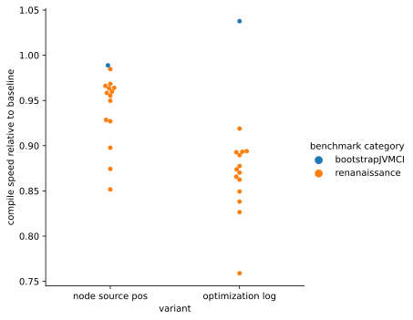

# Optimization log

The class `OptimizationLog` presents a unified interface that logs graph transformations performed in optimization phases.

Each optimization should be reported just after the transformation using the `OptimizationLog` instance bound to the transformed `StructeredGraph` (i.e. `StructuredGraph#getOptimizationLog`). Use the method `report(Class<?> optimizationClass, String eventName, Node node)`, which accepts the following arguments:
- the class that performed the transformation, preferably the optimization phase like `CanonicalizerPhase`
- a string in `PascalCase` that describes the transformation well in the context of the class, e.g. `CfgSimplification`
- the most relevant node in the transformation, i.e., a node that was just replaced/deleted/modified or a `LoopBeginNode` in the context of loop transformations like unrolling

At the moment, the node is only used to obtain the bci of the transformation. The `report` method handles the following use cases:

| Concern                              | Option                                 | Output                                                                  |
|--------------------------------------|----------------------------------------|-------------------------------------------------------------------------|
| `log` using a `DebugContext`         | `-Dgraal.Log`, `-Dgraal.MethodFilter`  | log the message `Performed {optimizationName} {eventName} at bci {bci}` at `BASIC_LEVEL` |
| `dump` using a `DebugContext`        | `-Dgraal.Dump`                         | dump the graph with the caption `After {optimizationName} {eventName}` at `DETAILED_LEVEL` |
| `CounterKey` increment               | `-Dgraal.Count`                        | increment the counter `{optimizationName}_{eventName}`                  |
| structured optimization logging      | `-Dgraal.OptimizationLog` (`-Dgraal.TrackNodeSourcePosition`) | tree of optimizations dumped to igv or json file |

It suffices to insert a line like the one below (from `DeadCodeEliminationPhase`) to solve all of the above concerns. The `report` method creates an *optimization entry*.

```java
graph.getOptimizationLog().report(DeadCodeEliminationPhase.class, "NodeRemoved", node);
```

It is recommended to enable the structured optimization jointly with node source position tracking (`-Dgraal.TrackNodeSourcePosition`) so that the bci of nodes can be logged. Otherwise, a warning is emitted.

## Properties

It is possible to provide additional key/value properties that are logged to the structured **optimization log only**. Consider the example from `LoopTransformations#peel`.

```java
loop.loopBegin().graph().getOptimizationLog()
                .report(LoopTransformations.class, "LoopPeeling", loop.loopBegin())
                .setProperty("peelings", loop.loopBegin().peelings());
```

The `report` method returns an optimization entry that can be used to extend the optimization entry with any `String`-convertible object identified by a `String` key.
The property keys should be in `camelCase`. If the optimization log (`-Dgraal.OptimizationLog`) is disabled, the method is a nop.

If the computation of the value is costly, use the `setLazyProperty` method, which accepts a `Supplier<Object>` instead of a direct value.

```java
graph.getOptimizationLog().report(CanonicalizerPhase.class, "CanonicalReplacement", node)
                                    .setLazyProperty("replacedNodeClass", nodeClass::shortName)
                                    .setLazyProperty("canonicalNodeClass", () -> {
                                        if (finalCanonical == null) {
                                            return null;
                                        }
                                        return finalCanonical.getNodeClass().shortName();
                                    });
```

If `-Dgraal.OptimizationLog` is enabled, the supplier is never evaluated. Otherwise, it is evaluated immediately.

## Optimization tree

The context of the optimizations is also collected when `-Dgraal.OptimizationLog` is enabled. This is achieved by setting the graph's `OptimizationLog` as the `CompilationListener`. We establish parent-child relationships between optimization phases and optimization entries. The result is a tree of optimizations.

- we create an artificial `RootPhase`, which is the root
- when a phase is entered (`CompilationListener#enterPhase`), the new phase is a child of the phase that entered this phase
- when an optimization is logged via the `report` method, it is attributed to its parent phase

An optimization tree in textual representation looks like the snippet below. In reality, however, the trees are significantly larger than in this example.

```
RootPhase
    HighTier
        LoopFullUnrollPhase
        LoopPeelingPhase
            LoopTransformations LoopPeeling at bci 122 {peelings: 1}
            IncrementalCanonicalizerPhase
                Canonicalizer CfgSimplification at bci 122
        HighTierLoweringPhase
            SchedulePhase
            IncrementalCanonicalizerPhase
                Canonicalizer CanonicalReplacement at bci 75 {replacedNodeClass: IsNull, canonicalNodeClass: IsNull}
                Canonicalizer CanonicalReplacement at bci 124 {replacedNodeClass: IsNull, canonicalNodeClass: IsNull}
    MidTier
        LockEliminationPhase
        FloatingReadPhase
            FloatingRead ReplacedWithFloating at bci 13
            FloatingRead ReplacedWithFloating at bci 20
            FloatingRead ReplacedWithFloating at bci 26
            IncrementalCanonicalizerPhase
        IterativeConditionalEliminationPhase
            ConditionalEliminationPhase
                ConditionalElimination KilledGuard at bci 80
                ConditionalElimination KilledGuard at bci 149
            IncrementalCanonicalizerPhase
            ConditionalEliminationPhase
            DeoptimizationGrouping DeoptimizationGrouping at bci 1
        CanonicalizerPhase
            Canonicalizer CanonicalReplacement at bci 1 {replacedNodeClass: ValuePhi, canonicalNodeClass: Constant}
        WriteBarrierAdditionPhase
    LowTier
        LowTierLoweringPhase
            SchedulePhase
            IncrementalCanonicalizerPhase
        ExpandLogicPhase
        CanonicalizerPhase
        AddressLoweringPhase
        SchedulePhase
```

## JSON output

Run a benchmark with the flag `-Dgraal.OptimizationLog=true` to produce an output. It is a good idea to run it jointly with `-Dgraal.TrackNodeSourcePosition=true`.

```sh
mx benchmark renaissance:scrabble -- -Dgraal.TrackNodeSourcePosition=true -Dgraal.OptimizationLog=true -Dgraal.DumpPath=/tmp/dump
```

In the dump directory, you can find many files named `optimization_log/<compilation-id>.json`. Each of them corresponds to one compilation.
The structure is the following:

```json
{
    "executionId": "1675684",
    "compilationMethodName": "java.util.Formatter$FixedString.<init>(Formatter, String, int, int)",
    "compilationId": "17697",
    "rootPhase": {
        "phaseName": "RootPhase",
        "optimizations": [ ... ]
    }
}
```

All of the methods share the same `executionId`. The `compilationMethodName` can be used to match several compilations of one compilation unit. `rootPhase` contains the root of the optimization tree. Each node in the optimization tree is either:
- a phase node, which contains a `phaseName` derived from the class name and a list of children (phases and optimization entries),
- or an optimization entry node, containing `optimizationName`, `eventName` (from the arguments of `report`), `bci` (from the `Node` passed to `report`) and additional properties.

Consider the following example with an `IncrementalCanonicalizerPhase` that performed a `CfgSimplification` and a `CanonicalReplacement`:

```json
{
    "phaseName": "IncrementalCanonicalizerPhase",
    "optimizations": [
        {
            "optimizationName": "Canonicalizer",
            "eventName": "CfgSimplification",
            "bci": 18
        },
        {
            "optimizationName": "Canonicalizer",
            "eventName": "CanonicalReplacement",
            "bci": 3,
            "replacedNodeClass": "==",
            "canonicalNodeClass": "=="
        }
    ]
}
```

## IGV output

Run a benchmark with the flag `-Dgraal.OptimizationLog=true` and a verbosity level at least `4 = DETAILED_LEVEL`, e.g. `-Dgraal.Dump=:4`. It is a good idea to run it jointly with `-Dgraal.TrackNodeSourcePosition=true`.

```sh
mx benchmark renaissance:scrabble -- -Dgraal.TrackNodeSourcePosition=true -Dgraal.OptimizationLog=true -Dgraal.Dump=:4 -Dgraal.PrintGraph=Network
```

The optimization tree should be at the bottom of each compilation dump in igv.

## Overhead of optimization logging

Enabling `-Dgraal.OptimizationLog` as well as `-Dgraal.TrackNodeSourcePosition` comes with an overhead. It may slow the compilation down in terms of CPU time and the logs may generate hundreds of MB of many small files.

Depending on the workload, node source positions can decrease the compile speed (measured in bytes/sec) by up to 15%. Optimization log with node source positions can decrease the speed by up to 25%.

In the chart below, each dot represents the compile speed of a benchmark with a given set of flags relative to the compile speed of the same benchmark without these flags.



### Measurement details

The selected benchmarks were a subset of renaissance benchmarks (that work on jdk 17), bootstrapJVMCI (`mx vm -XX:+BootstrapJVMCI -version`) and ctw (`mx -v gate --tags ctw`). For each benchmark, we have 3 variants:
- baseline (without any extra JVM parameters),
- node source positions (with `-Dgraal.TrackNodeSourcePosition=true`),
- optimization log (with `-Dgraal.TrackNodeSourcePosition=true` and `-Dgraal.OptimizationLog=true`).

Each benchmark's variant was repeated 30 times. The compile speed for each benchmark and its variant was aggregated as the arithmetic mean of the 30 compile speeds. The experiments were started in a pseudo-random order. The chart above displays the ratio of the mean compile speed of the node source position variant and the mean compile speed of the baseline (similarly for the optimization log variant).

#### Renaissance benchmarks

The renaissance benchmarks were started with libgraal. Renaissance was instructed to run for 180s, which is assumed to be enough time to finish most of the compilation tasks. We fixed the heap size to 10GB to reduce variance. We utilized the `mx benchmark` functionality but without any tracker. Forced gc between iterations is disabled as it serves no purpose in this case. The `-XX:+CITime` flag is used for statistics collection (the `JVMCI-native {...` line is parsed).

An example command to run the `scrabble` benchmark in the baseline variant is below.

```sh
JVM_CONFIG=graal-libgraal MX_PRIMARY_SUITE_PATH=../vm MX_ENV_PATH=libgraal mx -v benchmark renaissance:scrabble --tracker none -- -Xmx10g -Xms10g -XX:+CITime -- --no-forced-gc -r 1000000 -t 180
```

#### BootstrapJVMCI benchmark

The bootstrapJVMCI benchmark uses the `mx vm` infrastructure with the `-XX:+BootstrapJVMCI` flag to trigger a meta-circular workload. Statistics are collected from the output of `-XX:+CITime` (the `JVMCI {...` line is parsed).

The command below runs the baseline variant.

```sh
mx -v vm -Xmx10g -Xms10g -XX:+BootstrapJVMCI -XX:+CITime -version
```

#### Ctw benchmark

The ctw benchmark programmatically triggers compilation, which makes it the most stable workload in the set (i.e., the number of compiled methods is constant even across variants). The statistics are directly collected from the output of the gate.

The following command runs the baseline variant.

```sh
mx -v gate --extra-vm-argument="-Xmx10g -Xms10g" --tags ctw
```

#### Software and hardware information

- OS: `x86_64 GNU/Linux 5.13.0-51-generic #58~20.04.1-Ubuntu`
- JDK: `labsjdk-ce-17-jvmci-22.2-b03`
- Compiler: commit `b342aabbf09c0aba4a8ebc99af533a8d2fbca066` (community edition)
- Renaissance: version `0.11.0`
- CPU: AMD Ryzen 7 PRO 5850U
- RAM: 16GB
- SSD: 512GB NVMe M.2 PCIe
