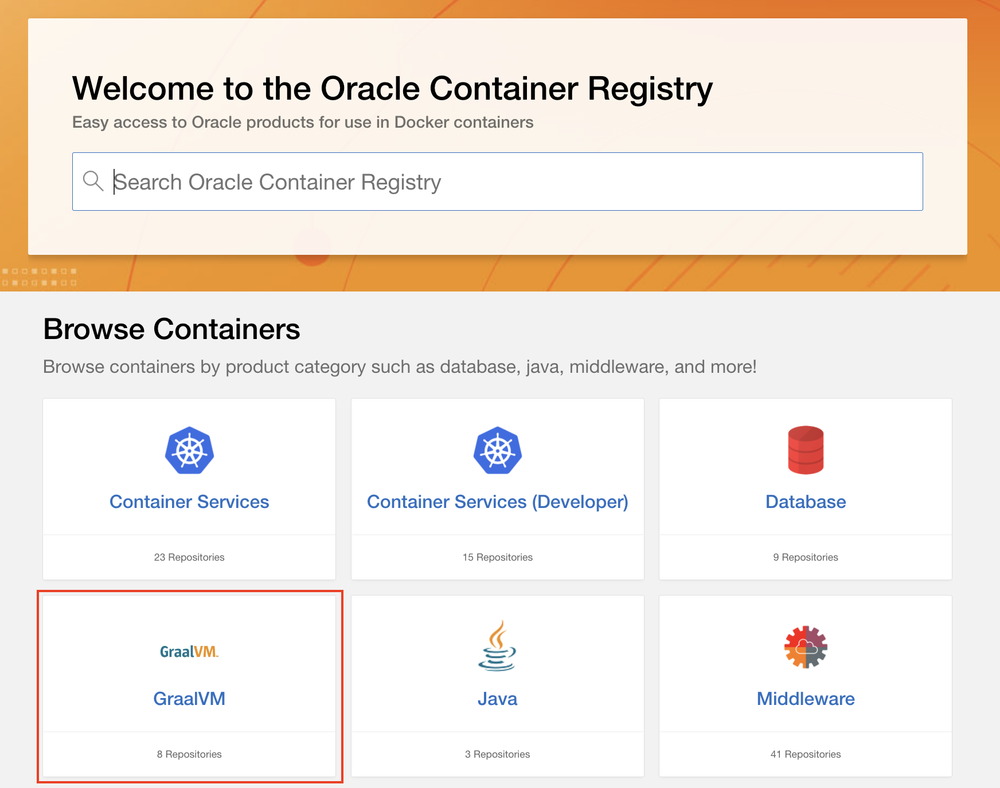
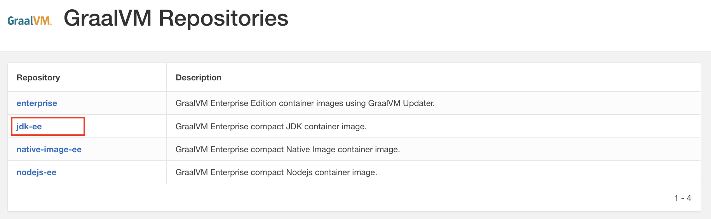
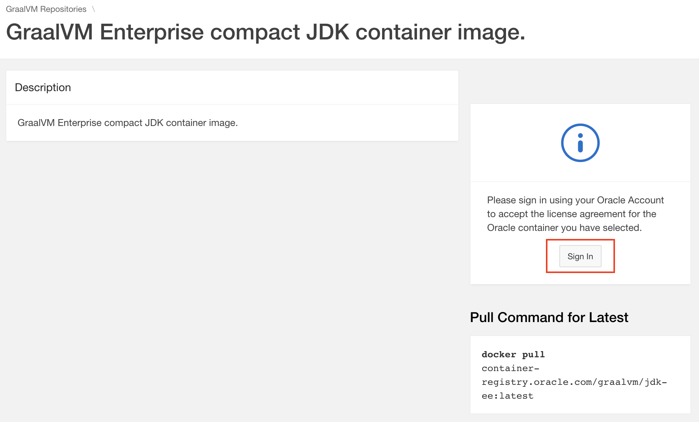
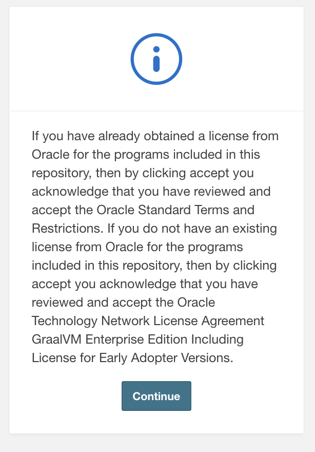
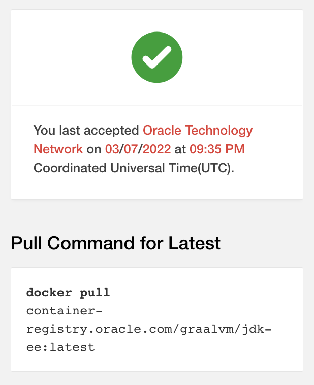

## Get Started with GraalVM Enterprise Container Images

Oracle GraalVM Enterprise container images are published in the [Oracle Container Registry](https://container-registry.oracle.com).

The following images are available:

| Image Name      | Description                                        
------------------------------------------------------------------------------------------------------------------------------------------------------------|-----------|
| **jdk-ee**          | A compact image containing the GraalVM Enterprise JDK. |
| **native-image-ee** | A compact image containing the GraalVM Enterprise `native-image` utility and JDK |
| **enterprise**      | Provides the GraalVM Enterprise JDK along with the `gu` (Graal Updater) utility to enable installation of additional features. |
| **nodejs-ee**       | Includes the Node.js runtime and the GraalVM Enterprise JDK. |

## Images Tagging Structure and Availability

Images are multi-arch (`amd64`, `aarch64` for Java 11 or later, depending on Docker host architecture), and tagged with the format:

```
container-registry.oracle.com/graalvm/{IMAGE_NAME}:{IMAGE_TAG}.
```

Image tag structure is:

```
{OS_VERSION}-java{JAVA_VERSION}-{MAJOR_RELEASE}.{MINOR_RELEASE}.{PATCH_RELEASE}-b{BUILD_NUMBER}
```

The structure is designed to allow references with different levels of specificity. 
The minimum valid tag is `java{JAVA_VERSION}-{MAJOR_RELEASE}`. For example, the following are all valid tags:

```
java17-21
java17-21.3
java17-21.3.0
java17-21.3.0-b1
ol8-java17-21.3.1-b2
```

It is recommended that the most specific tag be used, e.g., `ol8-java17-21.3.1` or `ol8-java17-21.3.1-b1`, where `-b1` indicates that the image required a patch and this specific build will never change.

Tags that are not fully specified, e.g., `java17-21`, are not stable and will change over time to refer to the latest available GraalVM 21 release. Using `latest` (or no tag) will always get the latest release available for a given image, the latest OS, the latest Java version, and the latest GraalVM version.

## Get Started

To pull a GraalVM Enterprise image from the Oracle Container Registry, you will be required to accept the license agreement. 

1. Go to [Oracle Container Registry](https://container-registry.oracle.com/) and click on “GraalVM”. You will be redirected to the GraalVM repositories page.

    

2. Click on an image repository. For example, if you need a compact container image with the JDK click the **jdk-ee** link.

    

3. Click on **Sign In**. This will take you to the Oracle Single Sign-on page.

    

4. Sign in with an Oracle account. If you do not have an existing Oracle account you can create one.

5. Once you have signed in you will see the following screen:

    

    Click **Continue** to accept the license and proceed ahead.

6. Check and accept the license.

    

7. Open a terminal window and `docker login` to Oracle Container Registry using your Oracle account.

    ```shell
    docker login container-registry.oracle.com
    Username: user.name@email.com
    Password: 
    Login Succeeded
    ```

8. Pull the image with the `docker pull` command.  Use the latest tag or a specific tag from the list of tags displayed on the page. For example:

    ```shell
    docker pull container-registry.oracle.com/graalvm/jdk-ee:latest
    latest: Pulling from graalvm/jdk-ee
    58c4eaffce77: Pull complete 
    8800a93aa49d: Pull complete 
    da2734fc865b: Pull complete 
    Digest: sha256:ccde822a1119da5f95e97b331632e6219b0ae29f81f516d1c0b9787
    Status: Downloaded newer image for container-registry.oracle.com/graalvm/jdk-ee:latest
    container-registry.oracle.com/graalvm/jdk-ee:latest
    ```

9. Start a container from the `jdk-ee` image and enter the bash session with the following `run` command:

    ```shell
    docker run -it --rm container-registry.oracle.com/graalvm/jdk-ee:latest bash
    ```

10. Check the GraalVM Enterprise version, storage location by running the `env` command:

    ```shell
    bash-4.4# env
    ```
    The output message will print the `GRAALVM_VERSION` and `JAVA_HOME` values showing the version of the installed GraalVM Enterprise and the location where it is installed.

11. Check the contents of the GraalVM Enterprise `bin` directory containing `java`, which is the GraalVM Enterprise JDK:

    ```shell
    bash-4.4# ls /usr/lib64/graalvm/graalvm21-ee-java17/bin
    ```

12. Check the Java version by running the following command:
 
    ```shell
    bash-4.4# java -version
    ```
    The output printed contains the information about the runtime environment and the version number.

If you pull the `native-image-ee` image, you can start a container and enter the session from the `native-image-ee` image immediately:

```shell
docker run -it --rm container-registry.oracle.com/graalvm/native-image-ee:latest bash
```

Follow steps 10-12 above to check the installed version and the location of GraalVM Enterprise. The `bin` directory, in this case, includes `java` and `native-image` launchers. Check the versions:

```shell
native-image --version
```

```shell
java -version
```

### Learn More

- [GraalVM Native Image, Spring and Containerisation](https://luna.oracle.com/lab/fdfd090d-e52c-4481-a8de-dccecdca7d68): Learn how GraalVM Native Image ahead-of-time compilation generates native executables ideal for containerization. 