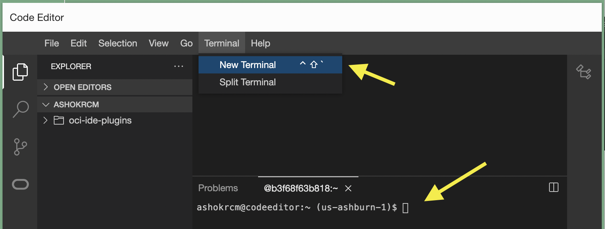
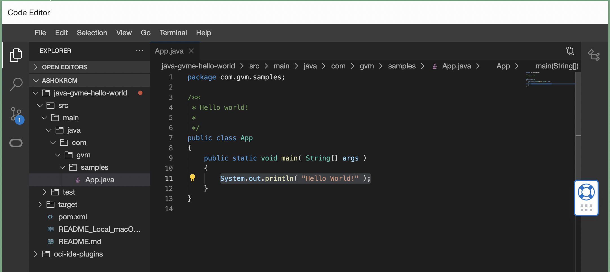

# GraalVM Enterprise in OCI Code Editor

This guide shows you how to get started with GraalVM Enterprise Edition in Oracle Cloud Infrastructure (OCI) Code Editor. 

[OCI Code Editor](https://docs.oracle.com/en-us/iaas/Content/API/Concepts/code_editor_intro.htm) provides a rich, in-console editing environment that enables you to edit code without having to switch between the OCI Console and your local development environment. The Code Editor enables you to edit and deploy code for OCI services directly from the OCI Console.

GraalVM Enterprise JDK 17 and Native Image are preinstalled in Cloud Shell, so you don’t have to install and configure a development machine. Code Editor's integration with Cloud Shell gives you direct access to GraalVM Enterprise JDK 17 and Native Image.

> Note: GraalVM Enterprise is available on Oracle Cloud Infrastructure at no additional cost.

## Create and Run a Java Application in OCI Code Editor

### Step 1: Open Terminal in Code Editor

1. [Login to OCI Console and launch Code Editor](https://cloud.oracle.com/?bdcstate=maximized&codeeditor=true).
2. Open a New Terminal in Code Editor. Use this Terminal window to run the following steps. 

    

### Step 2: Select GraalVM JDK as the Default JDK

1. List the installed JDKs using the `csruntimectl java list` command. You should see the following output:

    ```shell
    csruntimectl java list
    ```
    The output lists the JDKs preinstalled in Cloud Shell - GraalVM JDK for Java 17, Oracle JDK for Java 11, and Oracle JDK for Java 8. The JDK marked with an asterisk is the current JDK.

2. Select GraalVM JDK for Java 17 as the current JDK:

    ```shell
    csruntimectl java set graalvmeejdk-17
    ```
    You will see the confirmation message printed `The current managed java version is set to graalvmeejdk-17`.

3. Confirm the values of the environment variables `JAVA_HOME` and `PATH`, and the version of `java`, the `native-image` generator:
    ```shell
    echo $JAVA_HOME
    ```
    ```shell
    echo $PATH
    ```
    ```shell
    java -version
    ```
    ```shell
    native-image --version
    ```
## Step 3: Setup a Java Project and Run

1. Clone a demo repository and open it in OCI Code Editor. To achieve this, run the following commands one by one:

    ```shell
    git init graalvmee-java-hello-world
    ```
    ```shell
    cd graalvmee-java-hello-world
    ```
    ```shell
    git remote add origin https://github.com/oracle-devrel/oci-code-editor-samples.git
    ```
    ```shell
    git config core.sparsecheckout true
    ```
    ```shell
    echo "java-samples/graalvmee-java-hello-world/*">>.git/info/sparse-checkout
    ```
    ```shell
    git pull --depth=1 origin main
    ```
    ```shell
    cd java-samples/graalvmee-java-hello-world/
    ```
    
    You can now view/change the sample code in code editor.

    

2. Package the sample application into a runnable JAR:

    ```shell
    mvn clean package
    ```
3. Run the JAR:

    ```shell
    java -jar target/my-app-1.0-SNAPSHOT.jar 
    ```
    It prints out “Hello World!”.

## Step 4: Build and Run a Native Executable

This Java application incorporates the [Maven plugin for GraalVM Native Image](https://graalvm.github.io/native-build-tools/latest/maven-plugin.html) that adds support for building native executables using Apache Maven™. For testing purposes, build a native executable with the quick build mode enabled and disabled.

### Quick Build Mode Enabled

1. Build a native executable using the `native` Maven profile. The quick build mode is enabled for this run: notice the `<buildArg>-Ob</buildArg>` option in plugin's configuration in _pom.xml_.

    ```shell
    mvn clean -Pnative -DskipTests package
    ```
    This will generate a native executable for Linux in the target directory, named my-app.

2. Run the app native executable in the background:

    ```shell
    ./target/my-app
    ```

### Quick Build Mode Disabled

1. To disable the quick build mode, uncomment out this line in _pom.xml_:
 
    ```xml
    <!-- <buildArg>-Ob</buildArg> -->
    ```
2. Build a native executable again:

    ```shell
    mvn clean -Pnative -DskipTests package
    ```
    This will generate a native executable, _my-app_, in the _target_ directory, replacing the previous one. You have probably noticed how the quick build mode reduce the time required to generate a native executable, making it easier to use Native Image in a typical development cycle (compile, test, and debug). However, the size of a generated executable gets larger and peak performance worse. The quick build mode is recommended for development purposes only. 

3. Run the native executable:

    ```shell
    ./target/my-app
    ```

Congratulations! You have successfully built and run a native executable using GraalVM Enterprise in OCI Code Editor without the need to switch between the OCI Console and your local development environments.
The Code Editor allows you to accomplish quick coding tasks and run applications directly from the OCI Console.

### Related Documentation

- [Java Hello World with GraalVM Enterprise in OCI Code Editor](https://github.com/oracle-devrel/oci-code-editor-samples/tree/main/java-samples/graalvmee-java-hello-world)
- [Micronaut Hello World REST App with GraalVM Enterprise in OCI Code Editor](https://github.com/oracle-devrel/oci-code-editor-samples/tree/main/java-samples/graalvmee-java-micronaut-hello-rest)
- [Spring Boot Microservice with GraalVM Enterprise in OCI Code Editor](https://github.com/graalvm/graalvm-demos/blob/master/spring-native-image/README-Code-Editor.md)
- [Working with Code Editor](https://docs.oracle.com/en-us/iaas/Content/API/Concepts/code_editor_intro.htm)
- [GraalVM Enterprise in OCI Cloud Shell](cloud-shell.md)
