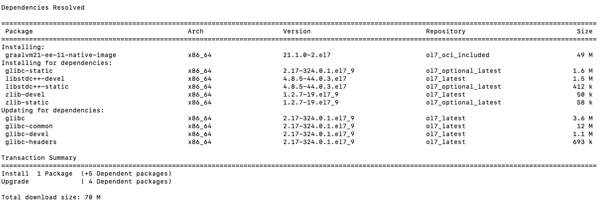

# Get Started with GraalVM Enterprise on OCI

[Oracle Cloud Infrastructure (OCI)](https://www.oracle.com/cloud) offers Oracle GraalVM Enterprise Edition for free to its customers.
GraalVM Enterprise support is included in the Oracle Cloud subscription.

This guide focuses on installing GraalVM Enterprise on the Oracle Cloud Infrastructure Virtual Machine (VM) Compute Instance.
For users who prefer a Bare Metal Machine instance, see [this documentation](https://cloud.oracle.com/iaas/whitepapers/deploying_custom_os_images.pdf).
For complete beginners, [start with this tutorial for creating and launching your first Linux instance](https://docs.cloud.oracle.com/iaas/Content/GSG/Reference/overviewworkflow.htm?tocpath=Getting%20Started%7CTutorial%20-%20Launching%20Your%20First%20Linux%20Instance%7C_____0).

### Prerequisites

To replicate the steps in this guide, [create a compute VM instance and connect to it](https://docs.cloud.oracle.com/iaas/Content/GSG/Reference/overviewworkflow.htm?tocpath=Getting%20Started%7CTutorial%20-%20Launching%20Your%20First%20Linux%20Instance%7C_____0).

## Install GraalVM Enterprise

For convenient installation, GraalVM Enterprise RPMs have been made available in the OCI YUM repository.
That means that OCI customers can use the GraalVM Enterprise environment in their cloud instances by installing it with `yum` - a package-management utility for the Linux operating systems.

For demonstration purposes, a demo-instance of the **VM.Standard.E4.Flex** shape with the **Oracle Linux 7.9** pre-built image was created.
The following SSH command is then used to connect to a Linux instance from a Unix-style system:
```shell
ssh -i .ssh/id_rsa opc@INSTANCE_PUBLIC_IP
```

In this instance, `.ssh/id_rsa` is the full path and name of the file containing the private SSH key, `opc` is the default name for the Oracle Linux image, and `INSTANCE_PUBLIC_IP` is the instance IP address provisioned from the console.
For more details, refer to the [Connecting to Your Linux Instance Using SSH](https://docs.cloud.oracle.com/iaas/Content/GSG/Tasks/testingconnection.htm) tutorial.

1. Having connected to the instance, verify which GraalVM Enterprise RPMs are available for the installation, narrowing down the search to the latest release, and Java 11.

   ```shell
   yum check-update
   sudo yum provides graalvm21-ee-11-jdk
   ```
   The resulting list includes both current and previous versions of all of the core package and additional features.

2. Find the appropriate RPM package name, and install GraalVM Enterprise with `sudo yum install <package_name>`.
For example, to install the latest version of "Oracle GraalVM Enterprise Edition JDK11 Java Development Kit", run:

   ```shell
   sudo yum install graalvm21-ee-11-jdk
   ```
   The dependent packages, e.g., `libpolyglot`, `llvm` and so on, will also be resolved.

   

3. Set up environment variables to point to the GraalVM Enterprise directory.

   > **Note:** After the installation, the GraalVM Enterprise binary is placed in _/usr/lib64/graalvm_.

   - Configure the `PATH` and `JAVA_HOME` environment variables in the bash configuration to point to GraalVM Enterprise for this SSH session with the following commands:
   ```shell
   echo "export JAVA_HOME=/usr/lib64/graalvm/graalvm21-ee-java11" >> ~/.bashrc
   echo "export PATH='$JAVA_HOME'/bin:'$PATH' " >> ~/.bashrc
   ```
   - Activate this change:
   ```shell
   source ~/.bashrc
   ```
   - Verify the values of  `PATH` and `JAVA_HOME` to check if the change was successful:
   ```shell
   echo $JAVA_HOME
   echo $PATH
   ```

Now you have a ready-to-go VM instance with GraalVM Enterprise installed and ready to use.

## Install Additional Features

1. Check what additional features are available for your current GraalVM Enterprise version:

   ```shell
   yum check-update
   sudo yum provides graalvm21*
   ```

2. Look up the necessary RPM package name and add it to GraalVM Enterprise with the `yum install <package_name> command` command.
For example, to install [Native Image](../../../reference-manual/native-image/README.md), which is a technology to ahead-of-time compile Java code to a standalone native executable, run this command:

   ```shell
   sudo yum install graalvm21-ee-11-native-image
   ```
   All required dependencies will be automatically installed:

   

> **Note:** To add Native Image to GraalVM Enterprise on Oracle Linux 8, currently run these commands:
```shell
sudo yum update -y oraclelinux-release-el8
sudo yum config-manager --set-enabled ol8_codeready_builder
sudo yum install graalvm21-ee-11-native-image
```
For Linux images with `dnf` or `microdnf` default package managers, run:
```shell
dnf update -y oraclelinux-release-el8
dnf --enablerepo ol8_codeready_builder
dnf install graalvm21-ee-11-native-image
```

## Update GraalVM Enterprise

If you have GraalVM Enterprise installed in the VM instance already, but you want to replace it with another version, use this command:
```shell
sudo yum install <package_name>
```

If you want to upgrade an existing version, and also remove the obsolete GraalVM Enterprise package, run:

```shell
sudo yum upgrade <package_name>
```
The `yum upgrade` command will upgrade the whole system.

## Learn More

To test GraalVM Enterprise in OCI, we recommend running the [Accelerate Applications in Oracle Cloud with GraalVM Enterprise](https://luna.oracle.com/lab/d502417b-df66-45be-9fed-a3ac8e3f09b1/steps) interactive workshop.
The purpose of this lab is to give you an overview of GraalVM Enterprise and its advantages. You will run demo projects to compare performance and see how GraalVM Enterprise can accelerate applications in OracIe Cloud.
