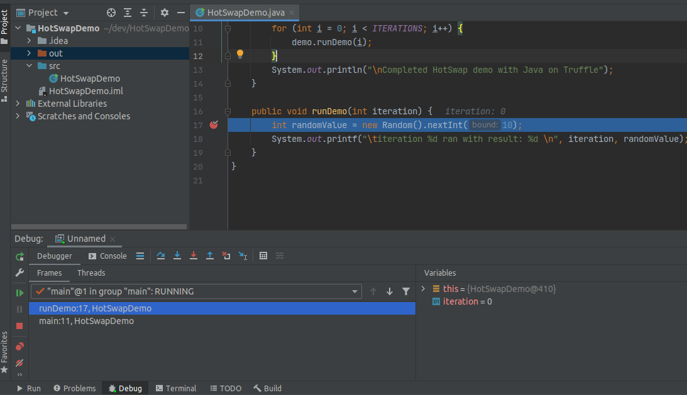
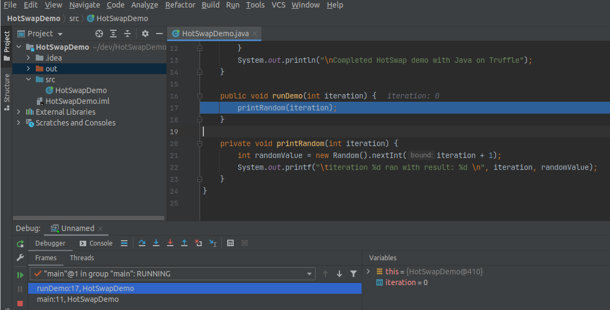
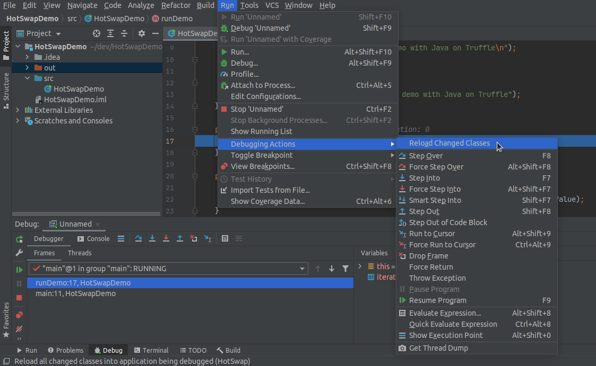
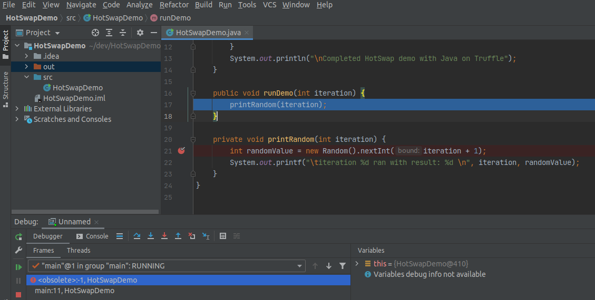
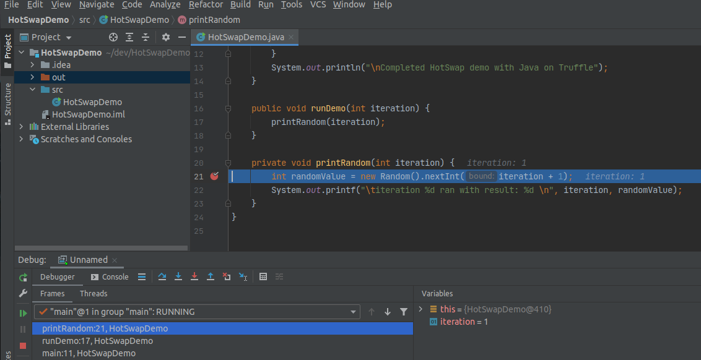
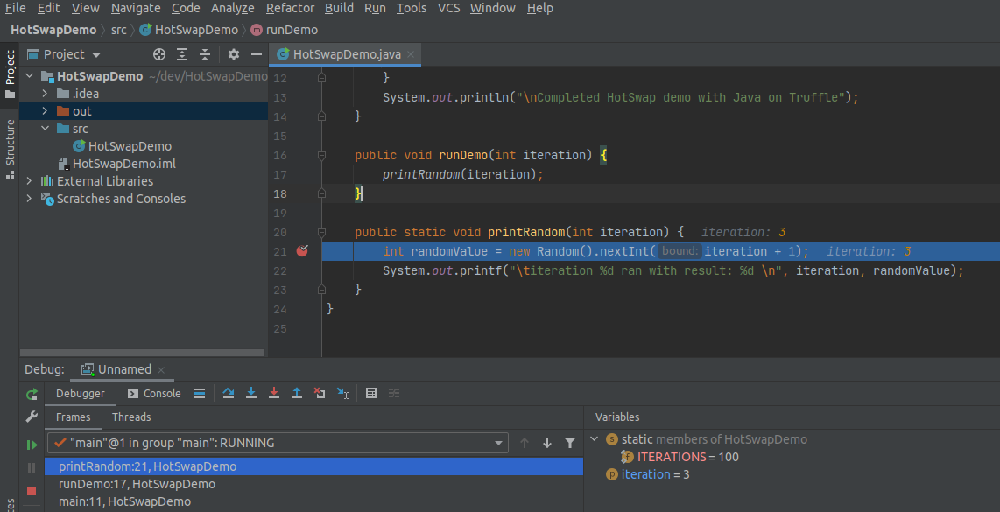

# Enhanced HotSwap Capabilities with Espresso

With Espresso you can benefit from enhanced HotSwap capabilities that allow the code to evolve naturally during development without the need for restarting a running application.
You do not have to configure anything specific besides launching your app in debug mode and attaching a standard IDE debugger to gain the advantages of enhanced HotSwap.

## Debugging with Espresso

You can use your favorite IDE debugger to debug Java applications running in the Espresso runtime.
For example, starting a debugger session from IntelliJ IDEA is based on the Run Configurations.
To ensure you attach the debugger to your Java application in the same environment, navigate in the main menu to **Run**, **Debug…**, **Edit Configurations**, expand Environment, check the JRE value and VM options values.
It should show GraalVM as project's JRE and VM options should include `-truffle -XX:+IgnoreUnrecognizedVMOptions`. It is necessary to specify `-XX:+IgnoreUnrecognizedVMOptions` because Intellij automatically adds a `-javaagent` argument which is not supported yet.
Press Debug.

This will run the application and start a debugger session in the background.

## Using HotSwap During a Debugging Session

Once you have your debugger session running, you will be able to apply extensive code changes (HotSwap) without needing to restart the session.
Feel free to try this out on your own applications or by following these instructions:

1. Create a new Java application.
2. Use the following `main` method as a starting point:
    ```java
    public class HotSwapDemo {

        private static final int ITERATIONS = 100;

        public static void main(String[] args) {
            HotSwapDemo demo = new HotSwapDemo();
            System.out.println("Starting HotSwap demo with Espresso: 'java.vm.name' = " + System.getProperty("java.vm.name"));
            // run something in a loop
            for (int i = 1; i <= ITERATIONS; i++) {
                demo.runDemo(i);
            }
            System.out.println("Completed HotSwap demo with Espresso");
        }

        public void runDemo(int iteration) {
            int random = new Random().nextInt(iteration);
            System.out.printf("\titeration %d ran with result: %d\n", iteration, random);
        }
    }
    ```

3. Check that the `java.vm.name` property says you're running on Espresso.
4. Place a line breakpoint on the first line in `runDemo()`.
5. Setup the Run configurations to run with Espresso and press Debug. You will see:

    

6. While paused at the breakpoint, extract a method from the body of `runDemo()`:

    

7. Reload the changes by navigating to Run -> Debugging Actions -> Reload Changed Classes:

    

8. Verify that the change was applied by noticing the `<obsolete>:-1` current frame in the Debug -> Frames view:

    

9. Place a breakpoint on the first line of the new extracted method and press Resume Program. The breakpoint will hit:

    

10. Try to change the access modifiers of `printRandom()` from `private` to `public static`. Reload the changes. Press Resume Program to verify the change was applied:

    

Watch the video [version of the enhanced HotSwap capabilities with Espresso demo](https://www.youtube.com/watch?v=gfuvvV6mplo).

### Supported Changes

The enhanced HotSwap of Espresso is almost feature complete.
The following changes are supported:

* Add and remove methods
* Add and remove constructors
* Add and remove methods from interfaces
* Change access modifiers of methods
* Change access modifiers of constructors
* Add and remove fields
* Change field type
* Move field in hierarchy and preserve state (see note below)
* Changes to class access modifiers, for example, abstract and final modifiers
* Changes to Lambdas
* Add new anonymous inner classes
* Remove anonymous inner classes
* Changing the superclass
* Changing implemented interfaces

**Note**: When instance fields are moved in the class hierarchy the state is preserved whenever possible.
Examples include the Pull Up Field refactoring where all existing instances of the origin subclass will be able to read the previously stored value from the super class field.
On the other hand, for unrelated subclass instances where the field was not present prior to the change, the new field value will be the language default (null for object-type fields, 0 for int, and so on).

The following limitations remain:
* Changes to Enums

## HotSwap Plugin API

With Espresso you can benefit from enhanced HotSwap capabilities that allow the code to evolve naturally during development without the need for restarting a running application.
While code reloading (HotSwap) is a powerful tool, it is not sufficient to reflect all kinds of changes, for example, changes to annotations, framework-specific changes such as implemented services or beans.
For these things the code often needs to be executed to reload configurations or contexts before the changes are fully reflected in the running instance.
This is where the Espresso HotSwap Plugin API comes in handy.

The HotSwap Plugin API is meant for framework developers by setting up appropriate hooks to reflect changes in response to source code edits in your IDE.
The main design principle is that you can register various HotSwap listeners that will be fired on specified HotSwap events.
Examples include the ability to re-run a static initializer, a generic post HotSwap callback and hooks when implementations for a certain service provider changes.

**Note**: The HotSwap Plugin API is under development and more fine-grained registration of HotSwap listeners are likely to be added upon requests from the community.
You are welcomed to send enhancement requests to help shape the API through our community support [channels](https://www.graalvm.org/community/).

Review the HotSwap Plugin API by going through a running example that will enable more powerful reloading support on [Micronaut](https://micronaut.io/).

### Micronaut HotSwap Plugin

The Micronaut HotSwap plugin example implementation is hosted as a [fork](https://github.com/javeleon/micronaut-core) of Micronaut-core.
The following instructions are based on a macOS X setup and only minor variations are needed for Windows.
To get started:

1. Clone the repository:
  ```shell
  git clone git@github.com:javeleon/micronaut-core.git
  ```

2. Build and publish to local Maven repository:
  ```shell
  cd micronaut-core
  ./gradlew publishMavenPublicationToMavenLocal
  ```

Now you will have a HotSwap-ready version of Micronaut.
Before setting up a sample application that uses the enhanced version of Micronaut, look at what the plugin does under the hood.

The interesting class is `MicronautHotSwapPlugin` which holds on to an application context that can be reloaded when certain changes are made to the application source code.
The class looks like this:

```java
final class MicronautHotSwapPlugin implements HotSwapPlugin {

    private final ApplicationContext context;
    private boolean needsBeenRefresh = false;

    MicronautHotSwapPlugin(ApplicationContext context) {
        this.context = context;
        // register class re-init for classes that provide annotation metadata
        EspressoHotSwap.registerClassInitHotSwap(
                AnnotationMetadataProvider.class,
                true,
                () -> needsBeenRefresh = true);
        // register ServiceLoader listener for declared bean definitions
        EspressoHotSwap.registerMetaInfServicesListener(
                BeanDefinitionReference.class,
                context.getClassLoader(),
                () -> reloadContext());
        EspressoHotSwap.registerMetaInfServicesListener(
                BeanIntrospectionReference.class,
                context.getClassLoader(),
                () -> reloadContext());
    }

    @Override
    public String getName() {
        return "Micronaut HotSwap Plugin";
    }

    @Override
    public void postHotSwap(Class<?>[] changedClasses) {
        if (needsBeenRefresh) {
            reloadContext();
        }
        needsBeenRefresh = false;
    }

    private void reloadContext() {
        if (Micronaut.LOG.isInfoEnabled()) {
            Micronaut.LOG.info("Reloading app context");
        }
        context.stop();
        context.flushBeanCaches();
        context.start();

        // fetch new embedded application bean which will re-wire beans
        Optional<EmbeddedApplication> bean = context.findBean(EmbeddedApplication.class);
        // now restart the embedded app/server
        bean.ifPresent(ApplicationContextLifeCycle::start);
    }
}
```

The logic regarding the HotSwap API sits in the constructor of this class.
Micronaut is architected around compile-time annotation processing where annotation metadata is gathered and stored into static fields in generated classes.
Whenever a developer makes a change to a Micronaut-annotated class, the corresponding metadata classes are re-generated.
Since standard HotSwap does not (and it should not) re-run static initializers, with HotSwap Plugin static initializer are re-run for all classes that provide metadata (the Micronaut-generated classes). Thus, this API method `EspressoHotSwap.registerClassInitHotSwap` is used:

```java
public static boolean registerClassInitHotSwap(Class<?> klass, boolean onChange, HotSwapAction action)
```

This will register a listener on Class changes for the specific class and importantly any subclass thereof.
The `onChange` variable instructs if static initializers should only be re-run if the code within changed.
The `action` parameter is a hook for firing a specific action whenever a static initializer has been re-run.
Here we pass a function for setting the `needsBeenRefresh` field to true whenever an static initializer is re-run.
Upon completion of a HotSwap action the plugin receives a `postHotSwap` call that, in response to a true `needsBeenRefresh`, executes the Micronaut-specific code to reload the application context in the `reloadContext` method.

### Detecting and Injecting New Classes

HotSwap is designed to enable classes to be HotSwap'ed in a running application.
However, if a developer introduces an entirely new class (for example, a new `@Controller `class in Micronaut), HotSwap does not magically inject a new class, as doing so would require knowledge about internal class loading logic at the very least.

A standard way in which classes are discovered by a framework is through the `ServiceLoader` mechanism.
The HotSwap API has built-in support for registering service implementation change listeners by means of the method `EspressoHotSwap.registerMetaInfServicesListener`:

```java
public static boolean registerMetaInfServicesListener(Class<?> serviceType, ClassLoader loader, HotSwapAction action)
```

The current support is limited to listening for implementation changes for class path based service deployment in `META-INF/services`.
Whenever there is a change to the set of service implementations for the registered class type, the `action` is fired.
In the Micronaut HotSwap plugin, `reloadContext` is executed which will then pickup the changes automatically.

**Note**: HotSwap actions caused by changes to service implementation changes are fired independent of HotSwap. As a developer, you do not need to perform a HotSwap from your IDE to see the new functionality in the running application.

### Next-Level HotSwap for Micronaut

Now that you know how the Micronaut HotSwap plugin works, use this feature in a real application.
Here is a sample application created from the tutorial ["Creating your first Micronaut Graal Application"](https://guides.micronaut.io/latest/micronaut-creating-first-graal-app-gradle-java.html).
Example's sources can be downloaded as a ready-made Gradle project from [here](https://guides.micronaut.io/latest/micronaut-creating-first-graal-app-gradle-java.zip).
Download, unzip and open the project in your IDE.

Before you proceed, make sure that you have [Espresso installed](README.md#install-java-on-truffle) and GraalVM set as the project SDK.

1. In your IDE navigate to the root `build.gradle` within the sample project. Add:
    ```
    run.jvmArgs+="-truffle"
    ```

2. Also add maven local repository where we previously published the enhanced Micronaut framework. For example:
    ```
    repositories {
    mavenLocal()
    ...
    }
    ```

3. In `gradle.properties` update the Micronaut version that you published. For example:
    ```
    micronautVersion=2.5.8-SNAPSHOT
    ```
    Now you are all setup.

4. Execute`assemble` task and create a run configuration using the defined `run` Gradle task.

5. Press the Debug button to start the application in debugging mode, which enables enhanced HotSwap support.

6. Once the application is started, verify that you get a response from the `ConferenceController` by going to `http://localhost:8080/conferences/random`.

7. Try to make various changes to the classes within the sample app, for example, change the `@Controller` mapping to a different value, or add a new `@Get`annotated method and apply HotSwap to see the magic. In case you define a new `@Controller` class, all you need is compiling the class and once the change is picked up by the file system watch, you will see the reload without the need for explicitly HotSwap.