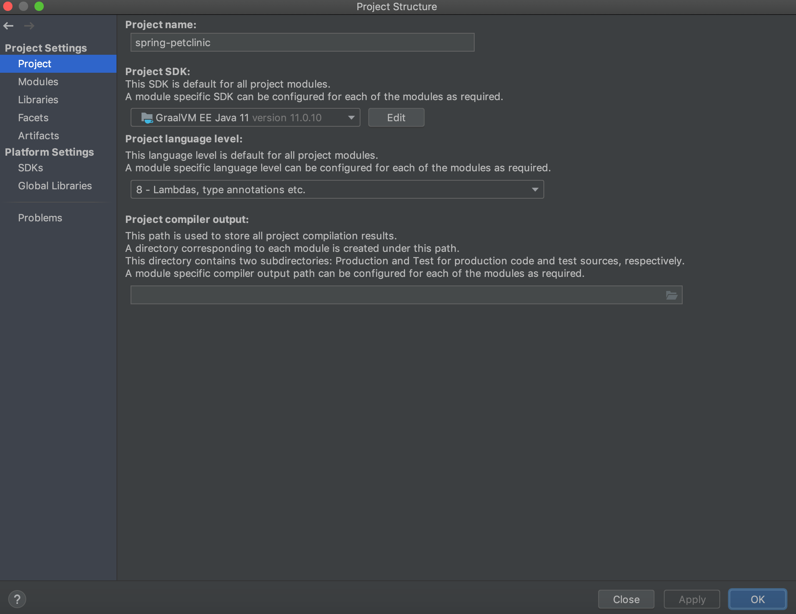

# Espresso

Using GraalVM, you can run Java applications normally [on HotSpot](../java/README.md), in [Native Image](../native-image/README.md), and on Truffle.

Espresso, also known as Java on Truffle, is an implementation of the Java Virtual Machine Specification, [Java SE 8](https://docs.oracle.com/javase/specs/jvms/se8/html/index.html), [Java SE 11](https://docs.oracle.com/javase/specs/jvms/se11/html/index.html), [Java SE 17](https://docs.oracle.com/javase/specs/jvms/se17/html/index.html), [Java SE 21](https://docs.oracle.com/javase/specs/jvms/se21/html/index.html), and [Java SE 25](https://docs.oracle.com/javase/specs/jvms/se25/html/index.html) built upon GraalVM as a Truffle interpreter.
It is a minified Java VM that includes all core components of a VM, implements the same API as the Java Runtime Environment library (`libjvm.so`), and reuses the existing standard library.
See the [Implementation Details](ImplementationDetails.md) for more information.

Espresso is open source with its codebase accessible [on GitHub](https://github.com/oracle/graal/tree/master/espresso).

Espresso runs Java via a Java bytecode interpreter, implemented with the [Truffle framework](../../../truffle/docs/README.md) – an open source library for writing interpreters for programming languages.
With Espresso, Java can be executed by the same principle as other languages in the GraalVM ecosystem (such as JavaScript, Python, Ruby), directly interoperate with those languages, and pass data back and forth in the same memory space.
Besides complete language interoperability, with Espresso you can:

- run Java bytecode in a separate context from the host Java VM.
- run either a Java 8, Java 11, Java 17, Java 21, or Java 25 guest JVM, allowing to embed, for example, a Java 17 context in a Java 21 application, by using [GraalVM’s Polyglot API](https://www.graalvm.org/sdk/javadoc/org/graalvm/polyglot/package-summary.html).
- leverage the whole stack of tools provided by the Truffle framework, not previously available for Java.
- have an improved isolation of the host Java VM and the Java program running on Truffle, so you can run less trusted guest code.
- run in the context of a native executable while still allowing dynamically-loaded bytecode.

Espresso passes the Java Compatibility Kit (JCK or TCK for Java SE).

## Getting Started

Espresso is available as a standalone distribution that provides a Java 21 environment.
You can download a standalone based on Oracle GraalVM or GraalVM Community Edition.

1. Download the Espresso 25.0.0 standalone for your operating system:

   * [Linux x64](https://gds.oracle.com/download/espresso/archive/espresso-java21-25.0.0-linux-amd64.tar.gz)
   * [Linux AArch64](https://gds.oracle.com/download/espresso/archive/espresso-java21-25.0.0-linux-aarch64.tar.gz)
   * [macOS x64](https://gds.oracle.com/download/espresso/archive/espresso-java21-25.0.0-macos-amd64.tar.gz)
   * [macOS AArch64](https://gds.oracle.com/download/espresso/archive/espresso-java21-25.0.0-macos-aarch64.tar.gz)
   * [Windows x64](https://gds.oracle.com/download/espresso/archive/espresso-java21-25.0.0-windows-amd64.zip)

2. Unzip the archive:

   > Note: If you are using macOS Catalina and later you may need to remove the quarantine attribute:
    ```shell
    sudo xattr -r -d com.apple.quarantine <archive>.tar.gz
    ```

   Extract:
    ```shell
    tar -xzf <archive>.tar.gz
    ```

3. A standalone comes with a JVM in addition to its native launcher. Check the version to see the runtime is active:
    ```shell
    # Path to Espresso installation
    ./path/to/bin/java -version
    ```

## Run a Java Application on Espresso

The `java` launcher included in the Espresso standalone works like the standard `java` launcher:

To execute a class file:
```shell
java [options] class
```
To execute a JAR file:
```shell
java [options] -jar jarfile
```

You can also run a Java application from the main class in a module, or run a single source-file program:
```shell
java [options] -m module[/<mainclass>]
java [options] sourcefile
```

By default, Espresso runs with the standard library included in the standalone, but it is possible to specify a different Java installation directory (`java.home`).
It will automatically switch versions as long as the new Java home is a supported version (8, 11, 17, 21, or 25).
```shell
java --java.JavaHome=/path/to/java/home -version
```

> Note: If you use `-server` option of the `java` launcher, espresso will not be used and HotSpot will be started instead.
> You can also use `-truffle` to explicitly require the use of espresso (the default).

## Performance Considerations

The startup time will not match the speed offered by the regular GraalVM just-in-time (JIT) execution yet, but having created a fully working Espresso runtime, the development team is now focusing on performance.
You can still influence the performance by passing the following option to `java`:
* `--engine.Mode=latency` to enable Truffle's latency mode to make JIT compilation faster, in exchange for slower peak performance.

The `--vm.XX:` syntax ensures the option is passed to the underlying [Native Image VM](../native-image/BuildOptions.md).
When using the `-XX:` syntax, the VM first checks if there is such an option in the Espresso runtime.
If there is none, it will try to apply this option to the underlying Native Image VM.
This might be important for options such as `MaxDirectMemorySize` which can be set independently at both levels: `-XX:MaxDirectMemorySize=256M` controls how much native memory can be reserved by the Java program running on Espresso (the guest VM), while `--vm.XX:MaxDirectMemorySize=256M` controls how much native memory can be reserved by Native Image (the host VM).

## Start Running Applications

#### From Command Line

To ensure you have successfully installed Espresso, verify its version:
```shell
# Path to Espresso installation
./path/to/bin/java -version
```

Taking this `HelloWorld.java` example, compile it and run from the command line:
```java
public class HelloWorld {
  public static void main(String[] args) {
    System.out.println("Hello, World!");
  }
}
```

```shell
$JAVA_HOME/bin/javac HelloWorld.java
$JAVA_HOME/bin/java HelloWorld
```

Taking some real-world applications, try running [Spring PetClinic](https://github.com/spring-projects/spring-petclinic) - a sample web application that demonstrates the use of Spring Boot with Spring MVC and Spring Data JPA.

1. Clone the project and navigate to the project’s directory:
   ```shell
   git clone https://github.com/spring-projects/spring-petclinic.git
   cd spring-petclinic
   ```

2. Build a JAR file (Spring PetClinic is built with Maven):
   ```shell
   ./mvnw package
   ```

3. Then run it from the command line:
   ```shell
   java -jar target/spring-petclinic-<version>-SNAPSHOT.jar
   ```

4. When the application starts, access it on [localhost:8000](http://localhost:8080/).

#### From IDE

To run a Java project on Espresso from an IDE, you need to set the Espresso standalone as the project's default JDK.
For example, to run the Spring PetClinic project using Intellij IDEA, you need to:

1. Navigate to **File**, then to **Project Structure**. Click **Project**, and then click **Project SDK**. Expand the drop down, press Add **JDK**, and open the directory where you installed the Espresso standalone. For macOS users, JDK home path will be `/Library/Java/JavaVirtualMachines/{espresso-standalone}/Contents/Home`. Give it a name, and press Apply.

    

2. Generate sources and update folders for the project. In the Maven sidebar, click on the directory with the spinner icon:

    

3. Press Run.

## Debugging

You do not have to configure anything special to debug Java applications running Espresso from your favorite IDE debugger.
For example, starting a debugger session from IntelliJ IDEA is based on the Run Configurations.

## What to Read Next

Espresso enables a seamless Java interoperability with other languages in the GraalVM ecosystem.
Check the [Interoperability with Truffle Languages guide](Interoperability.md) to learn how to load code written in other languages, export and import objects between languages, and so on.

To learn about the implementation approach, project's current status, and known limitations proceed to [Implementation Details](ImplementationDetails.md).

You can already run some large applications such as the Eclipse IDE, Scala or other languages REPLs in the Espresso execution mode.
We recommend having a look at the collection of [Demo Applications](Demos.md).

If you have a question, check the available [FAQs](FAQ.md), or reach us directly over the **#espresso** channel in [GraalVM Slack](https://www.graalvm.org/slack-invitation/).
