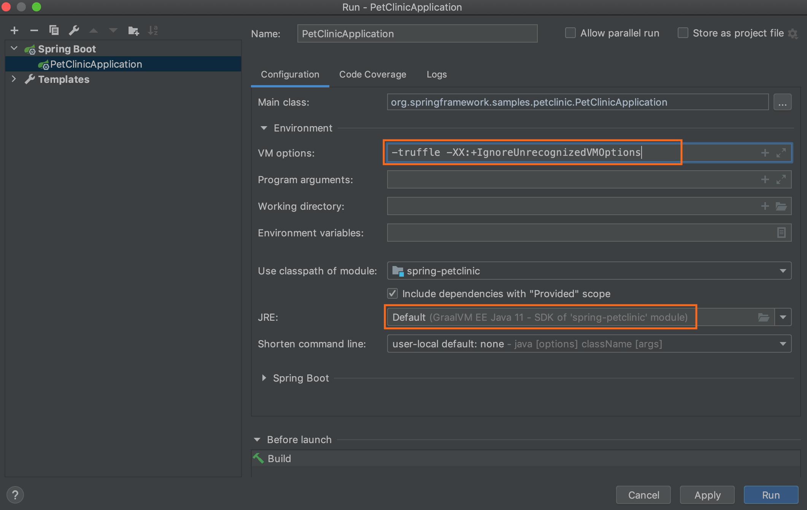
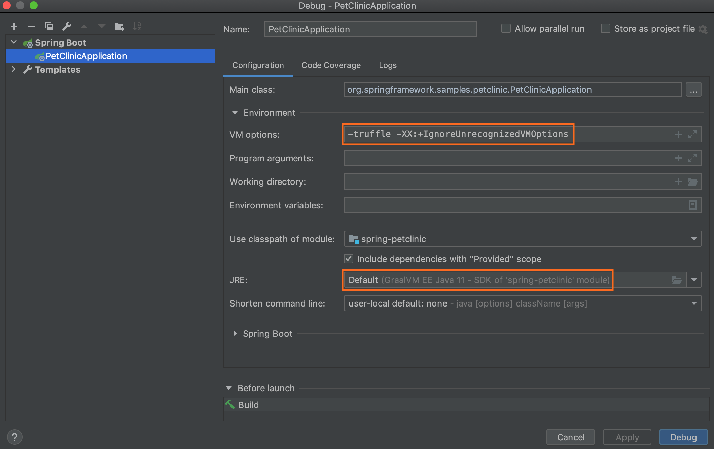

# Java on Truffle

Using GraalVM, you can run Java applications normally [on the JVM](../java/README.md), in [Native Image](../native-image/README.md), and now on Truffle.
Java on Truffle is an implementation of the Java Virtual Machine Specification, [Java SE 8](https://docs.oracle.com/javase/specs/jvms/se8/html/index.html) and [Java SE 11](https://docs.oracle.com/javase/specs/jvms/se11/html/index.html), built upon GraalVM as a Truffle interpreter.
It is a minified Java VM that includes all core components of a VM, implements the same API as the Java Runtime Environment library (libjvm.so), and reuses all JARs and native libraries from GraalVM.
See the [Implementation Details](ImplementationDetails.md) for more information.
The project name behind this implementation is "Espresso".
Its open source version is available on [GitHub](https://github.com/oracle/graal/tree/master/espresso).

The Java on Truffle execution mode runs Java via a Java bytecode interpreter, implemented with the [Truffle framework](../../../truffle/docs/README.md) – an open-source library for writing interpreters for programming languages.
Now Java can be executed by the same principle as other languages in the GraalVM ecosystem (JavaScript, Ruby, Python, R), directly interoperate with those languages, and pass data back and forth in the same memory space.
Besides complete language interoperability, with Java on Truffle you can:

- run Java bytecode in a separate context from the host Java VM.
- run either a Java 8, Java 11, Java 17 guest JVM, allowing to embed e.g. a Java 8 context in a Java 11 application, by using [GraalVM’s Polyglot API](https://www.graalvm.org/sdk/javadoc/org/graalvm/polyglot/package-summary.html)
- leverage the whole stack of tools provided by the Truffle framework, not previously available for Java.
- have an improved isolation of the host Java VM and the Java program running on Truffle, so you can run less trusted guest code.
- run in the context of a native executable while still allowing dynamically-loaded bytecodes.

Java on Truffle is an experimental technology in GraalVM, but already passes the Java Compatibility Kit (JCK or TCK for Java SE).

## Install Java on Truffle

To run Java on Truffle, you need to have [GraalVM installed](../../getting-started/graalvm-community/get-started-graalvm-community.md).
The Java on Truffle runtime is not available by default, but can be easily added to GraalVM using the [GraalVM Updater tool](../graalvm-updater.md).

For GraalVM Community Edition users, run the following command to install Java on Truffle from the GitHub catalog:
```shell
gu install espresso
```

The installable's name, `espresso`, is the project code-name, it is used to avoid ambiguity with the other ways Java code can run on GraalVM.

For GraalVM Enterprise Edition users, download  Java on Truffle from [Oracle GraalVM Downloads](https://www.oracle.com/downloads/graalvm-downloads.html).
Having downloaded the appropriate JAR file in consideration of the operating system and underlying Java SE version, install it with:
```shell
gu install -L espresso.jar
```

It installs the `jvm` runtime library under the `$JAVA_HOME/lib/truffle/` location.

## Run Java on Truffle

You can run a Java application on Truffle by passing the `-truffle` flag to the standard `java` launcher.
This is similar to how you used to switch between the `-client` and `-server` JVMs.

To execute a class file:
```shell
java -truffle [options] class
```
To execute a JAR file:
```shell
java -truffle [options] -jar jarfile
```

Using Java 11 based GraalVM distribution, you can also run a Java application from the main class in a module, or run a single source-file program:
```shell
java -truffle [options] -m module[/<mainclass>]
java -truffle [options] sourcefile
```

By default, Java on Truffle runs within GraalVM by reusing all GraalVM's JARs and native libraries, but it is possible to "cross-version" and specify a different Java installation directory (`java.home`).
It will automatically switch versions regardless of the host JVM.
```shell
java -truffle --java.JavaHome=/path/to/java/home -version
```

## Performance Considerations

Java on Trufle is an experimental technology in GraalVM, and peak performance is currently 2-3x slower than HotSpot.

The startup time will not match the speed offered by the regular GraalVM just-in-time (JIT) execution yet, but having created a fully working Java on Truffle runtime, the development team is now focusing on performance.
You can still influence the performance by passing the following options to `java -truffle`:
* `--engine.MultiTier=true` to enable multi-tier compilation;
* `--engine.Inlining=false` in combination with `--java.InlineFieldAccessors=true` to make the compilation faster, in exchange for slower performance.

The `--vm.XX:` syntax ensures the option is passed to the underlying [Native Image VM](../native-image/HostedvsRuntimeOptions.md).
When using the `-XX:` syntax, the VM first checks if there is such an option in the Java on Truffle runtime.
If there is none, it will try to apply this option to the underlying Native Image VM.
This might be important for options such as `MaxDirectMemorySize` which can be set independently at both levels: `-XX:MaxDirectMemorySize=256M` controls how much native memory can be reserved by the Java program running on Truffle (the guest VM), while `--vm.XX:MaxDirectMemorySize=256M` controls how much native memory can be reserved by Native Image (the host VM).

## Start Running Applications

#### From Command Line

To ensure you have successfully installed Java on Truffle, verify its version:
```shell
java -truffle -version
```

Taking this `HelloWorld.java` example, compile it and run from the command line:
```java
public class HelloWorld {
  public static void main(String[] args) {
    System.out.println("Hello, World!");
  }
}
```

```shell
$JAVA_HOME/bin/javac HelloWorld.java
$JAVA_HOME/bin/java -truffle HelloWorld
HelloWorld.java!
```

Taking some real-world applications, try running [Spring PetClinic](https://github.com/spring-projects/spring-petclinic) - a sample web application that demonstrates the use of Spring Boot with Spring MVC and Spring Data JPA.

1. Clone the project and navigate to the project’s directory:
```shell
git clone https://github.com/spring-projects/spring-petclinic.git
cd spring-petclinic
```

2. Build a JAR file (Spring PetClinic is built with Maven):
```shell
./mvnw package
```

3. Then run it from the command line by selecting the `-truffle` runtime:
```java
java -truffle -jar target/spring-petclinic-<version>-SNAPSHOT.jar
```

4. When the application starts, access it on [localhost:8000](http://localhost:8080/).

#### From IDE

To run a Java project on Truffle from an IDE requires setting the Java on Truffle enabled GraalVM as a project's default JDK.
For exampe, to run the Spring PetClinic project using Intellij IDEA, you need to:

1&#46; Navigate to **File**, then to **Project Structure**. Click **Project**, and then click **Project SDK**. Expand the drop down, press Add **JDK** and open the folder where you installed GraalVM. For macOS users, JDK home path will be `/Library/Java/JavaVirtualMachines/{graalvm}/Contents/Home`. Give it a name, and press Apply.


2&#46; Generate sources and update folders for the project. In the Maven sidebar, click on the folder with the spinner icon:


3&#46; Enable the Java on Truffle execution mode. From the main menu select **Run**, then **Run…**. Click **Edit Configurations** and choose **Environment**. Put the `-truffle -XX:+IgnoreUnrecognizedVMOptions` command in **VM options** and press Apply.



It is necessary to specify `-XX:+IgnoreUnrecognizedVMOptions` because Intellij automatically adds a `-javaagent` argument which is not supported yet.

4&#46; Press Run.

## Debugging

You do not have to configure anything special to debug applications running Java on Truffle from your favorite IDE debugger.
For example, starting a debugger session from IntelliJ IDEA is based on the Run Configurations.
To ensure you attach the debugger to your Java application in the same environment, navigate in the main menu to Run -> Debug… -> Edit Configurations, expand Environment, check the JRE value and VM options values.
It should show GraalVM as project's JRE and VM options should include `-truffle -XX:+IgnoreUnrecognizedVMOptions`: `-truffle` to run Java on Truffle, and `-XX:+IgnoreUnrecognizedVMOptions` as a temporary workaround since the Java on Truffle runtime does not yet support attaching Java agents.



## What to Read Next

Java on Truffle enables a seamless Java interoperability with other languages in the GraalVM ecosystem.
Check the [Interoperability with Truffle Languages guide](Interoperability.md) to learn how to load code written in foreign languages, export and import objects between languages, how to use Java-on-Truffle objects from a foreign language and vice versa to create powerful polyglot programs.

To learn about the implementation approach, project's current status, and known limitations proceed to [Implementation Details](ImplementationDetails.md).

You can already run some large applications like the Eclipse IDE, Scala or other languages REPLs, etc. in the Java on Truffle execution mode.
We recommend having a look at the collection of [Demo Applications](Demos.md).

If you have a question, check the available [FAQs](FAQ.md), or reach us directly over the **#espresso** channel in [GraalVM Slack](https://www.graalvm.org/slack-invitation/).
