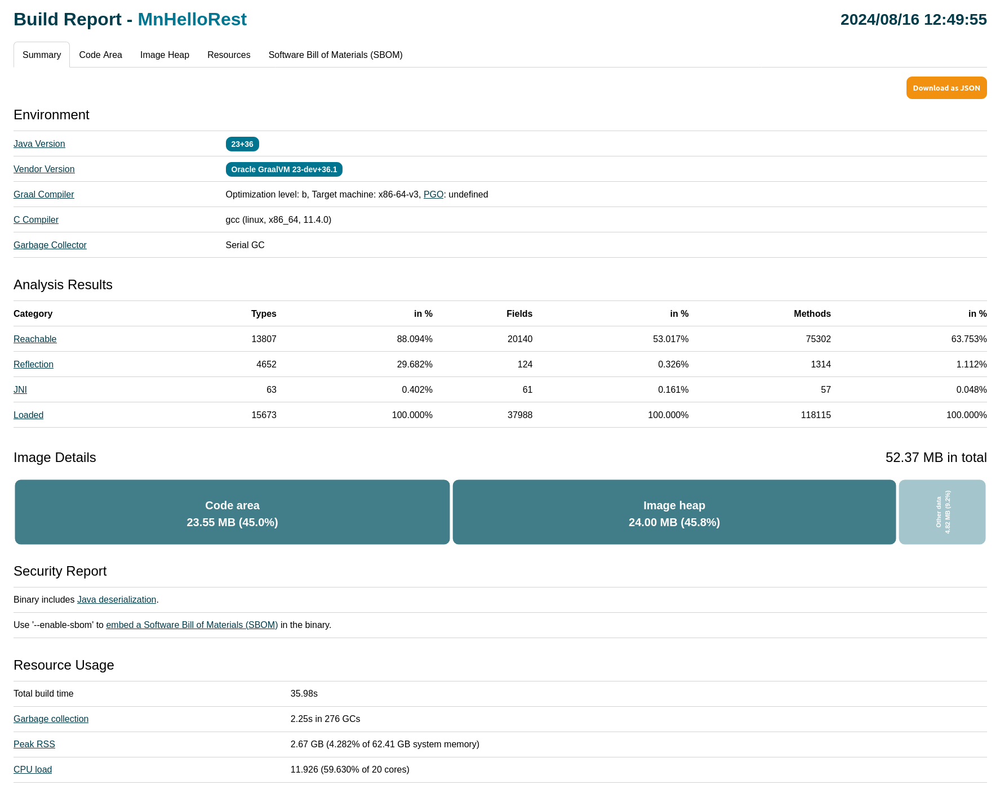
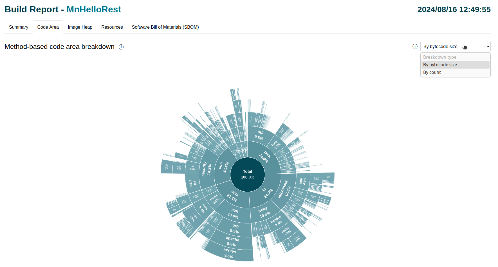
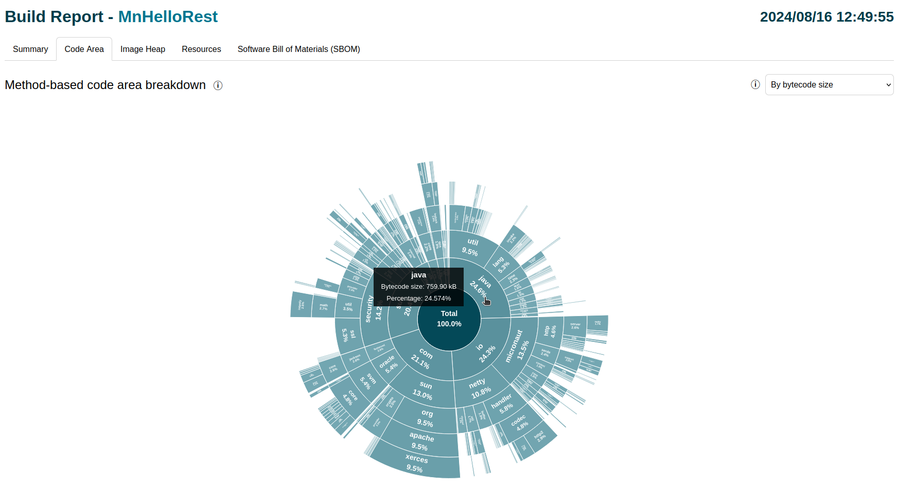
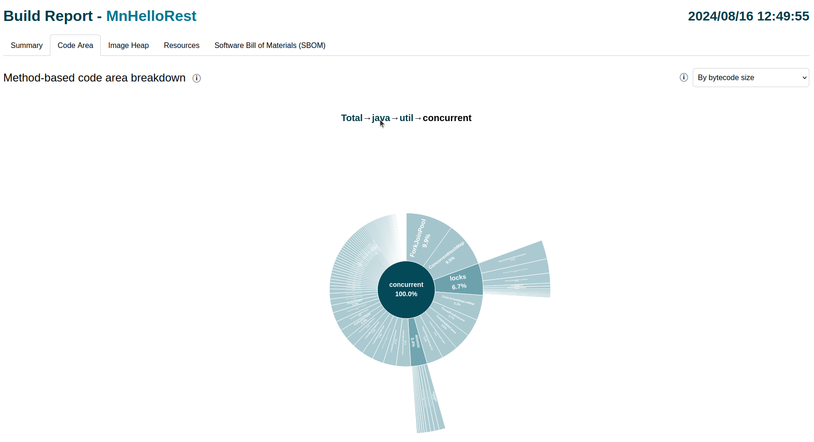
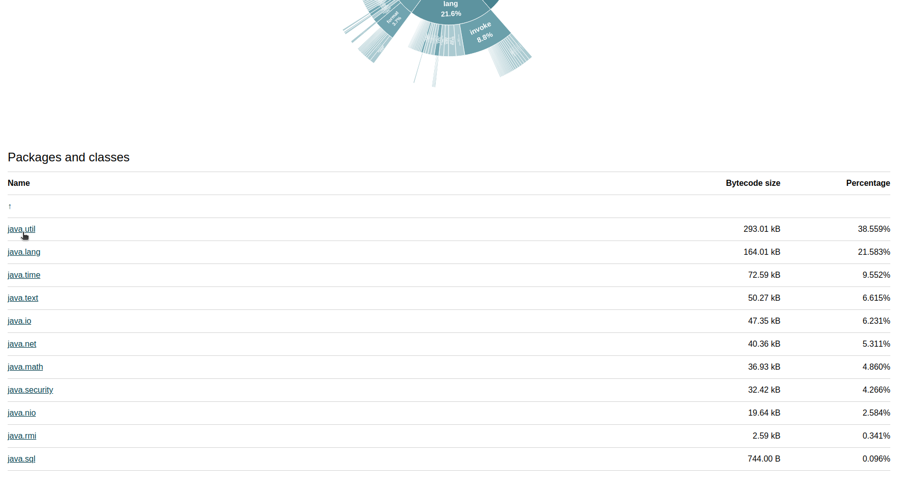
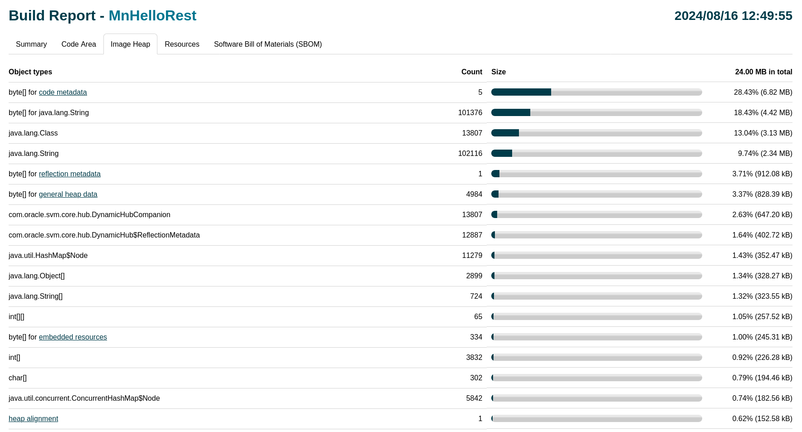
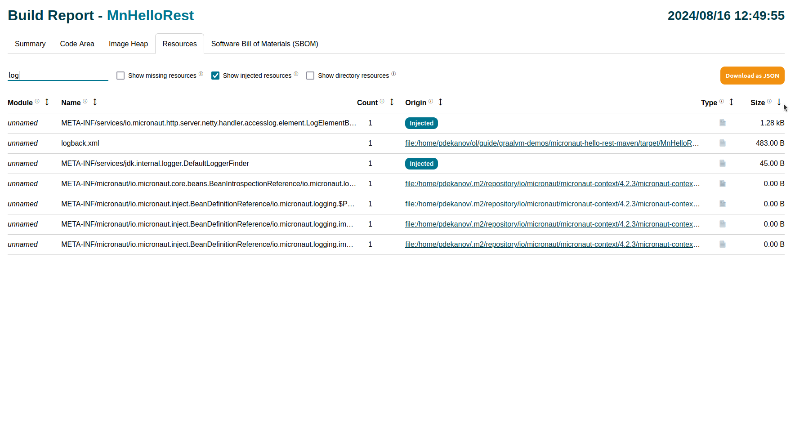
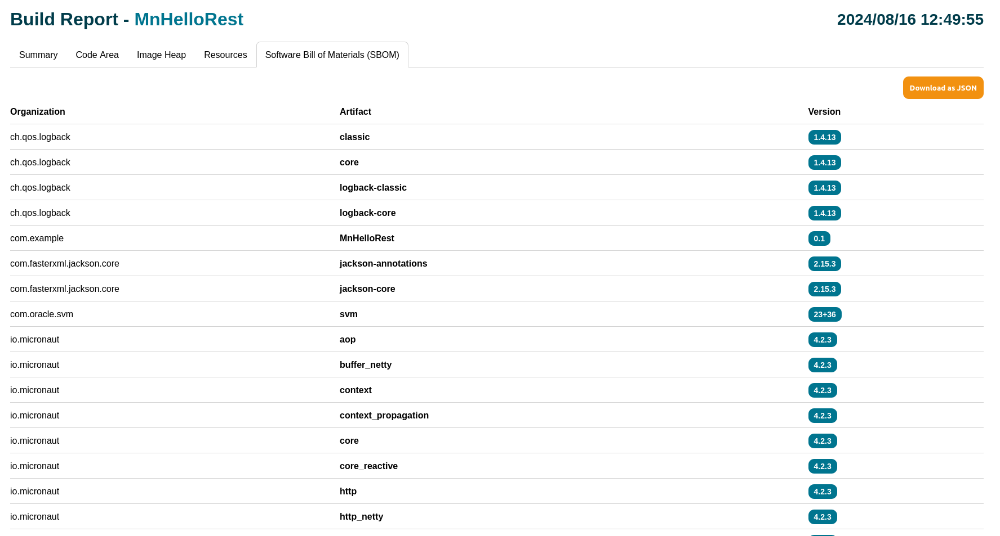

# Native Image Build Report

Build Report is a single HTML page report specifically tailored for GraalVM Native Image.
The report provides broad information about each build stage as well as the generated binary's contents.
Here you will learn how to generate a Build Report and how to use each report section.

> Note: Build Report is not available in GraalVM Community Edition.

### Table of Contents
* [Report Generation](#report-generation)
* [Report Structure](#report-structure)
  * [Summary](#summary)
  * [Code Area](#code-area)
    * [Method-Based Breakdown](#method-based-breakdown)
    * [List of Packages and Classes](#list-of-packages-and-classes)
  * [Image Heap](#image-heap)
  * [Resources](#resources)
  * [Software Bill of Materials (SBOM)](#software-bill-of-materials-sbom)
  * [PGO Sampling Profile](#pgo-sampling-profile)
* [Related Documentation](#related-documentation)

## Report Generation

A simple HelloWorld Micronaut application (available in the [GraalVM Demos repository](https://github.com/graalvm/graalvm-demos/tree/master/native-image/microservices/micronaut-hello-rest-maven)) is used to demonstrate Build Report generation and its structure.

A Build Report can simply be generated using the `--emit` option when running the `native-image` command:

```shell
native-image --emit build-report -cp . Application
```

In the case of the Micronaut example using the [Maven plugin for Native Image](https://graalvm.github.io/native-build-tools/latest/maven-plugin.html), simply add the option `--emit build-report` in the plugin's configuration:

```xml
<plugin>
  <groupId>org.graalvm.buildtools</groupId>
  <artifactId>native-maven-plugin</artifactId>
  <configuration>
    ...
    <buildArgs combine.children="append">
      <buildArg>--emit build-report</buildArg>
      ...
    </buildArgs>
  </configuration>
</plugin>
```

The report is automatically created alongside the generated binary after the successful build.
A link to the HTML page (named _&lt;binary-name&gt;-build-report.html_ by default) will be listed in *Build artifacts* section at the end of the build output:

```shell
========================================================================================================================
GraalVM Native Image: Generating 'MnHelloRest' (executable)...
========================================================================================================================

...

Build artifacts:
 .../graalvm-demos/micronaut-hello-rest-maven/target/MnHelloRest (executable)
 .../graalvm-demos/micronaut-hello-rest-maven/target/MnHelloRest-build-report.html (build_info) <----- generated report
========================================================================================================================
Finished generating 'MnHelloRest' in 36.0s.
```

Additionally, a report's filename or path can be customized by appending it to the `build-report` argument.
This can be very useful, for example, when creating multiple binaries of the same application using different configurations:

```shell
native-image -0b --emit build-report=/tmp/application-build-report-default.html -cp . Application
native-image -0s --emit build-report=/tmp/application-build-report-size-optimized.html -cp . Application
```

## Report Structure

Every report page consists of multiple sections, or tabs, each displaying the data corresponding to their title.
The *Summary* section is initially shown, and there are also *Code Area*, *Image Heap*, *Resources*, *Software Bill of Materials (SBOM)*, and *PGO Sampling Profile* (only in PGO builds) sections.
Each section is described in detail the following subsections.

### Summary

The *Summary* section provides a general overview of the build.
The section consists of four subsections that correspond to a stage in the build process or provide additional useful information:
- [*Environment*](BuildOutput.md#stage-initializing) provides the information about the environment used in the build (Java version, GraalVM version, Graal compiler configuration, and so on).
- [*Analysis Results*](BuildOutput.md#stage-analysis) displays the results of the points-to analysis (Types, Fields, and Methods) grouped by category (Reachable, Reflection, JNI, and Loaded).
- [*Image Details*](BuildOutput.md#stage-creating) gives an overview of the contents of the binary. The chart visualizes how different parts of the binary (Code area, Image heap, Debug info, and Other data) relate to each other in terms of their size.
- [*Security Report*](BuildOutput.md#security-report) reports various kinds of security-related information about the build (Deserialization, Embedded SBOM, and Backwards-Edge Control-Flow Integrity (CFI)).
- [*Resource Usage*](BuildOutput.md#resource-usage-statistics) provides additional information about the resources used for the build (Garbage collection, Peak RSS, and CPU load) as well as total time spent generating the binary.



> Note: Hover over each bar in *Image Details* to see more information.
> Also, click the *Code Area* and *Image Heap* bars to link to their respective sections.

All this information is also available in JSON format and can be downloaded by clicking *Download as JSON* at top-right of the page.

### Code Area

The *Code Area* section provides an in-depth view of code found reachable after the static analysis.
It consists of two interconnected parts: a [*breakdown chart*](#method-based-breakdown) and [*list of packages and classes*](#list-of-packages-and-classes).

#### Method-Based Breakdown

The code area of the binary is broken down by packages on fine-grained method-level.
The breakdown considers only reachable methods found by the points-to analysis.
It is visualized in the form of a sunburst chart: a hierarchical multi-level pie chart.

The chart displays how different packages (and classes) relate to each other.
The ratios are calculated based on either cumulative method **bytecode size** (by default) or **total number** of methods.
This can be selected using the *Breakdown type* drop-down list at the top-right of the page.



> Note: A fixed threshold is used to limit the amount of data shown on the chart (0.1 of total percentage relative to the current root package).
> The threshold _only_ applies to the breakdown chart, whereas the table underneath contains the complete list of packages and classes (on the current level).

The percentages (shown in every package arc) represent the relationship between sibling packages.
All the percentages are calculated relative to the root package (abstract _Total_ package for the top-level view, and arbitrary package when drilled-down to it).
Additionally, concrete values for specific packages (either its method bytecode size or total method count) can be seen by hovering over that package arc.



The most important functionality of this breakdown is the ability to deeply explore the relationships for an arbitrary package.
This can be simply achieved by clicking any package of interest (that has at least one child package or class).
The reverse operation of going back one level to the parent package is similarly achieved by clicking on the "root" package (in the center of the chart).

It is also possible to go back to any package in the drill-down chain (from _Total_ to the current package).
This is simply achieved by clicking the particular package in the drill-down chain displayed right above the chart.



Also, the breakdown chart and the list of packages and classes are _synchronized_ &mdash; every drill-down simultaneously updates the table below and vice versa.

#### List of Packages and Classes

The list of packages and classes serves as an extension to the main breakdown.
It lists every package and class that is part of the selected package (_Total_ initially).
The table also shows all the information about each package and class: its method bytecode size (or total method count) as well as its relative percentage.

Packages that have children (at least one package or class) are shown as _links_.
Click on a link to drill-down in the breakdown chart &mdash; they are _synchronized_.
Similarly, the reverse can be achieved by clicking &uarr; (shown in the first row) which goes back one level (to the parent package).



> Note: Only the _direct_ descendants of the selected package are listed (and updates with each drill-down).

### Image Heap

The object heap of the binary is broken down and grouped by object type (similar to the [Image Heap](BuildOutput.md#glossary-image-heap) table in CLI Build Output).
The main difference is that Build Report shows a complete list of object types along with more detailed information such as their counts, sizes, and relative percentages (visualized in the form of progress bars).

One common use case for the full list is to determine if any instances of a specific class are a part of the image heap (using *Find in page*).



### Resources

The Resources tab can be used to explore the Java resources included in the native image, their origin, and how their size contributes to the overall image size.
This is useful, for example, to detect resources that are accidentally included or missing due to incorrect reachability metadata.

All the resources are listed in the main table.
By default, the resources that are explicitly requested through configuration file(s) are shown.
Additionally, there are three more kinds of resources that are provided:
- *Missing resources* were requested through configuration files(s), but did not exist on the system.
- *Injected resources* were registered programmatically through the GraalVM SDK (typically used by a framework to assist Native Image compilation).
- *Directory resources* are special type of resources that represent directories (typically small as they only contain the names of files and directories within that directory).
Each of resource kind can be shown in the table via its corresponding checkbox.

Resources in the table can be filtered by their name using the search box on the top-left.
Furthermore, the list can be sorted by any of the resource attributes (using the dedicated &updownarrow; sorting button in the table header).



### Software Bill of Materials (SBOM)

A Software Bill of Materials represents an inventory of all the artifacts involved in building the final binary.
Each artifact is uniquely identified by its fully-qualified name (organization name + artifact name) and its specific version.
All the artifacts used in the build are listed in the table.



All of this information is also available as JSON in the [CycloneDX](https://github.com/CycloneDX) format and can be downloaded by clicking *Download as JSON*.

### PGO Sampling Profile

The PGO Sampling Profile is a section that is only present in reports generated when building [PGO-optimized binaries](guides/optimize-native-executable-with-pgo.md).
This section is described in detail in its dedicated PGO guide - [Inspecting a Profile in a Build Report](PGO-Build-Report.md).

## Related Documentation

- [Native Image Build Output](BuildOutput.md)
- [Inspecting a Profile in a Build Report](PGO-Build-Report.md)
- [Native Image Build Overview](BuildOverview.md)
- [Debugging and Diagnostics](DebuggingAndDiagnostics.md)
