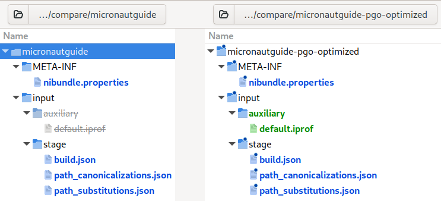

# Native Image Bundles

Native Image provides a feature that enables users to build native executables from a self-contained _bundle_. 
In contrast to regular `native-image` building, this mode of operation takes only a single _*.nib_ file as input.
The file contains everything required to build a native executable (or a native shared library).
This can be useful when large applications consisting of many input files (JAR files, configuration files, auto-generated files, downloaded files) need to be rebuilt at a later point in time without worrying whether all files are still available.
Often complex builds involve downloading many libraries that are not guaranteed to remain accessible later in time.
Using Native Image bundles is a safe solution to encapsulate all this input required for building into a single file.

> Note: The feature is experimental.

### Table of Contents

* [Creating Bundles](#creating-bundles)
* [Building with Bundles](#building-with-bundles)
* [Environment Variables](#capturing-environment-variables)
* [Creating New Bundles from Existing Bundles](#combining---bundle-create-and---bundle-apply)
* [Executing the bundled application](#executing-the-bundled-application)
* [Bundle File Format](#bundle-file-format)

## Creating Bundles

To create a bundle, pass the `--bundle-create` option along with the other arguments for a specific `native-image` command line invocation.
This will cause `native-image` to create a _*.nib_ file in addition to the actual image.

Here is the option description:
```
--bundle-create[=new-bundle.nib][,dry-run][,container[=<container-tool>][,dockerfile=<Dockerfile>]]
                      in addition to image building, create a Native Image bundle file (*.nib
                      file) that allows rebuilding of that image again at a later point. If a
                      bundle-file gets passed, the bundle will be created with the given
                      name. Otherwise, the bundle-file name is derived from the image name.
                      Note both bundle options can be extended with ",dry-run" and ",container"
                      * 'dry-run': only perform the bundle operations without any actual image building.
                      * 'container': sets up a container image for image building and performs image building
                        from inside that container. Requires podman or rootless docker to be installed.
                        If available, 'podman' is preferred and rootless 'docker' is the fallback. Specifying
                        one or the other as '=<container-tool>' forces the use of a specific tool.
                      * 'dockerfile=<Dockerfile>': Use a user provided 'Dockerfile' instead of the default based on
                        Oracle Linux 8 base images for GraalVM (see https://github.com/graalvm/container)
```

For example, assuming a Micronaut application is built with Maven, make sure the `--bundle-create` option is used.
For that, the following needs to be added to the plugins section of `pom.xml`:
```xml
<plugin>
  <groupId>org.graalvm.buildtools</groupId>
  <artifactId>native-maven-plugin</artifactId>
  <configuration>
      <buildArgs combine.children="append">
          <buildArg>--bundle-create</buildArg>
      </buildArgs>
  </configuration>
</plugin>
```

Then, when you run the Maven package command `mvn -Pnative native:compile`, you will get the following build artifacts:
```
Finished generating 'micronautguide' in 2m 0s.

Native Image Bundles: Bundle build output written to /home/testuser/micronaut-data-jdbc-repository-maven-java/target/micronautguide.output
Native Image Bundles: Bundle written to /home/testuser/micronaut-data-jdbc-repository-maven-java/target/micronautguide.nib
```

This output indicates that you have created a native executable, `micronautguide`, and a bundle, _micronautguide.nib_.
The bundle file is created in the _target/_ directory.
It should be copied to some safe place where it can be found if the native executable needs to be rebuilt later.

Obviously, a bundle file can be large because it contains all input files as well as the executable itself (the executable is compressed within the bundle). 
Having the image inside the bundle allows comparing a native executable rebuilt from the bundle against the original one.
In the case of the `micronaut-data-jdbc-repository` example, the bundle is 60.7 MB (the executable is 103.4 MB).
To see what is inside a bundle, run `jar tf *.nib`:
```shell
$ jar tf micronautguide.nib
META-INF/MANIFEST.MF
META-INF/nibundle.properties
output/default/micronautguide
com/oracle/svm/driver/launcher/BundleLauncherUtil.class
com/oracle/svm/driver/launcher/ContainerSupport$TargetPath.class
com/oracle/svm/driver/launcher/BundleLauncherHelp.txt
com/oracle/svm/driver/launcher/BundleLauncher.class
com/oracle/svm/driver/launcher/configuration/BundleConfigurationParser.class
com/oracle/svm/driver/launcher/configuration/BundleEnvironmentParser.class
com/oracle/svm/driver/launcher/configuration/BundleArgsParser.class
com/oracle/svm/driver/launcher/configuration/BundlePathMapParser.class
com/oracle/svm/driver/launcher/configuration/BundleContainerSettingsParser.class
com/oracle/svm/driver/launcher/ContainerSupport.class
com/oracle/svm/driver/launcher/json/BundleJSONParser.class
com/oracle/svm/driver/launcher/json/BundleJSONParserException.class
input/classes/cp/micronaut-core-3.8.7.jar
input/classes/cp/netty-buffer-4.1.87.Final.jar
input/classes/cp/jackson-databind-2.14.1.jar
input/classes/cp/micronaut-context-3.8.7.jar
input/classes/cp/reactive-streams-1.0.4.jar
...
input/classes/cp/netty-handler-4.1.87.Final.jar
input/classes/cp/micronaut-jdbc-4.7.2.jar
input/classes/cp/jackson-core-2.14.0.jar
input/classes/cp/micronaut-runtime-3.8.7.jar
input/classes/cp/micronautguide-0.1.jar
input/stage/path_substitutions.json
input/stage/path_canonicalizations.json
input/stage/build.json
input/stage/run.json
input/stage/environment.json
input/stage/Dockerfile
```

As you can see, a bundle is just a JAR file with a specific layout.
This is explained in detail [below](#bundle-file-format).

Next to the bundle, you can also find the output directory: _target/micronautguide.output_.
It contains the native executable and all other files that were created as part of the build. 
Since you did not specify any options that would produce extra output (for example, `-g` to generate debugging information or `--diagnostics-mode`), only the executable can be found there:
```shell
$ tree target/micronautguide.output
target/micronautguide.output
├── default
│   └── micronautguide
└── other
```

### Combining --bundle-create with dry-run

As mentioned in the `--bundle-create` option description, it is also possible to let `native-image` build a bundle but not actually perform the image building.
This might be useful if a user wants to move the bundle to a more powerful machine and build the image there.
Modify the `--bundle-create` argument in the `native-maven-plugin` configuration above to `<buildArg>--bundle-create,dry-run</buildArg>`.
Then running `mvn -Pnative native:compile` takes only seconds and the created bundle is much smaller: 
```
Native Image Bundles: Bundle written to /home/testuser/micronaut-data-jdbc-repository-maven-java/target/micronautguide.nib
```

Now _micronautguide.nib_ is only 20 MB in file size and the executable is not included:
```shell
$ jar tf micronautguide.nib
META-INF/MANIFEST.MF
META-INF/nibundle.properties
input/classes/cp/micronaut-core-3.8.7.jar
...
```

Note that this time you do not see the following message in the Maven output:
```
Native Image Bundles: Bundle build output written to /home/testuser/micronaut-data-jdbc-repository-maven-java/target/micronautguide.output
```
Since no executable is created, no bundle build output is available.

## Building with Bundles

Assuming that the native executable is used in production and once in a while, an unexpected exception is thrown at run time.
Since you still have the bundle that was used to create the executable, it is trivial to build a variant of that executable with debugging support.
Use `--bundle-apply=micronautguide.nib` like this:
```shell
$ native-image --bundle-apply=micronautguide.nib -g

Native Image Bundles: Loaded Bundle from /home/testuser/micronautguide.nib
Native Image Bundles: Bundle created at 'Tuesday, March 28, 2023, 11:12:04 AM Central European Summer Time'
Native Image Bundles: Using version: '20.0.1+8' (vendor 'Oracle Corporation') on platform: 'linux-amd64'
Warning: Native Image Bundles are an experimental feature.
========================================================================================================================
GraalVM Native Image: Generating 'micronautguide' (executable)...
========================================================================================================================
...
Finished generating 'micronautguide' in 2m 16s.

Native Image Bundles: Bundle build output written to /home/testuser/micronautguide.output
```

After running this command, the executable is rebuilt with an extra option `-g` passed after `--bundle-apply`.
The output of this build is in the directory _micronautguide.output_:
```
micronautguide.output
micronautguide.output/other
micronautguide.output/default
micronautguide.output/default/micronautguide.debug
micronautguide.output/default/micronautguide
micronautguide.output/default/sources
micronautguide.output/default/sources/javax
micronautguide.output/default/sources/javax/smartcardio
micronautguide.output/default/sources/javax/smartcardio/TerminalFactory.java
...
micronautguide.output/default/sources/java/lang/Object.java
```

You successfully rebuilt the application from the bundle with debug info enabled.

The full option help of `--bundle-apply` shows a more advanced use case that will be discussed [later](#combining---bundle-create-and---bundle-apply) in detail:
```
--bundle-apply=some-bundle.nib[,dry-run][,container[=<container-tool>][,dockerfile=<Dockerfile>]]
                      an image will be built from the given bundle file with the exact same
                      arguments and files that have been passed to native-image originally
                      to create the bundle. Note that if an extra --bundle-create gets passed
                      after --bundle-apply, a new bundle will be written based on the given
                      bundle args plus any additional arguments that have been passed
                      afterwards. For example:
                      > native-image --bundle-apply=app.nib --bundle-create=app_dbg.nib -g
                      creates a new bundle app_dbg.nib based on the given app.nib bundle.
                      Both bundles are the same except the new one also uses the -g option.
```


### Building in a Container

Another addition to the `--bundle-create` and `--bundle-apply` options, as mentioned above, is to perform image building inside a container image.
This ensures that during the image build `native-image` can not access any resources that were not explicitly specified via the classpath or module path.
Modify the `--bundle-create` argument in the `native-maven-plugin` configuration to `<buildArg>--bundle-create,container<buildArg>`.
This still creates the same bundle as before. 
However, a container image is built and then used for building the native image executable.
If the container image is newly created, you can also see the build output from the container tool. 
The name of the container image is the hash of the used Dockerfile.
If the container image already exists you will see the following line in the build output instead:

```shell
Native Image Bundles: Reusing container image c253ca50f50b380da0e23b168349271976d57e4e.
```

For building in a container you require either _podman_ or _rootless docker_ to be available on your system.
Additionally, building in a container is currently only supported for Linux.
Using any other OS native image will not create and use a container image.
The container tool used for running the image build can be specified with `<buildArg>--bundle-create,container=podman<buildArg>` or `<buildArg>--bundle-create,container=docker<buildArg>`.
If not specified, `native-image` uses one of the supported tools. 
If available, `podman` is preferred and rootless `docker` is the fallback.

The Dockerfile used to build the container image may also be explicitly specified with `--bundle-create,container,dockerfile=<path-to-dockerfile>`.
If no Dockerfile was specified, a default Dockerfile is used, which is based on the Oracle Linux 8 container images for GraalVM from [here](https://github.com/graalvm/container).
Whichever Dockerfile is finally used to build the container image is stored in the bundle.
Even if you do not use the `container` option, `native-image` creates a Dockerfile and stores it in the bundle.

Other than creating a container image on the host system, building inside a container does not create any additional build output.
However, the created bundle contains some additional files:
```shell
$ jar tf micronautguide.nib
META-INF/MANIFEST.MF
META-INF/nibundle.properties
...
input/classes/cp/micronaut-management-3.8.7.jar
input/stage/path_substitutions.json
input/stage/path_canonicalizations.json
input/stage/build.json
input/stage/run.json
input/stage/environment.json
input/stage/Dockerfile
input/stage/container.json
```
The bundle contains the Dockerfile used for building the container image and stores the used container tool, its version and the name of the container image in `container.json`:
```json
{
    "containerTool":"podman",
    "containerToolVersion":"podman version 3.4.4",
    "containerImage":"c253ca50f50b380da0e23b168349271976d57e4e"
}
```

The `container` option may also be combined with `dry-run`, in this case `native-image` does neither create an executable nor a container image.
It does not even check if the selected container tool is available.
In this case, _container.json_ is omitted, or, if you explicitly specified a container tool, just contains the _containerTool_ field without any additional information.

Containerized builds are sticky, which means that if a bundle was created with `--bundle-create,container` the bundle is marked as a container build.
If you now use `--bundle-apply` with this bundle, it is automatically built in a container again.
However, this does not apply to [executing a bundle](#executing-the-bundled-application), a bundled application is still executed outside a container by default.

The extended command line interface for containerized builds is shown in the option help texts for `--bundle-create` and `--bundle-apply` above.

## Capturing Environment Variables

Before bundle support was added, all environment variables were visible to the  `native-image` builder.
This approach does not work well with bundles and is problematic for image building without bundles.
Consider having an environment variable that holds sensitive information from your build machine.
Due to Native Image's ability to run code at build time that can create data to be available at run time, it is very easy to build an image where you accidentally leak the contents of such variables.

Passing environment variables to `native-image` now requires explicit arguments.

Suppose a user wants to use an environment variable (for example, `KEY_STORAGE_PATH`) from the environment in which the `native-image` tool is invoked, in the class initializer that is set to be initialized at build time.
To allow accessing the variable in the class initializer (with `java.lang.System.getenv`), pass the option `-EKEY_STORAGE_PATH` to the builder.

To make an environment variable accessible to build time, use:
```
-E<env-var-key>[=<env-var-value>]
                      allow native-image to access the given environment variable during
                      image build. If the optional <env-var-value> is not given, the value
                      of the environment variable will be taken from the environment
                      native-image was invoked from.
```

Using `-E` works as expected with bundles.
Any environment variable specified with `-E` will be captured in the bundle.
For variables where the optional `<env-var-value>` is not given, the bundle would capture the value the variable had at the time the bundle was created.
The prefix `-E` was chosen to make the option look similar to the related `-D<java-system-property-key>=<java-system-property-value>` option (which makes Java system properties available at build time).

## Combining --bundle-create and --bundle-apply

As already mentioned in [Building with Bundles](#building-with-bundles), it is possible to create a new bundle based on an existing one.
The `--bundle-apply` help message has a simple example.
A more interesting example arises if an existing bundle is used to create a new bundle that builds a PGO-optimized version of the original application.

Assuming you have already built the `micronaut-data-jdbc-repository` example into a bundle named _micronautguide.nib_.
To produce a PGO-optimized variant of that bundle, first build a variant of the native executable that generates PGO profiling information at run time (you will use it later):
```shell
$ native-image --bundle-apply=micronautguide.nib --pgo-instrument
```

Now run the generated executable so that profile information is collected:
```shell
$ /home/testuser/micronautguide.output/default/micronautguide
```

Based on <a href="https://guides.micronaut.io/latest/micronaut-data-jdbc-repository.html" target="_blank">this walkthrough</a>, you use the running native executable to add new database entries and query the information in the database afterwards so that you get real-world profiling information.
Once completed, stop the Micronaut application using `Ctrl+C` (`SIGTERM`).
Looking into the current working directory, you can find a new file:
```shell
$ ls -lh  *.iprof
-rw------- 1 testuser testuser 19M Mar 28 14:52 default.iprof
```

The file `default.iprof` contains the profiling information that was created because you ran the Micronaut application from the executable built with `--pgo-instrument`.
Now you can create a new optimized bundle out of the existing one:
```shell
native-image --bundle-apply=micronautguide.nib --bundle-create=micronautguide-pgo-optimized.nib,dry-run --pgo
```

Now take a look how _micronautguide-pgo-optimized.nib_ is different from _micronautguide.nib_:
```shell
$ ls -lh *.nib
-rw-r--r-- 1 testuser testuser  20M Mar 28 11:12 micronautguide.nib
-rw-r--r-- 1 testuser testuser  23M Mar 28 15:02 micronautguide-pgo-optimized.nib
```

You can see that the new bundle is 3 MB larger than the original.
The reason, as can be guessed, is that now the bundle contains the _default.iprof_ file.
Using a tool to compare directories, you can inspect the differences in detail:



As you can see, _micronautguide-pgo-optimized.nib_ contains _default.iprof_ in the directory _input/auxiliary_, and there
are also changes in other files. The contents of _META-INF/nibundle.properties_, _input/stage/path_substitutions.json_
and _input/stage/path_canonicalizations.json_ will be explained [later](#bundle-file-format). 
For now, look at the diff in _build.json_:
```
@@ -4,5 +4,6 @@
   "--no-fallback",
   "-H:Name=micronautguide",
   "-H:Class=example.micronaut.Application",
-  "--no-fallback"
+  "--no-fallback",
+  "--pgo"
 ]
```

As expected, the new bundle contains the `--pgo` option that you passed to `native-image` to build an optimized bundle.
Building a native executable from this new bundle generates a PGO-optimized executable out of the box (see `PGO: on` in build output):
```shell
$ native-image --bundle-apply=micronautguide-pgo-optimized.nib
...
[1/8] Initializing...                                                                                    (3.9s @ 0.27GB)
 Java version: 20.0.1+8, vendor version: GraalVM EE 20.0.1+8.1
 Graal compiler: optimization level: '2', target machine: 'x86-64-v3', PGO: on
 C compiler: gcc (redhat, x86_64, 13.0.1)
 Garbage collector: Serial GC (max heap size: 80% of RAM)
 6 user-specific feature(s)
...
```

## Executing a Bundled Application

As described later in [Bundle File Format](#bundle-file-format), a bundle file is a JAR file with a contained launcher for launching the bundled application.
This means you can use a native image bundle with any JDK and execute it as a JAR file with `<jdk>/bin/java -jar [bundle-file.nib]`.
The launcher uses the command line arguments stored in _run.json_ and adds all JAR files and folders in _input/classes/cp_ and _input/classes/p_ to the classpath and module path respectively.

The launcher also comes with a separate command line interface described in its help text:
```
This native image bundle can be used to launch the bundled application.

Usage: java -jar bundle-file [options] [bundle-application-options]

where options include:

    --with-native-image-agent[,update-bundle[=<new-bundle-name>]]
                runs the application with a native-image-agent attached
                'update-bundle' adds the agents output to the bundle-files classpath.
                '=<new-bundle-name>' creates a new bundle with the agent output instead.
                Note 'update-bundle' requires native-image to be installed

    --container[=<container-tool>][,dockerfile=<Dockerfile>]
                sets up a container image for execution and executes the bundled application
                from inside that container. Requires podman or rootless docker to be installed.
                If available, 'podman' is preferred and rootless 'docker' is the fallback. Specifying
                one or the other as '=<container-tool>' forces the use of a specific tool.
                'dockerfile=<Dockerfile>': Use a user provided 'Dockerfile' instead of the Dockerfile
                bundled with the application

    --verbose   enable verbose output
    --help      print this help message
```

Running the bundled application with the `--with-native-image-agent` argument requires a `native-image-agent` library to be available.
The output of the `native-image-agent` is written to _<bundle-name>.output/launcher/META-INF/native-image/<bundle-name>-agent_.
If native image agents output should be inserted into the bundle with `,update-bundle`, the launcher then also requires `native-image`.
The `update-bundle` option executes the command `native-image --bundle-apply=<bundle-name>.nib --bundle-create=<bundle-name>.nib -cp <bundle-name>.output/launcher` after executing the bundled application with the `native-image-agent` attached.

The `container` option realizes a similar behavior to [containerized image builds](#building-in-a-container).
However, the only exception is that in this case the application is executed inside the container instead of `native-image`.
Every bundle contains a Dockerfile which is used for executing the bundled application in a container.
However, this Dockerfile can be overwritten by adding `,dockerfile=<path-to-dockerfile>` to the `--container` argument.

The bundle launcher only consumes options it knows, all other arguments are passed on to the bundled application.
If the bundle launcher parses ` -- ` without a specified option, the launcher stops parsing arguments.
All remaining arguments are then also passed on to the bundled application.

## Bundle File Format

A bundle file is a JAR file with a well-defined internal layout.
Inside a bundle you can find the following inner structure:

```
[bundle-file.nib]
├── META-INF
│   ├── MANIFEST.MF
│   └── nibundle.properties <- Contains build bundle version info:
│                              * Bundle format version (BundleFileVersion{Major,Minor})
│                              * Platform and architecture the bundle was created on 
│                              * GraalVM / Native-image version used for bundle creation
├── com.oracle.svm.driver.launcher <- launcher for executing the bundled application
├── input <- All information required to rebuild the image
│   ├── auxiliary <- Contains auxiliary files passed to native-image via arguments
│   │                (e.g. external `config-*.json` files or PGO `*.iprof`-files)
│   ├── classes   <- Contains all class-path and module-path entries passed to the builder
│   │   ├── cp
│   │   └── p
│   └── stage
│       ├── build.json          <- Full native-image command line (minus --bundle options)
│       ├── container.json            <- Containerization tool, tool version and container
│       │                                image name (not available information is omitted)
│       ├── Dockerfile                 <- Dockerfile used for building the container image
│       ├── environment.json              <- Environment variables used in the image build
│       ├── path_canonicalizations.json  <- Record of path-canonicalizations that happened
│       │                                       during bundle creation for the input files
│       ├── path_substitutions.json          <- Record of path-substitutions that happened
│       │                                       during bundle creation for the input files                                        
│       └── run.json            <- Full command line for executing the bundled application
│                                                        (minus classpath and module path)
└── output
    ├── default
    │   ├── myimage         <- Created image and other output created by the image builder 
    │   ├── myimage.debug
    |   └── sources
    └── other      <- Other output created by the builder (not relative to image location)
```
### META-INF

The layout of a bundle file itself is versioned.
There are two properties in _META-INF/nibundle.properties_ that declare which version of the layout a given bundle file is based on.
Bundles currently use the following layout version:
```shell
BundleFileVersionMajor=0
BundleFileVersionMinor=9
```

Future versions of GraalVM might alter or extend the internal structure of bundle files.
The versioning enables us to evolve the bundle format with backwards compatibility in mind.

### input

This directory contains all input data that gets passed to the `native-image` builder. 
The file _input/stage/build.json_ holds the original command line that was passed to `native-image` when the bundle was created.

Parameters that make no sense to get reapplied in a bundle-build are already filtered out.
These include:
* `--bundle-{create,apply}`
* `--verbose`
* `--dry-run`

The state of environment variables that are relevant for the build are captured in _input/stage/environment.json_.
For every `-E` argument that was seen when the bundle was created, a snapshot of its key-value pair is recorded in the file.
The remaining files _path_canonicalizations.json_ and _path_substitutions.json_ contain a record of the file-path transformations that were performed by the `native-image` tool based on the input file paths as specified by the original command line arguments.

### output

If a native executable is built as part of building the bundle (for example, the `,dry-run` option was not used), you also have an _output_ directory in the bundle.
It contains the executable that was built along with any other files that were generated as part of building.
Most output files are located in the directory _output/default_ (the executable, its debug info, and debug sources).
Builder output files, that would have been written to arbitrary absolute paths if the executable had not been built in the bundle mode, can be found in _output/other_.

### Related Documentation

* [Native Image Build Configuration](BuildConfiguration.md)
* [Native Image Build Output](BuildOutput.md)