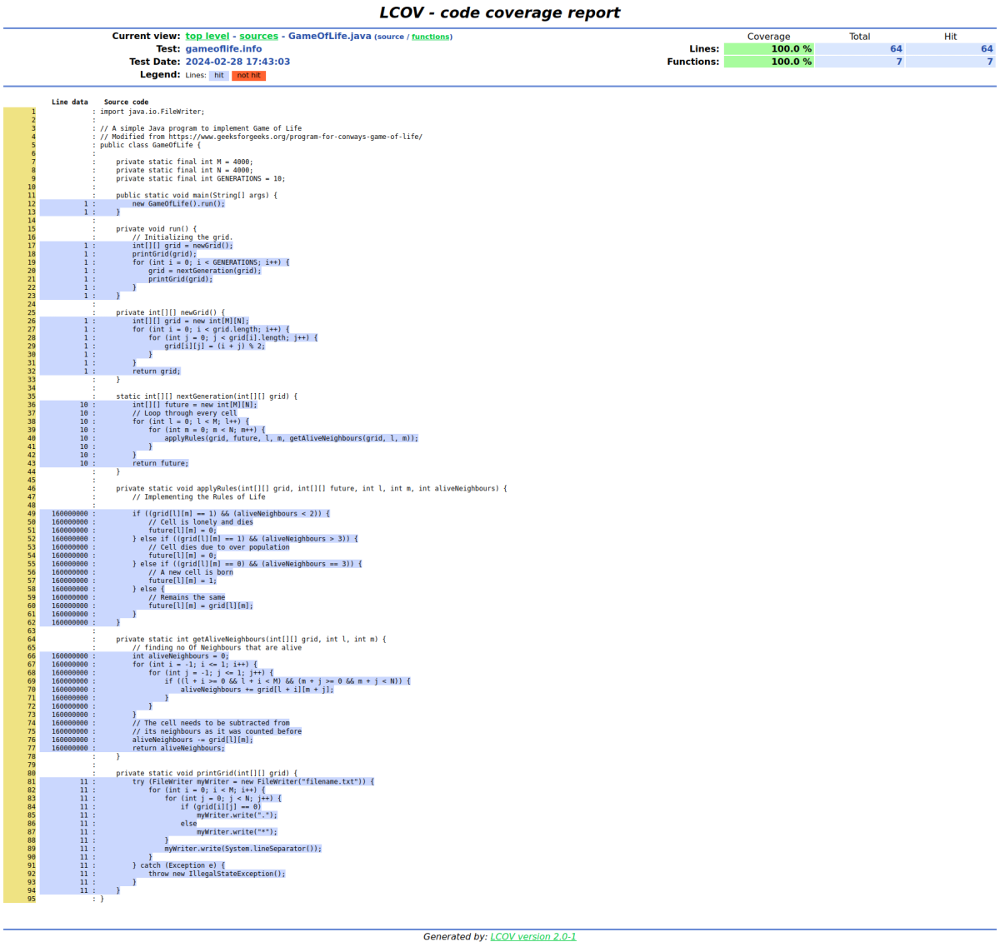

# Creating LCOV Coverage Reports

Instrumentation phase plays an essential role in the PGO pipeline.
All the run-time data, i.e, a profile, is collected during the execution of an instrumented binary.
This data is then used in the second optimization build to further improve the application performance.
The same profile can additionally be used for extracting the coverage information.
Native Image supports creating coverage reports in the [LCOV format](https://github.com/linux-test-project/lcov),
so-called *trace files*.

To create a coverage report, you first need to pass the `-H:+ProfilingLCOV` option along with the
`--pgo-instrument` when building an instrumented binary.
For example:

``` bash
native-image -cp . GameOfLife -o gameoflife-instrumented --pgo-instrument -H:+ProfilingLCOV
```

The report, in the form of a `.info` trace file, is then generated along with the profile after
running the instrumented application.
In the similar fashion to profiling, one can additionally customize the destination of the generated
info file via the `-XX:ProfilesLCOVTraceFile` option.
For example:

``` bash
./gameoflife-instrumented -XX:ProfilesLCOVTraceFile=gameoflife-coverage.info
```

The generated LCOV trace file provides the coverage information at method-level, i.e., whether a
particular method got executed (and how many times) or not.
This information can be easily summarised using the `lcov` command (see
[the official LCOV man page](https://linux.die.net/man/1/lcov)).
For example:

``` bash
lcov --summary gameoflife-coverage.info
Summary coverage rate:
  lines......: 17.3% (24873 of 144172 lines)
  functions..: 15.6% (2390 of 15285 functions)
  branches...: no data found
```

Additionally, to visualize the data, one can use the [`genhtml` utility](https://linux.die.net/man/1/genhtml)
for creating HTML reports from LCOV data, or use any third-party LCOV data visualizer (e.g., the
[LCOV viewer project](https://github.com/eugenezinovyev/lcov-viewer)).

To show which methods are instrumented (found) or executed (hit), the `genhtml` additionally utilises
source files (which can be omitted).
The `-XX:ProfilesLCOVSources` option can be very useful in this particular case.
It is used for providing the custom root directory of sources files for a LCOV trace file.
For example:

``` bash
./gameoflife-instrumented -XX:ProfilesLCOVTraceFile=gameoflife-coverage.info -XX:ProfilesLCOVSources=/absolute/path/to/sources/
```

See below an example page from the report for the `gameoflife-coverage.info` trace file generated by `genhtml`:



### Further Reading

* [Inspecting a Profile in a Build Report](PGO-Build-Report.md)
* [Frequently Asked Questions](PGO-FAQ.md)