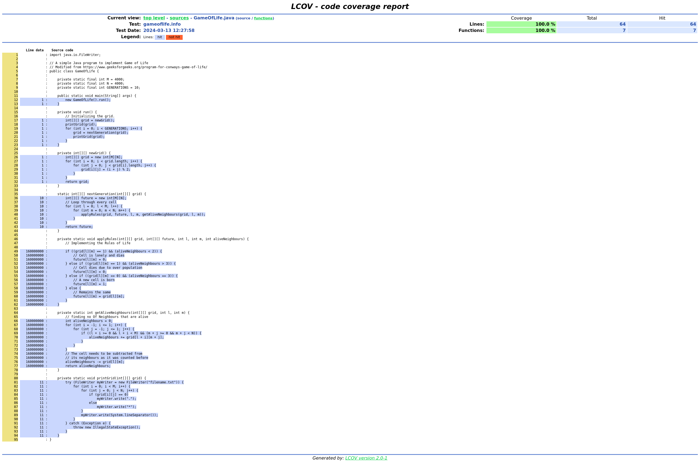
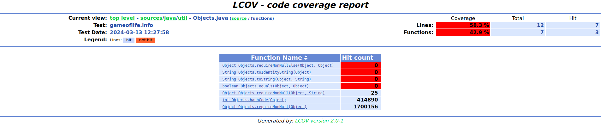

# Making Sense of PGO Reports Using LCOV

Here you will learn how to analyze PGO profiles with the aid of LCOV-based tooling.

Profile-Guided Optimization (PGO) helps you maximize the performance of your native application.
As part of the PGO process, you create an instrumented binary and run a workload on it to generate
a PGO profile file that you can then feed back into the build process to generate an optimized binary
of your application.
Typically, there's no need for you to understand the contents of such a PGO profile.
In some cases, however, you may want to understand what has been recorded as part of a profile,
especially when there is a problem with the performance of your optimized binary.
GraalVM Native Image can export profiling information in an additional file in the [LCOV format](https://github.com/linux-test-project/lcov).
You can open and visualize such a file in any IDE or tool that supports the LCOV format.
This allows you to see what methods of your code are called and how often.

The Graal compiler spends more time optimizing *hot methods*, methods that are called many times, than
*cold methods*, methods that are only called a few times or not at all.
Therefore, you can use the additional LCOV export to check what methods have actually been called as
part of the workload that ran on an instrumented binary.
This also means that the PGO profile contains appropriate profiling information for the methods.
Besides, the coverage visualization helps you identify the hot methods of your application, again for
the workload that ran on the instrumented binary.
If you want to maximize performance, these are typically the methods you want to take a closer look at.
On the contrary, methods that are not covered at all are potential candidates for cleanups, which in
turn can speed up the build time.

## Creating Coverage Report

To create a coverage report, you first need to pass the `-H:+ProfilingLCOV` experimental option along
with the `--pgo-instrument` option when building an instrumented binary.
For example:

```bash
native-image -cp . GameOfLife -o gameoflife-instrumented --pgo-instrument -H:+UnlockExperimentalVMOptions -H:+ProfilingLCOV -H:-UnlockExperimentalVMOptions
```

The report, in the form of a `.info` trace file, is then generated along with the profile after
running the instrumented application.
In the similar fashion to profiling, one can additionally customize the destination of the generated
info file via the `-XX:ProfilesLCOVFile` option.
For example:

```bash
./gameoflife-instrumented -XX:ProfilesLCOVFile=gameoflife-coverage.info
```

The generated LCOV trace file provides the coverage information at method-level, i.e., whether a
particular method got executed (and how many times) or not.
This information can be easily summarised using the `lcov` command (see
[the official LCOV man page](https://linux.die.net/man/1/lcov)).
For example:

```bash
lcov --summary gameoflife-coverage.info
```

This outputs the short summary in the format:

```
Summary coverage rate:
  lines......: 17.3% (24873 of 144172 lines)
  functions..: 15.6% (2390 of 15285 functions)
  branches...: no data found
```

Additionally, to visualize the data, one can use the [`genhtml` utility](https://linux.die.net/man/1/genhtml)
for creating HTML reports from LCOV data, or use any third-party LCOV data visualizer (e.g., the
[LCOV viewer project](https://github.com/eugenezinovyev/lcov-viewer)).

To show which methods are instrumented (found) and which are executed (hit), the `genhtml` additionally
utilises source files (which can also be omitted if unavailable using the `--synthesize-missing` option).
Also, the `--source-directory` option is useful in the case when the source files are located in a
specific directory.
For example:

```bash
genhtml --source-directory *absolute-path-to-sources* gameoflife-coverage.info
```

See below an example source file view from the report for the `gameoflife-coverage.info` trace file
generated by the former command:



More over, the `functions` view lists all the methods found in the particular source file along with
their execution counts:



### Further Reading

* [Inspecting a Profile in a Build Report](PGO-Build-Report.md)
* [Frequently Asked Questions](PGO-FAQ.md)