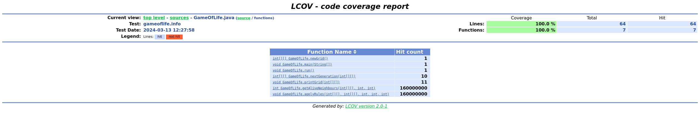

# Creating LCOV Coverage Reports

Instrumentation phase plays an essential role in the PGO pipeline.
All the run-time data, i.e, a profile, is collected during the execution of an instrumented binary.
This data is then used in the second optimization build to further improve the application performance.
The same profile can additionally be used for extracting the coverage information.
Native Image supports creating coverage reports in the [LCOV format](https://github.com/linux-test-project/lcov),
so-called *trace files*.

To create a coverage report, you first need to pass the `-H:+ProfilingLCOV` experimental option along
with the `--pgo-instrument` option when building an instrumented binary.
For example:

```bash
native-image -cp . GameOfLife -o gameoflife-instrumented --pgo-instrument -H:+UnlockExperimentalVMOptions -H:+ProfilingLCOV -H:-UnlockExperimentalVMOptions
```

The report, in the form of a `.info` trace file, is then generated along with the profile after
running the instrumented application.
In the similar fashion to profiling, one can additionally customize the destination of the generated
info file via the `-XX:ProfilesLCOVTraceFile` option.
For example:

```bash
./gameoflife-instrumented -XX:ProfilesLCOVTraceFile=gameoflife-coverage.info
```

The generated LCOV trace file provides the coverage information at method-level, i.e., whether a
particular method got executed (and how many times) or not.
This information can be easily summarised using the `lcov` command (see
[the official LCOV man page](https://linux.die.net/man/1/lcov)).
For example:

```bash
lcov --summary gameoflife-coverage.info
```

This outputs the short summary in the format:

```
Summary coverage rate:
  lines......: 17.3% (24873 of 144172 lines)
  functions..: 15.6% (2390 of 15285 functions)
  branches...: no data found
```

Additionally, to visualize the data, one can use the [`genhtml` utility](https://linux.die.net/man/1/genhtml)
for creating HTML reports from LCOV data, or use any third-party LCOV data visualizer (e.g., the
[LCOV viewer project](https://github.com/eugenezinovyev/lcov-viewer)).

To show which methods are instrumented (found) and which are executed (hit), the `genhtml` additionally
utilises source files (which can also be omitted if unavailable using the `--synthesize-missing` option).
Also, the `--source-directory` option is useful in the case when the source files are located in a
specific directory.
For example:

```bash
genhtml --source-directory *absolute-path-to-sources* gameoflife-coverage.info
```

See below an example source file view from the report for the `gameoflife-coverage.info` trace file
generated by the former command:


More over, the `functions` view lists all the methods found in the particular source file along with
their execution counts:



### Further Reading

* [Inspecting a Profile in a Build Report](PGO-Build-Report.md)
* [Frequently Asked Questions](PGO-FAQ.md)