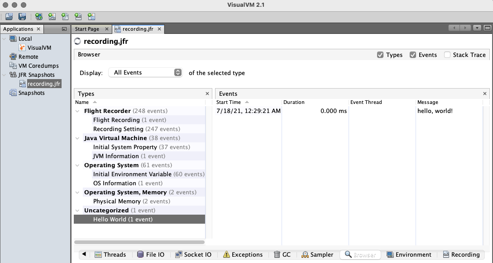

# Build and Run Native Executables with JFR

[JDK Flight Recorder (JFR)](https://docs.oracle.com/javacomponents/jmc-5-4/jfr-runtime-guide/about.htm) is a tool for collecting diagnostic and profiling data about a running Java application, built into the JVM.
GraalVM Native Image supports JFR events and users can use the [`jdk.jfr.Event` API](https://docs.oracle.com/en/java/javase/25/docs/api/jdk.jfr/jdk/jfr/Event.html) with a similar experience to using JFR in the Java HotSpot VM.

To collect JFR events when running a native executable, enable JFR support and JFR event recording as described in this guide.

> Note: JFR event recording is not yet available with Native Image on Windows.

## Enable JFR Support and Record Events at Runtime

To build a native executable with JFR events support, add the `--enable-monitoring=jfr` option when invoking the `native-image` tool, and then start JFR recording at runtime.

Follow the steps below to practice building a native executable with JFR support and recording events at runtime.

### Prerequisite
Make sure you have installed a GraalVM JDK.
The easiest way to get started is with [SDKMAN!](https://sdkman.io/jdks#graal).
For other installation options, visit the [Downloads section](https://www.graalvm.org/downloads/).

1. Save the following code to the file named _JFRDemo.java_.
    ```java
    import jdk.jfr.Event;
    import jdk.jfr.Description;
    import jdk.jfr.Label;

    public class JFRDemo {

      @Label("Hello World")
      @Description("Build and run a native executable with JFR.")
      static class HelloWorldEvent extends Event {
          @Label("Message")
          String message;
      }

      public static void main(String... args) {
          HelloWorldEvent event = new HelloWorldEvent();
          event.message = "Hello, World!";
          event.commit();
      }
    }
    ```

    This demo application consists of a simple class and JDK library classes.
    It creates an event, annotated with `@Label` from the `jdk.jfr.*` package.
    If you run this application, it will not print anything and just run that event.

2. Ccompile the application using the GraalVM JDK:
    ```shell
    javac JFRDemo.java
    ```
    It creates two class files: _JFRDemo$HelloWorldEvent.class_	and _JFRDemo.class_.

3. Build a native executable with the VM inspection enabled:
    ```shell
    native-image --enable-monitoring=jfr JFRDemo
    ```
    The `--enable-monitoring=jfr` option enables features such as JFR that can be used to inspect the VM.

4. Run the executable and start recording:
    ```shell
    ./jfrdemo -XX:StartFlightRecording=filename=recording.jfr
    ```
    This command runs the application as a native executable.
    The `-XX:StartFlightRecording` option enables the built-in Flight Recorder and starts recording to a specified binary file, _recording.jfr_.
    Additionally, you can configure the log output for JFR by passing the `-XX:FlightRecorderLogging` runtime option.

5. Start [VisualVM](https://visualvm.github.io/) to view the contents of the recording file in a user-friendly way.

6. Go to **File**, then **Add JFR Snapshot**, browse _recording.jfr_, and open the selected file.
Confirm the display name and click **OK**. Once opened, there are several options you can check (such as Monitoring, Threads, and Exceptions) but you are mostly interested in browsing events.
It will look something like this:

    

    Alternatively, you can view the contents of the recording file in the console window by running this command:

    ```shell
    jfr print recording.jfr
    ```
    It prints all the events recorded by Flight Recorder.

### Related Documentation

- Learn more about [Native Image support for JFR events](../JFR.md) and how to further configure JFR recording and system logging.