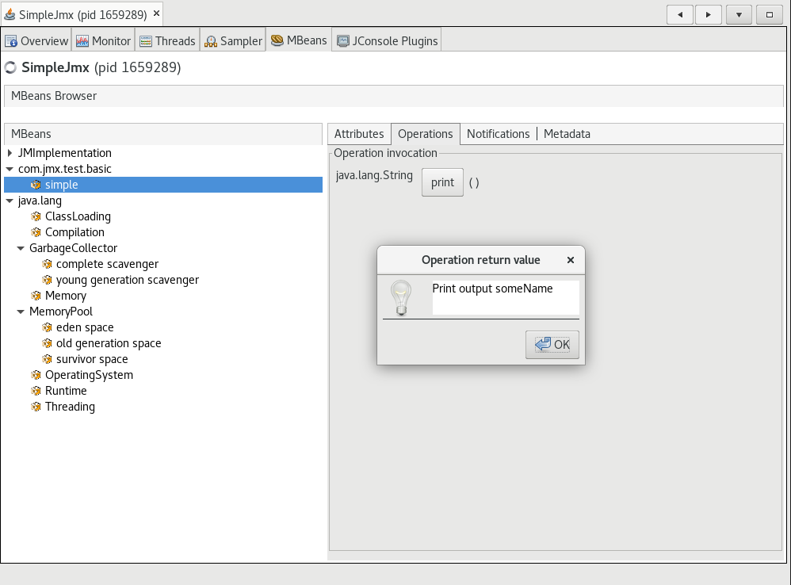

# Build and Run Native Executables with Remote JMX

Remote management using [Java Management Extensions (JMX)](https://www.oracle.com/java/technologies/javase/javamanagement.html) is possible in executables built with GraalVM Native Image.

> Note: The feature is experimental.

This guide covers the steps required to build, run, and interact with a native executable using JMX.
It also shows you how to register a custom managed bean (MBean) with the JMX server and the additional steps required for it to work with Native Image.

## Currently Supported Features and Limitations

A JMX connection from a client to a remote MBean server is supported. 
The client, the server, or both may be a native executable.
Only MXBeans, and standard user-defined MBeans, are supported. 
Dynamic and model MBeans are not supported because their management interfaces are defined at run time. 
Although remote management of MXBeans is supported, not all platform MXBean functionality is implemented or is applicable in Native Image. 
Additionally, to define and use standard MBeans, you must specify metadata configuration. 
This is further explained in this guide.    

## Step 1: Create a Demo Application

Create a demo application in a directory named _demo_.
Change your working directory to there and run the commands from that directory.

Save the following code to a file named _SimpleJmx.java_.
The `main()` method registers a custom MBean, then loop endlessly, so you have time to inspect the process using VisualVM.

```java
import javax.management.MBeanServer;
import javax.management.ObjectName;
import java.lang.management.ManagementFactory;

public class SimpleJmx {
    public static void main(String args[]) throws Exception {
        ObjectName objectName = new ObjectName("com.jmx.test.basic:name=simple");
        Simple simple = new Simple();
        simple.setName("someName");
        MBeanServer server = ManagementFactory.getPlatformMBeanServer();
        server.registerMBean(simple, objectName);
        while (true) {
            Thread.sleep(1000);
            System.out.println("JMX server running...");
        }
    }

    public static interface SimpleMBean {
        String getName();

        void setName(String name);

        String print();
    }

    static class Simple implements SimpleMBean {
        private String name;

        @Override
        public String getName() {
            return name;
        }

        @Override
        public void setName(String name) {
            this.name = name;
        }

        @Override
        public String print() {
            return "Print output " + name;
        }
    }
}
```

## Step 2: Compile to Java Bytecode

1. Make sure you have installed a GraalVM JDK.
The easiest way to get started is with [SDKMAN!](https://sdkman.io/jdks#graal).
For other installation options, visit the [Downloads section](https://www.graalvm.org/downloads/).

2. Compile the Java file using the GraalVM JDK:
    ```shell 
    $JAVA_HOME/bin/javac SimpleJmx.java
    ```
    This creates _SimpleJmx.class_, _SimpleJmx$Simple.class_, and _SimpleJmx$SimpleMBean.class_ files.

## Step 3: Make a Dynamic Proxy Configuration

JMX uses dynamic proxies, a [dynamic feature](../DynamicFeatures.md) of Java, to access MBeans.
To be able to interact with the custom `SimpleMBean` at run time, you need to provide Native Image with additional [dynamic proxy configuration](../DynamicProxy.md) for the MBean interface.
For this, create a JSON file named _proxy-config.json_ with the following contents:

```json
[
  { "interfaces": [ "SimpleJmx$SimpleMBean"] }
]
```

In the next step, you will pass this JSON file to the `native-image` builder.

## Step 4: Build a Native Executable with JMX Support

Build a native executable with VM monitoring enabled:

```shell
$JAVA_HOME/bin/native-image --enable-monitoring=jmxserver,jmxclient,jvmstat -H:DynamicProxyConfigurationFiles=proxy-config.json SimpleJmx
```

The `--enable-monitoring=jmxserver` option enables the JMX Server feature which allows accepting incoming connections.
The `--enable-monitoring=jmxclient` option enables the JMX Client feature which allows making outgoing connections.
Both features can be used together, comma-separated, for example, `--enable-monitoring=jmxserver,jmxclient`. 
The `jvmstat` option should also be included if you want to enable discovery by VisualVM and other JVMs: `--enable-monitoring=jmxserver,jmxclient,jvmstat`.

## Step 5: Run the Executable with JMX Properties

Now run your native executable with JMX properties:

```shell
./simplejmx -Dcom.sun.management.jmxremote.authenticate=false -Dcom.sun.management.jmxremote.port=9996 -Dcom.sun.management.jmxremote.ssl=false
```
This starts the application as a simple JMX server, without password authentication or SSL using port `9996`. 
You can configure JMX to apply all the usual properties as shown in [this guide](https://docs.oracle.com/javadb/10.10.1.2/adminguide/radminjmxenabledisable.html), but this example uses a basic configuration for simplicity.

## Step 6: Inspect Using VisualVM

1. Start [VisualVM](https://visualvm.github.io/) to view the managed beans in a user-friendly way.

2. Make sure you have the **VisualVM-MBeans plugin** installed (go to Tools, then Plugins, under Available Plugins, select "VisualVM-MBeans", and click Install).

3. Go to the **Applications** tab and select the **SimpleJmx** process.
   From there you can select the **MBeans** tab.

    

4. In the **MBeans** tab, you can inspect the custom MBean you created earlier and perform operations on it.

    

    

To conclude, Native Image now provides support for remote management using [JMX](https://www.oracle.com/java/technologies/javase/javamanagement.html).
Users can enable the JMX agent in a native executable to monitor a client application running on a remote system.

### Related Documentation
- [Enabling and disabling JMX](https://docs.oracle.com/javadb/10.10.1.2/adminguide/radminjmxenabledisable.html)
- [Create Heap Dumps with VisualVM](create-heap-dump-from-native-executable.md)
- [Dynamic Proxy](../DynamicProxy.md)
