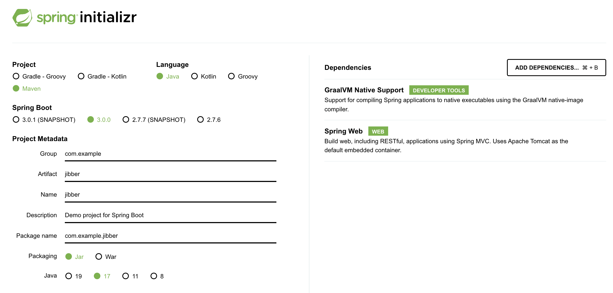

# Build a Native Executable from a Spring Boot 3 Application

With the built-in support for GraalVM Native Image in Spring Boot 3, superseding the experimental [Spring Native project](https://docs.spring.io/spring-native/docs/current/reference/htmlsingle/#overview), it has become much easier to compile a Spring Boot 3 application into a native executable.

There are two ways to generate a native executable from a Spring Boot application:
- [Using Buildpacks](https://docs.spring.io/spring-boot/docs/3.0.0/reference/html/native-image.html#native-image.developing-your-first-application.buildpacks)
- [Using GraalVM Native Build Tools](https://graalvm.github.io/native-build-tools/)

This guide focuses on using the [Native Build Tools](https://graalvm.github.io/native-build-tools/) plugins shipped by GraalVM for both Maven and Gradle. You can use them to perform a variety of GraalVM tasks.

For more information about using BuildPacks to create a native executable, see [Building a Native Image Using Buildpacks](https://docs.spring.io/spring-boot/docs/3.0.0/reference/html/native-image.html#native-image.developing-your-first-application.buildpacks).

> Note: To use the Native Build Tools, first install GraalVM. The easiest way to install GraalVM is to use the [GraalVM JDK Downloader](https://github.com/graalvm/graalvm-jdk-downloader): `bash <(curl -sL https://get.graalvm.org/jdk)`.

## Create a Sample Application

As a demonstration, this guide uses a minimal REST-based API application, built on top of Spring Boot 3:

- `com.example.jibber.JibberApplication`: the main Spring Boot class.
- `com.example.jibber.Jabberwocky`: a utility class that implements the logic of the application.
- `com.example.jibber.JibberController`: a REST controller which serves as an entry-point for HTTP requests.

If you call the HTTP endpoint, `/jibber`, it will return some nonsense verse generated in the style of the Jabberwocky poem, by Lewis Carroll. 
The program achieves this by using a Markov Chain to model the original poem (this is essentially a statistical model). 
This model generates a new text.
The example application provides the text of the poem, then generates a model of the text, which the application then uses to generate a new text that is similar to the original text. 
The application uses the [RiTa library](https://rednoise.org/rita/) as an external dependency to build and use Markov Chains.

Now follow these steps to create a Spring Boot REST-based application and compile it into a native executable.

1. Create a sample Spring Boot Java project: 

    - Go to [start.spring.io](https://start.spring.io/) and select the following values:

        
        
        Make sure you add the **GraalVM Native Support** dependency, and name the artifact and project "jibber".

    - Click **GENERATE**. Spring Initializr creates an application with the default package `com.example` in a directory named _jibber_. The application ZIP file will be downloaded in your default downloads directory. 
    
    - Unzip it, open it in your code editor, and proceed to the next steps.

2.  Open the Maven configuration file, _pom.xml_, and notice the `native-maven-plugin` plugin added:

    ```xml
    <plugin>
        <groupId>org.graalvm.buildtools</groupId>
        <artifactId>native-maven-plugin</artifactId>
    </plugin>
    ```

    This is the only dependency that you have to add to your Spring Boot 3 project to enable [Native Build Tools](https://graalvm.github.io/native-build-tools/latest/index.html), which provide a variety of GraalVM tasks. 
    
    This demonstration application uses the [Maven plugin for GraalVM Native Image building](https://graalvm.github.io/native-build-tools/latest/maven-plugin.html), but if your project is built with Gradle, substitute with  `native-gradle-plugin`.
    
    Another important thing is to ensure that your _pom.xml_ file uses `spring-boot-starter-parent`. You should have a `<parent>` element that looks like this:

    ```xml
    <parent>
        <groupId>org.springframework.boot</groupId>
        <artifactId>spring-boot-starter-parent</artifactId>
        <version>3.0.0</version>
    </parent>
    ```
    
    The `spring-boot-starter-parent` parent declares the `native` profile (as well as others, for example, `nativeTest`) that configures the executions needed to build a native executable. Then you can activate a profile using the `-P` option on the command line.

3. The application uses the [RiTa library](https://rednoise.org/rita/) as an external dependency to build and use Markov Chains. Insert the following in the `<dependency>` element of your _pom.xml_ file:

    ```xml
    <dependency>
        <groupId>org.rednoise</groupId>
        <artifactId>rita</artifactId>
        <version>2.4.501</version>
    </dependency>
    ```

4. Create a utility class named `Jabberwocky` (in a file named _Jabberwocky.java_) in the same location as the main class _src/main/java/com/example/jibber/_ with the following content:

    ```java
    package com.example.jibber;

    import org.springframework.context.annotation.Scope;
    import org.springframework.stereotype.Service;
    import rita.RiMarkov;

    @Service
    @Scope("singleton")
    public class Jabberwocky {

        private RiMarkov r;

        public Jabberwocky() {
            loadModel();
        }

        private void loadModel() {

            String text = "’Twas brillig, and the slithy toves " +
                    "Did gyre and gimble in the wabe:" +
                    "All mimsy were the borogoves, " +
                    "And the mome raths outgrabe. " +
                    "Beware the Jabberwock, my son! " +
                    "The jaws that bite, the claws that catch! " +
                    "Beware the Jubjub bird, and shun " +
                    "The frumious Bandersnatch! " +
                    "He took his vorpal sword in hand; " +
                    "Long time the manxome foe he sought— " +
                    "So rested he by the Tumtum tree " +
                    "And stood awhile in thought. " +
                    "And, as in uffish thought he stood, " +
                    "The Jabberwock, with eyes of flame, " +
                    "Came whiffling through the tulgey wood, " +
                    "And burbled as it came! " +
                    "One, two! One, two! And through and through " +
                    "The vorpal blade went snicker-snack! " +
                    "He left it dead, and with its head " +
                    "He went galumphing back. " +
                    "And hast thou slain the Jabberwock? " +
                    "Come to my arms, my beamish boy! " +
                    "O frabjous day! Callooh! Callay!” " +
                    "He chortled in his joy. " +
                    "’Twas brillig, and the slithy toves " +
                    "Did gyre and gimble in the wabe: " +
                    "All mimsy were the borogoves, " +
                    "And the mome raths outgrabe.";
            this.r = new RiMarkov(3);
            this.r.addText(text);
        }

        public String generate() {
            return generate(10);
        }

        public String generate(final int numLines) {
            String[] lines = this.r.generate(numLines);
            StringBuffer b = new StringBuffer();
            for (int i=0; i< lines.length; i++) {
                b.append(lines[i]);
                b.append("<br/>\n");
            }
            return b.toString();
        }

    }
    ```
    It is a Singleton class that generates nonsense verse in the style of the poem Jabberwocky, by Lewis Carroll. It does this using a Markov Chain to model the text of the original poem.   

5. Create a REST controller class named `JibberController` (in a file named _JibberController.java_), which serves as an entry-point for HTTP requests in the directory _src/main/java/com/example/jibber/_. Add the following content:

    ```java
    package com.example.jibber;

    import org.springframework.beans.factory.annotation.Autowired;
    import org.springframework.http.ResponseEntity;
    import org.springframework.web.bind.annotation.*;

    @RestController
    @RequestMapping("/jibber")
    public class JibberController {

        @Autowired
        Jabberwocky j;

        @RequestMapping
        ResponseEntity<String> jibber() {
            return ResponseEntity.ok(j.generate());
        }

        @RequestMapping(value = "/{number}")
        ResponseEntity<String> jibberN(@PathVariable int number) {
            return ResponseEntity.ok(j.generate(number));
        }
    }
    ```

This application is now ready to be built and compiled ahead-of-time into a native executable.

## Generate a Native Executable Using the Maven Profile

1. Run the following command:

    ```shell
    ./mvnw native:compile -Pnative
    ```
    It will generate a native executable for your platform in the _target_ directory, called _jibber_.

2. Run this native executable and put it into the background, by appending `&`:

    ```shell
    ./target/jibber &
    ```
    Open the application [http://localhost:8080/jibber](http://localhost:8080/jibber) in a browser to test it, or call the endpoint using `curl`:

    ```shell
    curl http://localhost:8080/jibber
    ```
    You should get some nonsense verse back. 
    To terminate it, first bring the application to the foreground using `fg`, and then enter `<CTRL-c>`.

As an experiment, compare the startup time when running this application from a JAR file:

1. Recompile the application: 

    ```shell
    ./mvnw clean package
    ```
    It generates a runnable JAR file with all dependencies.

2. Run the application from the JAR file:

    ```shell
    java -jar ./target/jibber-0.0.1-SNAPSHOT.jar
    ```
Notice how much quicker the native executable version of this Spring Boot application starts. It also uses fewer resources than running from a JAR file.

## Configure Native Build Tools Maven Plugin

You can configure the Maven plugin for GraalVM Native Image using the `<buildArgs>` elements. 
In individual `<buildArg>` elements, you can pass all Native Image options as you would pass them to the `native-image` tool on the command line. 
For example, pass the `-Ob` (capital “O”, lower case “b”) option which enables the quick build mode for development purposes. 
Also change the resulting binary name to "new-jibber".

1. Open _pom.xml_ and modify the `native-maven-plugin` configuration as follows:

    ```xml
    <plugin>
        <groupId>org.graalvm.buildtools</groupId>
        <artifactId>native-maven-plugin</artifactId>
        <configuration>
            <imageName>new-jibber</imageName>
            <buildArgs>
                <buildArg>-Ob</buildArg>
            </buildArgs>
        </configuration>
    </plugin>
    ```

2. Now re-build the native executable using the `native` profile:

    ```shell
    ./mvnw native:compile -Pnative
    ```
    
    Notice that a native executable, now named `new-jibber`, was generated in less time: the compiler operated in economy mode with fewer optimizations, resulting in much faster compilation times. (The quick build mode is not recommended for production.)

See the [Native Build Tools Maven plugin documentation](https://graalvm.github.io/native-build-tools/latest/maven-plugin.html) to learn more. 

### Related Documentation

- Run an interactive lab: [GraalVM Native Image, Spring and Containerisation](https://luna.oracle.com/lab/fdfd090d-e52c-4481-a8de-dccecdca7d68). This lab will also show how to create small Distroless containers to package your GraalVM Native Image native executables in, allowing you to shrink your Docker Images even further.
- [Containerise a Native Executable and Run in a Docker Container](containerise-native-executable-with-docker.md)
- [Spring Boot Support for GraalVM Native Image](https://docs.spring.io/spring-boot/docs/3.0.0/reference/html/native-image.html#native-image.introducing-graalvm-native-images)
- [Native Build Tools](https://graalvm.github.io/native-build-tools/)