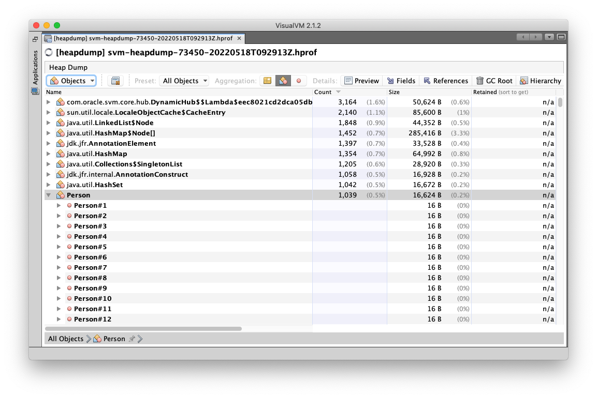
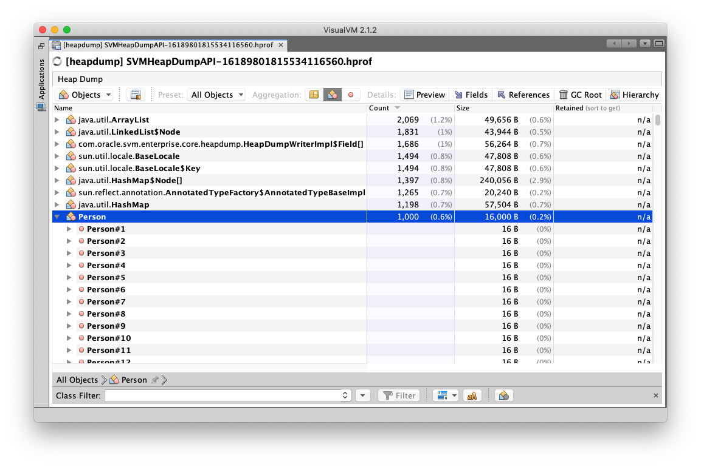

# Create a Heap Dump from a Native Executable

You can create a heap dump of a running executable to monitor its execution.
Just like any other Java heap dump, it can be opened with the [VisualVM](../../../tools/visualvm.md) tool.

To enable heap dump support, a native executable must be built with the `--enable-monitoring=heapdump` option. 
A heap dump can then be created in the following ways:

1. Create a heap dump with VisualVM.
2. The command-line option `-XX:+HeapDumpOnOutOfMemoryError` can be used to create a heap dump when the native executable runs out of Java heap memory.
3. Dump the initial heap of a native executable using the `-XX:+DumpHeapAndExit` command-line option.
4. Create a heap dump by sending a `SIGUSR1` signal to the application at runtime.
5. Create a heap dump programmatically using the [`org.graalvm.nativeimage.VMRuntime#dumpHeap`](https://github.com/oracle/graal/blob/master/substratevm/src/com.oracle.svm.core/src/com/oracle/svm/core/VMInspectionOptions.java) API.

All approaches are described below.

> Note: By default, a heap dump is created in the current working directory. The `-XX:HeapDumpPath` option can be used to specify an alternative filename or directory. For example:  
> `./helloworld -XX:HeapDumpPath=$HOME/helloworld.hprof`

> Also note: It is not possible to create a heap dump on the Microsoft Windows platform.

## Create a Heap Dump with VisualVM

A convenient way to create a heap dump is to use [VisualVM](../../../tools/visualvm.md).
For this, you need to add `jvmstat` to the `--enable-monitoring` option (for example, `--enable-monitoring=heapdump,jvmstat`).
This will allow VisualVM to pick up and list running Native Image processes.
You can then request a heap dump in the same way you can request one when your application runs on the JVM (for example, right-click on the process, then select **Heap Dump**).

## Create a Heap Dump on `OutOfMemoryError`

Start the application with the option `-XX:+HeapDumpOnOutOfMemoryError` to get a heap dump when the native executable throws an `OutOfMemoryError` because it ran out of Java heap memory.
The heap dump is created in a file named `svm-heapdump-<PID>-OOME.hprof`.
For example:

```shell
./mem-leak-example -XX:+HeapDumpOnOutOfMemoryError
Dumping heap to svm-heapdump-67799-OOME.hprof ...
Heap dump file created [10046752 bytes in 0.49 secs]
Exception in thread "main" java.lang.OutOfMemoryError: Garbage-collected heap size exceeded.
```

## Dump the Initial Heap of a Native Executable

Use the `-XX:+DumpHeapAndExit` command-line option to dump the initial heap of a native executable.
This can be useful to identify which objects the Native Image build process allocated to the executable's heap. 
For a HelloWorld example, use the option as follows:

```shell
$JAVA_HOME/bin/native-image HelloWorld --enable-monitoring=heapdump
./helloworld -XX:+DumpHeapAndExit
Heap dump created at '/path/to/helloworld.hprof'.
```

## Create a Heap Dump with SIGUSR1 (Linux/macOS only)

> Note: This requires the `Signal` API, which is enabled by default except when building shared libraries.

The following example is a simple multi-threaded Java application that runs for 60 seconds. 
This provides you with enough time to send it a `SIGUSR1` signal. 
The application will handle the signal and create a heap dump in the application's working directory. 
The heap dump will contain the `Collection` of `Person`s referenced by the static variable `CROWD`.

Follow these steps to build a native executable that will produce a heap dump when it receives a `SIGUSR1` signal.

### Prerequisite 
Make sure you have installed a GraalVM JDK.
The easiest way to get started is with [SDKMAN!](https://sdkman.io/jdks#graal).
For other installation options, visit the [Downloads section](https://www.graalvm.org/downloads/).

1.  Save the following code in a file named _SVMHeapDump.java_:
    ```java
    import java.nio.charset.Charset;
    import java.text.DateFormat;
    import java.util.ArrayList;
    import java.util.Collection;
    import java.util.Date;
    import java.util.Random;
    import org.graalvm.nativeimage.ProcessProperties;

    public class SVMHeapDump extends Thread {
        static Collection<Person> CROWD = new ArrayList<>();
        static DateFormat DATE_FORMATTER = DateFormat.getDateTimeInstance();
        static int i = 0;
        static int runs = 60;
        static int sleepTime = 1000;
        @Override
        public void run() {
            System.out.println(DATE_FORMATTER.format(new Date()) + ": Thread started, it will run for " + runs + " seconds");
            while (i < runs) {
                // Add a new person to the collection
                CROWD.add(new Person());
                System.out.println("Sleeping for " + (runs - i) + " seconds.");
                try {
                    Thread.sleep(sleepTime);
                } catch (InterruptedException ie) {
                    System.out.println("Sleep interrupted.");
                }
                i++;
            }
        }

        /**
        * @param args the command line arguments
        */
        public static void main(String[] args) throws InterruptedException {
            // Add objects to the heap
            for (int i = 0; i < 1000; i++) {
                CROWD.add(new Person());
            }

            long pid = ProcessProperties.getProcessID();
            StringBuffer sb1 = new StringBuffer(100);
            sb1.append(DATE_FORMATTER.format(new Date()));
            sb1.append(": Hello GraalVM native image developer! \n");
            sb1.append("The PID of this process is: " + pid + "\n");
            sb1.append("Send it a signal: ");
            sb1.append("'kill -SIGUSR1 " + pid + "' \n");
            sb1.append("to dump the heap into the working directory.\n");
            sb1.append("Starting thread!");
            System.out.println(sb1);

            SVMHeapDump t = new SVMHeapDump();
            t.start();
            while (t.isAlive()) {
                t.join(0);
            }
            sb1 = new StringBuffer(100);
            sb1.append(DATE_FORMATTER.format(new Date()));
            sb1.append(": Thread finished after: ");
            sb1.append(i);
            sb1.append(" iterations.");
            System.out.println(sb1);
        }
    }

    class Person {
        private static Random R = new Random();
        private String name;
        private int age;
            
        public Person() {
            byte[] array = new byte[7];
            R.nextBytes(array);
            name = new String(array, Charset.forName("UTF-8"));
            age = R.nextInt(100);
        }
    }
    ```

2. Build a native executable:

    Compile _SVMHeapDump.java_ as follows:
    ```shell
    javac SVMHeapDump.java
    ```
    Build a native executable using the `--enable-monitoring=heapdump` command-line option.
    (This causes the resulting native executable to produce a heap dump when it receives a `SIGUSR1` signal.)

    ```shell
    native-image SVMHeapDump --enable-monitoring=heapdump
    ```

    (The `native-image` builder creates a native executable from the file _SVMHeapDump.class_.
    When the command completes, the native executable _svmheapdump_ is created in the current directory.)

3. Run the application, send it a signal, and check the heap dump:

    Run the application:
    ```shell
    ./svmheapdump
    17 May 2022, 16:38:13: Hello GraalVM native image developer! 
    The PID of this process is: 57509
    Send it a signal: 'kill -SIGUSR1 57509' 
    to dump the heap into the working directory.
    Starting thread!
    17 May 2022, 16:38:13: Thread started, it will run for 60 seconds
    ```

    Make a note of the PID and open a second terminal. 
    Use the PID to send a signal to the application. 
    For example, if the PID is `57509`:
    ```shell
    kill -SIGUSR1 57509
    ```

    The heap dump will be created in the working directory while the application continues to run. The heap dump can be opened with the [VisualVM](../../../tools/visualvm.md) tool, as illustrated below.

    

## Create a Heap Dump from within a Native Executable

The following example shows how to create a heap dump from a running native executable using [`VMRuntime.dumpHeap()`](https://www.graalvm.org/sdk/javadoc/org/graalvm/nativeimage/VMRuntime.html#dumpHeap-java.lang.String-boolean-) if some condition is met.
The condition to create a heap dump is provided as an option on the command line.

1. Save the code below in a file named _SVMHeapDumpAPI.java_.

    ```java
    import java.io.File;
    import java.io.FileOutputStream;
    import java.io.IOException;
    import java.nio.charset.Charset;
    import java.text.DateFormat;
    import java.util.ArrayList;
    import java.util.Collection;
    import java.util.Date;
    import java.util.Random;
    import org.graalvm.nativeimage.VMRuntime;

    public class SVMHeapDumpAPI {
        static Collection<Person> CROWD = new ArrayList<>();

        /**
        * @param args the command line arguments
        */
        public static void main(String[] args) {   	
            // Populate the crowd
            for (int i = 0; i < 1000; i++) {
                CROWD.add(new Person());
            }
            StringBuffer sb1 = new StringBuffer(100);
            sb1.append(DateFormat.getDateTimeInstance().format(new Date()));
            sb1.append(": Hello GraalVM native image developer. \nYour command line options are: ");
            if (args.length > 0) {
                sb1.append(args[0]);
                System.out.println(sb1);
                if (args[0].equalsIgnoreCase("--heapdump")) {
                    createHeapDump();
                }
            } else {
                sb1.append("None");
                System.out.println(sb1);
            }
        }

        /**
        * Create a heap dump and save it into temp file
        */
        private static void createHeapDump() {
            try {
                File file = File.createTempFile("SVMHeapDumpAPI-", ".hprof");
                VMRuntime.dumpHeap(file.getAbsolutePath(), false);
                System.out.println("  Heap dump created " + file.getAbsolutePath() + ", size: " + file.length());
            } catch (UnsupportedOperationException unsupported) {
                System.err.println("Heap dump creation failed: " + unsupported.getMessage());
            } catch (IOException ioe) {
                System.err.println("IO went wrong: " + ioe.getMessage());
            }
        }

    }

    class Person {
            private static Random R = new Random();
            private String name;
            private int age;
            
            public Person() {
                byte[] array = new byte[7];
                R.nextBytes(array);
                name = new String(array, Charset.forName("UTF-8"));
                age = R.nextInt(100);
            }
        }
    ```

    As in the earlier example, the application creates a `Collection` of `Person`s referenced by the static variable `CROWD`. 
    It then checks the command line to see if heap dump has to be created, and then in method `createHeapDump()` creates the heap dump.

2. Build a native executable.

    Compile _SVMHeapDumpAPI.java_ and build a native executable:
    ```shell
    javac SVMHeapDumpAPI.java
    ```
    ```shell
    native-image SVMHeapDumpAPI
    ```
    When the command completes, the _svmheapdumpapi_ native executable is created in the current directory.

3. Run the application and check the heap dump

    Now you can run your native executable and create a heap dump from it with output similar to the following:
    ```shell
    ./svmheapdumpapi --heapdump
    Sep 15, 2020, 4:06:36 PM: Hello GraalVM native image developer.
    Your command line options are: --heapdump
      Heap dump created /var/folders/hw/s9d78jts67gdc8cfyq5fjcdm0000gp/T/SVMHeapDump-6437252222863577987.hprof, size: 8051959
    ```
    The resulting heap dump can be then opened with the [VisualVM](../../../tools/visualvm.md) tool like any other Java heap dump, as illustrated below.

    

### Related Documentation

* [Debugging and Diagnostics](../DebuggingAndDiagnostics.md)
* [VisualVM](../../../tools/visualvm.md)