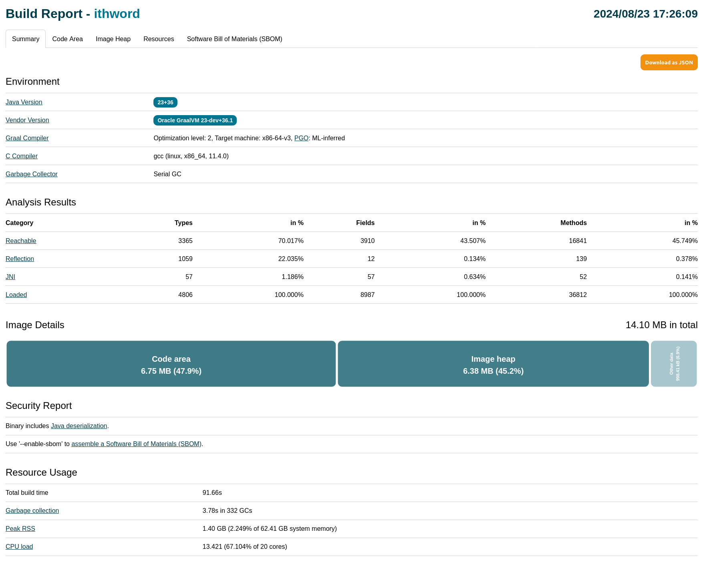
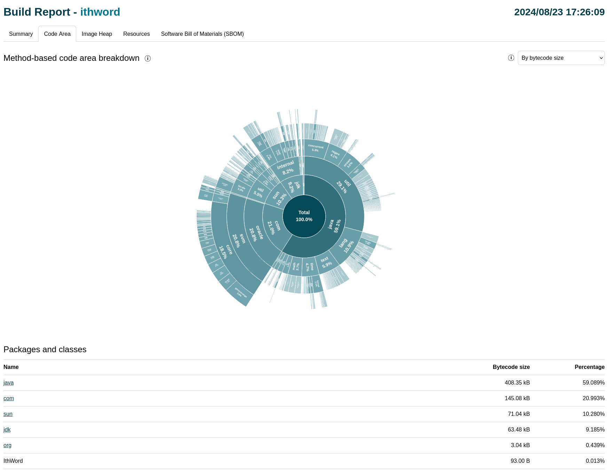
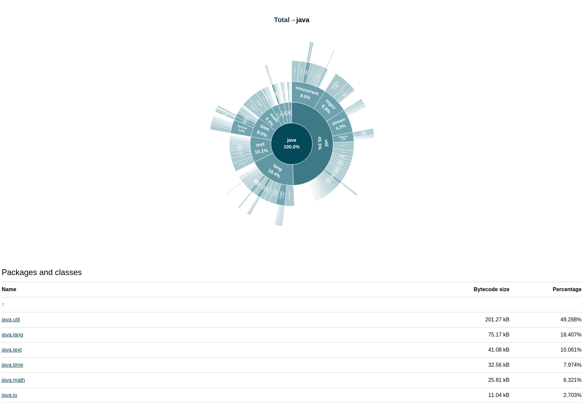
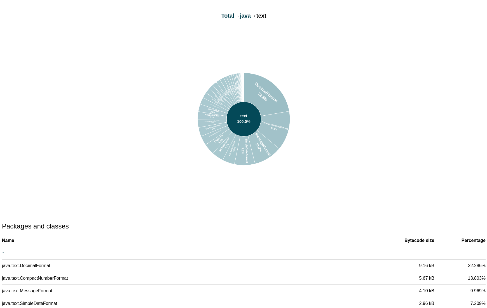
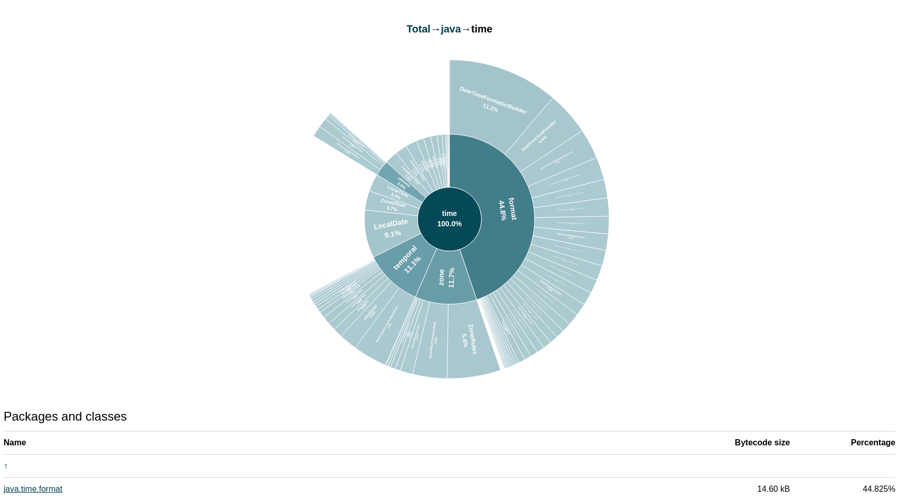
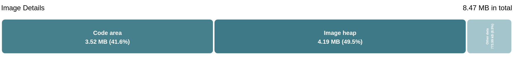
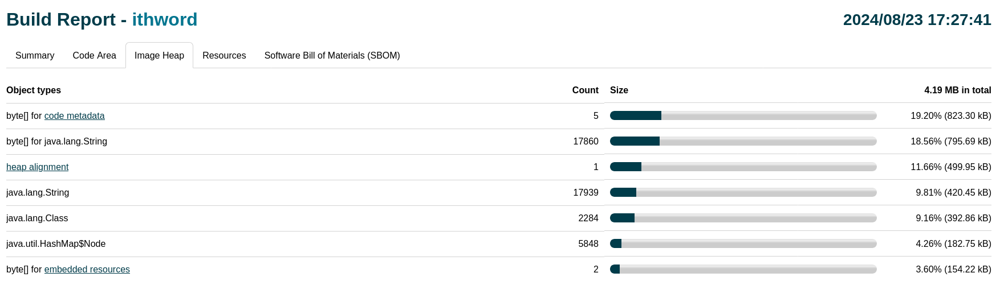
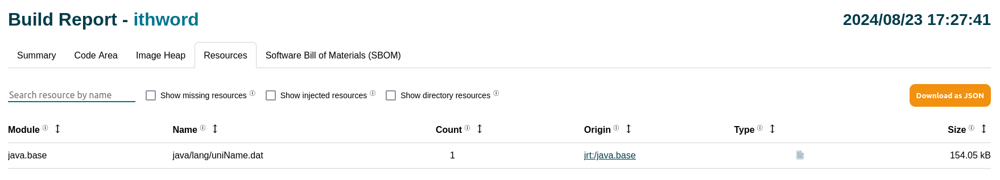
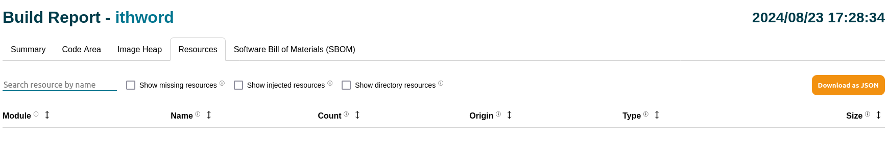

# Optimize Size of a Native Executable using Build Reports

You can optimize your native executable by taking advantage of different tools provided with Native Image.
The guide demonstrates how to use the [*Build Report*](../BuildReport.md) tool to better understand the contents of a produced native executable, and how a small alteration in an application, without any semantic change, can influence the final binary size.

> Note: Build Report is not available in GraalVM Community Edition.

### Prerequisites

Make sure you have installed a GraalVM JDK.
The easiest way to get started is with [SDKMAN!](https://sdkman.io/jdks#graal).
For other installation options, visit the [Downloads section](https://www.graalvm.org/downloads/).

For the demo, you will run a simple Java application that extracts the _i_-th word from an input string.
The words are delimited by commas and may be enclosed by an arbitrary number of whitespace characters.

1.  Save the following Java code to a file named _IthWord.java_:
    ```java
    public class IthWord {
      public static String input = "foo     \t , \t bar ,      baz";

       public static void main(String[] args) {
           if (args.length < 1) {
               System.out.println("Word index is required, please provide one first.");
               return;
           }
           int i = Integer.parseInt(args[0]);

           // Extract the word at the given index.
           String[] words = input.split("\\s+,\\s+");
           if (i >= words.length) {
               System.out.printf("Cannot get the word #%d, there are only %d words.%n", i, words.length);
               return;
           }

           System.out.printf("Word #%d is %s.%n", i, words[i]);
       }
    }
    ```

2.  Compile the application:
    ```shell
    javac IthWord.java
    ```

    (Optional) Test the application with some arbitrary argument to see the result:
    ```shell
    java IthWord 1
    ```

    The output should be:
    ```txt
    Word #1 is bar.
    ```

3.  Build a native executable from the class file along with a Build Report:
    ```shell
    native-image IthWord --emit build-report
    ```

    The command generates an executable file, `ithword`, in the current working directory.
    The Build Report file, _ithword-build-report.html_, is automatically created alongside the native executable.
    A link to the report is also listed in the _Build artifacts_ section at the end of the build output.
    You can specify a different filename or path for the report by appending it to the `build-report` option, for example, `--emit build-report=/tmp/custom-name-build-report.html`.

    (Optional) Run this executable with the same argument:
    ```shell
    ./ithword 1
    ```

    The output should be identical to the former one:
    ```txt
    Word #1 is bar.
    ```

4.  A Build Report is an HTML file. Open the report in a browser.
    First, you are greeted with the general summary about the image build. You can see the total image size above the _Image Details_ chart in top-right:

    

    The initial size looks as expected, but, for the reference, the size of a _HelloWorld_ application is around 7 MB. So the difference is substantial, despite the fact that the code is quite straightforward.
    Continue with the investigation.

5.  Go to the _Code Area_ tab either by clicking its tab in the navigation or the corresponding bar in the chart.

    The breakdown chart you see now visualizes how different packages _relate_ to each other in terms of their bytecode size.
    Note that the shown packages contain only the methods found to be _reachable_ by [the static analysis](../NativeImageBasics.md#static-analysis).
    This means that the shown packages (and their classes) are the only ones that end up being compiled and are in the final binary.

    

    The first conclusion you can draw is that the most of the code originates from either JDK or Native Image internal code &mdash; see that the `IthWord` class only contributes 0.013% of the total bytecode size of all the reachable methods.

6.  Drill-down to the `java` package just by clicking it.
    Most of the reachable code (almost the half) comes from the `java.util` package.
    Also, you can notice that `java.text` and `java.time` packages contribute to almost 20% of the `java` package size.
    But does the application use these packages?

    

7.  Drill-down to the `text` pacakge:

    

    You now see that most of the reachable classes are used for text formatting (see the list of packages and classes below).
    By now, you can suspect that included formatting classes can only be reachable (although not actually used) from one place: `System.out.printf`.

8.  Go back to the `java` package (by clicking the central circle or just the `java` name in the top of the chart).

9.  Next drill-down to the `time` package:

    
    
    Almost half of the package size comes from its `format` subpackage (similar to the situation in the `java.text` package).
    So, `System.out.printf` is your first opportunity for improving the binary size.

10. Go back to the initial application and simply switch from using `System.out.printf` to `System.out.println`:
    ```java
    public class IthWord {
        public static String input = "foo     \t , \t bar ,      baz";

        public static void main(String[] args) {
            if (args.length < 1) {
                System.out.println("Word index is required, please provide one first.");
                return;
            }
            int i = Integer.parseInt(args[0]);

            // Extract the word at the given index.
            String[] words = input.split("\\s+,\\s+");
            if (i >= words.length) {
                // Use System.out.println instead of System.out.printf.
                System.out.println("Cannot get the word #" + i + ", there are only " + words.length + " words.");
                return;
            }

            // Use System.out.println instead of System.out.printf.
            System.out.println("Word #" + i + " is " + words[i] + ".");
        }
    }
    ```

11. Repeat the steps 2-4 (compile the class file, build the native executable, and open the new report).

12. See in the _Summary_ section that the total binary size got reduced by almost 40%:

    

13. Go to the _Code Area_ tab again and drill-down to the `java` package.
    You can see that the initial assumption is correct: both `java.text` and `java.time` packages are not reachable anymore.

    

    Continue to see if there is more reachable code that the application does not necessarily need.

    As you may have guessed already, the other candidate resides in the `java.util` package, and is the `regex` subpackage.
    The package alone contributes nearly 15% of the `java` package size now.
    Notice that the regular expression (`\\s+,\\s+`) is used to split the original input into the words.
    Although very convenient, it makes the aforementioned `regex` package unnecessary dependency.
    The regular expression itself is not complex, and could be implemented differently.

14. Next go to the _Image Heap_ tab to continue our exploration.
    The section provides a list of all object types that are part of the image heap: the heap that contains reachable objects such as static application data, metadata, and byte arrays for different purposes.
    In this case, the list looks as usual: most of the size comes from the raw string values stored in their dedicated byte array (around 20%), `String` and `Class` objects (around 20%), and also from code metadata (20%).

    

    There are no specific object types that heavily contribute to the image heap in this application.
    But there is one unexpected entry: a small size contribution (~2%) is due to the resources that are embedded into the image heap.
    The application does not use any explicit resources, so this is unexpected.

15. Switch to the _Resource_ tab to continue the investigation.
    This section provides a list of all the resources that are explicitly requested through the configuration file(s).
    There is also the option to toggle other kinds of resources (Missing resources, Injected resources, and Directory resources); however, this is beyond the scope of this guide.
    Learn more in [Native Image Build Report](../BuildReport.md).

    

    To conclude this part, there is only one resource (`java/lang/uniName.dat`) that comes from the `java.base` module that also contributes to the image heap, but is not requested from the application code explicitly.
    You cannot do anything about this, but keep in mind that the JDK code (indirectly reachable from the user code) can also use the additional resources, which then adversely affect the size.

16. Now go back to the application code, and implement a new approach that does not use regular expressions.
    The following code uses `String.substring` and `String.indexOf` to preserve the semantics, but also keep the logic relatively simple:
    ```java
    public class IthWord {
        public static String input = "foo     \t , \t bar ,      baz";

        public static void main(String[] args) {
            if (args.length < 1) {
               System.out.println("Word index is required, please provide one first.");
               return;
            }
            int i = Integer.parseInt(args[0]);

            // Extract the word at the given index using String.substring and String.indexOf.
            String word = input;
            int j = i, index;
            while (j > 0) {
               index = word.indexOf(',');
               if (index < 0) {
                   // Use System.out.println instead of System.out.printf.
                   System.out.println("Cannot get the word #" + i + ", there are only " + (i - j + 1) + " words.");
                   return;
               }
               word = word.substring(index + 1);
               j--;
            }
            index = word.indexOf(',');
            if (index > 0) {
               word = word.substring(0, word.indexOf(','));
            }
            word = word.trim();

            // Use System.out.println instead of System.out.printf.
            System.out.println("Word #" + i + " is " + word + ".");
        }
    }
    ```

17. Repeat the steps 2-4 again (compile the class file, build the native executable, and open the new report).

18. Once more, you can see the improvement in the total binary size (around 15%) in the *Summary* section:

    

    Additionally, a previously registered resource is not part of the generated binary anymore (see the _Resources_ section again to confirm):

    

This guide demonstrated how to optimize the size of a native executable using Build Reports.
Build Reports allow you to explore the contents of the generated native executables in greater detail.
A better understanding of which code is reachable enables you to implement the application in a way that preserves its semantics while removing unnecessary JDK dependencies.

### Related Documentation

- [Native Image Build Report](../BuildReport.md)
- [Optimizations and Performance](../OptimizationsAndPerformance.md)
- [Optimize a Native Executable for File Size](optimize-file-size.md)