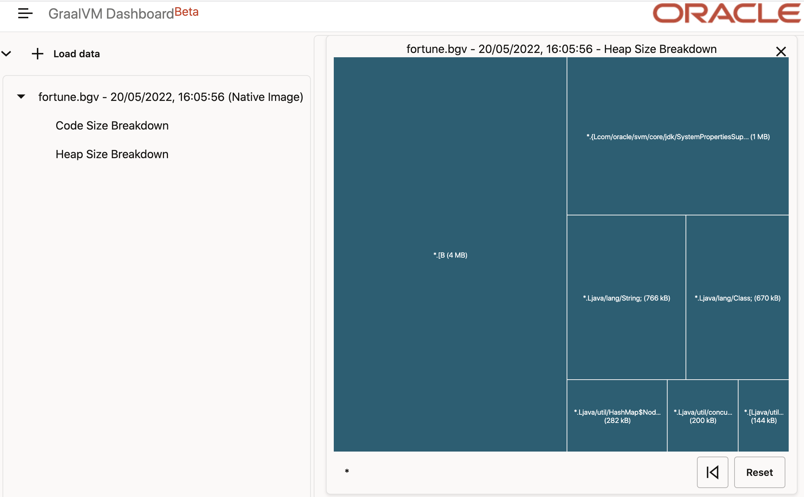
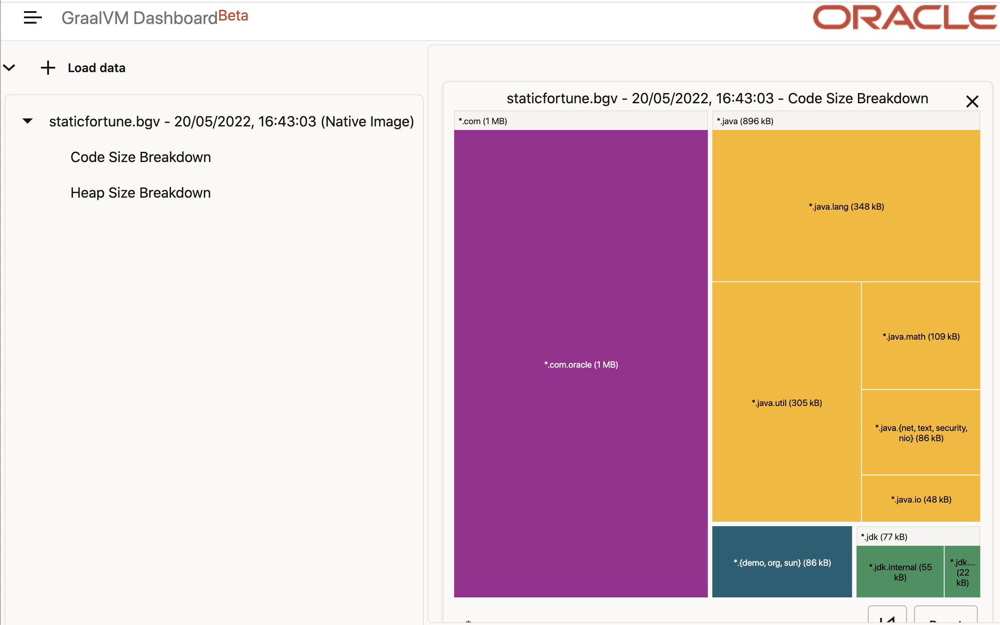
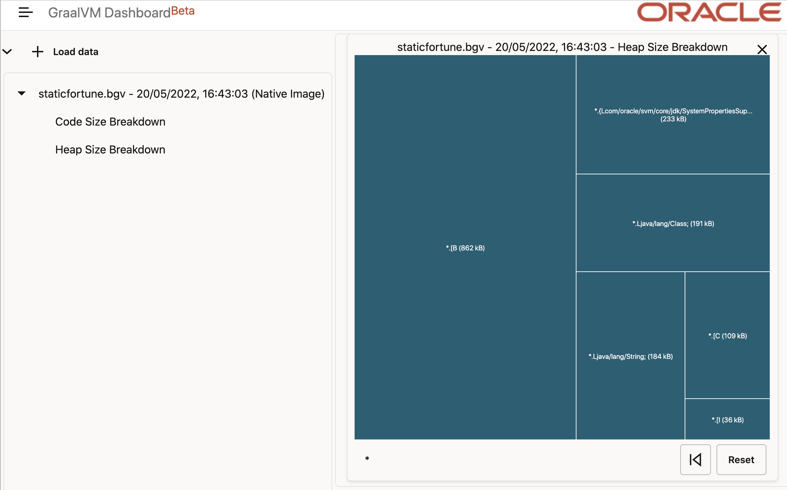

# Use GraalVM Dashboard to Optimize the Size of a Native Executable

The [GraalVM Dashboard](https://www.graalvm.org/dashboard) is a web-based tool that visualizes the composition of a native executable. It displays the breakdown of packages, classes, and methods included in a native executable, and provides a visual summary of objects that contributed most to its heap size. 
The GraalVM Dashboard uses report files created by the native image builder. (For more information, see [GraalVM Getting Started](https://www.graalvm.org/dashboard/?ojr=help%3Btopic%3Dgetting-started.md).)

This guide demonstrates how to use the dashboard to optimize the size of a native executable. It introduces two implementations of a "fortune" sample application that simulate the traditional `fortune` Unix program (for more information, see [fortune](https://en.wikipedia.org/wiki/Fortune_(Unix))).

> Note: This guide assumes you have installed [Maven](https://maven.apache.org).

## Fortune
Package the contents of the first implementation ([fortune](https://github.com/graalvm/graalvm-demos/tree/master/fortune-demo/fortune)) as a native executable and review its composition.

1. Download or clone the repository and navigate into the _fortune-demo/fortune_ directory:
    ```
    git clone https://github.com/graalvm/graalvm-demos
    cd fortune-demo/fortune
    ```
2. Build the project:
    ```
    mvn clean package
    ```
3. When the build succeeds, run the application on the JVM with the [Tracing agent](https://graalvm.github.io/native-build-tools/latest/maven-plugin.html#agent-support). Since you have installed GraalVM, it will run on GraalVM JDK.
    ```
    mvn -Pnative -Dagent exec:exec@java-agent
    ```
    The application will return a random saying. 
    The agent generates the configuration files in the `target/native/agent-output` subdirectory.

4. Build a native executable of this application with GraalVM Native Image and Maven:
    ```
    mvn -Pnative -Dagent package
    ```
    When the command completes, a native executable, `fortune`, is generated in the `/target` directory of the project and ready for use.

5. Run the application by launching a native executable directly:
    ```
    ./target/fortune
    ```

    The application should slowly print a random phrase.

    The application's [_pom.xml_](https://github.com/graalvm/graalvm-demos/blob/master/fortune-demo/fortune/pom.xml) file employs the [Native Image Maven plugin](https://graalvm.github.io/native-build-tools/latest/maven-plugin.html) to build a native executable, configured to produce diagnostic data using these two options:

    ```shell
    -H:DashboardDump=fortune -H:+DashboardAll
    ```

    These options result in a file named _fortune.bgv_. (For more information about different options, see [Dumping the Data for GraalVM Dashboard](https://www.graalvm.org/dashboard/?ojr=help%3Btopic%3Dgetting-started.md).)

    Compare the sizes of the JAR file and the native executable (for example, using `du`):

    ```shell
    du -sh target/*
    0B	    target/archive-tmp
    136K	target/classes
    17M     target/fortune
    2.0M	target/fortune-1.0-jar-with-dependencies.jar
    32K	    target/fortune-1.0.jar
    44M	    target/fortune.bgv
    4.0K	target/fortune.build_artifacts.txt
    0B	    target/generated-sources
    4.0K	target/maven-archiver
    8.0K	target/maven-status
    0B	    target/test-classes
    ```
    
    The size of the JAR file is 2MB, compared to the 17MB size of the native executable. The increase in size is because the native executable contains all necessary runtime code as well as pre-initialized data in its heap.

6.  Open the [GraalVM Dashboard](https://www.graalvm.org/dashboard) and load the _fortune.bgv_ file. (Click **+**, click **Select File**, select the _fortune.bgv_ file from the _target_ directory, and then click **OK**.)

    The GraalVM dashboard provides two visualizations of a native executable: code size breakdown and heap size breakdown. (For more information, see [Code Size Breakdown](https://www.graalvm.org/dashboard/?ojr=help%3Btopic%3Dcode-size-histogram.md) and [Heap Size Breakdown](https://www.graalvm.org/dashboard/?ojr=help%3Btopic%3Dheap-size-histogram.md), respectively.)

    

    The screenshot above visualizes the code breakdown of the `fortune` native executable, a great part of which consists of the [Jackson JSON parser](https://github.com/FasterXML/jackson) library implemented in the package `com.fasterxml`. One approach to reduce the size of a native executable is to minimize the amount of space taken by code. The code size breakdown gives you an insight into the amount of space taken up by the packages that are included in your native executable.

    Furthermore, the screenshot below shows that the heap of the native executable contains 4MB of Bytes and almost 800KB of Strings. Another approach to reduce the size of a native executable is to minimize the size of its heap.

    

    In the next section, we'll consider an alternative implementation for the `fortune` application that reduces the amount of code _and_ reduces the size of the heap.

## Static Fortune

The first implementation of the fortune application uses the [Jackson JSON parser](https://github.com/FasterXML/jackson) (package `com.fasterxml`) at **runtime** to parse the contents of a [resource file](https://github.com/graalvm/graalvm-demos/blob/master/fortune-demo/fortune/src/main/resources/fortunes.json) that the native image builder has included in the native executable. An alternative implementation (named "staticfortune") parses the contents of the resource file at build time. This means that the resource file is no longer included in the executable, and the code required to parse the file is omitted from the native executable because it is only required at build time.

1. Change to the project directory and build the project:
    ```
    cd ../staticfortune
    ```
    ```
    mvn clean package
    ```

2. Run the application on the JVM (GraalVM JDK) with the [Tracing agent](https://graalvm.github.io/native-build-tools/latest/maven-plugin.html#agent-support):
    ```
    mvn -Pnative -Dagent exec:exec@java-agent
    ```
    The application will print a random saying. The agent generates the configuration files in the `target/native/agent-output` subdirectory.
3. Build a static native executable:
    ```
    mvn -Pnative -Dagent package
    ```
    When the command completes, a native executable, `staticfortune`, is generated in the `/target` directory of the project and ready for use.

4. Run the demo by launching a native executable directly or with the Maven profile:

    ```
    ./target/staticfortune
    ```
    The application should behave in exactly the same way as the first implementation.

    The application's [_pom.xml_](https://github.com/graalvm/graalvm-demos/blob/master/fortune-demo/staticfortune/pom.xml) file again uses the [Native Image Maven plugin](https://graalvm.github.io/native-build-tools/latest/maven-plugin.html) to build a native executable. However, for this implementation it adds an extra option to initialize class `demo.StaticFortune` at build time:

    ```shell
    -H:DashboardDump=staticfortune -H:+DashboardAll --initialize-at-build-time=demo.StaticFortune
    ```

    Compare the sizes of the JAR file and the native executable:

    ```shell
    du -sh target/*
    0B	    target/archive-tmp
    76K	    target/classes
    0B	    target/generated-sources
    4.0K	target/maven-archiver
    4.0K	target/maven-status
    4.3M	target/staticfortune
    2.0M	target/staticfortune-1.0-jar-with-dependencies.jar
    32K	    target/staticfortune-1.0.jar
    9.0M	target/staticfortune.bgv
    4.0K	target/staticfortune.build_artifacts.txt
    0B	    target/test-classes
    ```

    The size of the native executable has reduced in size from 17MB to 4.3MB.

    The reduction in size is due to the use of the `--initialize-at-build-time=` argument used with the [Native Image Maven plugin](use-native-image-maven-plugin.md).

5.  The build created a file named _staticfortune.bgv_. Load it into the GraalVM Dashboard to view the composition of the `staticfortune` native executable. 

    

    The screenshot above demonstrates that the code in the `com.fasterxml` package is no longer present. There are also reductions in the amount of code included from the `java.util`, `java.math`, and `java.text` packages.

    The screenshot below illustrates that there has also been a significant reduction in the amount of heap given to Strings (767KB versus 184KB), and a reduction in Bytes from 4MB to 862KB.

    

### Related Documentation

* [Making sense of Native Image contents](https://medium.com/graalvm/making-sense-of-native-image-contents-741a688dab4d)
* [GraalVM Dashboard](https://www.graalvm.org/dashboard/?ojr=help%3Btopic%3Dgetting-started.md)
* [Class Initialization in Native Image](../ClassInitialization.md)