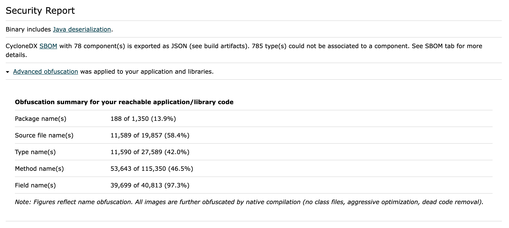

# Advanced Obfuscation in Native Image

Native Image provides strong baseline obfuscation through native compilation by eliminating class files, applying aggressive optimizations, and removing unreachable code.
Advanced obfuscation adds an extra layer of protection by applying symbol obfuscation to make reverse engineering of native images more difficult.
The feature replaces symbol names (module, package, class, method, field, and source file names) with short, opaque identifiers—for example, a class named `MySecretClass` might become `a`.
These opaque identifiers replace original names in stack traces, [heap dumps](../reference-manual/native-image/guides/create-heap-dump-from-native-executable.md), and in code that reads metadata (like `Class#getName()` and `Method#getName()`).
This helps protect intellectual property by hiding meaningful names from reverse engineering tools like disassemblers, debuggers, and binary string extractors.
Symbols in your application code and third-party dependencies are obfuscated, but not the JDK and [Substrate VM](https://github.com/oracle/graal/tree/master/substratevm) code.
Names registered under `"reflection"` in [reachability metadata JSON](../reference-manual/native-image/ReachabilityMetadata.md#specifying-metadata-with-json) are not obfuscated.

> Caveat: While obfuscation makes reverse engineering more difficult, it does not provide guaranteed protection and can be bypassed by determined attackers.

To enable advanced obfuscation, pass `-H:AdvancedObfuscation=` to the `native-image` command.
To generate a JSON mapping file from original to obfuscated names, use `-H:AdvancedObfuscation=export-mapping`.
The mapping file is produced as _\<image-name\>.obfuscation-mapping.json_ in your build artifacts.
You can use the mapping file to verify what was obfuscated and to [deobfuscate stack traces](#deobfuscating-stack-traces) for debugging.

The obfuscation build process involves two phases for accurate obfuscation with minimal manual configuration: an initial phase to identify what can safely be obfuscated, followed by a second phase that applies the symbol obfuscation.
This results in more verbose output and longer build times (typically 20–50% longer), but does not affect runtime performance or memory usage.

> Advanced obfuscation is an experimental feature and is not available in GraalVM Community Edition.
 
## Contents

* [Building an Obfuscated Image](#building-an-obfuscated-image)
* [Deobfuscating Stack Traces](#deobfuscating-stack-traces)
* [What Gets Obfuscated](#what-gets-obfuscated)
* [Understanding the Mapping File](#understanding-the-mapping-file)
* [Obfuscation Statistics in Build Reports](#obfuscation-statistics-in-build-reports)
* [Common Issues and Antipatterns](#common-issues-and-antipatterns)
* [Recommendations](#recommendations)

## Building an Obfuscated Image

This section demonstrates symbol obfuscation with a Java application, and includes building, running, viewing obfuscated outputs, and deobfuscating a stack trace for debugging.

### Building and Running a Non-Obfuscated Application on the JVM

Consider the following `SecretClass.java` which includes a `secretAlgorithm` that throws a `RuntimeException`:

```java
package com.obfuscation;

public class SecretClass {
    public static void main(String[] args) {
        System.out.println("Class name: " + SecretClass.class.getName());
        String sourceFileName = new Exception().getStackTrace()[0].getFileName();
        System.out.println("File name: " + sourceFileName);

        secretAlgorithm();
    }

    private static void secretAlgorithm() {
        // ...
        throw new RuntimeException("Something bad happened!");
        // ...
    }
}
```

Compile and run it on a JVM to see the original, non-obfuscated symbols:

```bash
javac -d build src/main/java/com/obfuscation/SecretClass.java
java -cp ./build com.obfuscation.SecretClass

Class name: com.obfuscation.SecretClass
File name: SecretClass.java
Exception in thread "main" java.lang.RuntimeException: Something bad happened!
        at com.obfuscation.SecretClass.secretAlgorithm(SecretClass.java:14)
        at com.obfuscation.SecretClass.main(SecretClass.java:9)
```

All symbols are visible, exposing sensitive information such as the name of `SecretClass` and `secretAlgorithm`.

### Building and Running an Obfuscated Native Image

Build the obfuscated native executable and export the mapping file from original to obfuscated names:

```bash
native-image -cp ./build com.obfuscation.SecretClass -o app -H:+UnlockExperimentalVMOptions -H:AdvancedObfuscation=export-mapping
```

Execute the native image:

```bash
./app

Class name: b.a
File name: c
Exception in thread "main" java.lang.RuntimeException: Something bad happened!
        at b.a.g(c:14)
        at b.a.f(c:9)
```

The symbols are now obfuscated, making it difficult for a malicious actor to infer meaningful information from stack traces or output.

Symbol obfuscation can change the behavior of code that relies on symbol names. 
For example, `SecretClass.class.getName()` now returns `b.a`.
Obfuscated names are non-deterministic and may vary between builds.

### Deobfuscating Stack Traces

To debug an obfuscated stack trace, save the stack trace to a file (for example, `obfuscated-stacktrace.log`) and use `native-image-configure` with the mapping file:

```bash
native-image-configure deobfuscate --map-file=app.obfuscation-mapping.json --input-file=obfuscated-stacktrace.log

Exception in thread "main" java.lang.RuntimeException: Something bad happened!
        at com.obfuscation.SecretClass.secretAlgorithm(SecretClass.java:14)
        at com.obfuscation.SecretClass.main(SecretClass.java:9)
```

This restores the original names for debugging the issue, while keeping your distributed binary obfuscated.
Log file lines not part of the stack trace remain unchanged.

You can locate the `native-image-configure` tool in the same `bin` directory as `native-image`.

## What Gets Obfuscated

Symbols in your application code and third-party dependencies are obfuscated by default. 
However, certain elements are excluded from obfuscation:
- JDK and [Substrate VM](https://github.com/oracle/graal/tree/master/substratevm) code is not obfuscated.
- Classes are not obfuscated if they are annotations, lambdas, proxies, [registered for reflection in JSON](../reference-manual/native-image/ReachabilityMetadata.md#specifying-metadata-with-json), or preserved using `-H:Preserve`.
- If a class loads a resource, its package and module names are retained.

The table below summarizes the obfuscation rules. 
Elements are obfuscated by default unless the conditions in _Obfuscated Unless_ apply. 
To explicitly prevent symbol obfuscation of an element, use the method in _Obfuscation Prevented By_.

| Element                                                                             | Obfuscated Unless                                                                                                      | Obfuscation Prevented By                                 | Notes                                                                                                          |
|-------------------------------------------------------------------------------------|------------------------------------------------------------------------------------------------------------------------|----------------------------------------------------------|----------------------------------------------------------------------------------------------------------------|
| **Class-Level Elements** (method, field, source file names)                         | The class is skipped (annotation, lambda, proxy, registered for reflection in JSON, or preserved)                      | Register the class for reflection                        | Applies per class; for example, a method is not obfuscated if its containing class is skipped                  |
| **Simple Class Name** (for example, `SecretClass` in `com.obfuscation.SecretClass`) | The class is skipped (annotation, lambda, proxy, registered for reflection in JSON, or preserved)                      | Register the class for reflection                        | The simple name can be obfuscated even if its package name is not obfuscated                                   |
| **Fully Qualified Class Name** (for example, `com.obfuscation.SecretClass`)         | The simple class name is not obfuscated or the package name is not obfuscated                                          | Register the class for reflection                        | Partial if only the simple name is obfuscated (for example, `com.obfuscation.SecretClass → com.obfuscation.a`) |
| **Package Name**                                                                    | Any class in the package is registered for reflection or accesses a resource (for example, `getResource("file.txt")`). | Register a class in the package for reflection           | Affects all classes in the package                                                                             |
| **Module Name**                                                                     | Any class in the module accesses a resource                                                                            | There is no explicit way (it is tied to resource access) | Unnamed modules are not obfuscated since they lack a defined name to replace                                   |

If a class is skipped, all its class-level elements (fields, methods, source file names) remain unobfuscated.
JUnit-related code is automatically preserved for testing compatibility.

## Understanding the Mapping File

When you use `export-mapping`, Native Image generates a JSON file named _\<image-name\>.obfuscation-mapping.json_ in your build artifacts.
This file maps original symbol names to their obfuscated versions, allowing `native-image-configure deobfuscate` to reverse the process.
Mappings can change per build, so associate mapping files with specific build versions or IDs for reliable deobfuscation.

The mapping file lists the `[original, obfuscated]` name pairs of modules, packages, source files, types (classes, records, interfaces, enums), and methods.
For example:

```json
{
  "modules": [
    [ 
      "myModule", "m"
    ]
  ],
  "packages": [
    [
      "com.obfuscation", "b"
    ]
  ],
  "files": [
    [
      "com/obfuscation/SecretClass.java", "c"
    ]
  ],
  "types": [
    [
      "com.obfuscation.SecretClass", "a"
    ],
    [
      "com.library.LibraryClass", "h"
    ]
  ],
  "methods": [
    [
      "com.obfuscation.SecretClass.main", "f"
    ],
    [
      "com.obfuscation.SecretClass.secretAlgorithm", "g"
    ]
  ]
}
```

Full qualifiers may mix original and obfuscated parts in cases of partial symbol obfuscation.
For example, `com.library.LibraryClass → com.library.h` because the simple name `LibraryClass` was obfuscated (as it is listed under `types`), but the package name was not (as it is _not_ listed under `packages`).

Mapping file sizes typically range between 1–5MB for medium-to-large projects.
For example, the Spring Boot application [spring-boot-microservice-jibber](https://github.com/graalvm/graalvm-demos/tree/master/native-image/spring-boot-microservice-jibber) produces a 1.7MB mapping file.

You can check if a symbol was obfuscated by searching the mapping file.
Fields are not included in the mapping file because field names are not part of stack traces.

## Obfuscation Statistics in Build Reports

To assess the symbol obfuscation effectiveness, enable [build reports](../reference-manual/native-image/BuildReport.md) with `--emit=build-report` during your build.
This generates an HTML report (in the build output directory) with a dedicated "Obfuscation Summary" section in the Security Report. 

This is an example report:



## Common Issues and Antipatterns

Symbol obfuscation can break previously functioning native image applications by changing the semantics of code using reflection or name-based logic.
Methods such as `Class#getName()`, `Method#getName()`, and `Field#getName()` return obfuscated values for obfuscated elements, which may break existing code.
Review and test such code patterns after enabling advanced obfuscation.

For example, the following application works without obfuscation but throws a `ClassNotFoundException` when obfuscation is enabled:

```java
package com.obfuscation;

public class Pitfalls {
    static final String ORIGINAL_NAME = "com.obfuscation.Pitfalls";
    // Pitfalls gets obfuscated so 'getName' returns the obfuscated name
    static final String OBFUSCATED_NAME = Pitfalls.class.getName();

    public static void main(String[] args) throws ClassNotFoundException {
        // 1) Lookup with original name works.
        System.out.printf("Class.forName(\"%s\") works\n", ORIGINAL_NAME);
        Class.forName(ORIGINAL_NAME);

        // 2) Lookup with obfuscated name throws ClassNotFoundException.
        System.out.printf("Class.forName(\"%s\") fails\n", OBFUSCATED_NAME);
        Class.forName(OBFUSCATED_NAME);
    }
}
```

When executed, the output is:

```bash
Class.forName("com.obfuscation.Pitfalls") works
Class.forName("b.a") fails
Exception in thread "main" java.lang.ClassNotFoundException: b.a. This exception was synthesized during native image building from a call to java.lang.Class.forName(String) with constant arguments.
        at b.a.f(c:15)
```

The native image builder sees the original names.
`Class#forName(String)` with constant arguments is folded during the build, so the native image builder resolves `com.obfuscation.Pitfalls` (1) but not the obfuscated name (2).

**Resolutions**
* Do not perform reflective operations with obfuscated names; instead, use original names with constant arguments (like `ORIGINAL_NAME`). This ensures the `Class.forName` lookup works while still obfuscating `Pitfalls`.
* If you cannot use constant string literals, explicitly [register classes for reflection](../reference-manual/native-image/ReachabilityMetadata.md#specifying-metadata-with-json) to avoid obfuscating affected classes. Reflection metadata can be collected automatically with the [tracing agent](../reference-manual/native-image/AutomaticMetadataCollection.md). Registering `com.obfuscation.Pitfalls` would skip obfuscation for the class and the `ClassNotFoundException` is not thrown anymore. Note: Registration skips obfuscation for the class, reducing the scope of obfuscation.

## Recommendations

Use the following best practices to ensure effective and secure use of advanced obfuscation in your native image builds:

* Export your [SBOM](SBOM.md) instead of embedding it if confidentiality is required. If you currently embed an SBOM and use it for vulnerability scanning, use `--enable-sbom=export` to export as JSON. [Class-level SBOMs](SBOM.md#including-class-level-metadata-in-the-sbom) must be exported when advanced obfuscation is enabled to prevent embedding original symbol names in the image. If the SBOM is not needed, disable with `--enable-sbom=false`.
* Archive [mapping files](#understanding-the-mapping-file) with build versions to ensure you can [deobfuscate stack traces](#deobfuscating-stack-traces) for specific builds.
* Use build reports to [monitor symbol obfuscation rates](#viewing-obfuscation-statistics-in-build-reports).
* Collect [reachability metadata automatically](../reference-manual/native-image/AutomaticMetadataCollection.md) to reduce risk of semantic issues from name changes.
* Test obfuscated builds to ensure there are no semantic issues from name changes, especially in reflection-heavy code. See [Common Issues and Antipatterns](#common-issues-and-antipatterns) for more information.
* Avoid enabling advanced obfuscation during local development (due to longer build times). Instead, apply it before deployment in automated workflows.
* Advanced obfuscation works with [PGO](../reference-manual/native-image/PGO.md) so you can enable it on your optimized builds.
* Use specific preserve selectors rather than broad ones to maximize obfuscation scope. For example, use `-H:Preserve=package=my.package` instead of `-H:Preserve=all`.

Feedback is welcome via [GraalVM GitHub issues](https://github.com/oracle/graal/issues).

## Related Documentation

- [Security Considerations in Native Image](native-image.md)
- [Build Output](../reference-manual/native-image/BuildOutput.md)