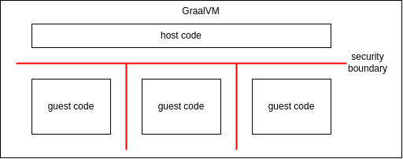

# Sandboxing

GraalVM allows a host application written in a JVM-based language to execute guest code written in Javascript or WebAssembly via the [Polyglot API](../reference-manual/embedding/embed-languages.md).
Configured with a [sandbox policy](#sandbox-policies), a security boundary between a host application and guest code can be established.
For example, host code can execute untrusted guest code using the [UNTRUSTED](https://www.graalvm.org/sdk/javadoc/org/graalvm/polyglot/SandboxPolicy.html#UNTRUSTED) policy.
Host code can also execute multiple mutually distrusting instances of guest code that will be protected from one another.
Used this way, sandboxing supports a multi-tenant scenario:



Use cases that benefit from introducing a security boundary are:
* Usage of third party code, i.e., pulling in a dependency. Third party code is typically trusted and scanned for vulnerabilities before use, but sandboxing them is an additional precaution against supply-chain attacks.
* User plugins. Complex applications might allow users to install community-written plugins. Traditionally, those plugins are considered trusted and often run with full privileges, but ideally they should not be able to interfere with the application except when intended.
* Server scripting. Allowing users to customize a server application with their own logic expressed in a general-purpose scripting language, for example, to implement custom data processing on a shared data source.

## Sandbox Policies

Depending on the use case and the associated acceptable security risk, a [SandboxPolicy](https://www.graalvm.org/sdk/javadoc/org/graalvm/polyglot/SandboxPolicy.html) can be chosen, ranging from [TRUSTED](https://www.graalvm.org/sdk/javadoc/org/graalvm/polyglot/SandboxPolicy.html#TRUSTED) to [UNTRUSTED](https://www.graalvm.org/sdk/javadoc/org/graalvm/polyglot/SandboxPolicy.html#UNTRUSTED), enabling and configuring an increasing range of restrictions and mitigations.
A `SandboxPolicy` serves two purposes: preconfiguration and validation of the final configuration.
It preconfigures context and engine to comply to a policy by default.
In case the configuration is further customized, validation of the policy will ensure that the custom configuration does not unacceptably weaken the policy.

### Trusted Policy

The [TRUSTED](https://www.graalvm.org/sdk/javadoc/org/graalvm/polyglot/SandboxPolicy.html#TRUSTED) sandboxing policy is intended for guest code that is entirely trusted.
This is the default mode.
There are no restrictions to the context or engine configuration.

Example:
```java
try (Context context = Context.newBuilder("js")
                              .sandbox(SandboxPolicy.TRUSTED)
                              .build();) {
    context.eval("js", "print('Hello JavaScript!');");
}
```

### Constrained Policy

The [CONSTRAINED](https://www.graalvm.org/sdk/javadoc/org/graalvm/polyglot/SandboxPolicy.html#CONSTRAINED) sandboxing policy is intended for trusted applications whose access to host resources should be regulated.
The CONSTRAINED policy:
* Requires the languages for a context to be set.
* Disallows [native access](https://www.graalvm.org/sdk/javadoc/org/graalvm/polyglot/Context.Builder.html#allowNativeAccess-boolean-).
* Disallows [process creation](https://www.graalvm.org/sdk/javadoc/org/graalvm/polyglot/Context.Builder.html#allowCreateProcess-boolean-).
* Disallows [system exit](https://www.graalvm.org/sdk/javadoc/org/graalvm/polyglot/Context.Builder.html#useSystemExit-boolean-), prohibiting the guest code from terminating the entire VM where this is supported by the language.
* Requires redirection of the standard [output](https://www.graalvm.org/sdk/javadoc/org/graalvm/polyglot/Context.Builder.html#out-java.io.OutputStream-) and [error](https://www.graalvm.org/sdk/javadoc/org/graalvm/polyglot/Context.Builder.html#err-java.io.OutputStream-) streams. This is to mitigate risks where external components, such as log processing, may be confused by unexpected writes to output streams by guest code.
* Disallows [host file](https://www.graalvm.org/sdk/javadoc/org/graalvm/polyglot/io/IOAccess.Builder.html#allowHostFileAccess-boolean-) or [socket](https://www.graalvm.org/sdk/javadoc/org/graalvm/polyglot/io/IOAccess.Builder.html#allowHostSocketAccess-boolean-) access. Only custom [polyglot file system](https://www.graalvm.org/sdk/javadoc/index.html?org/graalvm/polyglot/io/FileSystem.html) implementations are allowed.
* Disallows [environment access](https://www.graalvm.org/sdk/javadoc/org/graalvm/polyglot/Context.Builder.html#allowEnvironmentAccess-org.graalvm.polyglot.EnvironmentAccess-).
* Restricts host access:
  * Disallows [host class loading](https://www.graalvm.org/sdk/javadoc/org/graalvm/polyglot/Context.Builder.html#allowHostClassLoading-boolean-).
  * Disallows [access to all public host classes and methods by default](https://www.graalvm.org/sdk/javadoc/org/graalvm/polyglot/HostAccess.Builder.html#allowPublicAccess-boolean-).
  * Disallows [access inheritance](https://www.graalvm.org/sdk/javadoc/org/graalvm/polyglot/HostAccess.Builder.html#allowAccessInheritance-boolean-).
  * Disallows implementation of arbitrary host [classes](https://www.graalvm.org/sdk/javadoc/org/graalvm/polyglot/HostAccess.Builder.html#allowAllClassImplementations-boolean-) and [interfaces](https://www.graalvm.org/sdk/javadoc/org/graalvm/polyglot/HostAccess.Builder.html#allowAllImplementations-boolean-).
  * Disallows implementation of `java.lang.FunctionalInterface`.
  * Disallows host object mappings of [mutable target types](https://www.graalvm.org/sdk/javadoc/org/graalvm/polyglot/HostAccess.Builder.html#allowMutableTargetMappings-org.graalvm.polyglot.HostAccess.MutableTargetMapping...-).
The [HostAccess.CONSTRAINED](https://www.graalvm.org/sdk/javadoc/org/graalvm/polyglot/HostAccess.html#CONSTRAINED) host access policy is preconfigured to fulfill the requirements for the CONSTRAINED sandboxing policy.

Example:
```java
try (Context context = Context.newBuilder("js")
                              .sandbox(SandboxPolicy.CONSTRAINED)
                              .out(new ByteArrayOutputStream())
                              .err(new ByteArrayOutputStream())
                              .build()) {
    context.eval("js", "print('Hello JavaScript!');");
}
```

### Isolated Policy

The [ISOLATED](https://www.graalvm.org/sdk/javadoc/org/graalvm/polyglot/SandboxPolicy.html#ISOLATED) sandboxing policy builds on top of the CONSTRAINED policy and is intended for trusted applications that may misbehave because of implementation bugs or processing of untrusted input.
As the name already suggests, the ISOLATED policy enforces deeper isolation between host and guest code.
In particular, guest code running with the ISOLATED policy will be executed in their own virtual machine, on a separate heap.
This means that they no longer share runtime elements such as the JIT compiler or the garbage collector with the host application, making the host VM significantly more resilient against faults in the guest VM.

In addition to the restrictions of the CONSTRAINED policy, the ISOLATED policy:
* Requires [method scoping](https://www.graalvm.org/sdk/javadoc/org/graalvm/polyglot/HostAccess.Builder.html#methodScoping-boolean-) to be enabled. This avoids cyclic dependencies between host and guest objects. The [HostAccess.ISOLATED](https://www.graalvm.org/sdk/javadoc/org/graalvm/polyglot/HostAccess.html#ISOLATED) host access policy is preconfigured to fulfill the requirements for the ISOLATED sandboxing policy.
* Requires setting the maximum isolate heap size. This is the heap size that will be used by the guest VM. If the engine is shared by multiple contexts, execution of these contexts will share the isolate heap.
* Requires setting the host call stack headroom. This protects against host stack starving on upcalls to the host: the guest will be prohibited from performing an upcall if the remaining stack size drops below the specified value.
* Requires setting the maximum CPU time limit. This restricts the workload to execute within the given time frame.

Example:
```java
try (Context context = Context.newBuilder("js")
                              .sandbox(SandboxPolicy.ISOLATED)
                              .out(new ByteArrayOutputStream())
                              .err(new ByteArrayOutputStream())
                              .option("engine.MaxIsolateMemory", "256MB")
                              .option("sandbox.MaxCPUTime", "2s")
                              .build()) {
    context.eval("js", "print('Hello JavaScript!');");
}
```

Since Polyglot API version 23.1, the isolated and untrusted policy also requires isolated images of the languages to be specified on the class or module path.
Isolated versions of the languages can be downloaded from Maven using the following dependency:

```xml
<dependency>
    <groupId>org.graalvm.polyglot</groupId>
    <artifactId>js-isolate</artifactId>
    <version>${graalvm.polyglot.version}</version>
    <type>pom</type>
</dependency>
```

The [Embedding Languages guide](../reference-manual/embedding/embed-languages.md#polyglot-isolates) contains more details on using polyglot isolate dependencies.

### Untrusted Policy

The [UNTRUSTED](https://www.graalvm.org/sdk/javadoc/org/graalvm/polyglot/SandboxPolicy.html#UNTRUSTED) sandboxing policy builds on top of the ISOLATED policy and is intended to mitigate risks from running actual untrusted code.
The attack surface of GraalVM when running untrusted code consists of the entire guest VM that executes the code as well as the host entry points made available to guest code.

In addition to the restrictions of the ISOLATED policy, the UNTRUSTED policy:
* Requires redirection of the standard [input](https://www.graalvm.org/sdk/javadoc/org/graalvm/polyglot/Context.Builder.html#in-java.io.InputStream-) stream.
* Requires setting the maximum memory consumption of the guest code. This is a limit in addition to the maximum isolate heap size backed by a mechanism that keeps track of the size of objects allocated by the guest code on the guest VM heap. This limit can be thought of as a "soft" memory limit, whereas the isolate heap size is the "hard" limit.
* Requires setting the maximum depth of any Abstract Syntax Tree (AST) of the guest code. This puts a bound on the stack space consumed by a single guest method.
* Requires setting the maximum output and error stream sizes. As output and error streams have to be redirected, the receiving ends are on the host side. Limiting the output and error stream sizes protects against availability issues on the host.
* Requires untrusted code mitigations to be enabled. Untrusted code mitigations address risks from JIT spraying and speculative execution attacks. They include constant blinding as well as masking memory accesses and use of speculative execution barriers.
* Further restricts host access to ensure there are no implicit entry points to host code. This means that guest-code access to host arrays, lists, maps, buffers, iterables and iterators is disallowed. The reason is that there may be various implementations of these APIs on the host side, resulting in implicit entry points. In addition, direct mappings of guest implementations to host interfaces via [HostAccess.Builder#allowImplementationsAnnotatedBy](https://www.graalvm.org/sdk/javadoc/org/graalvm/polyglot/HostAccess.Builder.html) are disallowed. The [HostAccess.UNTRUSTED](https://www.graalvm.org/sdk/javadoc/org/graalvm/polyglot/HostAccess.html#UNTRUSTED) host access policy is preconfigured to fulfill the requirements for the UNTRUSTED sandboxing policy.

Example:
```java
try (Context context = Context.newBuilder("js")
                              .sandbox(SandboxPolicy.UNTRUSTED)
                              .in(new ByteArrayInputStream("foobar".getBytes()))
                              .out(new ByteArrayOutputStream())
                              .err(new ByteArrayOutputStream())
                              .allowHostAccess(HostAccess.UNTRUSTED)
                              .option("engine.MaxIsolateMemory", "1024MB")
                              .option("sandbox.MaxHeapMemory", "128MB")
                              .option("sandbox.MaxCPUTime","2s")
                              .option("sandbox.MaxStatements","50000")
                              .option("sandbox.MaxStackFrames","2")
                              .option("sandbox.MaxThreads","1")
                              .option("sandbox.MaxASTDepth","10")
                              .option("sandbox.MaxOutputStreamSize","32B")
                              .option("sandbox.MaxErrorStreamSize","0B");
                              .build()) {
    context.eval("js", "print('Hello JavaScript!');");
}
```

For further information on how to set the resource limits, please refer to the corresponding [guidance](#resource-limits).

## Host Access

GraalVM allows exchanging objects between host and guest code and exposing host methods to guest code.
When exposing host methods to less privileged guest code, these methods become part of the attack surface of the more privileged host code.
Therefore the sandboxing policies already restrict host access in the CONSTRAINED policy to make host entry points explicit.

`HostAccess.CONSTRAINED` is the predefined host access policy for the CONSTRAINED sandbox policy.
To expose a host class method, it has to be annotated with `@HostAccess.Export`.
This annotation is not inherited.
Service providers such as [Polyglot API FileSystem](https://www.graalvm.org/sdk/javadoc/org/graalvm/polyglot/io/FileSystem.html) implementations or output stream recipients for standard output and error stream redirections are exposed to guest code invocations.

Guest code can also implement a Java interface that has been annotated with `@Implementable`.
Host code using such an interface directly interacts with guest code.

Host code that interacts with guest code has to be implemented in a robust manner:
* Input validation. All data passed from the guest, for example, via parameters to an exposed method, is untrusted and should be thoroughly validated by host code where applicable.
* Reentrancy. Exposed host code should be reentrant as guest code may invoke it at any time. Do note that simply applying the `synchronized` keyword to a code block does not necessarily make it reentrant.
* Thread-safety. Exposed host code should be thread-safe as guest code may invoke them from multiple threads at the same time.
* Resource consumption. Exposed host code should be aware of its resource consumption. In particular, constructs that allocate memory based on untrusted input data, either directly or indirectly, for example, through recursion, should either be avoided altogether or implement limits.
* Privileged functionality. Restrictions enforced by the sandbox can be entirely bypassed by exposing host methods that provide restricted functionality. For example, guest code with a CONSTRAINED sandbox policy cannot perform host file IO operations. However, exposing a host method to the context that allows writing to arbitrary files effectively bypasses this restriction.
* Side channels. Depending on the guest language, guest code may have access to timing information. For example, in Javascript the `Date()` object provides fine-grained timing information. In the UNTRUSTED sandbox policy the granularity of Javascript timers is preconfigured to one second and can be lowered to 100 milliseconds. However, host code should be aware that guest code may time its execution, potentially discovering secret information if the host code performs secret-depending processing.

Host code that is unaware of interacting with untrusted guest code should never be directly exposed to guest code without taking the aforementioned aspects into account.
As an example, an antipattern would be to implement a third party interface and forwarding all method invocations to guest code.

## Resource Limits

The ISOLATED and UNTRUSTED sandbox policies require setting resource limits for a context.
Different configurations can be provided for each context.
If a limit is exceeded, evaluation of the code fails and the context is cancelled with a [`PolyglotException`](https://www.graalvm.org/sdk/javadoc/org/graalvm/polyglot/PolyglotException.html) which returns `true` for `isResourceExhausted()`.
At this point, no more guest code can be executed in the context

The `--sandbox.TraceLimits` option allows you to trace guest code and record the maximum resource utilization.
This can be used to estimate the parameters for the sandbox.
For example, a web server's sandbox parameters could be obtained by enabling this option and either stress-testing the server, or letting the server run during peak usage.
When this option is enabled, the report is saved to the log file after the workload completes.
Users can change the location of the log file by using `--log.file=<path>` with a language launcher or `-Dpolyglot.log.file=<path>` when using a `java` launcher.
Each resource limit in the report can be passed directly to a sandbox option to enforce the limit.

See, for example, how to trace limits for a Python workload:

```
graalpy --log.file=limits.log --sandbox.TraceLimits=true workload.py

limits.log:
Traced Limits:
Maximum Heap Memory:                                        12MB
CPU Time:                                                     7s
Number of statements executed:                           9441565
Maximum active stack frames:                                  29
Maximum number of threads:                                     1
Maximum AST Depth:                                            15
Size written to standard output:                              4B
Size written to standard error output:                        0B

Recommended Programmatic Limits:
Context.newBuilder()
            .option("sandbox.MaxHeapMemory", "2MB")
            .option("sandbox.MaxCPUTime","10ms")
            .option("sandbox.MaxStatements","1000")
            .option("sandbox.MaxStackFrames","64")
            .option("sandbox.MaxThreads","1")
            .option("sandbox.MaxASTDepth","64")
            .option("sandbox.MaxOutputStreamSize","1024KB")
            .option("sandbox.MaxErrorStreamSize","1024KB")
            .build();

Recommended Command Line Limits:
--sandbox.MaxHeapMemory=12MB --sandbox.MaxCPUTime=7s --sandbox.MaxStatements=9441565 --sandbox.MaxStackFrames=64 --sandbox.MaxThreads=1 --sandbox.MaxASTDepth=64 --sandbox.MaxOutputStreamSize=1024KB --sandbox.MaxErrorStreamSize=1024KB
```

Re-profiling may be required if the workload changes or when switching to a different major GraalVM version.

Certain limits can be [reset](#resetting-resource-limits) at any point of time during the execution.

### Limiting Active CPU Time

The `sandbox.MaxCPUTime` option allows you to specify the maximum CPU time spent running guest code.
CPU time spent depends on the underlying hardware.
The maximum [CPU time](https://docs.oracle.com/en/java/javase/25/docs/api/java.management/java/lang/management/ThreadMXBean.html#getThreadCpuTime\(long\)) specifies how long a context can be active until it is automatically cancelled and the context is closed.
By default the time limit is checked every 10 milliseconds.
This can be customized using the `sandbox.MaxCPUTimeCheckInterval` option.

As soon as the time limit is triggered, no further guest code can be executed with this context.
It will continuously throw a `PolyglotException` for any method of the polyglot context that will be invoked.

The used CPU time of a context includes time spent in callbacks to host code.

The used CPU time of a context typically does not include time spent waiting for synchronization or IO.
The CPU time of all threads will be added and checked against the CPU time limit.
This can mean that if two threads execute the same context then the time limit will be exceeded twice as fast.

The time limit is enforced by a separate high-priority thread that will be woken regularly.
There is no guarantee that the context will be cancelled within the accuracy specified.
The accuracy may be significantly missed, for example, if the host VM causes a full garbage collection.
If the time limit is never exceeded then the throughput of the guest context is not affected.
If the time limit is exceeded for one context then it may slow down the throughput for other contexts with the same explicit engine temporarily.

Available units to specify time durations are `ms` for milliseconds, `s` for seconds, `m` for minutes, `h` for hours and `d` for days.
Both maximum CPU time limit and check interval must be positive followed by a time unit.

```java
try (Context context = Context.newBuilder("js")
                           .option("sandbox.MaxCPUTime", "500ms")
                       .build();) {
    context.eval("js", "while(true);");
    assert false;
} catch (PolyglotException e) {
    // triggered after 500ms;
    // context is closed and can no longer be used
    // error message: Maximum CPU time limit of 500ms exceeded.
    assert e.isCancelled();
    assert e.isResourceExhausted();
}
```

### Limiting the Number of Executed Statements

Specifies the maximum number of statements a context may execute until it is cancelled.
After the statement limit was triggered for a context, it is no longer usable and every use of the context will throw a `PolyglotException` that returns `true` for `PolyglotException.isCancelled()`.
The statement limit is independent of the number of threads executing.

The limit may be set to a negative number to disable it.
Whether this limit is applied internal sources only can be configured using `sandbox.MaxStatementsIncludeInternal`.
By default the limit does not include statements of sources that are marked internal.
If a shared engine is used then the same internal configuration must be used for all contexts of an engine.

The complexity of a single statement may not be constant time depending on the guest language.
For example, statements that execute Javascript builtins, like `Array.sort`, may account for a single statement, but its execution time is dependent on the size of the array.

```java
try (Context context = Context.newBuilder("js")
                           .option("sandbox.MaxStatements", "2")
                           .option("sandbox.MaxStatementsIncludeInternal", "false")
                       .build();) {
    context.eval("js", "purpose = 41");
    context.eval("js", "purpose++");
    context.eval("js", "purpose++"); // triggers max statements
    assert false;
} catch (PolyglotException e) {
    // context is closed and can no longer be used
    // error message: Maximum statements limit of 2 exceeded.
    assert e.isCancelled();
    assert e.isResourceExhausted();
}
```

### AST Depth Limit

A limit on the maximum expression depth of a guest language function.
Only instrumentable nodes count towards the limit.

The AST depth can give an estimate of the complexity of a function as well as its stack frame size.

### Limiting the Number of Stack Frames

Specifies the maximum number of frames a context can push onto the stack.
A thread-local stack frame counter is incremented on function enter and decremented on function return.

The stack frame limit in itself serves as a safeguard against infinite recursion.
Together with the AST depth limit it can restrict total stack space usage.

### Limiting the Number of Active Threads

Limits the number of threads that can be used by a context at the same point in time.
Multithreading is not supported in the UNTRUSTED sandbox policy.

### Heap Memory Limits

The `sandbox.MaxHeapMemory` option specifies the maximum heap memory guest code is allowed to retain during its run.
Only objects residing in guest code count towards the limit - memory allocated during callbacks to host code does not.
This is not a hard limit as the efficacy of this option (also) depends on the garbage collector used.
This means that the limit may be exceeded by guest code.

```java
try (Context context = Context.newBuilder("js")
                           .option("sandbox.MaxHeapMemory", "100MB")
                       .build()) {
    context.eval("js", "var r = {}; var o = r; while(true) { o.o = {}; o = o.o; };");
    assert false;
} catch (PolyglotException e) {
    // triggered after the retained size is greater than 100MB;
    // context is closed and can no longer be used
    // error message: Maximum heap memory limit of 104857600 bytes exceeded. Current memory at least...
    assert e.isCancelled();
    assert e.isResourceExhausted();
}
```

The limit is checked by retained size computation triggered either based on [allocated](https://docs.oracle.com/en/java/javase/25/docs/api/jdk.management/com/sun/management/ThreadMXBean.html#getThreadAllocatedBytes\(long\)) bytes or on [low memory notification](https://docs.oracle.com/en/java/javase/25/docs/api/java.management/java/lang/management/MemoryMXBean.html).

The allocated bytes are checked by a separate high-priority thread that will be woken regularly.
There is one such thread for each memory-limited context (one with `sandbox.MaxHeapMemory` set).
The retained bytes computation is done by yet another high-priority thread that is started from the allocated bytes checking thread as needed.
The retained bytes computation thread also cancels the context if the heap memory limit is exceeded.
Additionally, when the low memory trigger is invoked, all memory-limited contexts are paused together with their allocation checkers.
All individual retained size computations are cancelled.
Retained bytes in the heap for each memory-limited context are computed by a single high-priority thread.

The heap memory limit will not prevent the context from causing `OutOfMemory` errors.
Guest code that allocates many objects in quick succession has a lower accuracy compared to code that allocates objects rarely.

Retained size computation for a context can be customized using the expert options `sandbox.AllocatedBytesCheckInterval`, `sandbox.AllocatedBytesCheckEnabled`, `sandbox.AllocatedBytesCheckFactor`, `sandbox.RetainedBytesCheckInterval`, `sandbox.RetainedBytesCheckFactor`, and `sandbox.UseLowMemoryTrigger` described below.

Retained size computation for a context is triggered when a retained bytes estimate exceeds a certain factor of specified `sandbox.MaxHeapMemory`.
The estimate is based on heap memory
[allocated](https://docs.oracle.com/en/java/javase/25/docs/api/jdk.management/com/sun/management/ThreadMXBean.html#getThreadAllocatedBytes\(long\)) by threads where the context has been active.
More precisely, the estimate is the result of previous retained bytes computation, if available, plus bytes allocated since the start of the previous computation.
By default the factor of `sandbox.MaxHeapMemory` is 1.0 and it can be customized by the `sandbox.AllocatedBytesCheckFactor` option.
The factor must be positive.
For example, let `sandbox.MaxHeapMemory` be 100MB and `sandbox.AllocatedBytesCheckFactor` be 0.5.
The retained size computation is first triggered when allocated bytes reach 50MB.
Let the computed retained size be 25MB, then the next retained size computation is triggered when additional 25MB is allocated, etc.

By default, allocated bytes are checked every 10 milliseconds. This can be configured by `sandbox.AllocatedBytesCheckInterval`.
The smallest possible interval is 1ms. Any smaller value is interpreted as 1ms.

The beginnings of two retained size computations of the same context must be by default at least 10 milliseconds apart.
This can be configured by the `sandbox.RetainedBytesCheckInterval` option. The interval must be positive.

The allocated bytes checking for a context can be disabled by the `sandbox.AllocatedBytesCheckEnabled` option.
By default it is enabled ("true"). If disabled ("false"), retained size checking for the context can be triggered only by the low memory trigger.

When the total number of bytes allocated in the heap for the whole host VM exceeds a certain factor of the total heap memory of the VM, [low memory notification](https://docs.oracle.com/en/java/javase/23/docs/api/java.management/java/lang/management/MemoryMXBean.html) is invoked and initiates the following process.
The execution pauses for all execution contexts where the `sandbox.MaxHeapMemory` option is set. The execution is resumed only when retained bytes in the heap for each memory-limited context are computed and contexts exceeding their limits are cancelled.
The default factor is 0.7. This can be configured by the `sandbox.RetainedBytesCheckFactor` option.
The factor must be between 0.0 and 1.0. All contexts using the `sandbox.MaxHeapMemory` option must use the same value for `sandbox.RetainedBytesCheckFactor`.

When the usage threshold or the collection usage threshold of any heap memory pool has already been set, then the low memory trigger cannot be used by default, because the limit specified by the `sandbox.RetainedBytesCheckFactor` cannot be implemented.
However, when `sandbox.ReuseLowMemoryTriggerThreshold` is set to true and the usage threshold or the collection usage threshold of a heap memory pool has already been set, then the value of `sandbox.RetainedBytesCheckFactor` is ignored for that memory pool and whatever limit has already been set is used.
That way the low memory trigger can be used together with libraries that also set the usage threshold or the collection usage threshold of heap memory pools.

The described low memory trigger can be disabled by the `sandbox.UseLowMemoryTrigger` option.
By default it is enabled ("true"). If disabled ("false"), retained size checking for the execution context can be triggered only by the allocated bytes checker.
All contexts using the `sandbox.MaxHeapMemory` option must use the same value for `sandbox.UseLowMemoryTrigger`.

The `sandbox.UseLowMemoryTrigger` option is not supported for the ISOLATED and UNTRUSTED sandbox policies as the polyglot engine runs in a `native-image` isolate for those policies. It is also not supported on a `native-image` host regardless of the policy. The option defaults to disabled (`false`) wherever it is not supported.

### Limiting the Amount of Data Written to Standard Output and Error Streams

Limits the size of the output that guest code writes to standard output or standard error output during runtime.
Limiting the size of the output can serve as protection against denial-of-service attacks that flood the output.

```java
try (Context context = Context.newBuilder("js")
                           .option("sandbox.MaxOutputStreamSize", "100KB")
                       .build()) {
    context.eval("js", "while(true) { console.log('Log message') };");
    assert false;
} catch (PolyglotException e) {
    // triggered after writing more than 100KB to stdout
    // context is closed and can no longer be used
    // error message: Maximum output stream size of 102400 exceeded. Bytes written 102408.
    assert e.isCancelled();
    assert e.isResourceExhausted();
}
```
```java
try (Context context = Context.newBuilder("js")
                           .option("sandbox.MaxErrorStreamSize", "100KB")
                       .build()) {
    context.eval("js", "while(true) { console.error('Error message') };");
    assert false;
} catch (PolyglotException e) {
    // triggered after writing more than 100KB to stderr
    // context is closed and can no longer be used
    // error message: Maximum error stream size of 102400 exceeded. Bytes written 102410.
    assert e.isCancelled();
    assert e.isResourceExhausted();
}
```

### Resetting Resource Limits

It is possible to reset the limits at any point in time using the [`Context.resetLimits`](https://www.graalvm.org/sdk/javadoc/org/graalvm/polyglot/Context.html#resetLimits--) method.
This can be useful if a known and trusted initialization script should be excluded from limit.
Only the statement, cpu time and output / error stream limits can be reset.

```java
try (Context context = Context.newBuilder("js")
                           .option("sandbox.MaxCPUTime", "500ms")
                       .build();) {
    context.eval("js", /*... initialization script ...*/);
    context.resetLimits();
    context.eval("js", /*... user script ...*/);
    assert false;
} catch (PolyglotException e) {
    assert e.isCancelled();
    assert e.isResourceExhausted();
}
```

## Runtime Defenses

The main defense enforced by the ISOLATED and UNTRUSTED sandbox policy through the `engine.SpawnIsolate` option is that the Polyglot engine runs in a dedicated `native-image` isolate, moving execution of guest code to a VM-level fault domain separate from the host application, with its own heap, garbage collector and JIT compiler.

Apart from setting a hard limit for the memory consumption of guest code via the guest's heap size, it also allows to focus runtime defenses just on guest code and not cause performance degradation of host code.
The runtime defenses are enabled by the `engine.UntrustedCodeMitigation` option.

### Constant Blinding

JIT compilers allow users to provide source code and, given the source code is valid, compile it to machine code.
From an attacker's perspective, JIT compilers compile attacker-controlled inputs to predictable bytes in executable memory.
In an attack called JIT spraying an attacker leverages the predictable compilation by feeding malicious input programs into the JIT compiler, thereby forcing it to emit code containing Return-Oriented Programming (ROP) gadgets.

Constants in the input program are a particularly attractive target for such an attack, since JIT compilers often include them verbatim in the machine code.
Constant blinding aims to invalidate an attacker's predictions by introducing randomness into the compilation process.
Specifically, constant blinding encrypts constants with a random key at compile time and decrypts them at runtime at each occurrence.
Only the encrypted version of the constant appears verbatim in the machine code.
Absent knowledge of the random key, the attacker cannot predict the encrypted constant value and, therefore, can no longer predict the resulting bytes in executable memory.

GraalVM blinds all immediate values and data embedded in code pages of runtime compiled guest code down to a size of four bytes.

### Randomized Function Entry Points

A predictable code layout makes it easier for attackers to find gadgets that have been introduced, for example, via the aforementioned JIT spray attack.
While runtime compiled methods are already placed in memory that is subject to address space layout randomization (ASLR) by the operating system, GraalVM additionally pads the starting offset of functions with a random number of trap instructions.

### Speculative Execution Attack Mitigations

Speculative execution attacks such as Spectre exploit the fact that a CPU may transiently execute instructions based on branch prediction information.
In the case of a misprediction, the result of these instructions is discarded.
However, the execution may have caused side effects in the micro-architectural state of a CPU.
For example, data may have been pulled into the cache during transient execution - a side-channel that can be read by timing data access.

GraalVM protects against Spectre attacks by applying masking to memory accesses in runtime compiled code.
Since the masking operation is also effective during speculative execution, accesses protected by masks are always scoped to the isolate heap.
For memory accesses where masking is not applicable, GraalVM inserts speculative execution barrier instructions to prevent attackers from crafting speculative execution gadgets.
On AArch64 protection relies solely on speculative execution barrier instructions.

### Process Isolation

As an experimental feature, the dedicated native-image isolate that runs the Polyglot engine in the ISOLATED and UNTRUSTED policy can run in a separate process.
The feature is enabled by setting `engine.IsolateMode=external`, experimental options have to be allowed:
```java
try (Context context = Context.newBuilder("js")
                              .allowExperimentalOptions(true)
                              .sandbox(SandboxPolicy.ISOLATED)
                              .out(new ByteArrayOutputStream())
                              .err(new ByteArrayOutputStream())
                              .option("engine.MaxIsolateMemory", "256MB")
                              .option("engine.IsolateMode", "external")
                              .build()) {
    context.eval("js", "print('Hello JavaScript!');");
}
```

Executing guest code in a separate process further deepens the isolation between the host application and guest code by providing a separate address space and signal domain.
This means that defenses against leaking sensitive data from the same address space are no longer necessary and fatal crashes of the native-image isolate no longer affect the host application.
These properties come at the expense of slower startup performance of a corresponding Polyglot engine as well as an increased communication overhead between host and guest code.
Under the hood, host and guest processes communicate via Unix Domain sockets, transparently hidden behind the Polyglot API.

## Sharing Execution Engines

Guest code of different trust domains has to be separated at the Polyglot engine level, that is, only guest code of the same trust domain should share an engine.
When multiple context share an engine, all of them must have the same sandbox policy (the engine's sandbox policy).
Application developers may choose to share execution engines among execution contexts for performance reasons.
While the context holds the state of the executed code, the engine holds the code itself.
Sharing of an execution engine among multiple contexts needs to be set up explicitly and can increase performance in scenarios where a number of contexts execute the same code. In scenarios where contexts that share an execution engine for common code also execute sensitive (private) code, the corresponding source objects can opt out from code sharing with:
```java
Source.newBuilder(…).cached(false).build()
```

## Compatibility and Limitations

Sandboxing is not available in GraalVM Community Edition.

Depending on the sandboxing policy, only a subset of Truffle languages, instruments, and options are available.
In particular, sandboxing is currently only supported for the runtime's [default version](https://github.com/oracle/graaljs/blob/master/docs/user/JavaScriptCompatibility.md) of ECMAScript (ECMAScript 2022).
Sandboxing is also not supported from within GraalVM's Node.js.

Sandboxing is not compatible with modifications to the VM setup via (for example) system properties that change the behavior of the VM.

The sandboxing policy is subject to incompatible changes across major GraalVM releases to maintain a secure-by-default posture.

Sandboxing cannot protect against vulnerabilities in its operating environment, such as vulnerabilities in the operating system or the underlying hardware.
We recommend to adopt the appropriate external isolation primitives to protect against corresponding risks.

## Differentiation with Java Security Manager

The Java Security Manager is deprecated in Java 17 with JEP-411.
The purpose of the security manager is stated as follows: "It allows an application to determine, before performing a possibly unsafe or sensitive operation, what the operation is and whether it is being attempted in a security context that allows the operation to be performed."

The goal of the GraalVM sandbox is to allow the execution of untrusted guest code in a secure manner, meaning untrusted guest code should not be able to compromise the confidentiality, integrity or availability of the host code and its environment.

The GraalVM sandbox differs from Security Managers in the following aspects:

* *Security boundary*: The Java Security Manager features a flexible security boundary that depends on the actual calling context of a method. This makes "drawing the line" complex and error prone. A security-critical code block first needs to inspect the current calling stack to determine whether all frames on the stack have the authority to invoke the code. In the GraalVM sandbox, there is a straightforward, clear security boundary: the boundary between host and guest code, with guest code running on top of the Truffle framework, similar to how typical computer architectures distinguish between user mode and (privileged) kernel mode.
* *Isolation*: With the Java Security Manager, privileged code is almost on "equal footing" as untrusted code with respect to the language and runtime:
 * *Shared language*: With the Java Security Manager, untrusted code is written in the same language as privileged code, with the advantage of straightforward interoperability between the two. In contrast, the GraalVM sandbox a guest application written in a Truffle language needs to pass an explicit boundary to host code written in Java.
 * *Shared runtime*: With the Java Security Manager, untrusted code executes in the same JVM environment as trusted code, sharing JDK classes and runtime services such as the garbage collector or the compiler. In the GraalVM sandbox, untrusted code runs in dedicated VM instances (GraalVM isolates), separating services and JDK classes of host and guest by design.
* *Resource limits*: The Java Security Manager cannot restrict the usage of computational resources such as CPU time or memory, allowing untrusted code to DoS the JVM. The GraalVM sandbox offers controls to set limits on several computational resources (CPU time, memory, threads, processes), guest code may consume to address availability concerns.
* *Configuration*: Crafting a Java Security Manager policy was often found to be a complex and error-prone task, requiring a subject matter expert that knows exactly which parts of the program require what level of access. Configuring the GraalVM sandbox provides security profiles that focus on common sandboxing use cases and threat models.

## Reporting Vulnerabilities

If you believe you have found a security vulnerability, please submit a report to secalert_us@oracle.com preferably with a proof of concept.
Please refer to [Reporting Vulnerabilities](https://www.oracle.com/corporate/security-practices/assurance/vulnerability/reporting.html) for additional information including our public encryption key for secure email.
We ask that you do not contact project contributors directly or through other channels about a report.

### Related Documentation

- [Security Guide](security-guide.md)
- [Security Considerations in Native Image](native-image.md)