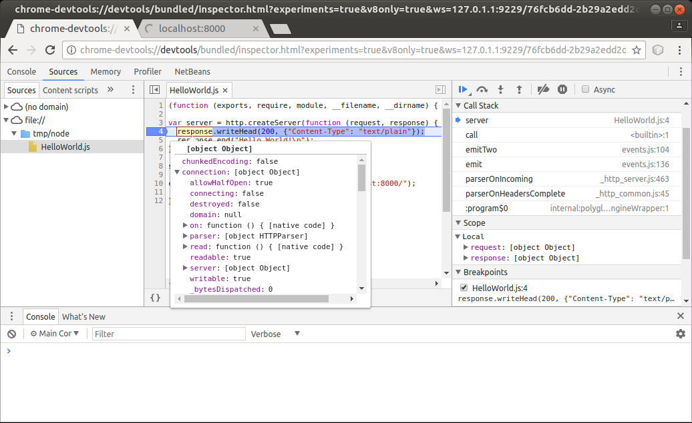

# Chrome Debugger

GraalVM supports debugging of guest language applications and provides a built-in implementation of the [Chrome DevTools Protocol](https://chromedevtools.github.io/devtools-protocol/).
This allows you to attach compatible debuggers such as [Chrome Developer Tools](https://developers.google.com/web/tools/chrome-devtools/) to GraalVM.

To debug guest language applications, pass the `--inspect` option to the command line launcher, as in the following example with a Node.js _HelloWorld_ program:

```javascript
var http = require('http');

var server = http.createServer(function (request, response) {
  response.writeHead(200, {"Content-Type": "text/plain"});
  response.end("Hello World!\n");
});

server.listen(8000);

console.log("Server running at http://localhost:8000/");
```

1. Save this program as `HelloWorld.js` and then run:
```shell
$JAVA_HOME/bin/node --inspect HelloWorld.js
Debugger listening on ws://127.0.0.1:9229/SBqxI5YIqtREaDrXkFr8hLE0HL1AfKx8TjkI8qPMq2s
For help, see: https://www.graalvm.org/tools/chrome-debugger
For example, in Chrome open: devtools://devtools/bundled/js_app.html?ws=127.0.0.1:9229/SBqxI5YIqtREaDrXkFr8hLE0HL1AfKx8TjkI8qPMq2s
```

2. Navigate to `http://localhost:8000/` in your browser to launch the node application.

3. Open the `devtools:...` link in a separate Chrome browser tab.

4. Navigate to the `HelloWorld.js` file and submit a breakpoint at line 4.

5. Refresh the node.js app and you can see the breakpoint hit.

Now you can inspect the stack, variables, evaluate variables, and selected expressions in a tooltip, and so on. By hovering your cursor over the `response` variable, for instance, you can inspect its properties, as seen in the screenshot below:



Consult the [JavaScript Debugging Reference](https://developers.google.com/web/tools/chrome-devtools/javascript/reference) for details on Chrome DevTools debugging features.

This debugging process applies to all guest languages that GraalVM supports.
Other languages such as R and Ruby can be debugged as easily as JavaScript, including stepping through language boundaries during guest language [interoperability](../reference-manual/polyglot-programming.md).

## Inspect Options

### Node Launcher
The Node.js runtime of GraalVM accepts the same options as [node.js built on the V8 JavaScript engine](https://nodejs.org/), such as:
```shell
--inspect[=[host:]<port number>]
```

This enables the inspector agent and listens on port 9229 by default. To listen on a different port, specify the optional port number:
```shell
--inspect-brk[=[host:]<port number>]
```

This applies to the `node` launcher only.

### Other Language Launchers
Other guest language launchers such as `js`, `python`, `Rscript`, `ruby`, `lli`, and `polyglot` accept the `--inspect[=[host:]<port number>]` option, but suspend on the first line of the application code by default.
```shell
--inspect.Suspend=(true|false)
```

This disables the initial suspension if you specify `--inspect.Suspend=false`.

### Additional Common Inspect Options
All launchers also accept the following additional options:

* `--inspect.Path=<path>` allows users to specify a custom path that generates the connection URL. Note: any website opened in your browser that has knowledge of this URL can connect to the debugger. **A predictable path can thus be abused by a malicious website to execute arbitrary code on your computer, even if you are behind a firewall.** Therefore the path is randomly generated by default.
* `--inspect.SourcePath=<source path>` specifies a list of directories or ZIP/JAR files representing the source path. When the inspected application contains relative references to source files, their content is loaded from locations resolved with respect to this source path. It is useful during LLVM debugging, for instance.
The paths are delimited by `:` on UNIX systems and by `;` on MS Windows.
* `--inspect.Secure=(true|false)` when true, use TLS/SSL to secure the debugging protocol. Besides changing the WS
(web socket) protocol to WSS, the HTTP endpoint that serves metadata about the debuggee
is also changed to HTTPS. This is not compatible, with a
[chrome://inspect](chrome://inspect) page, which is not able to provide the debuggee
information and launch the debugger. Launch debugging via the printed WSS URL directly. Use the standard `javax.net.ssl.*` system options to provide information about keystore with the TLS/SSL encryption keys, or the following options:
    * `--inspect.KeyStore` - keystore file path
    * `--inspect.KeyStoreType` - keystore file type (defaults to JKS)
    * `--inspect.KeyStorePassword` - keystore password
    * `--inspect.KeyPassword` - password for recovering keys, if it's different from the keystore password
* `--inspect.WaitAttached=(true|false)` when true, no guest language source code is executed until the inspector client is attached. Unlike `--inspect.Suspend=true`, the execution is resumed right
after the client is attached. This assures that no execution is missed by the
inspector client. It is `false` by default.
* `--inspect.SuspensionTimeout` sets a timeout of a debugger suspension. The debugger session is disconnected after the timeout expires. The timeout value consists of a positive integer value followed by a chronological time unit. For example, '15m' or '10s'. Valid time units are 'ms' for milliseconds, 's' for seconds, 'm' for minutes, 'h' for hours, and 'd' for days. There is no timeout set by default.

### Advanced Debug Options
The following options are for language experts and language developers:

* `--inspect.Initialization=(true|false)` when true, this option inspects the language initialization phase. When initial suspension is active, this suspends at the beginning of language initialization, not necessarily at the beginning of the application code. It is `false` by default.
* `--inspect.Internal=(true|false)`  when true, internal sources are inspected as well. Internal sources may provide language implementation details. It is `false` by default.

### Programmatic Launch of Inspector Backend
Embedders can provide the appropriate inspector options to the `Engine/Context` to launch the inspector backend.
The following code snippet provides an example of a possible launch:

```java
import org.graalvm.polyglot.*;

class DebuggerSample {
    public static void main(String... args) {
        String port = "4242";
        String path = java.util.UUID.randomUUID().toString();
        Context context = Context.newBuilder("js")
                    .option("inspect", port)
                    .option("inspect.Path", path)
                    .build();
        String hostAdress = "localhost";
        String url = String.format(
                    "chrome-devtools://devtools/bundled/js_app.html?ws=%s:%s/%s",
                    hostAdress, port, path);
    }
}
```
When running on OpenJDK, the following Maven dependencies must be declared to use the Chrome Inspector tool with embedded code:

```xml
<dependency> 
    <groupId>org.graalvm.polyglot</groupId> 
    <artifactId>polyglot</artifactId> 
    <version>${graalvm.polyglot.version}</version>
</dependency>
<dependency>
    <groupId>org.graalvm.tools</groupId>
    <artifactId>chromeinspector</artifactId>
    <version>${graalvm.polyglot.version}</version>
</dependency>
```

The Chrome Inspector tool is always available as a tool on GraalVM. No dependency needs to be explicitly declared there.
