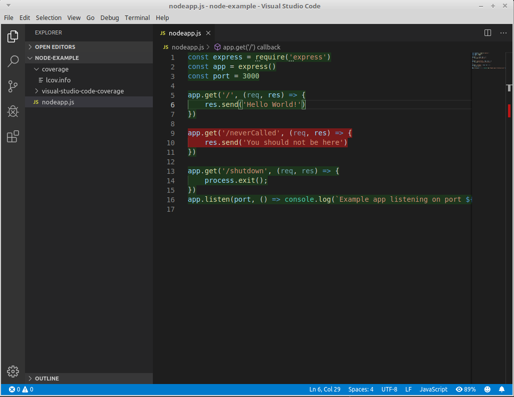

# Code Coverage Command Line Tool

GraalVM provides a **code coverage command line tool** that lets users record and analyze the source code coverage of a particular execution of code.

Code coverage, as a percentage of source code lines, functions, or statements covered, is an important metric for understanding a particular source code execution, and is commonly associated with test quality (test coverage).
Providing a visual coverage overview for individual lines of code shows the developer which code paths are covered and which are not, giving insight into the character of the execution which can, for example, inform further testing efforts.

The example application below will be used to demonstrate GraalVM's code coverage capabilities.
This application defines a `getPrime` function that calculates the n-th prime using a basic prime number calculator based on the [Sieve of Eratosthenes](https://en.wikipedia.org/wiki/Sieve_of_Eratosthenes) algorithm.
It also has a somewhat naive cache of the first 20 prime numbers.

1. Copy the following code into a new file named `primes.js`:

```javascript
class AcceptFilter {
    accept(n) {
        return true
    }
}
class DivisibleByFilter {
    constructor(number, next) {
        this.number = number;
        this.next = next;
    }
    accept(n) {
        var filter = this;
        while (filter != null) {
            if (n % filter.number === 0) {
                    return false;
            }
            filter = filter.next;
        }
        return true;
    }
}
class Primes {
    constructor() {
        this.number = 2;
        this.filter = new AcceptFilter();
    }
    next() {
        while (!this.filter.accept(this.number)) {
            this.number++;
        }
        this.filter = new DivisibleByFilter(this.number, this.filter);
        return this.number;
    }
}
function calculatePrime(n) {
    var primes = new Primes();
    var primesArray = [];
    for (let i = 0; i < n; i++) {
        primesArray.push(primes.next());
    }
    return primesArray[n-1];
}
function getPrime(n) {
    var cache = [2,3,5,7,11,13,17,19,23,29,31,37,41,43,47,53,59,61,67,71];
    var n = arguments[0];
    if (n > cache.length) { return calculatePrime(n); }
    return cache[n-1];
}
// TESTS
console.assert(getPrime(1) == 2);
console.assert(getPrime(10) == 29);
```

Notice that the last couple of lines are assertions to be treated as unit tests.

2. Run `js primes.js`. The example application should print no output, since all the assertions pass. But how well do the assertions test the implementation?

3. Run `js primes.js --coverage` to enable code coverage. The code coverage tool should print output for the example application as follows:
```shell
js primes.js --coverage
--------------------------------------------------------
Code coverage histogram.
Shows what percent of each element was covered during execution
--------------------------------------------------------
 Path               |  Statements |    Lines |    Roots
--------------------------------------------------------
 /path/to/primes.js |      20.69% |   26.67% |   22.22%
--------------------------------------------------------
```
The tracer prints a coverage histogram for each source file.
You can see that statement coverage is roughly 20%, line coverage is roughly 26%, and root coverage (the term "root" covers functions, methods, etc.) is 22.22%.
This tells your that our simple tests are not particularly good at exercising the source code.
Next you will figure out which parts of the code are not covered.

4. Run `js primes.js --coverage --coverage.Output=detailed`. Prepare for a somewhat verbose output.
Specifying the output as `detailed` will print all the source code lines with a
coverage annotation at the beginning. Due to potentially large output, it is
recommended to combine this output mode with the `--coverage.OutputFile` option
which prints the output directly to a file. The output for our example
application is as follows:

```shell
js primes.js --coverage --coverage.Output=detailed
--------------------------------------------------------
Code coverage per line of code and what percent of each element was covered during execution (per source)
  + indicates the line is covered during execution
  - indicates the line is not covered during execution
  p indicates the line is part of a statement that was incidentally covered during execution
    e.g. a not-taken branch of a covered if statement
--------------------------------------------------------
 Path               |  Statements |    Lines |    Roots
 /path/to/primes.js |      20.69% |   26.67% |   22.22%

  class AcceptFilter {
      accept(n) {
-         return true
      }
  }
  class DivisibleByFilter {
      constructor(number, next) {
-         this.number = number;
-         this.next = next;
      }
      accept(n) {
-         var filter = this;
-         while (filter != null) {
-             if (n % filter.number === 0) {
-                     return false;
-             }
-             filter = filter.next;
          }
-         return true;
      }
  }
  class Primes {
      constructor() {
-         this.number = 2;
-         this.filter = new AcceptFilter();
      }
      next() {
-         while (!this.filter.accept(this.number)) {
-             this.number++;
          }
-         this.filter = new DivisibleByFilter(this.number, this.filter);
-         return this.number;
      }
  }
  function calculatePrime(n) {
-     var primes = new Primes();
-     var primesArray = [];
-     for (let i = 0; i < n; i++) {
-         primesArray.push(primes.next());
      }
-     return primesArray[n-1];
  }
  function getPrime(n) {
+     var cache = [2,3,5,7,11,13,17,19,23,29,31,37,41,43,47,53,59,61,67,71];
+     var n = arguments[0];
p     if (n > cache.length) { return calculatePrime(n); }
+     return cache[n-1];
  }
  // TESTS
+ console.assert(getPrime(1) == 2);
+ console.assert(getPrime(10) == 29);
--------------------------------------------------------
```

As the legend at the beginning of the output explains, lines that are covered by the execution are preceded with a `+`.
Lines not covered by the execution are preceded with a `-`.
Lines that are covered partially are preceded with `p` (e.g., when an `if` statement is covered but only one branch is taken, consider the other bench to be incidentally covered).

Looking at the output you can see that the `calculatePrime` function and all its calls are never executed. Looking again at the assertions and the `getPrime`
function, it becomes clear that our tests always hit the cache.
Thus most of the code is never executed. You can improve on that.

5. Add `console.assert(getPrime(30) == 113);` to the end of the `primes.js` file and run `js primes.js --coverage`. Since the new assertion added calls
`getPrime` with 30 (our cache only has 20 entries) the coverage will look like this:

```shell
js primes.js --coverage
-------------------------------------------------------
Code coverage histogram.
  Shows what percent of each element was covered during execution
-------------------------------------------------------
 Path               |  Statements |    Lines |    Roots
-------------------------------------------------------
 /path/to/primes.js |     100.00% |  100.00% |  100.00%
-------------------------------------------------------
```

## Integrating with Other Tools

The code coverage tool provides ways to integrate with other tools.
Running with `--coverage.Output=lcov` produces output in the commonly used [lcov](https://linux.die.net/man/1/lcov) format which is used by multiple tools (e.g., `genhtml`) to display coverage data.
Take a look at the next example that shows how to visualise coverage of a Node.js app with Visual Studio Code.

1. Copy the following code into a new file named `nodeapp.js`:

```javascript
const express = require('express')
const app = express()
const port = 3000

app.get('/', (req, res) => {
  res.send('Hello World!')
})

app.get('/neverCalled', (req, res) => {
  res.send('You should not be here')
})

app.get('/shutdown', (req, res) => {
  process.exit();
})
app.listen(port, () => console.log(`Example app listening on port ${port}!`))
```

2. Install the express module dependency:
```shell
$JAVA_HOME/bin/npm install express
```

3. Launch Visual Studio Code and install a code coverage plugin that supports _lcov_.
The [Code Coverage Highlighter](https://marketplace.visualstudio.com/items?itemName=brainfit.vscode-coverage-highlighter) is used for this example, but other plugins should work similarly.

4. Run the _nodeapp.js_ file with coverage enabled and configured:
```shell
$JAVA_HOME/bin/node --coverage --coverage.Output=lcov \
--coverage.OutputFile=coverage/lcov.info \
nodeapp.js
```

Note that the Code Coverage Highlighter plugin looks for the `lcov.info` file in the `coverage` directory by default, so direct the output of the code coverage tool there.

5. Visit [localhost:3000/](http://localhost:3000/) in your browser, then visit [localhost:3000/shutdown](http://localhost:3000/shutdown) to close the app.

6. Open Visual Studio Code, then open the folder containing the `nodeapp.js` file and `coverage` directory and you should be greeted with an image similar to the following:



If you wish to integrate the data gathered by the GraalVM code coverage tool with your own visualisation, the `--coverage.Output=json` option results in the output being a JSON file with the raw data gathered by the tracker.
