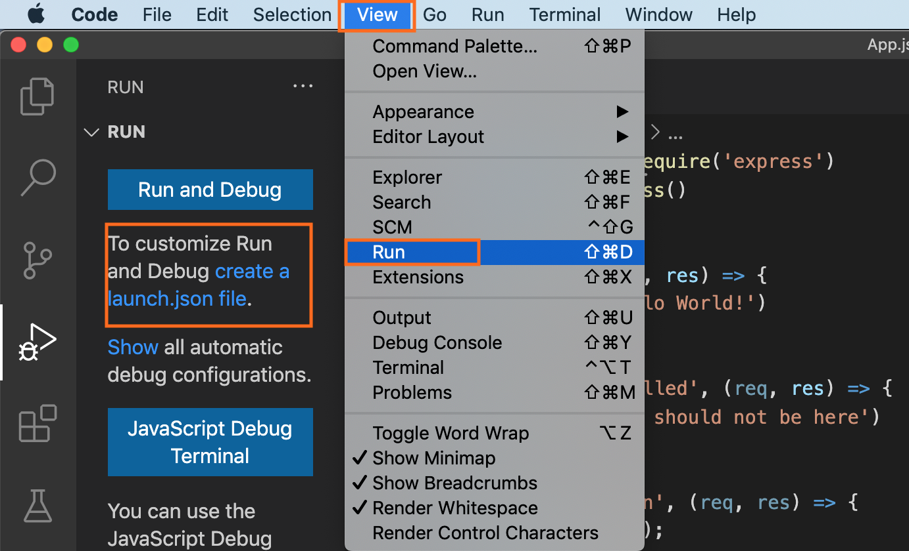

# Debug Adapter Protocol

GraalVM supports debugging of guest language applications, written in any of the supported languages, i.e., JavaScript/TypeScript, Python, R, Ruby, and provides a built-in implementation of the [Debug Adapter Protocol (DAP)](https://microsoft.github.io/debug-adapter-protocol/).
By definition, Debug Adapter Protocol is to standardize the "communication" between the debugging component and a concrete debugger or runtime.
This allows you to attach compatible debuggers such as Visual Studio Code (VS Code) to GraalVM.

To open a debugger port serving Debug Adapter Protocol, you need to pass the `--dap` option to the command line launcher.
The usage of Debug Adapter Protocol is similar to the existing [Chrome DevTools Protocol implementation](chrome-debugger.md) in the GraalVM runtime:
* `--dap.Suspend=false`: disable the execution suspension at first source line, enabled by default.
* `--dap.WaitAttached`: do not execute any source code until debugger client is attached. The default is false.
* `--dap=<[[host:]port]>`: start the debugger on a different port than default (`<host>:4711`).

Then you need a DAP client to connect to the open DAP port. VS Code will be used as an example.

1&#46; Save this Node.js application in a file named _App.js_:
```javascript
const express = require('express')
const app = express()
const port = 3000

app.get('/', (req, res) => {
  res.send('Hello World!')
})

app.get('/neverCalled', (req, res) => {
  res.send('You should not be here')
})

app.get('/shutdown', (req, res) => {
  process.exit();
})
app.listen(port, () => console.log(`Example app listening on port ${port}!`))
```

2&#46; Install the `express` module dependency in the directory where you saved the file:
```shell
$JAVA_HOME/bin/npm install express
```

3&#46; Run the application with DAP enabled:
```shell
$JAVA_HOME/bin/node --dap App.js
[Graal DAP] Starting server and listening on localhost/127.0.0.1:4711
```

4&#46; Start VS Code, freshly installed without any extensions:
```shell
code .
```
5&#46; Open the App.js source in VS Code, and put a breakpoint, for example, at line 6 (`res.send('Hello World!')`).

6&#46; Navigate to View > Run to create a launch configuration (Ctrl+Shift+D):


7&#46; Then create the _launch.json_ file with the following content:
```json
{
    "version": "0.2.0",
    "configurations": [
        {
            "name": "Attach",
            "type": "node",
            "request": "attach",
            "debugServer": 4711
        }
    ]
}
```

8&#46; Start debugging (F5).

The other approach is to use VS Code with the GraalVM extension installed.
Follow the steps described in [Node.js and JavaScript Debugging](https://marketplace.visualstudio.com/items?itemName=oracle-labs-graalvm.graalvm#javascript-and-node.js-debugging), and launch the application being debugged directly from VS Code.
When debugging a guest language application from VS Code, a user can choose a protocol to use by setting the protocol attribute in the corresponding debug configuration to either `chromeDevTools` or `debugAdapter`.
To connect to the open DAP port in this scenario, the content of the _launch.json_ should be:

```json
{
    "version": "0.2.0",
    "configurations": [
        {
            "type": "graalvm",
            "request": "launch",
            "name": "Launch Node App",
            "outputCapture": "std",
            "protocol": "debugAdapter",
            "program": "${workspaceFolder}/App.js"
        }
    ]
}
```

The advantage of using Debug Adapter Protocol over Chrome Dev Tools is that (1) it is 'native' to Visual Studio Code (VS Code), meaning it does not require any intermediate translatation, and (2) that it supports multithreading, which can be particually useful to debug, e.g., a Ruby application.
