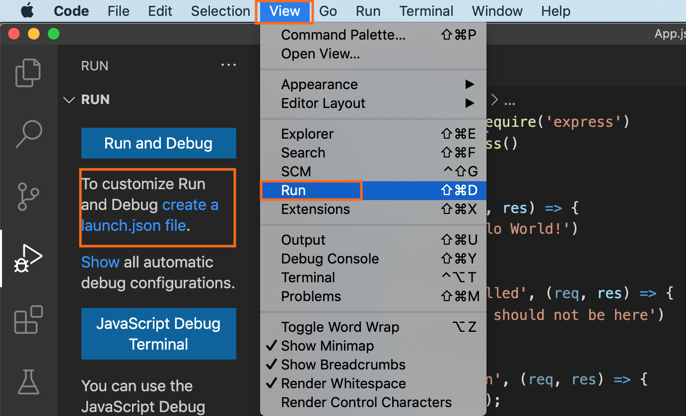

# Debug Adapter Protocol

GraalVM supports debugging of guest language applications, written in any of the supported languages (JavaScript/TypeScript, Python, R, or Ruby), and provides a built-in implementation of the [Debug Adapter Protocol (DAP)](https://microsoft.github.io/debug-adapter-protocol/).
By definition, Debug Adapter Protocol is to standardize the "communication" between the debugging component and a concrete debugger or runtime.
This allows you to attach compatible debuggers such as Visual Studio Code (VS Code) to GraalVM.

To open a debugger port serving Debug Adapter Protocol, you need to pass the `--dap` option to the command line launcher.
The usage of Debug Adapter Protocol is similar to the existing [Chrome DevTools Protocol implementation](chrome-debugger.md) in the GraalVM runtime:
* `--dap.Suspend=false`: disable the execution suspension at first source line, enabled by default.
* `--dap.WaitAttached`: do not execute any source code until debugger client is attached. The default is false.
* `--dap=<[[host:]port]>`: start the debugger on a different port than default (`<host>:4711`).

Then you need a DAP client to connect to the open DAP port. VS Code will be used as an example.

1&#46; Save this Node.js application in a file named _App.js_:
```javascript
const express = require('express')
const app = express()
const port = 3000

app.get('/', (req, res) => {
  res.send('Hello World!')
})

app.get('/neverCalled', (req, res) => {
  res.send('You should not be here')
})

app.get('/shutdown', (req, res) => {
  process.exit();
})
app.listen(port, () => console.log(`Example app listening on port ${port}!`))
```

2&#46; Install the `express` module dependency in the directory where you saved the file:
```shell
$JAVA_HOME/bin/npm install express
```

3&#46; Run the application with DAP enabled:
```shell
$JAVA_HOME/bin/node --dap App.js
[Graal DAP] Starting server and listening on localhost/127.0.0.1:4711
```

4&#46; Start VS Code, freshly installed without any extensions:
```shell
code .
```
5&#46; Open the App.js source in VS Code, and put a breakpoint, for example, at line 6 (`res.send('Hello World!')`).

6&#46; Navigate to View > Run to create a launch configuration (Ctrl+Shift+D):


7&#46; Then create the _launch.json_ file with the following content:
```json
{
    "version": "0.2.0",
    "configurations": [
        {
            "name": "Attach",
            "type": "node",
            "request": "attach",
            "debugServer": 4711
        }
    ]
}
```

8&#46; Start debugging (F5).
When debugging a guest language application from VS Code, a user can choose a protocol to use by setting the protocol attribute in the corresponding debug configuration to either `chromeDevTools` or `debugAdapter`.
To connect to the open DAP port in this scenario, the content of the _launch.json_ should be:

```json
{
    "version": "0.2.0",
    "configurations": [
        {
            "type": "graalvm",
            "request": "launch",
            "name": "Launch Node App",
            "outputCapture": "std",
            "protocol": "debugAdapter",
            "program": "${workspaceFolder}/App.js"
        }
    ]
}
```

The advantage of using Debug Adapter Protocol over Chrome Dev Tools is that (1) it is 'native' to Visual Studio Code (VS Code), meaning it does not require any intermediate translation, and (2) that it supports multithreading, which can be particularly useful to debug, for example, a Ruby application.

## Configure Source Path Mappings

Use source path mappings when the debugger client and the GraalVM runtime access the same sources through different paths.
You can configure mappings in either a `launch` or an `attach` configuration.

The `pathMappings` property accepts the debugpy array syntax.
Each entry maps a client-local `localRoot` to a `remoteRoot` used by the runtime:

```json
{
    "request": "launch",
    "pathMappings": [
        {
            "localRoot": "${workspaceFolder}/src",
            "remoteRoot": "/opt/application/src"
        }
    ]
}
```

The Xdebug object syntax maps each runtime root key to a client-local root value:

```json
{
    "request": "attach",
    "pathMappings": {
        "/opt/application/src": "${workspaceFolder}/src",
        "/opt/libraries": "${workspaceFolder}/libraries"
    }
}
```

For a single direct mapping, set `localRoot` and `remoteRoot` at the top level:

```json
{
    "request": "attach",
    "localRoot": "${workspaceFolder}",
    "remoteRoot": "/opt/application"
}
```

The server translates client-local paths to runtime paths for path-based breakpoint, breakpoint-location, and source requests.
It translates runtime paths to client-local paths in loaded-source events, loaded-source responses, and stack traces.
Trailing path separators do not affect matching.
Windows drive-letter roots (such as `C:\work`) and Universal Naming Convention (UNC) roots (such as `\\server\share` or `//server/share`) match without regard to case.
For these roots, `/` and `\` are interchangeable separators.
The server recognizes Windows syntax independently on each side of a mapping, regardless of its own operating system.
Other roots remain case-sensitive.
A root matches either the complete path or a whole directory prefix, so `/opt/app` does not match `/opt/application`.
When multiple roots match, the longest root takes precedence.
You can combine `pathMappings` with the top-level `localRoot` and `remoteRoot` pair.
If matching roots have the same length, the top-level pair takes precedence.
Paths that do not match a configured root remain unchanged.
When path mappings are configured, a source receives a `sourceReference` only if its runtime path does not match a mapped remote root.
A source that matches a mapping is returned with the mapped client path, even when the runtime cannot verify its readability.
This also applies to sources cached before the `launch` or `attach` request supplies mappings.

> Note: Paths for sources with a positive `sourceReference` remain unchanged.
> The client must retrieve these sources with a DAP `source` request that specifies the source reference.
