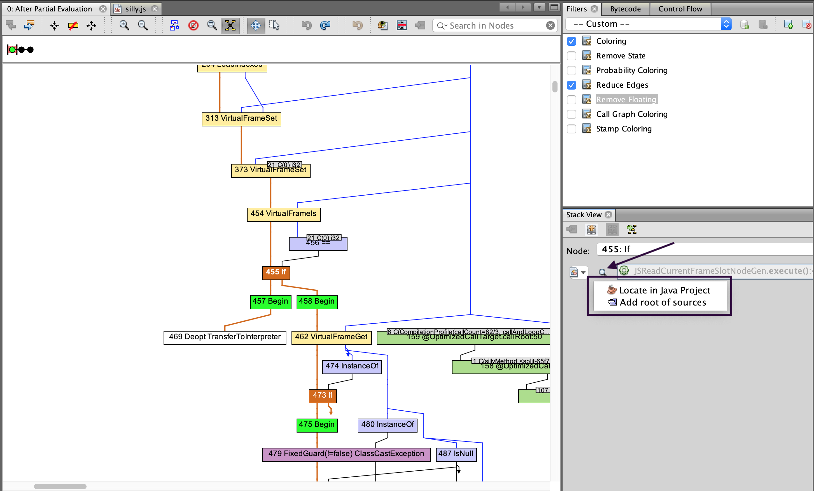
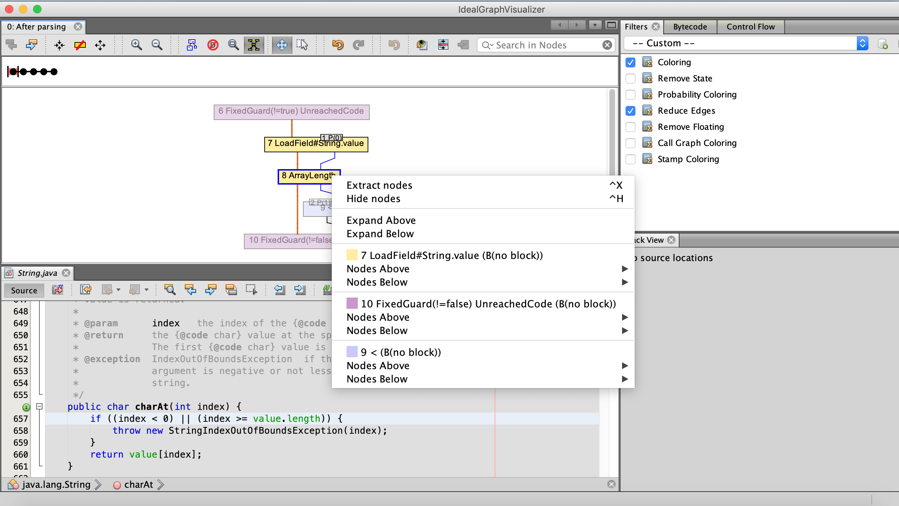
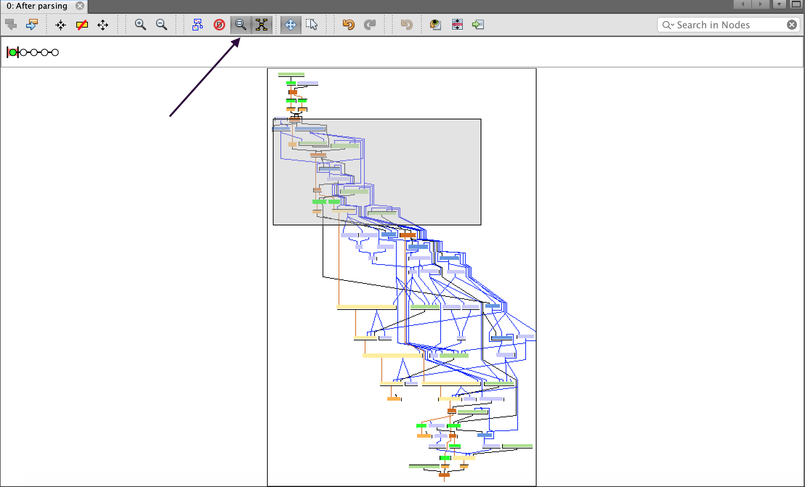

# Ideal Graph Visualizer

Ideal Graph Visualizer (IGV) is a developer tool to analyze compilation graphs and investigate performance issues.
IGV is developed to view and inspect intermediate representation graphs&mdash;a language-independent intermediate representation (IR) between the source
language and the machine code, generated by the compiler. It is essential for any language implementers building on top of GraalVM.

The IGV tool is developed to allow GraalVM language implementers to optimize their languages assembled with the [Truffle framework](../../truffle/docs/README.md). 
As a development tool it should not be installed to production environments.

### Prerequisites
* [GraalVM](https://www.graalvm.org/downloads/) installed.
* The [`mx` tool](https://github.com/graalvm/mx) for the development of GraalVM projects (see below).

## Get Started

IGV is free to use and has to be built on user's machine with the [`mx` tool](https://github.com/graalvm/mx/blob/master/README.md) - a command-line tool to build, test, run, update the code, and built artifacts for GraalVM.

1. Clone the `mx` repository to your work directory:
    ```shell
    git clone https://github.com/graalvm/mx.git
    ```

2. Clone the [Graal repository](https://github.com/oracle/graal.git):
    ```shell
    git clone https://github.com/oracle/graal.git
    ```

3. Add `mx` to the `PATH` environment variable:
    ```shell
    export PATH="/path/to/mx:$PATH"
    ```
    To check whether the installation was successful, run the command:
    ```shell
    mx --version 
    ```
    
4. Launch IGV with `mx`:
    ```shell
    mx -p graal/compiler igv
    ```

## Dump Graphs Using a Ruby Example

Using a host Ruby application that embeds some Java, you will now dump compiler graphs over the network.
 
1. Save the following code snippet in a file named `Test.rb`:

    ```shell
    require 'json'
    obj = {
      time: Time.now,
      msg: 'Hello World',
      payload: (1..10).to_a
    }
    encoded = JSON.dump(obj)
    js_obj = Polyglot.eval('js', 'JSON.parse').call(encoded)
    puts js_obj[:time]
    puts js_obj[:msg]
    puts js_obj[:payload].join(' ')
    ```

2. [Install Ruby from a TruffleRuby standalone](https://www.graalvm.org/reference-manual/ruby/#getting-started) using a Ruby manager/installer.
Check its version to make sure you are running the TruffleRuby distribution:
    ```shell
    ruby --version
    ```

3. Run the application, connecting the process to the running IGV:
    ```shell
    ruby --vm.Djdk.graal.Dump=:1 --vm.Djdk.graal.PrintGraph=Network Test.rb
    ```

This dumps compiler graphs, in the IGV format, over the network to an IGV process listening on _127.0.0.1:4445_. 
Once the connection is made, you are able to see the graphs in the Outline view. 
Find, for example, the `java.lang.String.char(int)` folder and open its After Parsing graph by double-clicking. 
If the node has `sourceNodePosition` property, then the Processing window will attempt to display its location and the entire stacktrace.

## Browse Graphs

Once a specific graph is opened, you can search for nodes by name, ID, or by `property=value` data, and all matching results will be shown.
Another great feature of this tool is the ability to navigate to the original guest language source code.
Select a node in the graph and click the **Go to Source** button in the Stack View window.



Graphs navigation is also available from the Context menu, enabled by focusing and right-clicking a specific graph node.
The Extract Nodes option re-renders a graph and displays only the selected nodes and their neighbors.



If the graph is larger than the screen, manipulate with the Satellite view button in the main toolbar to move the viewport rectangle.



For user preference, the graph color scheme is adjustable by editing the Coloring filter, enabled by default in the left sidebar.

## View Source Code

Source code views can be opened in manual and assisted modes.
Once you select a node in the graph view, the Processing view opens.
If the IGV knows where the source code for the current frame is, the green Go to Source arrow is enabled.
If the IGV does not know where the source is, the line is greyed out and a Looking Glass button appears.


Press it and select Locate in Java project to locate the correct project in the dialog.
The IGV hides projects which do not contain the required source file.
The Source Collections serves to display the standalone roots added by **Add root of sources** general action.
If the source is located using the preferred method (for example, from a Java project), its project can be later managed on the Project tab.
That one is initially hidden, but you can display the list of opened projects using **Window**, then **Projects**.

## Dump Graphs from Embedded Java

To dump the GraalVM compiler graphs from an embedded Java application to IGV, you need to add options to the GraalVM-based process.
Depending on the language/VM used, you may need to prefix the options by `--vm`. 
See the particular language's documentation for the details.
The main option to add is `-Djdk.graal.Dump=:1`.
This will dump graphs in an IGV readable format to the local file system.
To send the dumps directly to the IGV over the network, add `-Djdk.graal.PrintGraph=Network` when starting a GraalVM instance.
Optionally a port can be specified.
Then dumps are sent to the IGV from the running GraalVM on localhost.
If the IGV does not listen on localhost, check under **Options**, then **Ideal Graph Settings|Accept Data From Network** can be checked.
If there is not an IGV instance listening on `127.0.0.1`, or it cannot be connected to, the dumps will be redirected to the local file system.
The file system location is `graal_dumps/` under the current working directory of the process and can be changed with the `-Djdk.graal.DumpPath` option.

In case an older GraalVM version is used, you may need to explicitly request that dumps include the `nodeSourcePosition` property.
This is done by adding the `-XX:+UnlockDiagnosticVMOptions -XX:+DebugNonSafepoints` options.

### Relative Documentation

- [Implement Your Language](../graalvm-as-a-platform/implement-language.md)
- The [`mx` tool](https://github.com/graalvm/mx)