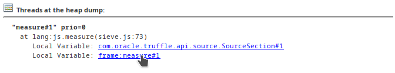
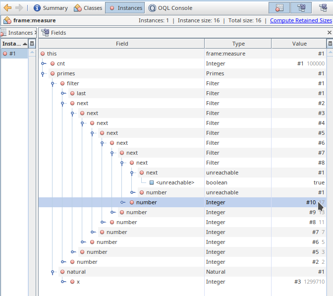

# Insight Manual

GraalVM Insight is multipurpose, flexible tool to write reliable applications.
The dynamic nature of the tool allows to selectively apply tracing pointcuts on already deployed applications with no loss of performance.

Any moderately skilled hacker can easily creat so called **Insight snippets** and dynamically apply them to the actual programs.
This provides ultimate insights into execution and behavior of one's application without compromising the execution speed.

### Table of contents
- [Quick Start](#quick-start)
- [Hotness Top 10 Example](#hotness-top-10-example)
- [Apply Insight to Any GraalVM Language](#apply-insight-to-any-graalvm-language)
- [Insights with JavaScript](#insights-with-javascript)
- [Insights with Python](#insights-with-python)
- [Insights with Ruby](#insights-with-ruby)
- [Insights with R](#insights-with-r)
- [Insight into C Code](#insight-into-c-code)
- [Inspecting Values](#inspecting-values)
- [Modifying Local Variables](#modifying-local-variables)
- [Delaying Insight Initialization in Node.JS](#delaying-insight-initialization-in-nodejs)
- [Handling Exceptions](#handling-exceptions)
- [Intercepting and Altering Execution](#intercepting-and-altering-execution)
- [Minimal Overhead](#minimal-overhead)
- [Minimal Overhead when Accessing Locals](#minimal-overhead-when-accessing-locals)
- [Accessing Execution Stack](#accessing-execution-stack)
- [Note on GraalVM Insight API](#note-on-graalvm-insight-api)
- [Heap Dumping](#heap-dumping)

## Quick Start

Get started with an obligatory *HelloWorld* example.
Create a `source-tracing.js` script with following content:

```js
insight.on('source', function(ev) {
    print(`Loading ${ev.characters.length} characters from ${ev.name}`);
});
```
Run it with GraalVM's `node` launcher adding the `--insight` instrument option.
Observe what scripts are being loaded and evaluated:

```bash
graalvm/bin/node --js.print --insight=source-tracing.js -e "print('The result: ' + 6 * 7)" | tail -n 10
Loading 29938 characters from url.js
Loading 345 characters from internal/idna.js
Loading 12642 characters from punycode.js
Loading 33678 characters from internal/modules/cjs/loader.js
Loading 13058 characters from vm.js
Loading 52408 characters from fs.js
Loading 15920 characters from internal/fs/utils.js
Loading 505 characters from [eval]-wrapper
Loading 29 characters from [eval]
The result: 42
```

What has just happened? GraalVM Insight `source-tracing.js` script has used the provided `insight` object to attach a *source* listener to the runtime.
As such, whenever `node` loaded a script, the listener got notified of it and could take an action (in this case printing the length and name of processed script).

## Hotness Top 10 Example

Collecting the insights information is not limited to a print statement.
One can perform any Turing complete computation in your language.
For example, a program that counts all method invocations and dumps the most frequent ones when the execution is over.

Save the following code to `function-hotness-tracing.js`:

```js
var map = new Map();

function dumpHotness() {
    print("==== Hotness Top 10 ====");
    var digits = 3;
    Array.from(map.entries()).sort((one, two) => two[1] - one[1]).forEach(function (entry) {
        var number = entry[1].toString();
        if (number.length >= digits) {
            digits = number.length;
        } else {
            number = Array(digits - number.length + 1).join(' ') + number;
        }
        if (number > 10) print(`${number} calls to ${entry[0]}`);
    });
    print("========================");
}

insight.on('enter', function(ev) {
    var cnt = map.get(ev.name);
    if (cnt) {
        cnt = cnt + 1;
    } else {
        cnt = 1;
    }
    map.set(ev.name, cnt);
}, {
    roots: true
});

insight.on('close', dumpHotness);
```

The `map` is a global variable visible for the whole Insight script that allows the code to share data between the `insight.on('enter')` function and the `dumpHotness` function.
The latter is executed when the `node` process execution is over (registered via `insight.on('close', dumpHotness)`.
Invoke the program:

```bash
graalvm/bin/node --js.print --insight=function-hotness-tracing.js -e "print('The result: ' + 6 * 7)"
The result: 42
==== Hotness Top 10 ====
543 calls to isPosixPathSeparator
211 calls to E
211 calls to makeNodeErrorWithCode
205 calls to NativeModule
198 calls to uncurryThis
154 calls to :=>
147 calls to nativeModuleRequire
145 calls to NativeModule.compile
 55 calls to internalBinding
 53 calls to :anonymous
 49 calls to :program
 37 calls to getOptionValue
 24 calls to copyProps
 18 calls to validateString
 13 calls to copyPrototype
 13 calls to hideStackFrames
 13 calls to addReadOnlyProcessAlias
========================
```

Table with names and counts of function invocations is printed out when the `node` process exits.

## Apply Insight to Any GraalVM Language

The previous examples were written in JavaScript and used `node`, but due to the polyglot nature of GraalVM you can take the same instrument and apply it to any language GraalVM supports.
For example, test the Ruby language with GraalVM Insight.

To start, create the instrument in the `source-trace.js` file:

```js
insight.on('source', function(ev) {
   if (ev.uri.indexOf('gems') === -1) {
     let n = ev.uri.substring(ev.uri.lastIndexOf('/') + 1);
     print('JavaScript instrument observed load of ' + n);
   }
});
```

Prepare your Ruby program in the `helloworld.rb` file:

```ruby
puts 'Hello from GraalVM Ruby!'
```

Note: Make sure the Ruby support is added to GraalVM with `gu install ruby`.

Apply the JavaScript instrument to the Ruby program. Here is what you should see:

```bash
graalvm/bin/ruby --polyglot --insight=source-trace.js helloworld.rb
JavaScript instrument observed load of helloworld.rb
Hello from GraalVM Ruby!
```

It is necessary to start GraalVM's Ruby launcher with the `--polyglot` parameter as the `source-tracing.js` script remains written in JavaScript.

## Insights with JavaScript

As stated in the previous section, GraalVM Insight is not limited to Node.js only.
It is available in all languages runtimes GraalVM provides.
Try the JavaScript implementation that comes with GraalVM.

Create the `function-tracing.js` script:

```js
var count = 0;
var next = 8;

insight.on('enter', function(ev) {
    if (count++ % next === 0) {
        print(`Just called ${ev.name} as ${count} function invocation`);
        next *= 2;
    }
}, {
    roots: true
});
```

Run it on top of [sieve.js](../../vm/benchmarks/agentscript/sieve.js).
It is a sample script which uses a variant of the Sieve of Erathostenes to compute one hundred thousand of prime numbers:

```bash
graalvm/bin/js --insight=function-tracing.js sieve.js | grep -v Computed
Just called :program as 1 function invocation
Just called Natural.next as 17 function invocation
Just called Natural.next as 33 function invocation
Just called Natural.next as 65 function invocation
Just called Natural.next as 129 function invocation
Just called Filter as 257 function invocation
Just called Natural.next as 513 function invocation
Just called Natural.next as 1025 function invocation
Just called Natural.next as 2049 function invocation
Just called Natural.next as 4097 function invocation
```

## Insights with Python

Not only one can instrument any GraalVM language, but also the Insight scripts can be written in that language.
In this section, you will find a Python example.

It is possible to write GraalVM Insight scripts in Python.
Such insights can be applied to programs written in Python or any other language.

Here is an example of a script that prints out value of variable `n` when a function `minusOne` is called.
Save this code to the `agent-fib.js` file:

```python
def onEnter(ctx, frame):
    print(f"minusOne {frame.n}")

class Roots:
    roots = True

    def sourceFilter(self, src):
        return src.name == "agent-fib.js"

    def rootNameFilter(self, n):
        return n == "minusOne"

insight.on("enter", onEnter, Roots())
```
Apply this script to, for example, a JavaScript application using the following command:

```bash
`js --polyglot --insight=agent.py agent-fib.js`
```

Note: Make sure the Python support is added to GraalVM with `gu install python`.

## Insights with Ruby

It is possible to write GraalVM Insight scripts in Ruby.
Such insights can be applied to programs written in Ruby or any other language.

Note: Make sure the Ruby support is added to GraalVM with `gu install ruby`.

Create the `source-tracing.rb` script:

```ruby
puts("Ruby: Insight version #{insight.version} is launching")

insight.on("source", -> (env) {
  puts "Ruby: observed loading of #{env.name}"
})
puts("Ruby: Hooks are ready!")

insight.on("enter", -> (ctx, frame) {
    puts("minusOne #{frame.n}")
}, {
  roots: true,
  rootNameFilter: "minusOne",
  sourceFilter: -> (src) {
    return src.name == "agent-fib.js"
  }
})
```

The above Ruby script example prints out value of variable `n` when a function `minusOne` in the `agent-fib.js` program is called.
Launch a Node.js application and instrument it with the Ruby script:

```bash
graalvm/bin/node --js.print --polyglot --insight=agent-ruby.rb agent-fib.js
Ruby: Initializing GraalVM Insight script
Ruby: Hooks are ready!
Ruby: observed loading of internal/per_context/primordials.js
Ruby: observed loading of internal/per_context/setup.js
Ruby: observed loading of internal/per_context/domexception.js
....
Ruby: observed loading of internal/modules/cjs/loader.js
Ruby: observed loading of vm.js
Ruby: observed loading of fs.js
Ruby: observed loading of internal/fs/utils.js
Ruby: observed loading of [eval]-wrapper
Ruby: observed loading of [eval]
Three is the result 3
```

## Insights with R

The same instrument can be written in the R language.

Create the `agent-r.R` script:

```R
cat("R: Initializing GraalVM Insight script\n")

insight@on('source', function(env) {
    cat("R: observed loading of ", env$name, "\n")
})

cat("R: Hooks are ready!\n")
```

Use it to trace a `test.R` program:

```bash
graalvm/bin/Rscript --insight=agent-r.R test.R
R: Initializing GraalVM Insight script
R: Hooks are ready!
R: observed loading of test.R
```

The only change is the R language. All the other GraalVM Insight features and [APIs](https://www.graalvm.org/tools/javadoc/org/graalvm/tools/insight/Insight.html#VERSION) remain the same.

## Insight into C Code

Not only it is possible to interpret dynamic languages, but with the help of the [GraalVM's LLI implementation](../../reference-manual/polyglot-programming.md/llvm/README.md), one can mix in even statically compiled programs written in **C**, **C++**, **Fortran**, **Rust**, etc.

Take, for examle, a long running program like [sieve.c](https://github.com/oracle/graal/blob/master/vm/tests/all/agentscript/agent-sieve.c), which contains never-ending `for` loop in `main` method. You would like to give it some execution quota.

First, execute the program on GraalVM:

```bash
export TOOLCHAIN_PATH=`graalvm/bin/lli --print-toolchain-path`
${TOOLCHAIN_PATH}/clang agent-sieve.c -lm -o sieve
graalvm/bin/lli sieve
```

The GraalVM `clang` wrapper adds special options instructing the regular `clang` to keep the LLVM bitcode information in the `sieve` executable along the normal native code.
The GraalVM's `lli` interpreter can then use the bitcode to interpret the program at full speed.
By the way, compare the result of direct native execution via `./sieve` and interpreter speed of `graalvm/bin/lli sieve`.
It should show quite good results as for an interpreter.

Now focus on breaking the endless loop. You can do it with this JavaScript `agent-limit.js` Insight script:

```js
var counter = 0;

insight.on('enter', function(ctx, frame) {
    if (++counter === 1000) {
        throw `GraalVM Insight: ${ctx.name} method called ${counter} times. enough!`;
    }
}, {
    roots: true,
    rootNameFilter: 'nextNatural'
});
```

The script counts the number of invocations of the C `nextNatural` function and when the function gets invoked a thousand times, it emits an error to terminate the `sieve` execution.
Run the program as:

```bash
graalvm/bin/lli --polyglot --insight=agent-limit.js sieve
Computed 97 primes in 181 ms. Last one is 509
GraalVM Insight: nextNatural method called 1000 times. enough!
        at <js> :anonymous(<eval>:7:117-185)
        at <llvm> nextNatural(agent-sieve.c:14:186-221)
        at <llvm> nextPrime(agent-sieve.c:74:1409)
        at <llvm> measure(agent-sieve.c:104:1955)
        at <llvm> main(agent-sieve.c:123:2452)
```

It is possible to access primitive local variables from the native code.
Replace the above Insight script with:

```js
insight.on('enter', function(ctx, frame) {
    print(`found new prime number ${frame.n}`);
}, {
    roots: true,
    rootNameFilter: (n) => n === 'newFilter'
});
```

Print out a message everytime a new prime is added into the filter list:

```bash
graalvm/bin/lli --polyglot --insight=agent-limit.js sieve | head -n 3
found new prime number 2
found new prime number 3
found new prime number 5
```

The mixture of `lli`, polyglot and GraalVM Insight opens enormous possibilities in tracing, controlling and interactive or batch debugging of native programs.

## Inspecting Values

GraalVM Insight not only allows one to trace where the program execution is happening, but it also offers access to values of local variables and function arguments during execution.
One can for example write instrument that shows a value of argument `n` in a function `fib`:

```js
insight.on('enter', function(ctx, frame) {
   print('fib for ' + frame.n);
}, {
   roots: true,
   rootNameFilter: 'fib'
});
```

This instrument uses the second function argument `frame` to get access to values of local variables inside of every instrumented function.
The above Insight script also uses `rootNameFilter` to apply its hook only to function named `fib`:

```js
function fib(n) {
  if (n < 1) return 0;
  if (n < 2) return 1;
  else return fib(n - 1) + fib(n - 2);
}
print("Two is the result " + fib(3));
```

When the instrument is stored in a `fib-trace.js` file and the actual code in `fib.js`, then invoking following command yields detailed information about the program execution and parameters passed between function invocations:

```bash
graalvm/bin/node --js.print --insight=fib-trace.js fib.js
fib for 3
fib for 2
fib for 1
fib for 0
fib for 1
Two is the result 2
```

To summarise this section, GraalVM Insight is a useful tool for polyglot, language agnostic aspect oriented programming.

## Modifying Local Variables

Not only that GraalVM Insight can access local variables, but it can also modify them.
Take, for example, this program summing an array:

```js
function plus(a, b) {
  return a + b;
}

var sum = 0;
[1, 2, 3, 4, 5, 6, 7, 8, 9].forEach((n) => sum = plus(sum, n));
print(sum);
```

It prints out a number `45`.
Apply the following Insight script to "erase" non-even numbers before adding them:

```js
insight.on('enter', function zeroNonEvenNumbers(ctx, frame) {
    if (frame.b % 2 === 1) {
        frame.b = 0;
    }
}, {
    roots: true,
    rootNameFilter: 'plus'
});
```

When launched with `js --insight=erase.js sumarray.js`, only the value `20` gets printed.

GraalVM Insight `enter` and `return` hooks can only modify existing variables.
They cannot introduce new ones.
Attempts to do so yield an exception.

## Delaying Insight Initialization in Node.JS

GraalVM Insight can be used in any GraalVM language runtime, including the `node` implementation.
However, when in `node`, one does not want to write plain Insight scripts. You would proabably want to use full power of the `node` ecosystem including its modules.
Here is a sample `agent-require.js` script that does it:

```js
let initialize = function (require) {
    let http = require("http");
    print(`${typeof http.createServer} http.createServer is available to the agent`);
}

let waitForRequire = function (event) {
  if (typeof process === 'object' && process.mainModule && process.mainModule.require) {
    insight.off('source', waitForRequire);
    initialize(process.mainModule.require.bind(process.mainModule));
  }
};

insight.on('source', waitForRequire, { roots: true });
```

The Insight scripts are initialized as soon as possible, and at that moment the `require` function is not yet ready.
As such, the script first attaches a listener on loaded scripts and, when the main user script is being loaded, it obtains its `process.mainModule.require` function.
Then it removes the probes using `insight.off` and invokes the actual `initialize` function to perform the real initialization while having access to all the node modules.
The script can be run with:

```js
graalvm/bin/node --js.print --insight=agent-require.js yourScript.js
```

This initialization sequence is known to work on GraalVM's `node` version 12.10.0 launched with the main `yourScript.js` parameter.

## Handling Exceptions

The GraalVM Insight instrument can throw exceptions which are then propagated to the surrounding user scripts.
Imagine you have a program `seq.js` logging various messages:

```js
function log(msg) {
    print(msg);
}

log('Hello GraalVM Insight!');
log('How');
log('are');
log('You?');
```

You can register an instrument `term.js` and terminate the execution in the middle of the `seq.js` program execution, based on observing the logged message:

```js
insight.on('enter', (ev, frame) => {
    if (frame.msg === 'are') {
        throw 'great you are!';
    }
}, {
    roots: true,
    rootNameFilter: 'log'
});
```

The `term.js` instrument waits for a call to `log` function with message `are` and, at that moment, it emits its own exception effectively interrupting the user program execution.
As a result one gets:

```bash
graalvm/bin/js --polyglot --insight=term.js seq.js
Hello GraalVM Insight!
How
great you are!
        at <js> :=>(term.js:3:75-97)
        at <js> log(seq.js:1-3:18-36)
        at <js> :program(seq.js:7:74-83)
```

The exceptions emitted by Insight instrument are treated as regular language exceptions.
The `seq.js` program could use the regular `try { ... } catch (e) { ... }` block to catch them and deal with them as if they were emitted by the regular user code.

## Intercepting and Altering Execution

GraalVM Insight is capable to alter the execution of a program.
It can skip certain computations and replace them with own alternatives.
The the following `plus` function as an example:

```js
function plus(a, b) {
    return a + b;
}
```

It is easy to change the behavior of the `plus` method.
The following Insight script replaces the `+` operation with multiplication by using the `ctx.returnNow` functionality:

```js
insight.on('enter', function(ctx, frame) {
    ctx.returnNow(frame.a * frame.b);
}, {
    roots: true,
    rootNameFilter: 'plus'
});
```

The `returnNow` method immediatelly stops execution and returns to the caller of the `plus` function.
The body of the `plus` method is not executed at all because the insight `on('enter', ...)` was applied, e.g., before the actual body of the function was executed.
Multiplying instead of adding two numbers may not sound very tempting, but the same approach is useful in providing add-on caching (e.g., memoization) of repeating function invocations.

It is also possible to let the original function code run and just alter its result.
For example, alter the result of `plus` function to be always non-negative:

```js
insight.on('return', function(ctx, frame) {
    let result = ctx.returnValue(frame);
    ctx.returnNow(Math.abs(result));
}, {
    roots: true,
    rootNameFilter: 'plus'
});
```

The Insight hook is executed on return of the `plus` function and is using the `returnValue` helper function to obtain the computed return value from the current `frame` object.
Then it can alter the value and `returnNow` returns a new result instead.
The `returnValue` function is always available on the provided `ctx` object, but it only returns a meaningful value when used in `on('return', ...)` hooks.

## Minimal Overhead

If you ask whether GraalVM Insight causes any performance overhead when the scripts are applied, the answer is "No" or "Minimal".
The overhead depends on what your scripts do.
When they add and spread complex computations all around your code base, then the price for the computation will be payed.
However, that would be overhead of your code, not of the instrumentation.
Using a simple `function-count.js` script, measure overhead.

```js
var count = 0;
function dumpCount() {
    print(`${count} functions have been executed`);
}

insight.on('enter', function(ev) {
    count++;
}, {
    roots: true
});

insight.on('close', dumpCount);
```

Use the script on fifty iterations of the [sieve.js](../../vm/benchmarks/agentscript/sieve.js) sample which uses a variant of the Sieve of Erathostenes to compute one hundred thousand of prime numbers.
Repeating the computation fifty times gives the runtime a chance to warm up and properly optimize.
Here is the optimal run:

```bash
graalvm/bin/js sieve.js | grep -v Computed
Hundred thousand prime numbers in 75 ms
Hundred thousand prime numbers in 73 ms
Hundred thousand prime numbers in 73 ms
```

Now compare it to execution time when running with the GraalVM Insight script enabled:

```bash
graalvm/bin/js --insight=function-count.js sieve.js  | grep -v Computed
Hundred thousand prime numbers in 74 ms
Hundred thousand prime numbers in 74 ms
Hundred thousand prime numbers in 75 ms
72784921 functions have been executed
```

The difference is 2 milliseconds.
GraalVM Insight blends the difference between application code and insight gathering scripts making all code work as one.
The `count++` invocation becomes a natural part of the application at all the places representing `ROOT` of application functions.

## Minimal Overhead when Accessing Locals

GraalVM Insight is capable to access local variables, almost "for free".
GraalVM Insight code, accessing local variables, blends with the actual function code defining them and there is no visible slowdown.

This can be demonstrated with this [sieve.js](../../vm/benchmarks/agentscript/sieve.js) algorithm to compute hundred thousand of prime numbers.
It keeps the found prime numbers in a linked list constructed via following function:

```js
function Filter(number) {
    this.number = number;
    this.next = null;
    this.last = this;
}
```

First, test the behavior by invoking the computation fifty times and measuring time it takes to finish the last round:

```bash
graalvm/bin/js -e "var count=50" --file sieve.js | grep Hundred | tail -n 1
Hundred thousand prime numbers in 73 ms
```

Then "tease" the system by observing each allocation of a new prime number slot, e.g., the call to `new Filter` constructor:

```js
var sum = 0;
var max = 0;

insight.on('enter', (ctx, frame) => {
    sum += frame.number;
    if (frame.number > max) {
        max = frame.number;
    }
}, {
  roots: true,
  rootNameFilter: 'Filter'
});

insight.on('return', (ctx, frame) => {
    log(`Hundred thousand prime numbers from 2 to ${max} has sum ${sum}`);
    sum = 0;
    max = 0;
}, {
    roots: true,
    rootNameFilter: 'measure'
});
```

Everytime a `new Filter(number)` is allocated, the maximum value of `number` is captured (e.g. the highest prime number found), and also `sum` of all prime numbers found so far.
When the main loop in `measure` is over, e.g., there are hundred thousand prime numbers, the result is printed.

Now try the following:

```bash
graalvm/bin/js  -e "var count=50" --insight=sieve-filter1.js --file sieve.js | grep Hundred | tail -n 2
Hundred thousand prime numbers from 2 to 1299709 has sum 62260698721
Hundred thousand prime numbers in 74 ms
```

There is no slowdown at all.
GraalVM Insight, when combined with inlining algorithms of the GraalVM compiler, enables great instrumentation capabilities with almost no performance penalty.

## Accessing Execution Stack

There is a way for GraalVM Insight to access the whole execution stack.
The following code snippet shows how to do that:

```js
insight.on("return", function(ctx, frame) {
  print("dumping locals");
  ctx.iterateFrames((at, vars) => {
      for (let p in vars) {
          print(`    at ${at.name} (${at.source.name}:${at.line}:${at.column}) ${p} has value ${vars[p]}`);
      }
  });
  print("end of locals");
}, {
  roots: true
});
```

Whenever the Insight hook is triggered, it prints the current execution stack with `name` of the function, `source.name`, `line` and `column`.
Moreover, it also prints values of all local `vars` at each frame.
It is also possible to modify values of existing variables by assigning new values to them: `vars.n = 42`.
Accessing the whole stack is flexible, but unlike [access to locals in the current execution frame](#modifying-local-variables), it is not a fast operation, use it wisely, if you want your program to continue running at full speed.

## Heap Dumping

GraalVM Insight can be used to snapshot a region of your program heap during the execution.
Use the `--heap.dump=/path/to/output.hprof` option together with a regular `--insight` one.
The Insight script will get access to `heap` object with the `dump` function.
Place your hook whereever needed and at the right moment dump the heap:

```js
insight.on('return', (ctx, frame) => {
    heap.dump({
        format: '1.0',
        depth: 50, // set max depth for traversing object references
        events: [
            {
                stack : [
                    {
                        at : ctx, // location of dump sieve.js:73
                        frame : {
                            // assemble frame content as you want
                            primes : frame.primes, // capture primes object
                            cnt : frame.cnt, // capture cnt value
                        },
                        depth : 10 // optionally override depth to ten references
                    }, // there can be more stack elements like this one
                ]
            },
            // there can be multiple events like the previous one
        ],
    });
    throw 'Heap dump written!';
}, {
    roots: true,
    rootNameFilter: 'measure'
});
```

Save the code snippet as a `dump.js` file.
Get the [sieve.js](../../vm/benchmarks/agentscript/sieve.js) file and launch it as:

```bash
graalvm/bin/js --insight=dump.js --heap.dump=dump.hprof --file sieve.js
```



A `dump.hprof` file is going to be created at the end of the `measure` function capturing the state of your program memory.
Inspect the generated `.hprof` file with regular tools like [VisualVM](https://www.graalvm.org/tools/visualvm/) or [NetBeans](http://netbeans.org):



The previous picture shows the heap dump taken at the end of the `measure` function in the [sieve.js](../../vm/benchmarks/agentscript/sieve.js) script.
The function has just computed one hundred thousand (count available in variable `cnt`) prime numbers.
The picture shows a linked list `Filter` holding prime numbers from `2` to `17`.
The rest of the linked list is hidden (only references up to depth `10` were requested) behind `unreachable` object.
Last variable `x` shows the number of searched natural numbers to compute all the prime numbers.

## Note on GraalVM Insight API

The compatibility of the GraalVM Insight API exposed via the `insight` object is implemented in a compatible way.
The GraalVM Insight API can be found by [this link](https://www.graalvm.org/tools/javadoc/org/graalvm/tools/insight/Insight.html).
The `insight` object properties and functions is available as part of its [javadoc](https://www.graalvm.org/tools/javadoc/org/graalvm/tools/insight/Insight.html#VERSION).

Future versions will add new features, but whatever has once been exposed, remains functional.
If your script depends on some new feature, it may check version of the exposed API:

```js
print(`GraalVM Insight version is ${insight.version}`);
```

New elements in the [API](https://www.graalvm.org/tools/javadoc/org/graalvm/tools/insight/Insight.html)
carry associated `@since` tag to describe the minimimal version the associated functionality is available since.

<!-- ### TODO:

GraalVM comes with a unified set of prepackaged high performance **Insight**
insights at your convenience.

**Insight** is an ideal tool for practicing *aspects oriented programming*
in a completely language agnostic way.
- types at invocation or allocation sites, gathering useful information

- powerful tools to help you write, debug, manage, and organize
your **Insight** insights scripts. It is a matter of pressing a single button
to enable selected **Insight** insight and a matter of another click to
disable it cleanly, returning the application to state prior to the use
of the insight.

- *VisualVM* has been enhanced to provide a unified view of locally as well as
remotely running applications and the **Insight** insights dynamically
applied to each of them. Enlist available *HotSpot* or *native-image* based
virtual machines. Connect to them on demand. Apply selected insights. Let
them gather their data. Obtain the data and analyze them with the integrated
graphical tools. Disable the insights and disconnect. Let the application run
at its original full speed.
 -->
