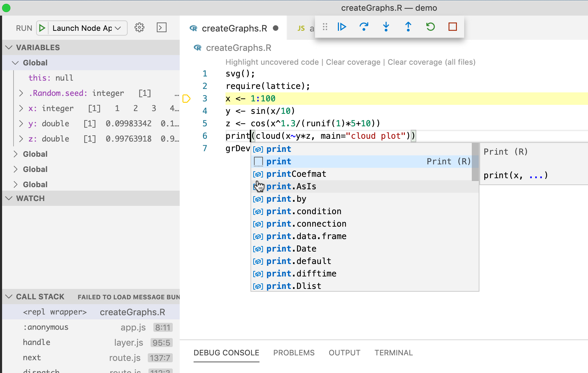

# Language Server Protocol

GraalVM supports [Language Server Protocol](https://microsoft.github.io/language-server-protocol/) (LSP) for guest languages.
It provides features like code-completion, find usages and alike for the client tools -- IDEs like Visual Studio Code.

To start the GraalVM Language Server, pass the `--lsp` option to the command line launcher as in the following example with a Node.js application.

Note: The GraalVM Language Server is offered as a technology preview and requires the user to pass the `--experimental-options` option for its activation.

```shell
$JAVA_HOME/bin/node --experimental-options --lsp app.js
[Graal LSP] Starting server and listening on localhost/127.0.0.1:8123
Example app listening on port 3000!
```

_GraalVM Enterprise-provided code completion for R script, part of the Node.js Polyglot application_

The GraalVM Language Server itself does not provide the static data usually gathered by parsing the application sources (as these data are sometimes fuzzy in the cases of dynamic languages).
Instead, the Language Server was designed to provide the accurate dynamic data gathered from the application runtime.

However, the Language Server could delegate to the existing language servers written specially for the particular languages (using the `--lsp.Delegates` launcher option) and merge the static data returned from these servers with its own dynamic data to a single result.

For more information about the GraalVM Language Server and its usage in GraalVM Visual Studio Code Extension, see [Visual Studio Code Marketplace documentation](https://marketplace.visualstudio.com/items?itemName=oracle-labs-graalvm.graalvm).
