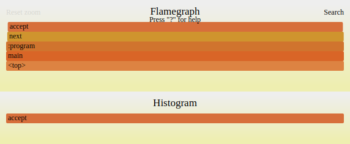

# Profiling Command Line Tools

GraalVM **profiling command line tools** help you optimize your code through analysis of CPU and memory usage.

Most applications spend 80% of their runtime in 20% of the code.
For this reason, to optimize the code, it is essential to know where the application spends its time.
In this section, we use an example application to demonstrate the three main profiling capabilities that GraalVM offers: CPU Tracer, CPU Sampler, and Memory Tracer.

This example application uses a basic prime number calculator based on the [Sieve of Eratosthenes](https://en.wikipedia.org/wiki/Sieve_of_Eratosthenes)
algorithm.

1. Copy the following code into a new file named `primes.js`:

    ```javascript
    class AcceptFilter {
        accept(n) {
            return true
        }
    }

    class DivisibleByFilter {
        constructor(number, next) {
            this.number = number;
            this.next = next;
        }

        accept(n) {
            var filter = this;
            while (filter != null) {
                if (n % filter.number === 0) {
                    return false;
                }
                filter = filter.next;
            }
            return true;
        }
    }

    class Primes {
        constructor() {
            this.number = 2;
            this.filter = new AcceptFilter();
        }

        next() {
            while (!this.filter.accept(this.number)) {
                this.number++;
            }
            this.filter = new DivisibleByFilter(this.number, this.filter);
            return this.number;
        }
    }

    var primes = new Primes();
    var primesArray = [];
    for (let i = 0; i < 5000; i++) {
        primesArray.push(primes.next());
    }
    console.log(`Computed ${primesArray.length} prime numbers. ` +
                `The last 5 are ${primesArray.slice(-5)}.`);
    ```

2. Run `js primes.js`. The example application should print output as follows:
    ```shell
    js primes.js
    Computed 5000 prime numbers. The last 5 are 48563,48571,48589,48593,48611.
    ```

    This program takes a moment to compute. Next you will check where the time is spent.

3. Run `js --cpusampler primes.js` to enable CPU sampling. CPU Sampler should print output for the example application as follows:
    ```shell
    js --cpusampler primes.js

    Computed 5000 prime numbers. The last 5 are 48563,48571,48589,48593,48611.
    ----------------------------------------------------------------------------------------------
    Sampling Histogram. Recorded 250 samples with period 10ms.
      Self Time: Time spent on the top of the stack.
      Total Time: Time spent somewhere on the stack.
    ----------------------------------------------------------------------------------------------
    Thread[main,5,main]
     Name       ||             Total Time    ||              Self Time    || Location
    ----------------------------------------------------------------------------------------------
     accept     ||             2150ms  86.0% ||             2150ms  86.0% || primes.js~13-22:191-419
     next       ||             2470ms  98.8% ||              320ms  12.8% || primes.js~31-37:537-737
     :program   ||             2500ms 100.0% ||               30ms   1.2% || primes.js~1-46:0-982
    ----------------------------------------------------------------------------------------------
    ```

    By default the sampler prints an execution time histogram for each JavaScript function.

    You can produce a flame graph in SVG format by requesting that with the `--cpusampler=flamegraph` option:
    ```shell
    js --cpusampler=flamegraph primes.js
    ```
    It should produce a file called `flamegraph.svg` containing something like this:

    

    You can zoom into the graph by clicking on elements.

    By default, CPU sampling takes a sample every 10 milliseconds.
    From the result, we can see that roughly 89% of the time is spent in the `DivisibleByFilter.accept` function.

    ```javascript
    accept(n) {
        var filter = this;
        while (filter != null) {
            if (n % filter.number === 0) {
                return false;
            }
            filter = filter.next;
        }
        return true;
    }
    ```
    See this [blog post](https://medium.com/graalvm/where-has-all-my-run-time-gone-245f0ccde853) for more details.

    Now use the CPU Tracer to collect execution counts of each statement:

4. Run `js primes.js --cputracer --cputracer.TraceStatements --cputracer.FilterRootName=*accept` to collect execution counts for all statements in methods ending with `accept`:
    ```shell
    js primes.js --cputracer --cputracer.TraceStatements --cputracer.FilterRootName=accept
    Computed 5000 prime numbers. The last 5 are 48563,48571,48589,48593,48611.
    -----------------------------------------------------------------------------------------
    Tracing Histogram. Counted a total of 468336895 element executions.
      Total Count: Number of times the element was executed and percentage of total executions.
      Interpreted Count: Number of times the element was interpreted and percentage of total executions of this element.
      Compiled Count: Number of times the compiled element was executed and percentage of total executions of this element.
    -----------------------------------------------------------------------------------------
     Name     |          Total Count |    Interpreted Count |       Compiled Count | Location
    -----------------------------------------------------------------------------------------
     accept   |     234117338  50.0% |        365660   0.2% |     233751678  99.8% | primes.js~15:245-258
     accept   |     117053670  25.0% |        182582   0.2% |     116871088  99.8% | primes.js~16-18:275-348
     accept   |     117005061  25.0% |        181001   0.2% |     116824060  99.8% | primes.js~19:362-381
     accept   |         53608   0.0% |          1829   3.4% |         51779  96.6% | primes.js~14:211-227
     accept   |         53608   0.0% |          1829   3.4% |         51779  96.6% | primes.js~13-22:191-419
     accept   |         48609   0.0% |          1581   3.3% |         47028  96.7% | primes.js~17:322-334
     accept   |          4999   0.0% |           248   5.0% |          4751  95.0% | primes.js~21:402-413
     accept   |             1   0.0% |             1 100.0% |             0   0.0% | primes.js~2-4:25-61
     accept   |             1   0.0% |             1 100.0% |             0   0.0% | primes.js~3:45-55
    -----------------------------------------------------------------------------------------
    ```

    The output shows execution counters for each statement, instead of timing information.
    Tracing histograms often provides insights into the behavior of the algorithm that needs optimization.

5. Run `js primes.js --experimental-options --memtracer` to display source code locations and counts of reported allocations. Note that the Memory Tracer tool for capturing allocations is currently an experimental feature in GraalVM. As such, `--memtracer` must be preceded by the `--experimental-options` command line option.
    ```shell
    js primes.js --experimental-options --memtracer
    Computed 5000 prime numbers. The last 5 are 48563,48571,48589,48593,48611.
    ------------------------------------------------------------
    Location Histogram with Allocation Counts. Recorded a total of 5007 allocations.
      Total Count: Number of allocations during the execution of this element.
      Self Count: Number of allocations in this element alone (excluding sub calls).
   --------------------------------------------------------
    Name     |      Self Count |     Total Count | Location
   --------------------------------------------------------
    next     |     5000  99.9% |     5000  99.9% | primes.js~31-37:537-737
    :program |        6   0.1% |     5007 100.0% | primes.js~1-46:0-982
    Primes   |        1   0.0% |        1   0.0% | primes.js~25-38:424-739
   --------------------------------------------------------
    ```

    This output shows the number of allocations which were recorded per function. For each prime number that was computed, the program allocates one object in `next` and one in `constructor` of `DivisibleByFilter`.
    Allocations are recorded independently of whether they could get eliminated by the compiler.

    The GraalVM compiler is particularly powerful in optimizing allocations and can push allocations into infrequent branches to increase execution performance.
    The GraalVM team plans to add information about memory optimizations to the memory tracer in the future.

## Tools Options
Use the `--help:tools` option in all guest language launchers to display reference information for CPU Sampler, CPU Tracer, and Memory Tracer.
The current set of available options is as follows.

### CPU Sampler Options

<!-- BEGIN: cpu-sampler-options -->
- `--cpusampler=true|false|<Output>` : Enable/Disable the CPU sampler, or enable with specific Output - as specified by the Output option (default: false). Choosing an output with this options defaults to printing the output to std out, except for the flamegraph which is printed to a flamegraph.svg file.
- `--cpusampler.Delay=<ms>` : Delay the sampling for this many milliseconds (default: 0).
- `--cpusampler.FilterFile=<filter>` : Wildcard filter for source file paths. (eg. *program*.sl) (default: no filter).
- `--cpusampler.FilterLanguage=<languageId>` : Only profile the language with given ID. (eg. js) (default: profile all).
- `--cpusampler.FilterMimeType=<mime-type>` : Only profile the language with given mime-type. (eg. application/javascript) (default: profile all)
- `--cpusampler.FilterRootName=<filter>` : Wildcard filter for program roots. (eg. Math.*) (default: no filter).
- `--cpusampler.GatherHitTimes` : Save a timestamp for each taken sample.
- `--cpusampler.MinSamples=[0, inf)` : Remove elements from output if they have less samples than this value (default: 0)
- `--cpusampler.Output=histogram|calltree|json|flamegraph` : Specify the output format to one of: histogram, calltree, json or flamegraph (default: histogram).
- `--cpusampler.OutputFile=<path>` : Save output to the given file. Output is printed to output stream by default.
- `--cpusampler.Period=<ms>` : Period in milliseconds to sample the stack (default: 10)
- `--cpusampler.SampleContextInitialization` : Enables sampling of code executed during context initialization
- `--cpusampler.ShowTiers=true|false|0,1,2` : Specify whether to show compilation information for entries. You can specify 'true' to show all compilation information, 'false' for none, or a comma separated list of compilation tiers. Note: Interpreter is considered Tier 0. (default: false)
- `--cpusampler.StackLimit=[1, inf)` : Maximum number of maximum stack elements (default: 10000).
- `--cpusampler.SummariseThreads` : Print output as a summary of all 'per thread' profiles.
<!-- END: cpu-sampler-options -->

### CPU Tracer Options


<!-- BEGIN: cpu-tracer-options -->
- `--cputracer` : Enable the CPU tracer (default: false).
- `--cputracer.FilterFile=<filter>` : Wildcard filter for source file paths. (eg. *program*.sl) (default: no filter).
- `--cputracer.FilterLanguage=<languageId>` : Only profile languages with given ID. (eg. js) (default: no filter).
- `--cputracer.FilterMimeType=<mime-type>` : Only profile languages with mime-type. (eg. application/javascript) (default: no filter).
- `--cputracer.FilterRootName=<filter>` : Wildcard filter for program roots. (eg. Math.*) (default: no filter).
- `--cputracer.Output=histogram|json` : Print a 'histogram' or 'json' as output (default: histogram).
- `--cputracer.OutputFile=<path>` : Save output to the given file. Output is printed to standard output stream by default.
- `--cputracer.TraceCalls` : Capture calls when tracing (default: false).
- `--cputracer.TraceRoots=true|false` : Capture roots when tracing (default: true).
- `--cputracer.TraceStatements` : Capture statements when tracing (default: false).
<!-- END: cpu-tracer-options -->

### Memory Tracer Options

The memory tracer tool is currently an experimental tool. Make sure to prepend the `--experimental-options` flag to enable `--memtracer`.

<!-- BEGIN: mem-tracer-options -->
- `--memtracer` : Enable the Memory Tracer (default: false).
- `--memtracer.FilterFile=<filter>` : Wildcard filter for source file paths. (eg. *program*.sl) (default: no filter).
- `--memtracer.FilterLanguage=<languageId>` : Only profile languages with given ID. (eg. js) (default: no filter).
- `--memtracer.FilterMimeType=<mime-type>` : Only profile languages with mime-type. (eg. application/javascript). (default: no filter)
- `--memtracer.FilterRootName=<filter>` : Wildcard filter for program roots. (eg. Math.*) (default: no filter).
- `--memtracer.Output=typehistogram|histogram|calltree` : Print a 'typehistogram', 'histogram' or 'calltree' as output. (default: histogram)
- `--memtracer.StackLimit=[1, inf)` : Maximum number of maximum stack elements. (default: 10000)
- `--memtracer.TraceCalls` : Capture calls when tracing. (default: false)
- `--memtracer.TraceRoots=true|false` : Capture roots when tracing. (default: true)
- `--memtracer.TraceStatements` : Capture statements when tracing (default: false).
<!-- END: mem-tracer-options -->
