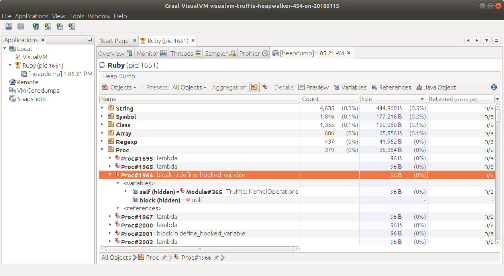
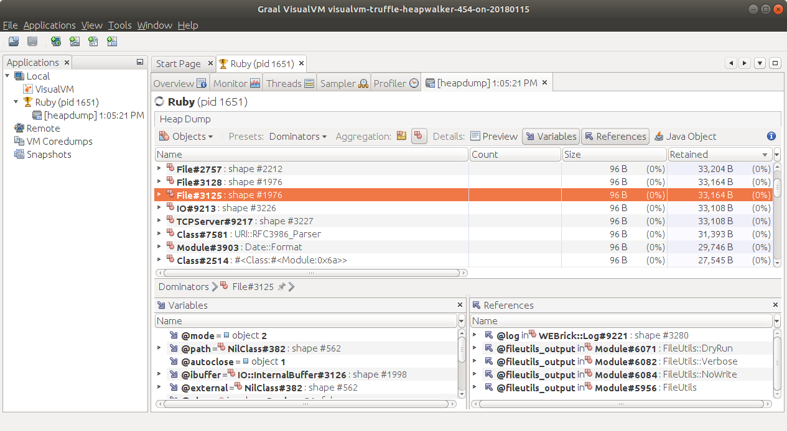
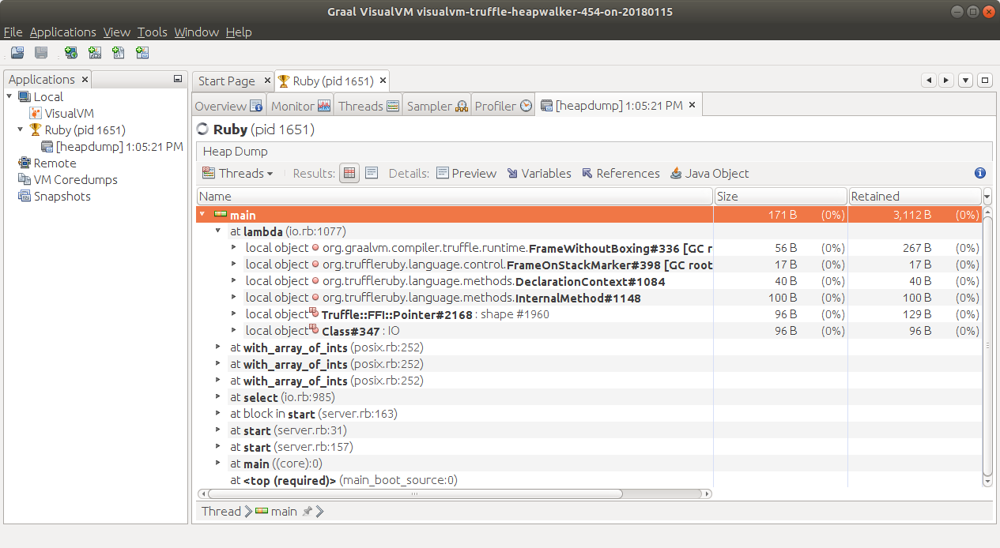
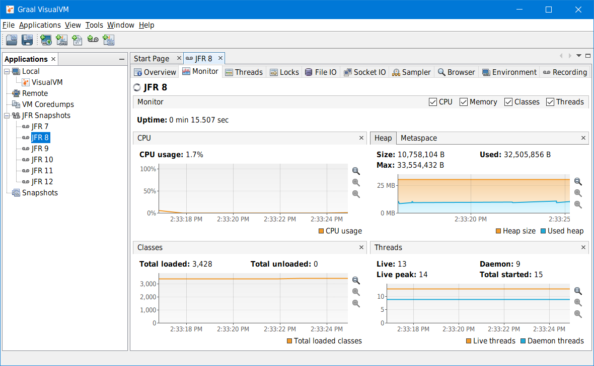

# VisualVM

GraalVM comes with the [VisualVM](https://visualvm.github.io) tool which includes heap analysis
features for the supported guest languages. These languages and features are
currently available:

 - __Java:__ Heap Summary, Objects View, Threads View, OQL Console
 - __JavaScript:__ Heap Summary, Objects View, Thread View
 - __Python:__ Heap Summary, Objects View
 - __Ruby:__ Heap Summary, Objects View, Threads View
 - __R:__ Heap Summary, Objects View

### Starting VisualVM
To start VisualVM, execute `jvisualvm`. Immediately after startup, the tool shows all locally running Java processes in the Applications area, including the VisualVM process, itself.

### Capture a Heap Dump
To capture a heap dump of, for example, a Ruby application for later analysis, start your application and let it run for a few seconds to warm up.
Then right-click its process in VisualVM and invoke the Heap Dump action.
A new heap viewer for the Ruby process opens.

__Note:__ [Native Image](../reference-manual/native-image/README.md) does not implement the JVMTI agent, so triggering heap dump creation from the Applications area is impossible.
Apply the `-H:+AllowVMInspection` flag with the `native-image` tool for native image processes.
This way your application will handle signals and capture a heap dump when it receives the SIGUSR1 signal.
The guest language REPL process must be started also with the `--jvm` flag to monitor it using VisualVM.
This functionality is available with [GraalVM Enterprise Edition](https://www.oracle.com/downloads/graalvm-downloads.html).
It is not available in GraalVM Community Edition.
See the [Generating Native Heap Dumps](../reference-manual/native-image/NativeImageHeapdumpEnterprise.md) page for details on capturing heap dumps from a native image process.

### Analyzing Objects
Initially the Summary view for the Java heap is displayed.
To analyze the Ruby heap, click the leftmost (Summary) dropdown in the Heap Viewer toolbar, choose the Ruby Heap scope and select the Objects view.
Now the heap viewer displays all Ruby heap objects, aggregated by their type.

Expand the Proc node in the Results view to see a list of objects of this type.
Each object displays its logical value as provided by the underlying implementation.
Expand the objects to access their variables and references, where available.

Now enable the Preview, Variables, and References details by clicking the buttons in the toolbar, and select the individual _ProcType_ objects.
Where available, the Preview view shows the corresponding source fragment, the Variables view shows variables of the object, and the References view shows objects referring to the selected object.

Last, use the Presets dropdown in the Heap Viewer toolbar to switch the view from All Objects to Dominators or GC Roots.
To display the heap dominators, retained sizes must be computed first, which can take a few minutes for the _server.rb_ example.
Select the Objects aggregation in the toolbar to view the individual dominators or GC roots.

### Analyzing Threads
Click the leftmost dropdown in the Heap Viewer toolbar and select the Threads view for the Ruby heap.
The heap viewer now displays the Ruby thread stack trace, including local objects. The stack trace can alternatively be displayed textually by clicking the HTML toolbar button.

### Reading JFR Snapshots
The VisualVM tool bundled with GraalVM 19.2.x and later has the ability to read JFR snapshots -- snapshots taken with JDK Flight Recorder (previously Java Flight Recorder).
JFR is a tool for collecting diagnostic and profiling data about a running Java application.
It is integrated into the Java Virtual Machine (JVM) and causes almost no performance overhead, so it can be used even in heavily loaded production environments.

To install the JFR support, released as a plugin:
1. Run `<GRAALVM_HOME>/bin/jvisualvm` to start VisualVM;
2. Navigate to Tools > Plugins > Available Plugins to list all available plugins, then install the _VisualVM-JFR_ and
_VisualVM-JFR-Generic_ modules.

The JFR snapshots can be opened using either the File > Load action, or by double-clicking the JFR Snapshots node and adding the snapshot into the JFR
repository, permanently.
Please follow the documentation for your Java version to create JFR snapshots.

The JFR viewer reads all JFR snapshots created from Java 7 onward, and presents the data in typical VisualVM views familiar to the tool users.

These views and functionality tabs are currently available:

* Overview tab - displays the basic information about the recorded process like
its main class, arguments, JVM version and configuration, and system properties.
This tab also provides access to the recorded thread dumps.
* Monitor tab - shows the process uptime and basic telemetry: CPU usage, Heap
and Metaspace utilization, number of loaded classes, and number of live & started
threads.
* Threads tab - reconstructs the threads timeline based on all events recorded in
the snapshot as precisely as possible, based on the recording configuration.
* Locks tab - allows the user to analyze threads synchronization.
* File IO tab - presents information on read and write events to the filesystem.
* Socket IO tab - presents information on read and write events to the network.
* Sampler tab - shows per-thread CPU utilization and memory allocations, and a
heap histogram. There is also an experimental feature, "CPU sampler," for building a CPU
snapshot from the recorded events. It does not provide an exact performance
analysis but still helps to understand what was going on in the recorded
application, and where the CPU bottleneck might be.
* Browser tab - provides a generic browser of all events recorded in the snapshot.
* Environment tab - gives an overview of the recording machine setup and conditions
like CPU model, memory size, operating system version, CPU utilization, memory
usage, etc.
* Recording tab - lists the recording settings and basic snapshot telemetry like
number of events, total recording time, etc.

Note: The support of JDK Flight Recorder is currently experimental. Some advanced features like analyzing JVM internals, showing event stack traces, or support for creating JFR snapshots from live processes are not available in this preview version and will be addressed incrementally in the following releases.
