# GraalVM Tools for Java

* [Extension Installation](#extension-installation)
* [GraalVM Installation Wizard](#graalvm-installation-wizard)
* [Set Default Java Runtime](#set-default-java-runtime)
* [Java Development and Debugging](#java-development-and-debugging)
* [Integration with VisualVM](#integration-with-visualvm)
* [Native Image Support](#native-image-support)
* [Extension Settings](#extension-settings)

[GraalVM Tools for Java](https://marketplace.visualstudio.com/items?itemName=oracle-labs-graalvm.graalvm) extension provides capabilities to manage GraalVM installations and its components in VS Code and locally. 
The extension ships a GraalVM installation and configuration wizard. 
You can conveniently set up the default Java runtime to GraalVM JDK which comes with both just-in-time ([Graal](../../../reference-manual/java/compiler.md)) and ahead-of-time ([Native Image](../../../reference-manual/native-image/README.md)) compilers, making VS Code a comfortable and convenient integrated environment.

The GraalVM Tools for Java in combination with the [GraalVM Tools for Micronaut](https://marketplace.visualstudio.com/items?itemName=oracle-labs-graalvm.micronaut) brings native support for the Micronaut framework in VS Code and opens many more possibilities for Java developers.

> Note: The extension is a Technology Preview, and the development team is actively working on further improvements to provide better usability for developers.

## Extension Installation

To install the GraalVM Tools for Java extension in VS Code, do the following:

1. Navigate to Extensions in the Activity Bar.
2. Search for "GraalVM" in the search field.
3. Once found, click **Install**. That action will install the GraalVM Tools for Java extension from the [VS Code Marketplace](https://marketplace.visualstudio.com/items?itemName=oracle-labs-graalvm.graalvm).
4. Reload when required.

The extension depends on the [Apache NetBeans Language Server](https://marketplace.visualstudio.com/items?itemName=ASF.apache-netbeans-java). (VS Code installs it for you.)
When the extension (and its dependent) is installed, VS Code will display the **Gr** icon in the Activity Bar on the left.

## GraalVM Installation Wizard

You can easily install [GraalVM](https://www.graalvm.org/) in VS Code by using the built-in installation wizard.

To start, click the **Gr** icon in the Activity Bar. You can either add an existing GraalVM installation (if you already have GraalVM), or download it immediately from within VS Code. 
A dialogue window suggests these options:
  * **Download & Install GraalVM**
  * **Add Existing GraalVM**

    

The **Download & Install GraalVM** action is recommended as it eliminates the fuss around setting up environment variables for you.

Each registered GraalVM installation displays its location and all its available components.
Components are either installed or available for download - the context actions to install (the plus icon) or remove (the bucket icon) are displayed when hovering over component's name.
All registered GraalVM installations will be listed in the configuration file under **File** > **Preferences** > **Settings** (**Code** > **Preferences** > **Settings** on macOS).

This installation model permits multiple GraalVMs at the same time and enables a quick removal of unnecessary GraalVM installations from VS Code global storage or even from your local disk.
### Add Existing GraalVM

Use the **Add Existing GraalVM** action to select an existing GraalVM installation.
You are prompted to set the GraalVM installation as default, and to install additional components, if not already installed.
**Add Existing GraalVM** can also be invoked by using an icon on the side of the **GRAALVM: INSTALLATIONS** panel.

### Download and Install GraalVM Community

Follow these steps to download and install GraalVM Community Edition:

1. Pick the GraalVM distribution: **Community (free for all purposes)**.
2. Pick the GraalVM version: one of the latest major stable releases, or the latest development snapshot.
3. Pick one of the available Java versions.
4. Select the destination folder.

The installation will start immediately.
The wizard will download the package from [Github](https://github.com/graalvm/graalvm-ce-builds/releases) in the background and display progress.

Once the installation completes, the **Install Optional GraalVM Components** window will pop up prompting you to install additional language runtimes and utilities (Native Image, JavaScript, Node.js, LLVM, Python, Ruby, etc.) to the core package:


Once you confirm, you are taken to the selection list:

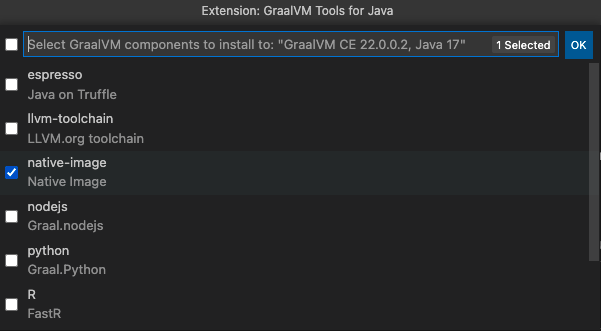

### Download and Install GraalVM Enterprise

Installing GraalVM Enterprise requires a user to provide a valid email address and accept the [Oracle Technology Network License Agreement GraalVM Enterprise Edition Including License for Early Adopter Versions](https://www.oracle.com/downloads/licenses/graalvm-otn-license.html).

Follow these steps to download and install GraalVM Enterprise:

1. Pick the GraalVM distribution: **Enterprise (free for evaluation and development)**.
2. Pick the GraalVM version: one of the latest major stable releases.
3. Pick one of the available Java versions.
4. Select the destination folder.
5. Provide a valid email address where the license will be sent or enter the existing download token.  
   Supposedly, this is your first installation and you have not accepted the license yet.
   Press `Enter`. Once the email address is entered, you see this popup in the bottom right corner:

    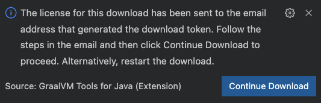

    You are sent an email to verify your email address and accept the license.

6. Go to your email client and review the [Oracle Technology Network License Agreement GraalVM Enterprise Edition Including License for Early Adopter Versions](https://www.oracle.com/downloads/licenses/graalvm-otn-license.html).

7. Accept the license. You confirm the license acceptance and generating a download token simultaneously.

8. Return to VS Code and press **Continue Download** to continue. Your download token is then generated and saved by default in the `.gu/config` file in user's home directory (you can update the storage location later, see below).

    

    The download and installation of GraalVM Enterprise will start. You will see the installation notification: 

    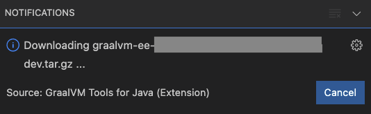

    The installation wizard will download a package from Oracle's storage point.

    If you clicked **Continue Download** without accepting the license, you would see the following warning:

    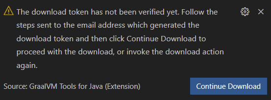

    > Note: If your machine is behind a proxy, you must set your environment variables (`http_proxy`, `https_proxy`) appropriately. You can use the quick command  **Setup Proxy**.

Once the installation completes, the **Install Optional GraalVM Components** window will pop up prompting you to install additional language runtimes and utilities (Native Image, JavaScript, Node.js, LLVM, Python, Ruby, etc.) to the core package. Once you confirm, you are taken to the selection list. 
Since you already have a download token and accepted the license, components will be installed without any additional interaction.

#### Show Current Download Configuration

There is a quick action to determine the location of an existing download token (default location, system property, user-defined file), and to copy it into the clipboard. 
Once copied you can re-use the download token, for example, (1) to install GraalVM Enterprise or its component on another computer; (2) to integrate into CI/CD build pipelines, etc.

1. Go to **View**, then **Command Palette** and search for **GraalVM: Show GU Configuration**:

    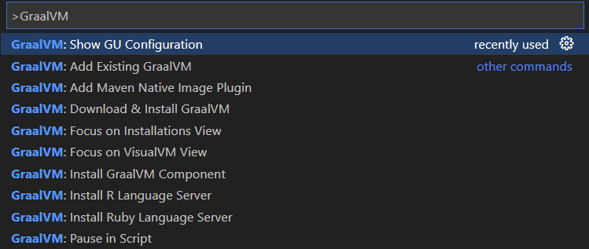

2. Click **GraalVM: Show GU Configuration**. You will see the popup window with a similar content:

    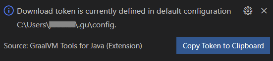

3. Copy the download token.

#### Define a Custom File

If you would like to define a custom file containing a download token, you can do that in VS Code. 

1. Go to VS Code **Preferences**, then **Settings**. 
2. Open the GraalVM for Java extension settings and find the **GU** field.
3. Provide a custom file containing the download token:

   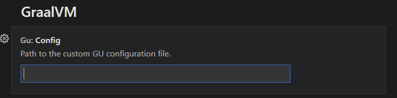

## Set Default Java Runtime

When the installation is complete, the **Set Default Java** action is invoked.

1. To set a newly added GraalVM active, click the home icon by the side of the installation name.

2. Select both **Set as JAVA for Terminal** options (`JAVA_HOME` and `PATH`) in the **Configure active GraalVM** window:

    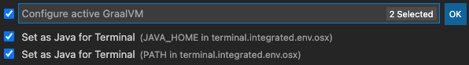

Alternatively, you can invoke the same action from **View**, then **Command Palette** (use the `Ctrl+Shift+P` hot keys combination for Linux, and `Command+Shift+P` for macOS to open the commands palette), and search for "GraalVM".
You will see **GraalVM: Set Active GraalVM Installation** among other actions.

## Java Development and Debugging

The [Apache NetBeans Language Server](https://marketplace.visualstudio.com/items?itemName=ASF.apache-netbeans-java), installed on par with the extension, enables the Java language support. 

There are several Java launch configurations available by default. In addition to regular features enabled, GraalVM Tools for Java provides support for ahead-of-time compilation with GraalVM Native Image, Java-like debugging of a native executables, integration with VisualVM, and, lastly, polyglot programming (check [here](polyglot-runtime.md)).

You can use the [Extension Pack for Java from Microsoft](https://marketplace.visualstudio.com/items?itemName=vscjava.vscode-java-pack) if you prefer it instead of the default Apache NetBeans Language Server (see [Java in VS Code](https://code.visualstudio.com/docs/languages/java) to get started).
If VS Code detects the Extension Pack for Java from Microsoft installed, it deactivates the Apache NetBeans Language Server.

## Integration with VisualVM

The GraalVM Tools for Java extension provides integration with [VisualVM](https://visualvm.github.io), the all-in-one Java (and polyglot) monitoring and troubleshooting tool.
VisualVM brings powerful yet easy-to-use visual Java tooling to VS Code.

When you run a Java application, the process ID will be detected automatically and displayed in the **VISUALVM** pane. 
Open VisualVM by just clicking the play button:

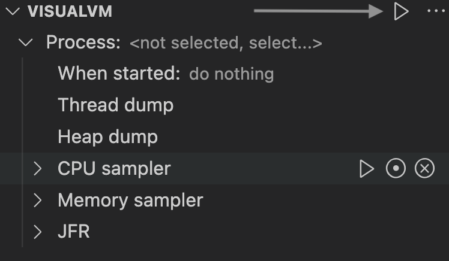

For more information, see the [dedicated guide](visualvm-integration.md) how to start using VisualVM from within VS Code.

## Native Image Support

Thanks to [GraalVM Tools for Java](https://marketplace.visualstudio.com/items?itemName=oracle-labs-graalvm.graalvm) extension, you can conveniently configure, build, and debug native executables produced with [GraalVM Native Image](../../../reference-manual/native-image/README.md) directly in VS Code.   

> Note: Support for GraalVM Native Image becomes available when you add Native Image component to your GraalVM installation.

### Configuration

GraalVM Tools for Java extension provides the **NATIVE IMAGE** with **Agent** pane to automate the process of tracking and registering dynamic feature calls, making it easier to configure and build a native executable in VS Code. The [tracing agent](../../../reference-manual/native-image/AutomaticMetadataCollection.md) tracks dynamic feature calls whilst your application is running on a JVM, and records those calls into JSON configuration files.

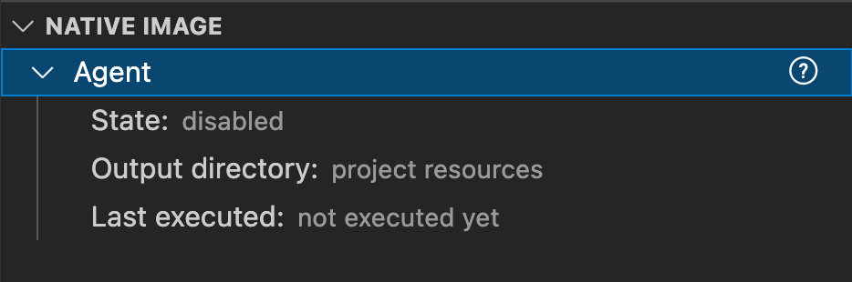

> Note: The **NATIVE IMAGE** pane will show up when you open your Java project in VS Code. 

> Note: The support for the Native Image agent is experimental.

In the next section you will learn how to build a native executable of a Java application and apply the Tracing agent in VS code.

### Building

To build a native executable of your Java application in VS Code, do the following:

1. Create the _launch.json_ file. If not already created, create a new file from the **Run and Debug** activity panel using the _create a launch.json file_ link. Select the **Java 8+ environment** when asked. Save the _launch.json_ file after editing it.
2. Enable the Tracing agent. Click **Gr** in the left sidebar and expand the **NATIVE IMAGE** pane. Expand **Agent** and click the edit button to configure its state.

    Select **enabled** so the Native Image agent will start with the Java process:

    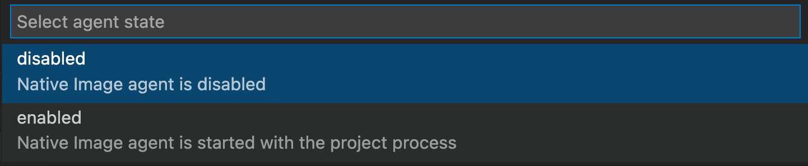

    > Note: The state is not remembered: if you close the VS Code window, it will change back to **disabled**.

3. Run your Java application on the GraalVM runtime. Open **Run and Debug** activity panel (click the bug icon in the left sidebar), choose the **Launch Java 8+ App** configuration and click **Run Without Debugging** to start the current project. 
    > Note: Do not click the **Start Debugging** action to start a project. The Tracing agent is not compatible with the debugger agent and running such a configuration will fail.
4. Specify the output folder for configuration files to be generated. During the execution, the agent interfaces with a JVM to intercept all calls that look up classes, methods, fields, resources, or request proxy accesses. The agent generates configuration files containing all intercepted dynamic accesses and and stores them in the output folder you specify. When you start the project, VS Code asks you to select the desired location. The following choices are available:
    

    * `META-INF/native-image` - the default location in project sources to store the configuration files
    * `/tmp` - the configuration files will be stored to the `/tmp/native-image` folder
    * Custom folder - the configuration files will be stored in the custom folder you specify
5. Generate load to the running process to invoke more code and generate the best configuration.
6. Once all possible execution paths have been executed, terminate the process. At this point the Tracing agent dumps the collected configuration to the selected output folder.
7. Go to **Terminal**, and click **New Terminal**. To build a native executable from a Java class file in the current working folder, use the following command:

    ```shell
    native-image [options] class [imagename]
    ```

If you project is Maven or Gradle based, there are dedicated Maven or Gradle plugins to add support for building and testing native executables written in Java. 
For more documentation, go to:

* [Gradle plugin](https://graalvm.github.io/native-build-tools/latest/gradle-plugin.html)
* [Maven plugin](https://graalvm.github.io/native-build-tools/latest/maven-plugin.html)

If you use the Micronaut framework to create your Java project, you can build a native executable of a Micronaut application using VS Code quick actions. Go [here](../micronaut/README.md#generate-native-images-of-micronaut-projects) to learn how.

### Building Native Images on Windows

To use Native Image on Windows, you need Visual Studio Build Tools with Windows SDK installed. 
The `native-image` builder will only work when it is executed from the **x64 Native Tools Command Prompt**. Check [this link](https://medium.com/graalvm/using-graalvm-and-native-image-on-windows-10-9954dc071311) for more details.

For Windows users, the extension provides a pre-configured x64 command prompt using Microsoft Developer Tools. Assuming you already have Visual Studio Build Tools with Windows SDK, GraalVM with Native Image installed, and opened your Java project in VS Code.

1. In the **NATIVE IMAGE** pane, click on right arrow, **>**:

    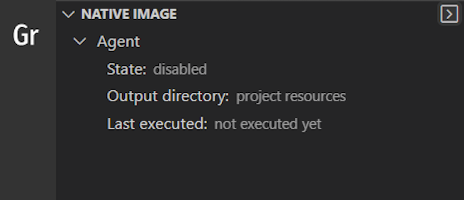
    
    It will open a dialog window asking you to select an existing Windows SDK build tools configuration script (`vcvars64.bat`) from the default installation location, or to select a custom configuration script. VS Code will detect the script and pre-populate the path:

    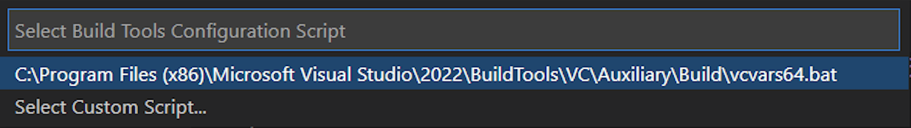

2. Click enter. A new Terminal window will open running inside the x64 native tools command prompt.

    Note that the path to Windows SDK build tools is saved globally, so next time you open a New Terminal 
    from the **NATIVE IMAGE** pane, it will run inside the x64 native tools command prompt.

3. Run the `native-image` builder, for example, check the version:

    ```shell
    native-image --version
    ```

Learn more about GraalVM Native Image [here](../../../reference-manual/native-image/README.md).

### Debugging

The GraalVM Tools for Java provide Java-like debugging of a native executable in a running state directly from within VS Code.
You can set breakpoints, inspect the state of your application, even attach the debugger to a native image process in VS Code and step over the Java application source code.


> Note: To debug a native executable from within VS Code, you must install GraalVM Enterprise.

Learn more and find a demo application in the [Native Image Debugging guide](native-image-debugging.md).

## Extension Settings

The GraalVM Tools for Java extension contributes the following settings in VS Code:

* __graalvm.home__ - the path to the GraalVM installation
* __graalvm.installations__ - all registered GraalVM installations
* __graalvm.systemDetect__ - detect GraalVM's installation from the system environment variables
* __graalvm.languageServer.currentWorkDir__ - an absolute path to the working folder of GraalVM's Language Server Protocol
* __graalvm.languageServer.start__ - start GraalVM's Language Server Protocol within processes being run or debugged
* __graalvm.languageServer.delegateServers__ - a comma-separated list of `language@[host:]port` where other language servers run
* __graalvm.languageServer.startRLanguageServer__ - start the R Language Server
* __graalvm.languageServer.startRubyLanguageServer__ - start the Ruby Language Server

### Provide Feedback or Seek Help

* [Request a feature](https://github.com/graalvm/vscode-extensions/issues/new?labels=enhancement)
* [File a bug](https://github.com/graalvm/vscode-extensions/issues/new?labels=bug)

### Privacy Policy

Read the [Oracle Privacy Policy](https://www.oracle.com/legal/privacy/privacy-policy.html) to learn more.