# GraalVM Tools for Java Extension

[GraalVM Tools for Java](https://marketplace.visualstudio.com/items?itemName=oracle-labs-graalvm.graalvm) extension provides a full-fledged support for the Java language and, additionally, enables a polyglot environment in VS Code, making it a comfortable and convenient integrated development environment to work with.
Users can edit and debug applications written in the GraalVM supported languages (Java, JS, Ruby, R, and Python) without the need to install any other additional extensions.
The extension is Technology Preview.

### Table of contents
- [Features](#features)
- [Installation and Setup](#installation-and-setup)
- [Java Development and Debugging](#java-development-and-debugging)
- [Native Image Agent](#native-image-agent)
- [Native Image Debugging](#native-image-debugging)
- [Integration with VisualVM](#integration-with-visualvm)
- [JavaScript and Node.js Debugging](#javascript-and-nodejs-debugging)
- [Python Debugging](#python-debugging)
- [R Debugging](#r-debugging)
- [Ruby Debugging](#ruby-debugging)
- [Polyglot Applications Debugging](#polyglot-applications-debugging)
- [Debug Adapter Protocol](#debug-adapter-protocol)
- [Language Server Protocol Integration](#language-server-protocol-integration)
- [R Language Server](#r-language-server)
- [Ruby Language Server](#ruby-language-server)
- [Additional Editor Features](#additional-editor-features)
- [Extension Settings](#extension-settings)
- [Recommendations](#recommendations)
- [Feedback](#feedback)
- [Privacy Policy](#privacy-policy)

## Features

The installation wizard for the GraalVM Tools for Java extension simplifies setting up the development environment.
You can now download and install any available GraalVM distribution right from the user interface, or, alternatively, you can select an existing GraalVM installation from your local disk.

GraalVM for Java brings support for Java projects development and debugging in VS Code.
This extension for VS Code also provides editing and debugging capabilities for JavaScript and Node.js, Python, R, and Ruby applications running on GraalVM by default.

The GraalVM Tools for Java extension is a prerequisite for the [Micronaut support in VS Code](https://marketplace.visualstudio.com/items?itemName=oracle-labs-graalvm.micronaut), which brings many more possibilities for Java developers.

The development team is actively working on further improvements and are focused on the GraalVM Extension providing high usability to developers.

## Installation and Setup

To install the GraalVM Tools for Java extension in VS Code, navigate to Extensions in the left-hand side Activity Bar (or use the _Ctrl+Shift+X_ hot keys combination).
Search for "GraalVM" in the search field.
Once found, press Install.
That action will install the GraalVM Tools for Java extension from the [VS Code Marketplace](https://marketplace.visualstudio.com/items?itemName=oracle-labs-graalvm.graalvm).
Reload will be required.

Once installed, notice the "Gr" icon in the Activity Bar on the left.
When clicking on the icon, a dialogue with the following choices displays:
* Download & Install GraalVM
* Add Existing GraalVM

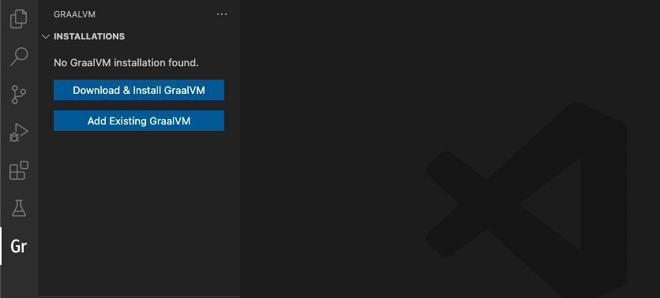

### Download & Install GraalVM

The Download & Install GraalVM action prompts you to:
* Pick the GraalVM distribution: Community (free for all purposes) or Enterprise (free for evaluation and development)
* Pick the GraalVM version: Current (21.x), Annual (20.x), Latest Snapshot (Nightly Build)
* Pick a Java version: 8, 11, or 16
* Select the destination folder

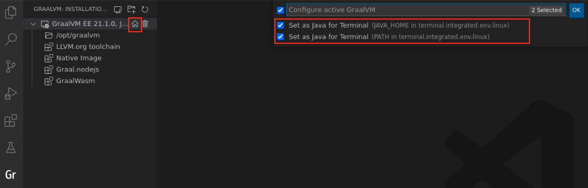

If you prefer GraalVM Community Edition, the installation wizard will download the package from [Github](https://github.com/graalvm/graalvm-ce-builds/releases) in the background and display the progress.

If you select GraalVM Enterprise Editon, you will be prompted to accept the Oracle Technology Network License Agreement and requested to enter your email address.
Providing your email address is mandatory.

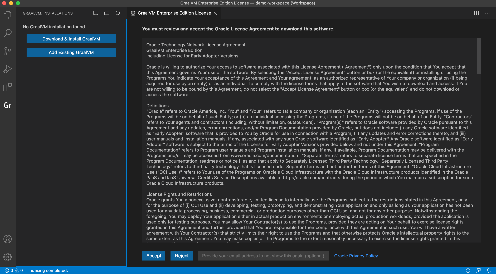

The installation wizard will download the package from [Oracle Software Downloads](https://www.oracle.com/downloads/graalvm-downloads.html) in the background and display the progress.

If you are behind a proxy, setup your proxy configuration by the "Setup Proxy" command or by overriding the `http_proxy` and `https_proxy` environment variables.

Upon completion, the "Set as Default Java" action is invoked. At the same time, the "Install Optional GraalVM Components" window pops up:

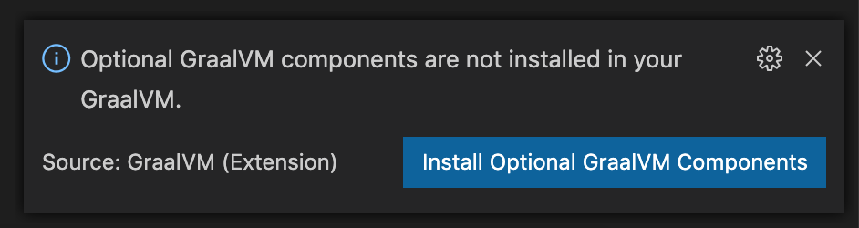

Once you confirm, you are taken to the selection list:

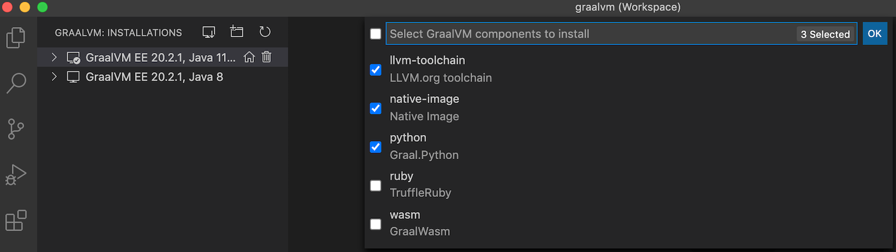

Note: You can download and install multiple GraalVM distributions and components at the same time.

### Add Existing GraalVM

The "Add Existing GraalVM" action allows you to select the existing GraalVM installation from your local disk.
As in the previous installation scenario, you are prompted to set the GraalVM installation as default, and to install optional components, if not already installed.

The "Add Existing GraalVM" action can also be invoked by using an icon on the side of the "GRAALVM: INSTALLATIONS" panel.
To make a newly added GraalVM runtime active, you can use the "home" icon by the side of the installation.

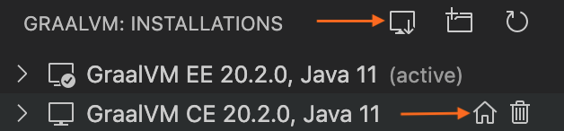

Alternatively, you can invoke the same actions from the View > Command Palette (Command Palette can be also opened by pressing F1, or the _Ctrl+Shift+P_  hot keys combination for Linux, and _Command+Shift+P_ for macOS):
* GraalVM: Download & Install GraalVM
* GraalVM: Install GraalVM Component
* GraalVM: Set Active GraalVM Installation

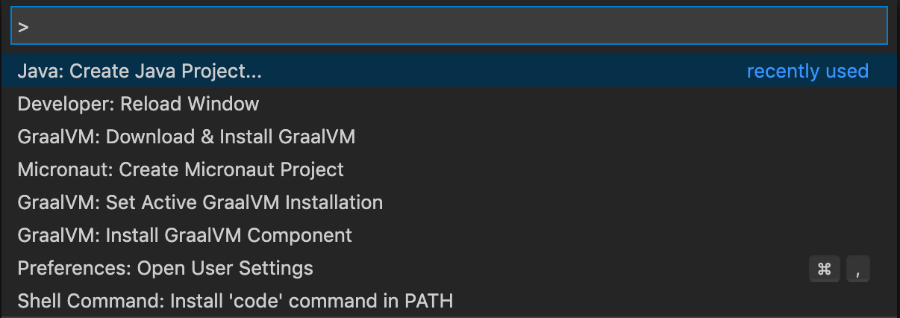

Each registered GraalVM instance displays its installation location and all its available components.
The active one is placed on top.
Components are either installed or available for download - the context actions to install (the plus icon) or remove (the bucket icon) are displayed when hovering over the component name.

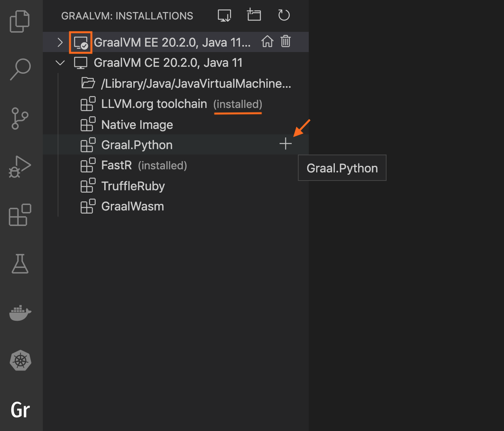

All registered GraalVM instances for `java.home` will be listed in the configuration file under File > Preferences > Settings (Code > Preferences > Settings on macOS).

This installation model greatly simplifies setting up the GraalVM development environment in VS Code:
- It permits multiple GraalVM and components installations at the same time.
- It allows an easy switch from one runtime version to another.
- It enables a quick removal of unnecessary GraalVM installations from VS Code global storage or even from your local disk.

The "Download & Install GraalVM" action is a preferable way, as it eliminates the fuss around setting up environment variables and prepares the GraalVM runtime in VS Code for you.

## Java Development and Debugging

To start developing Java applications, ensure GraalVM is used as your Java runtime in VS Code.
If the current path is not pointing to the GraalVM folder, go to the User Settings window and use the `netbeans.jdkhome` value in the _settings.json_ file.
This configuration is then used to launch the Java Language Server.

The project you create from scratch or a Java project you open in VS Code will run on GraalVM.

To debug a Java application running on GraalVM, creating a launch configuration for the application is necessary.
Having opened the file to be debugged or run in VS Code, switch to the Debug view by clicking on the "bug" icon in the left-hand side panel.
The newly opened window will suggest you create a _launch.json_ file:

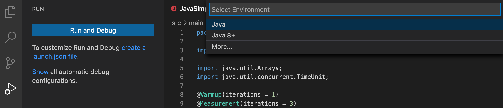

Make sure to select the "Java 8+" environment. To start debugging, press F5 or navigate to Run > Start Debugging.

### Available Launch Configurations

1. The CodeLens feature in the source code uses the __Java 8+...__ launch configuration (Debugger or Run) when `Run main | Debug main` CodeLens is selected in the code.
2. When __Java 8+...__ is selected in the __Run and Debug__ activity panel then following options are available:

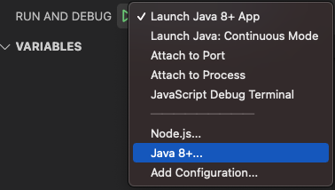

* __Launch Java 8+ App__ - Debug or Run a current Java project
* __Attach to Port__ & __Attach to Process__ - Attach debugger actions. Available when __Java 8+ ...__ at the bottom of drop down list is selected.
    * Select this configuration, then click [Run](images/run.png)
    * Select either from the available processes or enter the port to connect to a JVM running with JDWP.
    * __Attach to Shared Memory__ is available on Windows in addtion to above-mentioned _Attach..._

To add more launch configurations, navigate to Run > Add Configuration or open the _.vscode/launch.json_ file and press the "Add Configuration" button in the right-hand corner.

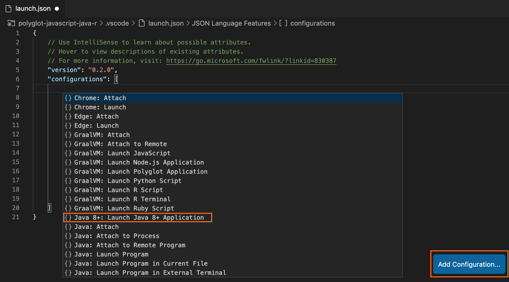

Suggestions for launch configuration options are available using code completion in `launch.json`.

## Native Image Agent

GraalVM Tools for Java extension provides an the experimental support for the [Native Image Tracing Agent](https://www.graalvm.org/reference-manual/native-image/Agent/) tool to track all usages of dynamic features when executing a Java application on a JVM. This makes it easier to build native images from the VS Code projects.

### Get Started

Once you have download or selected the most recent GraalVM release, made it active, and installed the Native Image component, as described in the [Installation and Setup](#installation-and-setup) section, you are ready to go.

> Note: This feature was introduced with the GraalVM 21.2.0 release. Please make sure to get the latest GraalVM Tools for Java extension from the VS Code Marketplace, preferably by downloading the [GraalVM Extension Pack for Java](https://marketplace.visualstudio.com/items?itemName=oracle-labs-graalvm.graalvm-pack).

A special launch configuration **Launch Native Image Agent & Java 8+ Application** is provided by the GraalVM Tools for Java extension to start the project with the Native Image tracing agent.

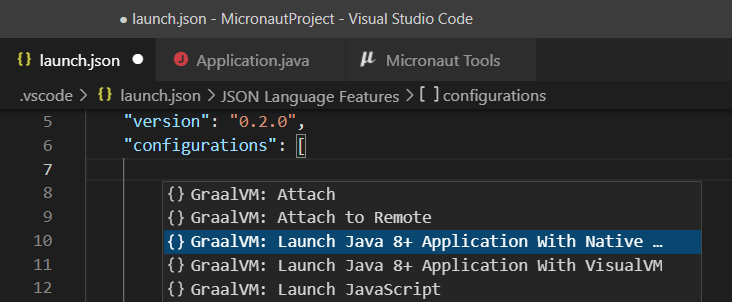

These are the steps to start the project with the agent from within the VS Code:

1&#46; Create the _launch.json_ file. If not already created, create a new file from the Run and Debug activity using the _create a launch.json file_ link. Select the Java 8+ environment when asked.

2&#46; Create the **Launch Native Image Agent & Java 8+ Application** launch configuration.
Open the _launch.json_ file and click the Add Configuration... button in the bottom right corner of the editor. Select the **GraalVM: Launch Java 8+ Application with Native Image Agent** configuration. Make sure to save the _launch.json_ file after editing.

3&#46; Select the **Launch Native Image Agent & Java 8+ Application** launch configuration in the Run and Debug activity. Use the Run Without Debugging action to start the current project.

> Note: Do not use the Start Debugging action to start a project as the Native Image agent is not compatible with the debugger agent and running such a configuration would fail.

4&#46; Specify the output directory for configuration files to be generated. During execution, the agent interfaces with the Java VM to intercept all calls that look up classes, methods, fields, resources, or request proxy accesses. The agent generates configuration files in JSON format which contain all intercepted dynamic accesses and will store them the output directory you specify. When starting the project, VS Code asks to select the desired location. The following choices are available:

* `META-INF/native-image` - the default location in project sources to store the configuration files
* `/tmp` - the configuration files will be stored to the `/tmp/native-image` directory
* Custom directory - the configuration files will be stored to the provided custom directory

5&#46; Generate load to the running process to invoke more code and generate the best configuration.
Once all possible execution paths have been executed, terminate the process. At this point the Native Image agent dumps the collected configuration to the selected output directory.

Once the configuration for Native Image has been generated, follow the documentation on how to [generate a native image for a project](https://www.graalvm.org/reference-manual/native-image/#build-a-native-image) from the command line, or how to [build native images right from VS Code](../micronaut/README.md#generate-native-images-of-micronaut-projects).

## Native Image Debugging

GraalVM Extension Pack for Java provides Java like debugging of platform native executables produced by [GraalVM Native Image](https://www.graalvm.org/reference-manual/native-image/).
It is provided using the GNU Debugger (GDB) and via a new Run configuration named __Launch Native Image__.
GraalVM Enterprise Edition is required as it produces full debug information for a native image.


> Note: Native Image debugging requires `gdb` debugger (GDB 7.11 or GDB 10.1+), it currently works only on Linux. The feature is experimental.

In order to debug native images of Java applications, it is necessary to build such images with debug information available.
It can be done by providing following switches for the `native-image` builder:
- `-g -O0` or
- `-H:Debug=2 -H:Optimize=0`.


The resulting images will contain debug records in a format `gdb` debugger understands.

### Debug Native Image “Real” Code

Since recently you can attach the debugger to a Native Image process and step over the image “real” code.

Attaching of debugger to a Native Image process is done via adding a configuration into the _launch.json_ file.

1. Select **Native Image: Attach to Process** from the configurations autocompletion in _launch.json_. It generates the **Attach to Native Image** configuration. When that configuration is selected and executed, a list of running processes opens.
2. Select the running process that corresponds to the Native Image you intend to debug.
3. when the source file opens, start debugging:
   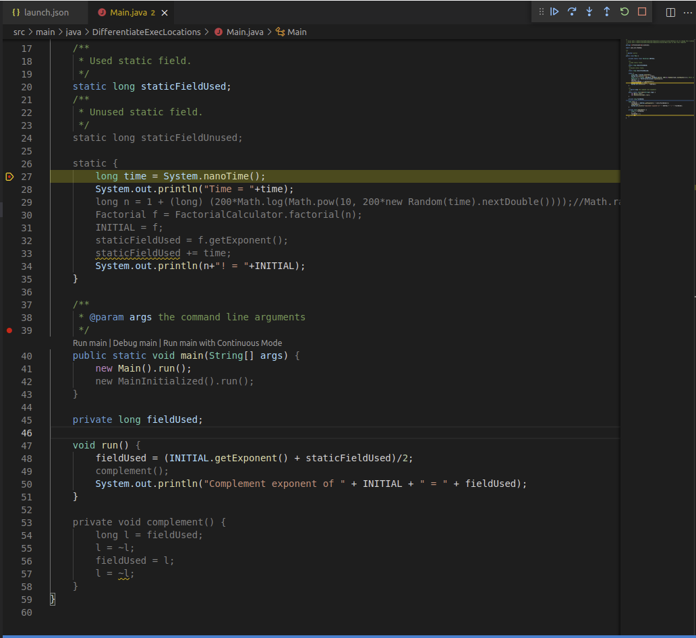

The step over the image “real” code” is mostly about UI differentiation of code which is compiled in the native image and which is not used.
The shaded code is not a part of the Native Image.

## Integration with VisualVM

As of GraalVM 21.2.0, the GraalVM Tools for Java extension introduced a new feature in this version - the integration with [VisualVM](https://visualvm.github.io), which is the all-in-one Java (and polyglot) monitoring and troubleshooting tool.
This brings the visual Java tooling to VS Code.

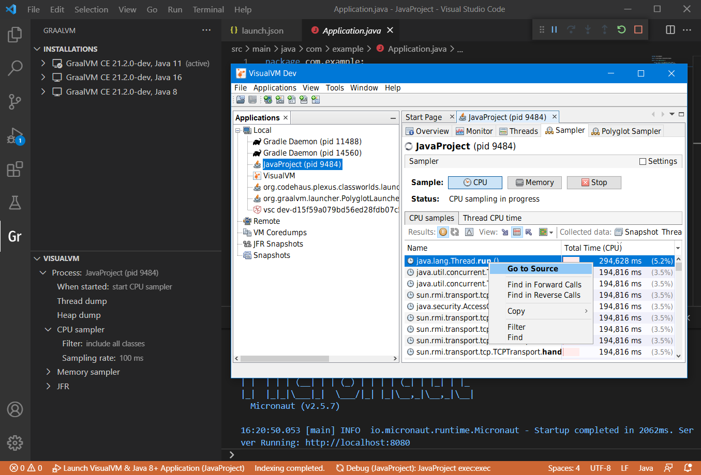

To get started, you need to get the latest stable GraalVM release using the **Download & Install GraalVM** action from the **Gr** activity view, as described in the [Installation and Setup](README.md#installation-and-setup) section.
Make sure the GraalVM is set as the **active** installation.

Once a GraalVM installation is set as active, the Command Palette contains the following commands related to VisualVM:

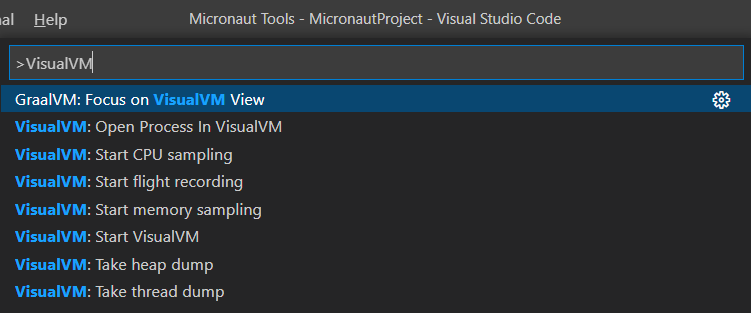

### Launch Configuration

A special launch configuration **Launch VisualVM & Java 8+ Application** is provided by the GraalVM Tools for Java extension to start VisualVM along with the project.
Follow these steps to start VisualVM automatically from within the VS Code:

1. Create the _launch.json_ file. If not already created, create a new launch.json file from the Run and Debug activity using the create a launch.json file link. Select the Java 8+ environment when asked.

2. Open the launch.json file and click the Add Configuration... button in the bottom right corner of the editor. Select the **GraalVM: Launch Java 8+ Application with VisualVM** configuration. Make sure to save the launch.json file after editing.

3. Select the action to perform when project starts. In the VisualVM pane of the **Gr** activity view, click the Configure action for the When started node to define the action to perform when the project is started.

4. Select the **Launch VisualVM & Java 8+ Application** launch configuration in the Run and Debug activity. Use the Start Debugging or Run Without Debugging action to start the current project.

While the project is starting, the Process node in VisualVM pane displays the project name with a "pid pending" label.
Once the project process starts, the Process node is updated to show its process ID (PID) and the action defined in step 3 is performed.

> Note: This feature was introduced with the GraalVM 21.2.0 release. Please make sure to get the latest GraalVM Tools for Java extension from the VS Code Marketplace, preferably by downloading the [GraalVM Extension Pack for Java](https://marketplace.visualstudio.com/items?itemName=oracle-labs-graalvm.graalvm-pack).

For a more detailed feature description, go to [this page](visualvm-integration.md).

## JavaScript and Node.js Debugging

To debug a JavaScript or Node.js application running on GraalVM, create a launch configuration for the application.
To do so, open the application project folder in VS Code (File > Open Folder), then switch to the Debug view by clicking on the "bug" icon in the left-hand side panel.
The newly opened window will suggest you create a _launch.json_ file.

If debugging is not yet configured (no `launch.json` has been created), select `GraalVM` from the list of available debug environmnets.

The following techniques can be used to add a new configuration:
* Use code completion if your cursor is located inside the configurations array.
* Press the Add Configuration button to invoke IntelliSense snippet suggestions at the start of the array.
* Choose the Add Configuration option in the Debug menu.


> Note: The attributes available in launch configurations vary from configuration to configuration. You can use IntelliSense suggestions (_Ctrl+Space_) to find out which attributes exist for a specific debug configuration. Hover help is also available for all attributes.


The GraalVM extension provides the following debug configurations that can be used to run and debug JavaScript and Node.js applications running on GraalVM:
* __Launch Node.js Application__ - Launches a Node.js application with GraalVM in a debug mode.
* __Launch JavaScript__ - Launches a JavaScript application with GraalVM in a debug mode.
* __Attach__ - Attaches a debugger to a locally running GraalVM runtime.
* __Attach to Remote__ - Attaches a debugger to the debug port of a remote GraalVM runtime.

You now have the possibility to choose which debugging protocol to use ([Debug Adapter Protocol](https://www.graalvm.org/tools/dap/) or [Chrome Dev Tools protocol](https://www.graalvm.org/tools/chrome-debugger/)) by setting the `protocol` attribute in the corresponding debug configuration to either `chromeDevTools` or `debugAdapter`.
For example, to connect to the open Debug Adapter Protocol port, the content of the _launch.json_ should be:
```json
{
    "version": "0.2.0",
    "configurations": [
        {
            "type": "graalvm",
            "request": "launch",
            "name": "Launch Node App",
            "outputCapture": "std",
            "protocol": "debugAdapter",
            "program": "${workspaceFolder}/App.js"
        }
    ]
}
```

In order to start a debug session, first select the proper configuration using the Configuration drop-down in the Debug view.
Once you have your launch configuration set, start your debug session with F5.
Alternatively, you can run your configuration through View > Command Palette (Command Palette can be opened by pressing F1, or the _Ctrl+Shift+P_  hot keys combination for Linux, and _Command+Shift+P_ for macOS).
Set filtering to Debug: Select and Start Debugging, or type "debug" and select the configuration you want to debug.

## Python Debugging

To debug a Python application running on GraalVM, create a launch configuration for the application.
To do so, open the application project folder in VS Code (File > Open Folder), then switch to the Debug view by clicking on the "bug" icon in the left-hand side panel. The newly opened window will suggest you create a _launch.json_ file.
If debugging is not yet configured (no `launch.json` has been created), select `GraalVM` from the list of available debug environmnets.

Once the `launch.json` file is opened in the editor, one of the following techniques can be used to add a new configuration:
* Use code completion if your cursor is located inside the configurations array.
* Press the Add Configuration button to invoke IntelliSense snippet suggestions at the start of the array.
* Choose Add Configuration option in the Debug menu.


The GraalVM Python extension provides the following debug configuration that can be used to debug Python applications/scripts running on GraalVM:
* __Launch Python Script__ - Launches a Python script with GraalVM in a debug mode.

You now have the possibility to choose which debugging protocol to use ([Debug Adapter Protocol](https://www.graalvm.org/tools/dap/) or [Chrome Dev Tools protocol](https://www.graalvm.org/tools/chrome-debugger/)) by setting the `protocol` attribute in the corresponding debug configuration to either `chromeDevTools` or `debugAdapter`.
For example, to connect to the Chrome Dev Tools protocol port, the content of the _launch.json_ should be:
```json
{
    "version": "0.2.0",
    "configurations": [
        {
            "type": "graalvm",
            "request": "launch",
            "name": "Launch Python App",
            "outputCapture": "std",
            "protocol": "chromeDevTools",
            "program": "${workspaceFolder}/App.py"
        }
    ]
}
```

When editing debug configurations, you can use IntelliSense suggestions (_Ctrl+Space_) to find out which attributes exist for a specific debug configuration.
Hover help is also available for all attributes.


In order to start a debug session, first select the proper configuration using the Configuration drop-down in the Debug view.
Once you have your launch configuration set, start your debug session with F5.
Alternatively, you can run your configuration through View > Command Palette (Command Palette can be also opened by pressing F1, or _Ctrl+Shift+P_  hot keys combination for Linux and _Command+Shift+P_ for macOS), by filtering on Debug: Select and Start Debugging or typing "debug", and selecting the configuration you want to debug.

## R Debugging

To debug an R application running on GraalVM, create a launch configuration for the application.
To do so, open the application project folder in VS Code (File > Open Folder), then switch to the Debug view by clicking on the "bug" icon in the left-hand side panel. The newly opened window will suggest you create a _launch.json_ file.
If debugging is not yet configured (no `launch.json` has been created), select `GraalVM` from the list of available debug environmnets.

Once the `launch.json` file is opened in the editor, one of the following techniques can be used to add a new configuration:
* Use code completion if your cursor is located inside the configurations array.
* Press the Add Configuration button to invoke IntelliSense snippet suggestions at the start of the array.
* Choose Add Configuration option in the Debug menu.


The GraalVM R extension provides the following debug configurations that can be used to debug R applications/scripts running on GraalVM:
* __Launch R Script__ - Launches an R script using GraalVM in a debug mode.
* __Launch R Terminal__ - Launches an integrated R terminal running on GraalVM in a debug mode.

You now have the possibility to choose which debugging protocol to use ([Debug Adapter Protocol](https://www.graalvm.org/tools/dap/) or [Chrome Dev Tools protocol](https://www.graalvm.org/tools/chrome-debugger/)) by setting the `protocol` attribute in the corresponding debug configuration to either `chromeDevTools` or `debugAdapter`.
For example, to connect to the Chrome Dev Tools protocol port, the content of the _launch.json_ should be:
```json
{
    "version": "0.2.0",
    "configurations": [
        {
            "type": "graalvm",
            "request": "launch",
            "name": "Launch R Script",
            "outputCapture": "std",
            "protocol": "chromeDevTools",
            "program": "${workspaceFolder}/App.r"
        }
    ]
}
```

When editing debug configurations, you can use IntelliSense suggestions (_Ctrl+Space_) to find out which attributes exist for a specific debug configuration.
Hover help is also available for all attributes.


In order to start a debug session, first select the proper configuration using the Configuration drop-down in the Debug view.
Once you have your launch configuration set, start your debug session with F5.
Alternatively, you can run your configuration through View > Command Palette (Command Palette can be also opened by pressing F1, or _Ctrl+Shift+P_  hot keys combination for Linux and _Command+Shift+P_ for macOS), by filtering on Debug: Select and Start Debugging or typing "debug", and selecting the configuration you want to debug.

## Ruby Debugging

To debug a Ruby application running on GraalVM, create a launch configuration for the application.
To do so, open the application project folder in VS Code (File > Open Folder), then switch to the Debug view by clicking on the "bug" icon in the left-hand side panel. The newly opened window will suggest you create a _launch.json_ file.
If debugging is not yet configured (no `launch.json` has been created), select `GraalVM` from the list of available debug environmnets.

Once the `launch.json` file is opened in the editor, one of the following techniques can be used to add a new configuration:
* Use code completion if your cursor is located inside the configurations array.
* Press the Add Configuration button to invoke IntelliSense snippet suggestions at the start of the array.
* Choose Add Configuration option in the Debug menu.


The GraalVM Ruby extension provides the following debug configuration that can be used to debug Ruby applications/scripts running on GraalVM:
* __Launch Ruby Script__ - Launches a Ruby script using GraalVM in a debug mode.

You now have the possibility to choose which debugging protocol to use ([Debug Adapter Protocol](https://www.graalvm.org/tools/dap/) or [Chrome Dev Tools protocol](https://www.graalvm.org/tools/chrome-debugger/)) by setting the `protocol` attribute in the corresponding debug configuration to either `chromeDevTools` or `debugAdapter`.
For example, to connect to the Chrome Dev Tools protocol port, the content of the _launch.json_ should be:
```json
{
    "version": "0.2.0",
    "configurations": [
        {
            "type": "graalvm",
            "request": "launch",
            "name": "Launch Ruby App",
            "outputCapture": "std",
            "protocol": "chromeDevTools",
            "program": "${workspaceFolder}/App.rb"
        }
    ]
}
```

When editing debug configurations, you can use IntelliSense suggestions (_Ctrl+Space_) to find out which attributes exist for a specific debug configuration.
Hover help is also available for all attributes.


In order to start a debug session, first select the proper configuration using the Configuration drop-down in the Debug view.
Once you have your launch configuration set, start your debug session with F5.
Alternatively, you can run your configuration through View > Command Palette (Command Palette can be also opened by pressing F1, or _Ctrl+Shift+P_  hot keys combination for Linux and _Command+Shift+P_ for macOS), by filtering on Debug: Select and Start Debugging or typing "debug", and selecting the configuration you want to debug.

## Polyglot Applications Debugging

To run a polyglot application on GraalVM in VS Code, you have to either pass the `--polyglot` option to any of the existing application lauchers (e.g., `js --polyglot` or `node --polyglot`), or use an experimental launcher called `polyglot` that runs code for JavaScript, Python, Ruby, and R without requiring the selection of a primary language.
The `polyglot` launcher does not require the `--polyglot` option, it is enabled by default.
For more information see the [GraalVM polyglot documentation](https://www.graalvm.org/reference-manual/polyglot-programming/).

To debug a polyglot application on GraalVM in VS Code, create a launch configuration for the application.
To do so, open the application project folder in VS Code (File > Open Folder), switch to the Debug view by clicking on the "bug" icon in the left-hand side panel. The newly opened window will suggest to create a _launch.json_ file.
If debugging is not yet configured (no `launch.json` has been created), select `GraalVM` from the list of available debug environmnets.

Once the `launch.json` file is opened in the editor, one of the following techniques can be used to add a new configuration:
* Use code completion if your cursor is located inside the configurations array.
* Press the Add Configuration button to invoke IntelliSense snippet suggestions at the start of the array.
* Choose Add Configuration option in the Debug menu.


The GraalVM extension provides the following debug configuration that can be used to debug an applications running on GraalVM using the `polyglot` launcher:
* __Launch Polyglot Application__ - Launches a Polyglot Application in a debug mode.

You now have the possibility to choose which protocol ([Debug Adapter Protocol](https://www.graalvm.org/tools/dap/) or [Chrome Dev Tools protocol](https://www.graalvm.org/tools/chrome-debugger/)) to use to debug a polyglot application by setting the `protocol` attribute in the corresponding debug configuration to either `chromeDevTools` or `debugAdapter`.
For example, to connect to the Chrome Dev Tools protocol port, the content of the _launch.json_ can be:
```json
{
    "version": "0.2.0",
    "configurations": [
        {
            "type": "graalvm",
            "request": "launch",
            "name": "Launch Polyglot App",
            "outputCapture": "std",
            "protocol": "chromeDevTools",
            "program": "${workspaceFolder}/polyglot.js"
        }
    ]
}
```

Alternatively, to pass the `--polyglot` option to any of the existing application launchers, add the `runtimeArgs` attribute containing the `--polyglot` value to their respective debug configurations.

> Note: In some cases (polyglot application calls Java or R, or native launcher accesses languages installed with `gu` without [rebuilding images](https://www.graalvm.org/reference-manual/graalvm-updater/#component-uninstallation)), also passing the `--jvm` option is necessary.

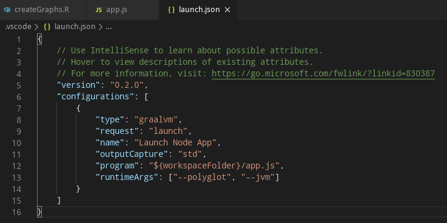

## Debug Adapter Protocol

When creating the Run/Debug Configurations in VS Code, Chrome DevTools Protocol is provisioned by default.
However, GraalVM provides a built-in implementation of the [Debug Adapter Protocol (DAP)](https://www.graalvm.org/tools/dap/) and, with the GraalVM Extention for VS Code, a user now can choose a protocol to use by setting the protocol attribute in the corresponding debug configuration to either `chromeDevTools` or `debugAdapter`.

To open a debugger port serving the Debug Adapter Protocol, you need to pass the `--dap` option to the command-line launcher.
Other available options to pass to GraalVM's Debug Adapter Protocol are:
* `--dap.Suspend=false`: Disable the execution suspension at first source line, enabled by default.
* `--dap.WaitAttached`: Do not execute any source code until debugger client is attached. The default is false.
* `--dap=<[[host:]port]>`: Start the debugger on a different port than default (`<host>:4711`).

Then you need a DAP client to connect to the open DAP port.
To connect to the open DAP port, the content of _launch.json_ for a Node.js application, for example, should be:
```json
{
    "version": "0.2.0",
    "configurations": [
        {
            "type": "graalvm",
            "request": "launch",
            "name": "Launch Node App",
            "outputCapture": "std",
            "protocol": "debugAdapter",
            "program": "${workspaceFolder}/App.js"
        }
    ]
}
```

The advantage of using the Debug Adapter Protocol over Chrome Dev Tools is that (1) it is "native" to Visual Studio Code (VS Code), meaning it does not require any intermediate translatation, and (2) it supports multithreading, which can be particually useful to debug, e.g., a Ruby application.

## Language Server Protocol Integration

GraalVM supports smart editing features of development tools used to create guest language applications by providing a built-in implementation of the [Language Server Protocol](https://microsoft.github.io/language-server-protocol).
This allows you to attach compatible development tools such as VS Code to GraalVM and to get features like auto complete, go to declaration, or documentation on hover.

Currently, [GraalVM's Language Server Protocol](https://www.graalvm.org/tools/lsp/) implementation supports the following services:
* [Text Document Synchronization](https://microsoft.github.io/language-server-protocol/specifications/specification-current/#textDocument_synchronization)
* [Hover Provider](https://microsoft.github.io/language-server-protocol/specifications/specification-current/#textDocument_hover)
* [Completion Provider](https://microsoft.github.io/language-server-protocol/specifications/specification-current/#textDocument_completion)
* [Signature Help Provider](https://microsoft.github.io/language-server-protocol/specifications/specification-current/#textDocument_signatureHelp)
* [Document Highlight Provider](https://microsoft.github.io/language-server-protocol/specifications/specification-current/#textDocument_documentHighlight)
* [Code Action Provider](https://microsoft.github.io/language-server-protocol/specifications/specification-current/#textDocument_codeAction)
* [Code Lens Provider](https://microsoft.github.io/language-server-protocol/specifications/specification-current/#textDocument_codeLens)
* [Execute Command Provider](https://microsoft.github.io/language-server-protocol/specifications/specification-current/#workspace_executeCommand)

> Note: The Language Server Protocol is offered as a technology preview and requires to pass the `--experimental-options` option for its activation.

To start the Language Server Protocol, pass the `--lsp` option to the command-line launcher as in the following example with a Node.js application:
```shell
node --experimental-options --lsp app.js
[Graal LSP] Starting server and listening on localhost/127.0.0.1:8123
Example app listening on port 3000!
```

> Important: GraalVM's Language Server Protocol itself does not provide the static data usually gathered by parsing the application sources (as these data are sometimes fuzzy in the case of dynamic languages). Instead, it was designed to provide the accurate dynamic data gathered from the application runtime.


However, GraalVM's Language Server Protocol could delegate to the existing language servers written specially for the particular languages (using the `--lsp.Delegates` launcher option) and merge the static data returned from these servers with its own dynamic data to a single result.

This extension works as a client to the Language Server Protocol.
By default, a language server is started as a part of every process being executed or debugged via the VS Code user interface.
The other possibility (available on option) is a language server started as a separated process that gets informed about every application being executed or debugged.
It tries to "dry-run" the same code as the original application and serve the run-time data afterwards.
Currently, both approaches start the language server, providing the smart editing features for the following GraalVM-supported languages - JavaScript, Python, R, Ruby, and [SimpleLanguage](https://github.com/graalvm/simplelanguage).

### R Language Server

This extension provides an option to automatically install and run the [languageserver](https://github.com/REditorSupport/languageserver) which is an implementation of the Language Server Protocol for the R language.
Enabling this option, the GraalVM R installation is checked for the presence of the `languageserver` package and the user is provided with the option of an automatic installation of the missing package.


Once the `languageserver` package is installed, the R Language Server is automatically started and passed to the Language Server Protocol as delegate when necessary.

### Ruby Language Server

This extension provides an option to automatically install and run the [solargraph](https://github.com/castwide/solargraph) which is an implementation of the Language Server Protocol for the Ruby language.
Enabling this option, the GraalVM Ruby installation is checked for the presence of the `solargraph` gem and the user is provided with the option of an automatic installation of the missing gem.


Once the `solargraph` gem is installed, the Ruby Language Server is automatically started and passed to the Language Server Protocol as delegate when necessary.

### Additional Editor Features

Since the easy writing of [polyglot](https://www.graalvm.org/docs/reference-manual/polyglot) applications is one of the defining features of GraalVM, the code completion invoked inside JavaScript sources provides items for `Polyglot.eval(...)`, `Polyglot.evalFile(...)`, and `Java.type(...)` calls.


Similarly, the code completion invoked inside Python sources provides items for `Polyglot.eval(...)`, `Polyglot.eval_file(...)`, and `Java.type(...)` calls.


The code completion invoked inside R sources provides items for `eval.polyglot(...)` and `new("<Java type>", ...)` calls.


And finally, the code completion invoked inside Ruby sources provides items for `Polyglot.eval(...)`, `Polyglot.eval_file(...)`, and `Java.type(...)` calls.


For JavaScript, Python, R, and Ruby sources opened in the editor, all the `Polyglot.eval(...)` calls are detected and the respective embedded languages are injected to their locations.
For example, having an R code snippet called via the Polyglot API from inside a JavaScript source, the R language code is embedded inside the corresponding JavaScript String and all VS Code's editing features (syntax highlighting, bracket matching, auto closing pairs, code completion, etc.) treat the content of the String as the R source code.


## Extension Settings

This extension contributes the following settings:

* __graalvm.home__ - the path to the GraalVM installation
* __graalvm.installations__ - all registered GraalVM installations
* __graalvm.systemDetect__ - detect GraalVM's installation from the system environment variables
* __graalvm.languageServer.currentWorkDir__ - an absolute path to the working directory of GraalVM's Language Server Protocol
* __graalvm.languageServer.inProcessServer__ - start GraalVM's Language Server Protocol within processes being run or debugged
* __graalvm.languageServer.delegateServers__ - a comma-separated list of `language@[host:]port` where other language servers run
* __graalvm.languageServer.startRLanguageServer__ - start the R Language Server
* __graalvm.languageServer.startRubyLanguageServer__ - start the Ruby Language Server

### Recommendations

The GraalVM Extension for VS Code recommends the following extensions:
* [Python](https://marketplace.visualstudio.com/items?itemName=ms-python.python) - the Python language support
* [R](https://marketplace.visualstudio.com/items?itemName=Ikuyadeu.r) - a basic support for the R language
* [Ruby](https://marketplace.visualstudio.com/items?itemName=rebornix.Ruby) - the Ruby language support

### Feedback

* [Request a feature](https://github.com/graalvm/vscode-extensions/issues/new?labels=enhancement)
* [File a bug](https://github.com/graalvm/vscode-extensions/issues/new?labels=bug)

### Privacy Policy

Read the [Oracle Privacy Policy](https://www.oracle.com/legal/privacy/privacy-policy.html) to learn more.
