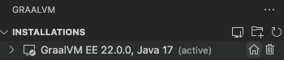

# GraalVM Tools for Java Extension

* [Extension Installation](#extension-installation)
* [GraalVM Installation Wizard](#graalvm-installation-wizard)
* [Java Development and Debugging](#java-development-and-debugging)
* [Integration with VisualVM](#integration-with-visualvm)
* [Micronaut Support](#micronaut-support)
* [Native Image Building and Debugging](#native-image-building-and-debugging)
* [Polyglot Programming and Debugging](#polyglot-programming-and-debugging)
* [Built-in Debug Adapter Protocol](#built-in-debug-adapter-protocol)
* [Extension Settings](#extension-settings)

[GraalVM Tools for Java](https://marketplace.visualstudio.com/items?itemName=oracle-labs-graalvm.graalvm) extension provides full-fledged support for Java and includes the GraalVM runtime with both just-in-time and ahead-of-time compilers, making it a comfortable and convenient integrated development environment.
Besides Java, this extension enables a polyglot environment in VS Code and offers full editing and debugging capabilities for JavaScript and Node.js, Python, R, and Ruby languages.
The extension provides a wizard to install GraalVM and simplify configuring the development environment.

The GraalVM Tools for Java extension in combination with the [GraalVM Tools for Micronaut extension](https://marketplace.visualstudio.com/items?itemName=oracle-labs-graalvm.micronaut) brings native support for the Micronaut framework in VS Code and opens many more possibilities for Java developers.

Note: The extension is a Technology Preview, and the development team is actively working on further improvements to provide better usability for developers.

## Extension Installation

To install the GraalVM Tools for Java extension in VS Code, do the following:

1. Navigate to Extensions in the left-hand side Activity Bar.
2. Search for "GraalVM" in the search field.
3. Once found, click **Install**. That action will install the GraalVM Tools for Java extension from the [VS Code Marketplace](https://marketplace.visualstudio.com/items?itemName=oracle-labs-graalvm.graalvm).
4. Reload when required.

Once installed, notice the **Gr** icon in the Activity Bar on the left.

## GraalVM Installation Wizard

After installing the extension, you can install GraalVM by using the built-in installation wizard (click the **Gr** icon in the left side Activity Bar).
You can either add an existing GraalVM installation (if you already have GraalVM), or download it immediately from within VS Code. A dialogue window suggests these options:
  * **Download & Install GraalVM**
  * **Add Existing GraalVM**


GraalVM includes a JDK based on the Java HotSpot VM, integrates an optimizing, just-in-time (JIT) compiler written in Java, the [Graal compiler](../../../reference-manual/java/compiler.md), and enables ahead-of-time compilation support with Native Image.
Any application that runs on a Java Virtual Machine (JVM) can run on GraalVM.

The **Download & Install GraalVM** action is recommended as it eliminates the fuss around setting up environment variables and prepares the GraalVM runtime in VS Code for you.

Each registered GraalVM installation displays its location and all its available components.
Plugins are either installed or available for download - the context actions to install (the plus icon) or remove (the bucket icon) are displayed when hovering over component's name.
All registered GraalVM installations will be listed in the configuration file under **File** > **Preferences** > **Settings** (**Code** > **Preferences** > **Settings** on macOS).

The advantages of this installation model are:
- It permits multiple GraalVM and component installations at the same time.
- It allows an easy switch from one runtime version to another.
- It enables a quick removal of unnecessary GraalVM installations from VS Code global storage or even from your local disk.

### Download and Install GraalVM

If you select **Download & Install GraalVM**, the installation wizard will ask you to:
  * Pick the GraalVM distribution: Community (free for all purposes) or Enterprise (free for evaluation and development)
  * Pick the GraalVM version: 22.x, 21.x, 20.x, or Latest Snapshot (Nightly Build)
  * Pick a Java version: 11 or 17
  * Select the destination folder

If you select GraalVM Community Edition, the installation wizard will download the package from [Github](https://github.com/graalvm/graalvm-ce-builds/releases) in the background and display progress.
If you select GraalVM Enterprise Edition, you will be prompted to accept the Oracle Technology Network License Agreement and requested to enter your email address.
Providing your email address is mandatory.


The installation wizard will download the package from [Oracle Software Downloads](https://www.oracle.com/downloads/graalvm-downloads.html) in the background and display progress.
If you are behind a proxy, set up your proxy configuration using the **Setup Proxy** command or by overriding the `http_proxy` and `https_proxy` environment variables.

At the same time, the **Install Optional GraalVM Components** window will pop up prompting you to install additional plugins (JavaScript and Node.js support, LLVM, etc.) to GraalVM:


Once you confirm, you are taken to the selection list:


### Add Existing GraalVM

Use the **Add Existing GraalVM** action to select an existing GraalVM installation.
As in the previous installation scenario, you are prompted to set the GraalVM installation as default, and to install additional components, if not already installed.
**Add Existing GraalVM** can also be invoked by using an icon on the side of the **GRAALVM: INSTALLATIONS** panel.

### Set Default Java

When the installation is complete, the **Set Default Java** action is invoked.
To set a newly added GraalVM active, click the home icon by the side of the installation:



Select both **Set as JAVA for Terminal** options in the **Configure active GraalVM** window:


Alternatively, you can invoke the same action from **View**, then **Command Palette** (use the Ctrl+Shift+P hot keys combination for Linux, and Command+Shift+P for macOS to open the commands palette), and search for "GraalVM".
You will see **GraalVM: Set Active GraalVM Installation** among other actions.


## Java Development and Debugging

The GraalVM Tools for Java extension brings complete support for Java language development and debugging in VS Code.
In addition to regular features like auto completion, code navigation, and refactoring, this extension provides support for ahead-of-time compilation with GraalVM Native Image, integrates with VisualVM, and supports polyglot programming, which will be described later.

To develop, compile, run and debug your Java application, GraalVM should be the default Java runtime in VS Code.
You can set GraalVM default as described in the [GraalVM Installation](#graalvm-installation-wizard) section or specify the path to GraalVM manually, by editing the `java.home` setting in VS Code.
If not specified, it is searched on the current system path.

Note: If the path is not pointing to the GraalVM folder, go to the User Settings window and use the `netbeans.jdkhome` value in the _settings.json_ file.
This configuration is then used to launch the Java Language Server.

The application you create from scratch or a Java project you open in VS Code will then run on GraalVM.
Any application that runs on a JVM can run unmodified on GraalVM.

To debug a Java application running on GraalVM, first create a launch configuration:

1. Open the file to be debugged or run.
2. Switch to the Debug view by clicking on the bug icon in the left-hand side panel. The newly opened window will suggest you create a _launch.json_ file.
3. Select the **Java 8+** environment:

  

To start debugging, press F5 or navigate to **Run**, then **Start Debugging**.

### Available Launch Configurations

There are several launch configurations available by default, and you can add more.

1. The CodeLens feature in the source code uses the **Java 8+...** launch configuration (Debugger or Run) when **Run main** and/or **Debug main** CodeLens is selected in the code.
2. When **Java 8+...** is selected in the **Run and Debug** activity panel, the following options are available:

    

    * **Launch Java 8+ App** to debug or run a current Java project.
    * **Attach to Port** and **Attach to Process** to attach the debugger. Available when **Java 8+ ...** is selected at the bottom of the dropdown list.
        * Select this configuration, then click **Run**
        * Select either from the available processes or enter the port to connect to a JVM running with JDWP
        * **Attach to Shared Memory** is available on Windows in addition to _Attach..._ mentioned above

To add more launch configurations, go to **Run**, then **Add Configuration**, or open the _.vscode/launch.json_ file, and click **Add Configuration** in the right-hand side corner.
Suggestions for launch configuration options are available using code completion in `launch.json`.


## Integration with VisualVM

GraalVM Tools for Java extension provides integration with [VisualVM](https://visualvm.github.io), the all-in-one Java (and polyglot) monitoring and troubleshooting tool.
VisualVM brings powerful yet easy-to-use visual Java tooling to VS Code.

It you go to **View**, then **Command Palette**, and search for "VisualVM", the following actions related to VisualVM are available:


A special launch configuration - **Launch VisualVM & Java 8+ Application** - is provided by the GraalVM Tools for Java extension to start VisualVM along with the project.


For more information, see the [dedicated guide](visualvm-integration.md) how to start VisualVM from within VS Code and learn about available launch configurations.

## Micronaut Support

The GraalVM Tools for Java extension in combination with the [GraalVM Tools for Micronaut extension](https://marketplace.visualstudio.com/items?itemName=oracle-labs-graalvm.micronaut) provides full support for the [Micronaut framework](https://micronaut.io/). 
You can create a Micronaut project, run and debug it with different debugging protocols, etc.
This native support for Micronaut allows you to build a native executable of your Micronaut application right from VS Code!
Moreover, you can build a Docker image with the application artifacts, or even build a Docker image containing an executable generated by GraalVM Native Image and deploy it in a container.

See the [GraalVM Tools for Micronaut extension documentation](../micronaut/README.md) to learn more.

## Native Image Building and Debugging

The GraalVM download includes [GraalVM Native Image](../../../reference-manual/native-image/README.md), which allows you to compile Java code ahead-of-time to a native executable - directly in VS Code.
Only the code that is required by the application at run time will be compiled and linked into the final native executable.
The advantages are many.
Your application will:
  * Be compiled into small executable files, using a fraction of customary resources, so they run lightning fast
  * Achieve peak performance with no warmup time
  * Have improved security by reducing attack surfaces and thwarting reverse engineering

### Configuration with Tracing Agent

When building a native executable, the representation of a whole program is created to figure out which classes and methods will be used at run time.
So the build relies on static analysis.
However, this analysis cannot always completely predict all dynamic features such as Java Reflection calls or Dynamic Proxy objects.
Undetected usages of dynamic features must be pre-configured, otherwise they will be omitted in the native executable.

Native Image provides several options to configure a build process.
The most convenient is to use the [Tracing agent](../../../reference-manual/native-image/Agent.md).
The agent tracks dynamic feature calls whilst your application is running on a JVM, and records those calls into JSON configuration files.

GraalVM Tools for Java extension provides experimental support for the Tracing agent to automate the process of tracking and registering dynamic feature calls, making it even easier to build a native executable in VS Code.
A special launch configuration - **Launch Native Image Agent & Java 8+ Application** - is provided by the extension to start a Java project with the Tracing agent.


In the next section you will learn how to build a native executable of your Java application and apply the Tracing agent in VS code.

### Building Native Executables

To build a native executable of your Java application in VS Code, do the following:

1. Create the _launch.json_ file. If not already created, create a new file from the **Run and Debug** activity panel using the _create a launch.json file_ link. Select the **Java 8+ environment** when asked.
2. Create the **Launch Native Image Agent & Java 8+ Application** configuration. Open the _launch.json_ file and click  **Add Configuration...** in the bottom right corner of the editor. Select the **GraalVM: Launch Java 8+ Application with Native Image Agent** configuration. 
3. Save the _launch.json_ file after editing it.
4. In the **Run and Debug** activity panel, choose the **Launch Native Image Agent & Java 8+ Application** configuration and click **Run Without Debugging** to start the current project. 
    > Note: Do not click the **Start Debugging** action to start a project. The Tracing agent is not compatible with the debugger agent and running such a configuration will fail.
5. Specify the output folder for configuration files to be generated. During the execution, the agent interfaces with a JVM to intercept all calls that look up classes, methods, fields, resources, or request proxy accesses. The agent generates configuration files containing all intercepted dynamic accesses and and stores them in the output folder you specify. When you start the project, VS Code asks you to select the desired location. The following choices are available:
    * `META-INF/native-image` - the default location in project sources to store the configuration files
    * `/tmp` - the configuration files will be stored to the `/tmp/native-image` folder
    * Custom folder - the configuration files will be stored in the custom folder you specify
6. Generate load to the running process to invoke more code and generate the best configuration.
7. Once all possible execution paths have been executed, terminate the process. At this point the Tracing agent dumps the collected configuration to the selected output folder.
8. Go to **Terminal**, and click **New Terminal**. To build a native executable from a Java class file in the current working folder, use the following command:
    ```shell
    native-image [options] class [imagename] [options]
    ```

If you project is Maven or Gradle based, there are dedicated Maven or Gradle plugins to add support for building and testing native executables written in Java. 
Refer to the following pages for more specific documentation:

* [Gradle plugin](https://graalvm.github.io/native-build-tools/latest/gradle-plugin.html)
* [Maven plugin](https://graalvm.github.io/native-build-tools/latest/maven-plugin.html)

If you use the Micronaut framework to create your Java project, you can build a native executable of a Micronaut application using VS Code quick actions. Go [here](../micronaut/README.md#generate-native-images-of-micronaut-projects) to learn how.

Read more about GraalVM Native Image [here](../../../reference-manual/native-image/README.md).

### Debugging Native Executables

The GraalVM Tools for Java extension provides Java-like debugging of a native executable in a running state directly from within VS Code.
You can set breakpoints, inspect the state of your application, even attach the debugger to a native image process in VS Code and step over the Java application source code.


Read more about this and find a demo application in the [Native Image Debugging guide](native-image-debugging.md).

## Polyglot Programming and Debugging

The GraalVM Tools for Java extension enables a polyglot environment in VS Code, providing necessary editing and debugging features for a number of popular languages such as Python, Ruby, R, JavaScript, and Node.JS.
The extension allows for polyglot programming in a bidirectional way: you can embed JavaScript, Ruby, R, and Python in Java, or call Java from those languages.
A host language and a guest language can directly interoperate with each other and pass data back and forth in the same memory space.


The GraalVM Tools for Java extension comes with full **editing capabilities** for JavaScript, Node.js, and Python by default. For Ruby and R development in VS Code you will need to additionally install languages servers.
Besides that, the extension comes with a built-in implementation of the [Language Server Protocol](https://microsoft.github.io/language-server-protocol) which adds more smart editing features such as code-completion, find usages, go to declaration, CodeLens, documentation on hover, and so on.
The **debugging features** are provided for all supported languages by default.

Proceed to the [dedicated guide](polyglot-runtime.md) to read about debugging JavaScript and Node.JS, Python, Ruby, R applications in VS Code, the Language Server Protocol implementation and editing features.

## Built-in Debug Adapter Protocol

Thanks to the built-in implementation of the [Debug Adapter Protocol (DAP)](../../dap.md), a user can choose a debugging protocol in VS Code by selecting either `chromeDevTools` or `debugAdapter`.
The advantage of using the Debug Adapter Protocol over Chrome Dev Tools is that (1) it is "native" to VS Code, meaning it does not require any intermediate translation, and (2) it supports multithreading, which can be particularly useful to debug, for example, a Ruby application.

See the documentation for more information on [Polyglot Programming and Debugging in VS Code](polyglot-runtime.md).

## Extension Settings

The GraalVM Tools for Java extension contributes the following settings in VS Code:

* __graalvm.home__ - the path to the GraalVM installation
* __graalvm.installations__ - all registered GraalVM installations
* __graalvm.systemDetect__ - detect GraalVM's installation from the system environment variables
* __graalvm.languageServer.currentWorkDir__ - an absolute path to the working folder of GraalVM's Language Server Protocol
* __graalvm.languageServer.start__ - start GraalVM's Language Server Protocol within processes being run or debugged
* __graalvm.languageServer.delegateServers__ - a comma-separated list of `language@[host:]port` where other language servers run
* __graalvm.languageServer.startRLanguageServer__ - start the R Language Server
* __graalvm.languageServer.startRubyLanguageServer__ - start the Ruby Language Server

### Recommendations

The GraalVM Extension for VS Code recommends the following extensions:
* [Python](https://marketplace.visualstudio.com/items?itemName=ms-python.python) - the Python language support
* [R](https://marketplace.visualstudio.com/items?itemName=Ikuyadeu.r) - a basic support for the R language
* [Ruby](https://marketplace.visualstudio.com/items?itemName=rebornix.Ruby) - the Ruby language support

### Provide Feedback or Seek Help

* [Request a feature](https://github.com/graalvm/vscode-extensions/issues/new?labels=enhancement)
* [File a bug](https://github.com/graalvm/vscode-extensions/issues/new?labels=bug)

### Privacy Policy

Read the [Oracle Privacy Policy](https://www.oracle.com/legal/privacy/privacy-policy.html) to learn more.
