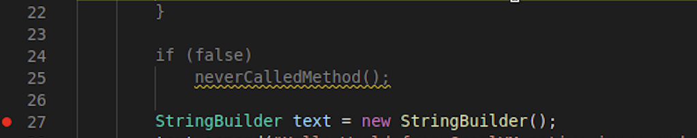

# Debug Native Executables in VS Code

You can debug a native executable generated by GraalVM Native Image from the command line with the GDB debugger, or from within Visual Studio Code (VS Code) by means of the [GraalVM Tools for Java](https://marketplace.visualstudio.com/items?itemName=oracle-labs-graalvm.graalvm).

In this guide you will learn how to debug a Java application compiled into a native executable from VS Code.

To learn how to debug Java using GDB, see the dedicated [Debug Native Executables with GDB](../../../reference-manual/native-image/guides/debug-native-executables-with-gdb.md).

## Introduction

You can debug a Native Image process the same way as debugging a regular Java application: when your native executable is running, the debugger attaches to the application process, the Java source file is opened, letting you debug it. You can perform regular debugging actions like setting breakpoints, creating watches, inspecting the state of your application, etc.
Debugger attachment is enabled by adding a separate configuration, **Native Image: launch**, to the `launch.json` file.

> Note: To debug a native executable from within VS Code, you must install GraalVM Enterprise.

### Prerequisites

1. Linux OS with GDB 10.1
2. [VS Code](https://code.visualstudio.com/)
3. [Extension Pack for Java from Microsoft](https://marketplace.visualstudio.com/items?itemName=vscjava.vscode-java-pack)
4. [GraalVM Extension Pack for Java](https://marketplace.visualstudio.com/items?itemName=oracle-labs-graalvm.graalvm-pack) installed in VS Code
5. [GraalVM Enterprise with Native Image](https://www.graalvm.org/downloads), [set as a default Java runtime environment in VS Code](README.md#graalvm-installation-wizard)

## Create and Build the Demo

The demo is a simple Java factorial calculator that uses the [Native Build Tools for GraalVM Native Image](https://graalvm.github.io/native-build-tools/latest/index.html), which provides support for building and testing native executables using Apache Maven™ and Gradle.

The Maven `pom.xml` file is extended with a native profile, which makes building a native executable easier (read more about Maven Profiles [here](https://maven.apache.org/guides/introduction/introduction-to-profiles.html)).
To add debug information, the `<buildArg>` tags are used in the native profile configuration to pass parameters to the `native-image` build process:

```xml
 <buildArg>-g</buildArg>
 <buildArg>-O0</buildArg>
```

The `-g` flag instructs `native-image` to generate debug information in a format the GNU Debugger (GDB) understands.
Then `-O0` specifies that no compiler optimizations should be performed.
Disabling all optimizations is not required, but in general it makes the debugging experience better.

1. Clone the [demos repository from GitHub](https://github.com/graalvm/graalvm-demos) and open the `javagdbnative` folder in VS Code:

    ```
    git clone https://github.com/graalvm/graalvm-demos.git
    ```

2. In VS Code, open **Terminal**, then click **New Terminal**, and run following command:

    ```shell
    mvn -Pnative -DskipTests package
    ```
    This command compiles and packages a Java application into a runnable JAR file and then uses GraalVM Native Image to generate a native executable from it.
    Once you have your executable with debug symbols generated, the next step is to add the debugger configuration, **Native Image: launch**, into the `launch.json` file in VS Code.

3. Select **Run Add Configuration…** and then select **Native Image: Launch** from the list of available configurations. It will add the following code to `launch.json`:

    ```JSON
    {
    “type”: “nativeimage”,
    “request”: “launch”,
    “name”: “Launch Native Image”,
    “nativeImagePath”: “${workspaceFolder}/build/native-image/application”
    }
    ```
    The value of the `nativeImagePath` property has to match the executable name and the location specified in the `pom.xml`, so change the last line of the configuration to `"nativeImagePath": "${workspaceFolder}/target/javagdb"`.

4. Add an argument to specify the number that you want to calculate the factorial, for example, `“args”: “100”`. Your configuration should look like this:
    ```JSON
    {
    “type”: “nativeimage”,
    “request”: “launch”,
    “name”: “Launch Native Image”,
    “nativeImagePath”: “${workspaceFolder}/target/javagdb”,
    “args”: “100”
    }
    ```

## Run and Debug the Demo

To run the application in debug mode, first set a breakpoint in the source code.
Then go to the **Run and Debug** activity in the top navigation panel, select **Launch Native Image** and click the green arrow to run this configuration.
VS Code will execute your native executable, attach to the application process, open the Java source file, letting you debug it.
You step over the code, explore local variables, specify expressions to be evaluated, etc.


Notice that some code is greyed out in the source file. For example, the method `neverCalledMethod()`:



The `native-image` builder removes the code that is not used by the application at run time.
This could be some uncalled library or some unreachable methods.
The VS Code extension recognizes these eliminations and will grey out both the body of eliminated method and the method call.
The shaded code is not a part of the native executable.

### Related Documentation

- [Debug Info Feature](../../../reference-manual/native-image/DebugInfo.md)
- [Learn how to debug a native executable using GDB](../../../reference-manual/native-image/guides/debug-native-executables-with-gdb.md)
