# Polyglot Programming and Debugging in VS Code

The GraalVM Tools for Java extension enables a polyglot environment in VS Code, providing editing and debugging features for several popular languages such as Python, Ruby, R, JavaScript, and Node.JS.
The extension supports polyglot programming in a bidirectional way: you can embed JavaScript, Ruby, R, and Python in Java, or call Java from those languages.
A host language and a guest language can directly interoperate with each other and pass data back and forth in the same memory space.

The GraalVM Tools for Java extension comes with full **editing capabilities** for JavaScript, Node.js, and Python by default. For Ruby and R development in VS Code you will need to additionally install languages servers.
Besides that, the extension comes with a built-in implementation of the [Language Server Protocol](https://microsoft.github.io/language-server-protocol) which adds more smart editing features such as code-completion, find usages, go to declaration, CodeLens, documentation on hover, and so on.
The **debugging features** are provided for all supported languages by default.

In this guide you will learn how to debug JavaScript and Node.JS, Python, Ruby, R applications one by one, read about the Language Server Protocol implementation and editing features.
You can jump to the necessary section directly:
* [Debug Adapter Protocol Implementation](#debug-adapter-protocol-implementation)
* [Debugging JavaScript and Node.js](#debugging-javascript-and-nodejs)
* [Debugging Python](#debugging-python)
* [Debugging Ruby](#debugging-ruby)
* [Debugging R](#debugging-r)
* [Language Server Protocol Implementation](#language-server-protocol-implementation)
* [Running and Debugging Polyglot Applications](#running-and-debugging-polyglot-applications)

## Debug Adapter Protocol Implementation

Together with the native debugging capabilities, the extension is shipped with a built-in implementation of the [Debug Adapter Protocol (DAP)](../../dap.md).
When creating the **Run/Debug Configuration** in VS Code, Chrome DevTools Protocol is provisioned by default.
With the GraalVM Tools for Java extension, a user can choose a protocol to use by setting the protocol attribute in the corresponding debug configuration to either `chromeDevTools` or `debugAdapter`.

To open a debugger port serving the Debug Adapter Protocol, you need to pass the `--dap` option to the command line launcher.
Other available options to pass to GraalVM's Debug Adapter Protocol are:
* `--dap.Suspend=false`: Disable the execution suspension at the first source line, enabled by default.
* `--dap.WaitAttached`: Do not execute any source code until debugger client is attached. The default is false.
* `--dap=<[[host:]port]>`: Start the debugger on a different port than default (`<host>:4711`).

Then you need a DAP client to connect to the open DAP port.
For example, to connect to the open DAP port, the content of `launch.json` for a Node.js application, should look like the following:
```json
{
    "version": "0.2.0",
    "configurations": [
        {
            "type": "graalvm",
            "request": "launch",
            "name": "Launch Node App",
            "outputCapture": "std",
            "protocol": "debugAdapter",
            "program": "${workspaceFolder}/App.js"
        }
    ]
}
```

The advantage of using the Debug Adapter Protocol over Chrome Dev Tools is that it is "native" to VS Code, meaning it does not require any intermediate translation, and it supports multithreading, which can be particularly useful to debug, for example,  a Ruby application.

## Debugging JavaScript and Node.js

To debug a JavaScript or Node.js application running on GraalVM, create a launch configuration for the application:

1. Go to **File**, then **Open Folder** to open the application project folder in VS Code.
2. Switch to the Debug view by clicking on the "bug" icon in the left-hand side panel. The newly opened window will suggest you create a `launch.json` file. If debugging is not yet configured (that is, no `launch.json` has been created), select `GraalVM` from the list of available debug environments.
3. Once the `launch.json` file is opened, one of the following techniques can be used to add a new configuration:
  * Use code completion if your cursor is located inside the configurations array.
  * Click **Add Configuration** to invoke IntelliSense snippet suggestions at the start of the array.
  * Choose **Add Configuration** in the Debug menu.
4. Choose one of the launch configurations:

   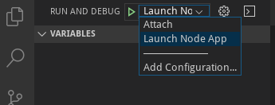

   > Note: The attributes available in launch configurations vary from configuration to configuration. You can use IntelliSense suggestions (_Ctrl+Space_) to discover which attributes exist for a specific debug configuration. Hover help is also available for all attributes.

To start a debug session:

1. Select the appropriate configuration from the Configuration drop-down list in the Debug view.
2. Once you have your launch configuration set, start your debug session with F5. Alternatively, you can run your configuration through **View**, then **Command Palette** (use the _Ctrl+Shift+P_  hot keys combination for Linux, or _Command+Shift+P_ for macOS).
3. Set filtering to **Debug: Select and Start Debugging**, or type “debug” and select the configuration you want to debug.

The GraalVM extension provides the following debug configurations that can be used to run and debug JavaScript and Node.js applications running on GraalVM:

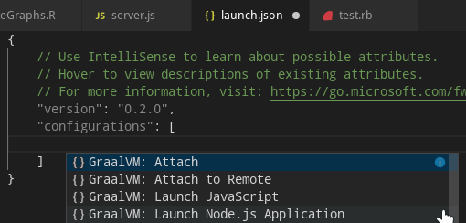

* __Launch Node.js Application__ launches a Node.js application with GraalVM in a debug mode.
* __Launch JavaScript__ launches a JavaScript application with GraalVM in a debug mode.
* __Attach__ attaches a debugger to a locally running GraalVM runtime.
* __Attach to Remote__ attaches a debugger to the debug port of a remote GraalVM runtime.

You also can choose which debugging protocol to use ([Debug Adapter Protocol](../../dap.md) or [Chrome Dev Tools protocol](../../chrome-debugger.md)) by setting the `protocol` attribute in the corresponding debug configuration to either `chromeDevTools` or `debugAdapter`.
For example, to connect to the open Debug Adapter Protocol port, the content of the `launch.json` should be:
```json
{
    "version": "0.2.0",
    "configurations": [
        {
            "type": "graalvm",
            "request": "launch",
            "name": "Launch Node App",
            "outputCapture": "std",
            "protocol": "debugAdapter",
            "program": "${workspaceFolder}/App.js"
        }
    ]
}
```

## Debugging Python

To debug a Python application running on GraalVM, create a launch configuration for the application:
1. Go to **File**, then **Open Folder** to open the application project folder in VS Code.
2. Switch to the Debug view by clicking on the "bug" icon in the left-hand side panel. The newly opened window will suggest you create a `launch.json` file. If debugging is not yet configured (that is, no `launch.json` has been created), select `GraalVM` from the list of available debug environments.
3. Once the `launch.json` file is opened, one of the following techniques can be used to add a new configuration:
  * Use code completion if your cursor is located inside the configurations array.
  * Click **Add Configuration** to invoke IntelliSense snippet suggestions at the start of the array.
  * Choose **Add Configuration** in the Debug menu.
4. Choose the launch configuration.

   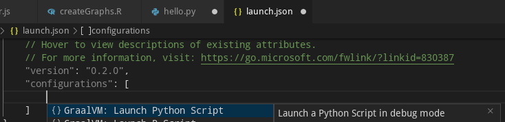

   > Note: The attributes available in launch configurations vary from configuration to configuration. You can use IntelliSense suggestions (_Ctrl+Space_) to discover which attributes exist for a specific debug configuration. Hover help is also available for all attributes.

To start a debug session:
1. Select the appropriate configuration using the Configuration drop-down list in the Debug view.
2. Once you have your launch configuration set, start your debug session with F5. Alternatively, you can run your configuration through **View**, then **Command Palette** (use the _Ctrl+Shift+P_  hot keys combination for Linux, or _Command+Shift+P_ for macOS).
3. Set filtering to **Debug: Select and Start Debugging**, or type “debug”.
4. Select the configuration __Launch Python Script__ which launches a Python script running on GraalVM in debug mode.

   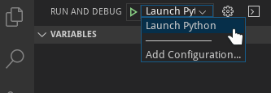

You also can choose which debugging protocol to use ([Debug Adapter Protocol](../../dap.md) or [Chrome Dev Tools protocol](../../chrome-debugger.md)) by setting the `protocol` attribute in the corresponding debug configuration to either `chromeDevTools` or `debugAdapter`.
For example, to connect to the Chrome Dev Tools protocol port, the content of the `launch.json` should be:
```json
{
    "version": "0.2.0",
    "configurations": [
        {
            "type": "graalvm",
            "request": "launch",
            "name": "Launch Python App",
            "outputCapture": "std",
            "protocol": "chromeDevTools",
            "program": "${workspaceFolder}/App.py"
        }
    ]
}
```

## Debugging Ruby

To debug a Ruby application running on GraalVM, create a launch configuration for the application:

1. Go to **File**, then **Open Folder** to open the application project folder in VS Code.
2. Switch to the Debug view by clicking on the "bug" icon in the left-hand side panel. The newly opened window will suggest you create a `launch.json` file. If debugging is not yet configured (no `launch.json` has been created), select `GraalVM` from the list of available debug environments.
3. Once the `launch.json` file is opened, one of the following techniques can be used to add a new configuration:
  * Use code completion if your cursor is located inside the configurations array.
  * Click **Add Configuration** to invoke IntelliSense snippet suggestions at the start of the array.
  * Choose **Add Configuration** in the Debug menu.
4. Choose the launch configuration.

    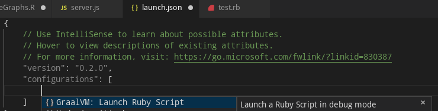

   > Note: The attributes available in launch configurations vary from configuration to configuration. You can use IntelliSense suggestions (_Ctrl+Space_) to find out which attributes exist for a specific debug configuration. Hover help is also available for all attributes.

To start a debug session:
1. Select the appropriate configuration using the Configuration drop-down list in the Debug view.
2. Once you have your launch configuration set, start your debug session with F5. Alternatively, you can run your configuration through **View**, then **Command Palette** (use the _Ctrl+Shift+P_  hot keys combination for Linux, or _Command+Shift+P_ for macOS).
3. Set filtering to **Debug: Select and Start Debugging**, or type “debug”.
4. Select the configuration __Launch Ruby Script__ which launches a Ruby script running on GraalVM in debug mode.

   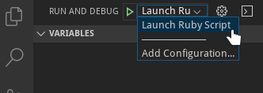

You also can choose which debugging protocol to use ([Debug Adapter Protocol](../../dap.md) or [Chrome Dev Tools protocol](../../chrome-debugger.md)) by setting the `protocol` attribute in the corresponding debug configuration to either `chromeDevTools` or `debugAdapter`.
For example, to connect to the Chrome Dev Tools protocol port, the content of the `launch.json` should be:
```json
{
    "version": "0.2.0",
    "configurations": [
        {
            "type": "graalvm",
            "request": "launch",
            "name": "Launch Ruby App",
            "outputCapture": "std",
            "protocol": "chromeDevTools",
            "program": "${workspaceFolder}/App.rb"
        }
    ]
}
```

## R Debugging

To debug an R application running on GraalVM, create a launch configuration for the application:

1. Go to **File**, then **Open Folder** to open the application project folder in VS Code.
2. Switch to the Debug view by clicking on the "bug" icon in the left-hand side panel. The newly opened window will suggest you create a `launch.json` file. If debugging is not yet configured (that is, no `launch.json` has been created), select `GraalVM` from the list of available debug environments.
3. Once the `launch.json` file is opened, one of the following techniques can be used to add a new configuration:
  * Use code completion if your cursor is located inside the configurations array.
  * Click **Add Configuration** to invoke IntelliSense snippet suggestions at the start of the array.
  * Choose **Add Configuration** in the Debug menu.
4. Choose the launch configuration.

    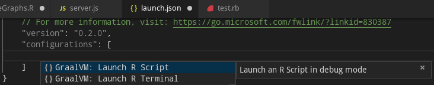

   > Note: The attributes available in launch configurations vary from configuration to configuration. You can use IntelliSense suggestions (_Ctrl+Space_) to discover which attributes exist for a specific debug configuration. Hover help is also available for all attributes.

To start a debug session:
1. Select the appropriate configuration using the Configuration drop-down list in the Debug view.
2. Once you have your launch configuration set, start your debug session with F5. Alternatively, you can run your configuration through **View**, then **Command Palette** (use the _Ctrl+Shift+P_  hot keys combination for Linux, or _Command+Shift+P_ for macOS).
3. Set filtering to **Debug: Select and Start Debugging**, or type “debug” and select one of the configurations:

    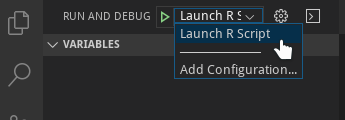

    * __Launch R Script__  launches an R script using GraalVM in a debug mode.
    * __Launch R Terminal__ launches an integrated R terminal running on GraalVM in a debug mode.

You also can choose which debugging protocol to use ([Debug Adapter Protocol](../../dap.md) or [Chrome Dev Tools protocol](../../chrome-debugger.md)) by setting the `protocol` attribute in the corresponding debug configuration to either `chromeDevTools` or `debugAdapter`.
For example, to connect to the Chrome Dev Tools protocol port, the content of the `launch.json` should be:
```json
{
    "version": "0.2.0",
    "configurations": [
        {
            "type": "graalvm",
            "request": "launch",
            "name": "Launch R Script",
            "outputCapture": "std",
            "protocol": "chromeDevTools",
            "program": "${workspaceFolder}/App.r"
        }
    ]
}
```

## Language Server Protocol Implementation

GraalVM provides a built-in implementation of the [Language Server Protocol](https://microsoft.github.io/language-server-protocol).
which allows users to attach compatible development tools such as VS Code to GraalVM and adds more smart editing features such as code-completion, find usages, go to declaration, CodeLens, documentation on hover.

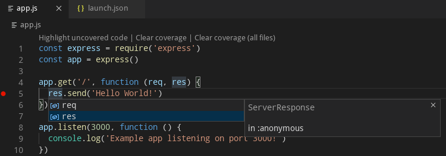

Currently, [GraalVM's Language Server Protocol](https://www.graalvm.org/tools/lsp/) implementation supports the following services:
* [Text Document Synchronization](https://microsoft.github.io/language-server-protocol/specifications/specification-current/#textDocument_synchronization)
* [Hover Provider](https://microsoft.github.io/language-server-protocol/specifications/specification-current/#textDocument_hover)
* [Completion Provider](https://microsoft.github.io/language-server-protocol/specifications/specification-current/#textDocument_completion)
* [Signature Help Provider](https://microsoft.github.io/language-server-protocol/specifications/specification-current/#textDocument_signatureHelp)
* [Document Highlight Provider](https://microsoft.github.io/language-server-protocol/specifications/specification-current/#textDocument_documentHighlight)
* [Code Action Provider](https://microsoft.github.io/language-server-protocol/specifications/specification-current/#textDocument_codeAction)
* [CodeLens Provider](https://microsoft.github.io/language-server-protocol/specifications/specification-current/#textDocument_codeLens)
* [Execute Command Provider](https://microsoft.github.io/language-server-protocol/specifications/specification-current/#workspace_executeCommand)

> Note: The Language Server Protocol is offered as a technology preview and requires to pass the `--experimental-options` option for its activation.

To start the Language Server Protocol, pass the `--lsp` option to the command line launcher as in the following example with a Node.js application:
  ```shell
  node --experimental-options --lsp app.js
  [Graal LSP] Starting server and listening on localhost/127.0.0.1:8123
  Example app listening on port 3000!
  ```

This extension works as a client to the Language Server Protocol.
By default, a language server is started as a part of every process being executed or debugged via the VS Code user interface.
The other possibility (available on option) is a language server started as a separated process that is informed about every application being executed or debugged.
It tries to "dry-run" the same code as the original application and serve the run-time data afterwards.
Currently, both approaches start the language server, providing the smart editing features for the following GraalVM-supported languages - JavaScript, Python, R, Ruby, and [SimpleLanguage](https://github.com/graalvm/simplelanguage).

> Important: GraalVM's Language Server Protocol itself does not provide the static data usually gathered by parsing the application sources (as these data are sometimes fuzzy in the case of dynamic languages). Instead, it was designed to provide the accurate dynamic data gathered from the application runtime.

GraalVM's Language Server Protocol implementation can delegate to the existing language servers written specially for the particular languages (using the `--lsp.Delegates` launcher option) and merge the static data returned from these servers with its own dynamic data to a single result.

### Ruby and R Language Servers

The GraalVM Tools for Java extension comes with default editing features for JavaScript, Node.js, and Python. For Ruby and R development in VS Code you will need to additionally install languages servers.

#### Ruby Language Server

The GraalVM Tools for Java extension provides an option to automatically install and run [solargraph](https://github.com/castwide/solargraph), which is an implementation of the Language Server Protocol for the Ruby language.
Enabling this option, the GraalVM installation is checked for the presence of the `solargraph` gem and the user is offered  the option of automatically installing the missing gem.


Once the `solargraph` gem is installed, the Ruby Language Server is automatically started and passed to the Language Server Protocol as delegate when necessary.

#### R Language Server

The GraalVM Tools for Java extension provides an option to automatically install and run [languageserver](https://github.com/REditorSupport/languageserver), which is an implementation of the Language Server Protocol for R.
Enabling this option, the GraalVM installation is checked for the presence of the `languageserver` package and the user is offered the option of automatically installing the missing package.

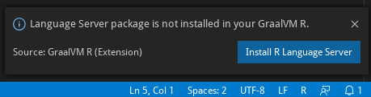

Once the `languageserver` package is installed, the R Language Server is automatically started and passed to the Language Server Protocol as delegate when necessary.

## Running and Debugging Polyglot Applications

[GraalVM Polyglot API](https://www.graalvm.org/sdk/javadoc/org/graalvm/polyglot/package-summary.html) enables you to combine multiple languages (supported by GraalVM) in one program.
The combination can be bidirectional: you can embed JavaScript, Ruby, R, and Python in Java, or call Java from those languages.
A host language and a guest language can directly interoperate with each other and pass data back and forth in the same memory space.
For more information, see the [Polyglot Programming guide](../../../reference-manual/polyglot-programming.md).

To run a polyglot application on GraalVM, you have to either pass the `--polyglot` option to any of the existing application launchers (for example, `js --polyglot` or `node --polyglot`), or use an experimental launcher called `polyglot` that runs code for JavaScript, Python, Ruby, and R without requiring the selection of a primary language.
The `polyglot` launcher does not require the `--polyglot` option, because it is enabled by default.

> Note: In some cases (such as a polyglot application calling Java or R, or a native launcher accessing languages installed with `gu`) passing the `--jvm` option may be necessary.

To debug a polyglot application on GraalVM in VS Code, you create a launch configuration for the application:

1. Go to **File**, then **Open Folder** to open the application project folder in VS Code.
2. Switch to the Debug view by clicking on the "bug" icon in the left-hand side panel. The newly opened window will suggest you create a `launch.json` file. If debugging is not yet configured (no `launch.json` has been created), select `GraalVM` from the list of available debug environments.
3. Once the `launch.json` file is opened, one of the following techniques can be used to add a new configuration:
  * Use code completion if your cursor is located inside the configurations array.
  * Click **Add Configuration** to invoke IntelliSense snippet suggestions at the start of the array.
  * Choose **Add Configuration** in the Debug menu.
4. Select __Launch Polyglot Application__  to launch a polyglot application in a debug mode.

    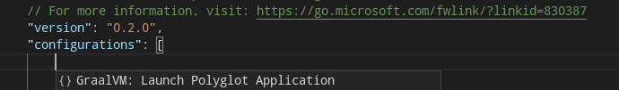

You can choose which debugging protocol, ([Debug Adapter Protocol](../../dap.md) or [Chrome Dev Tools protocol](../../chrome-debugger.md), to use to debug a polyglot application by setting the `protocol` attribute in the corresponding debug configuration to either `chromeDevTools` or `debugAdapter`.
For example, to connect to the Chrome Dev Tools protocol port, the content of the `launch.json` can be:
```json
{
    "version": "0.2.0",
    "configurations": [
        {
            "type": "graalvm",
            "request": "launch",
            "name": "Launch Polyglot App",
            "outputCapture": "std",
            "protocol": "chromeDevTools",
            "program": "${workspaceFolder}/polyglot.js"
        }
    ]
}
```
Alternatively, to pass the `--polyglot` option to any of the existing application launchers, add the `runtimeArgs` attribute containing the `--polyglot` value to their respective debug configurations.

### Additional Editor Features

Since the easy writing of [polyglot](../../../reference-manual/polyglot-programming.md) applications is one of the defining features of GraalVM, the code completion invoked inside JavaScript sources provides items for `Polyglot.eval(...)`, `Polyglot.evalFile(...)`, and `Java.type(...)` calls.

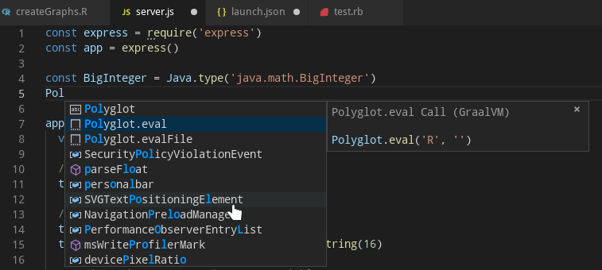

Similarly, the code completion invoked inside Python sources provides items for `Polyglot.eval(...)`, `Polyglot.eval_file(...)`, and `Java.type(...)` calls.

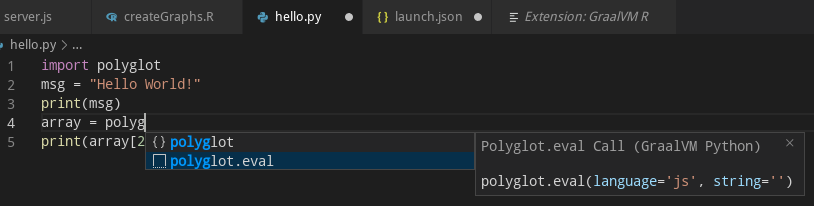

The code completion invoked inside R sources provides items for `eval.polyglot(...)` and `new("<Java type>", ...)` calls.

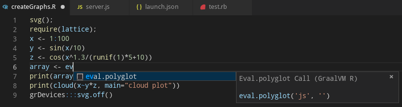

And finally, the code completion invoked inside Ruby sources provides items for `Polyglot.eval(...)`, `Polyglot.eval_file(...)`, and `Java.type(...)` calls.

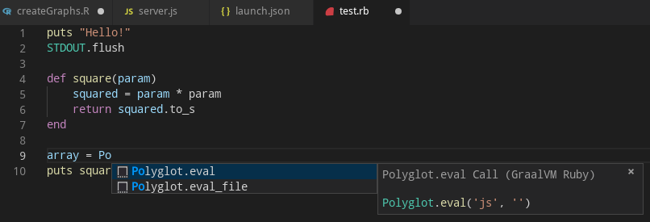

For JavaScript, Python, R, and Ruby sources opened in the editor, all the `Polyglot.eval(...)` calls are detected and the respective embedded languages are injected to their locations.
For example, having an R code snippet called via the Polyglot API from inside a JavaScript source, the R language code is embedded inside the corresponding JavaScript String and all VS Code's editing features (syntax highlighting, bracket matching, auto closing pairs, code completion, etc.) treat the content of the `String` as the R source code.

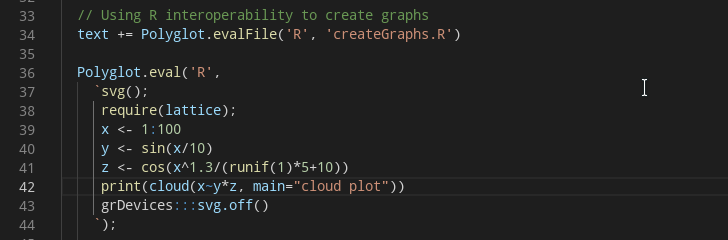

### Related Documentation

- [Polyglot Programming](../../../reference-manual/polyglot-programming.md)
