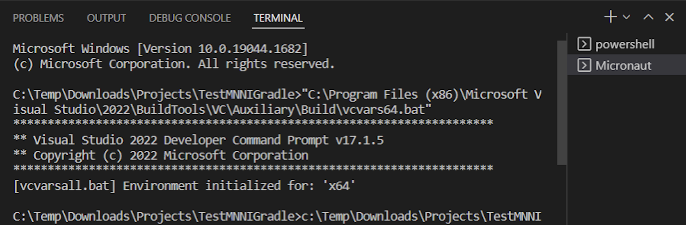
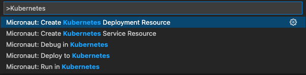
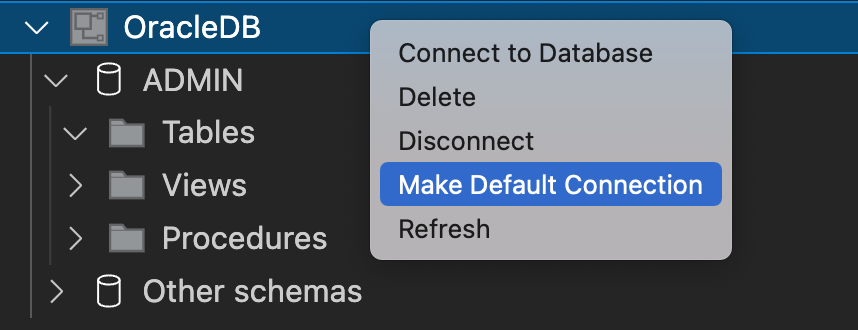
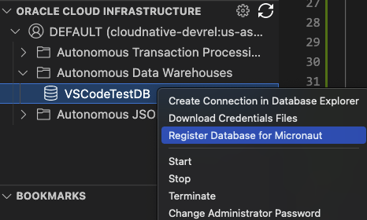

# GraalVM Tools for Micronaut

* [Extension Installation](#extension-installation)
* [Extension Settings](#extension-settings)
* [Micronaut Commands](#micronaut-commands)
* [Create a Micronaut Project](#create-a-micronaut-project)
* [Package and Run Micronaut Applications](#package-and-run-micronaut-applications)
* [Debug Micronaut Applications](#debug-micronaut-applications)
* [Transform  Micronaut Applications into Native Executables](#transform-micronaut-applications-into-native-executables)
* [Build Docker Images and Deploy Micronaut Applications to a Docker Registry](#build-docker-images-and-deploy-micronaut-applications-to-a-docker-registry)
* [Deploy, Run, and Debug Micronaut Applications in a Kubernetes Cluster](#deploy-run-and-debug-micronaut-applications-in-a-kubernetes-cluster)
* [Manage Databases with Database Explorer](#manage-databases-with-database-explorer)
* [Work with Oracle Autonomous Database from VS Code](#work-with-oracle-autonomous-database-from-vs-code)

[GraalVM Tools for Micronaut](https://marketplace.visualstudio.com/items?itemName=oracle-labs-graalvm.micronaut) extension provides support for developing Micronaut applications with Visual Studio Code (VS Code).

The [Micronaut framework](https://micronaut.io/) is a lightweight reactive framework that provides a solid foundation for building cloud native Java microservices. Thanks to [Micronaut Data](https://micronaut-projects.github.io/micronaut-data/latest/guide/), the database access toolkit, you can access the database and execute queries.

> Note: The extension is a Technology Preview.

The extension provides many features to boost your Java 8+ and Micronaut productivity in the VS Code environment:

* Micronaut project creation wizard
* Editing and debugging capabilities for Micronaut projects
* Code completion and navigation for Micronaut configuration (YAML) files and Java (available with [Apache NetBeans Language Server extension](https://marketplace.visualstudio.com/items?itemName=asf.apache-netbeans-java))
* Ability to build Micronaut projects ahead-of-time into native executables with GraalVM Native Image
* Continuous mode of operation: an application will reload automatically when source code is changed
* Building Docker images
* Kubernetes support
* Databases integration
* Oracle Cloud explorer

While the extension delivers all these features on its own, it works best when used together with the [GraalVM Tools for Java extension](https://marketplace.visualstudio.com/items?itemName=oracle-labs-graalvm.graalvm). You get all the GraalVM-specific features like the innovative Graal compiler for better performance, ahead-of-time compilation with GraalVM Native Image, built-in VisualVM, and many more.
## Extension Installation

To install the GraalVM Tools for Micronaut extension in VS Code, do the following:

1. Navigate to Extensions in the left-hand side Activity Bar.
2. Search for "Micronaut" in the search field.
3. Once found, click **Install**. to install the GraalVM Tools for Micronaut extension from the [VS Code Marketplace](https://marketplace.visualstudio.com/items?itemName=oracle-labs-graalvm.micronaut).
4. Reload when required.

The Micronaut extension requires the [GraalVM Tools for Java](https://marketplace.visualstudio.com/items?itemName=oracle-labs-graalvm.graalvm) extension for more features support such as GraalVM Java runtime and building native executables. For the Java language support, it depends on the [Apache NetBeans Language Server](https://marketplace.visualstudio.com/items?itemName=ASF.apache-netbeans-java). Both extensions will be installed in the background. 

When installed, the extension checks whether there is a registered GraalVM installation, and eventually requests to download it or point to a local installation (see [GraalVM Installation and Setup in VS Code](../graalvm/README.md#graalvm-installation-wizard)).

You can use the [Extension Pack for Java from Microsoft](https://marketplace.visualstudio.com/items?itemName=vscjava.vscode-java-pack) if you prefer instead of the default Apache NetBeans Language Server (see [Java in VS Code](https://code.visualstudio.com/docs/languages/java) to get started).
If VS Code detects the Extension Pack for Java from Microsoft installed, it deactivates the Apache NetBeans Language Server.

The entrypoint to the Micronaut extension is the Micronaut Tools page which opens as soon as the extension is installed or using the Command Palette command **Micronaut: Show Micronaut Tools Page**.

 
## Extension Settings

The GraalVM Tools for Micronaut extension contributes the following settings in VS Code:
* __micronaut.home__ - the optional path to the Micronaut CLI installation
* __micronaut.showWelcomePage__ - show the Micronaut Tools Page on extension activation

## Micronaut Commands

Invoke the Micronaut commands from **View**, **Command Palette** (Command Palette can be also opened by pressing F1, or the `Ctrl+Shift+P` hot keys combination for Linux, and `Command+Shift+P` for macOS), then search for "Micronaut". 
The following commands are available for Micronaut project development:

* **Micronaut: Show Micronaut Tools Page**: show the Micronaut Tools Page
* **Micronaut: Create Micronaut Project** create a Micronaut project based on [project creation wizard](https://micronaut.io/launch)

  

## Create a Micronaut Project

The GraalVM Tools for Micronaut extension enables the [Micronaut Launch](https://micronaut.io/launch/) application that enables you to create Micronaut projects directly in VS Code.
It supports generating Micronaut applications, CLI applications, and other types of applications.

To create a new project, go to  **View**, **Command Palette**, search for "micronaut" and invoke the **Micronaut: Create Micronaut Project** command.
The wizard will prompt you to:

  * pick the application type
  * pick the Micronaut version
  * pick the Java version
  * provide a project name
  * provide a base package name
  * pick the project language (Java, Kotlin, or Groovy)
  * pick the project features:

    

  * pick the build tool (Maven or Gradle)
  * pick the test framework (JUnit, Spock, or Kotlintest)

Finally, you are asked to select the destination directory on your local disk and whether to open the created project in a new window or add it to the current workspace.

The GUI part of the Micronaut extension adds a new view to the Explorer activity, which shows Micronaut projects in the current workspace.

Besides the project creation wizard, you can use the console CLI.
If you provide a path to the [Micronaut CLI installation](https://micronaut-projects.github.io/micronaut-starter/latest/guide/#installation), you can create a project using the `mn` executable.

## Package and Run Micronaut Applications

The GraalVM Tools for Micronaut extension provides complete support for application development and debugging in VS Code for Micronaut developers, including regular features like auto completion, code navigation, refactoring, etc.

You can package a Micronaut application into a runnable JAR in different ways. 
For user's convenience, there is a quick command available: 

1. Go to **View**, **Command Palette**, and invoke the **Micronaut: Build...** quick action.

   

2. Select the **compile** build target from a list of available ones to compile the source code of the application.

3. When compilation completes, invoke the **Micronaut: Build...** quick action again, and select **package** target, which will package the compiled code into a distributive format.

Alternatively, open the entry-point class of your Micronaut application, find its `main` method, and click **Run Main** above.
 
Lastly, you can package and run your application at the same time calling the Maven or  Gradle jobs explicitly from the command line.

   * If your project is built with Maven, it will run the `./mvnw mn:run` job.

   * If your project is built with Gradle, it will run the `./gradlew run` job.

## Debug Micronaut Applications

To debug a Micronaut application, first create a launch configuration:

1. Open the file to be debugged or run.
2. Switch to the Debug view by clicking the bug icon in the left-hand side panel. The newly opened window will suggest you create a _launch.json_ file.
3. Select the **Java 8+** environment.
4. Start debugging. Press `F5` or navigate to **Run**, then **Start Debugging**.

## Transform  Micronaut Applications into Native Executables
The Micronaut support for VS Code in combination with [GraalVM Tools for Java extension](https://marketplace.visualstudio.com/items?itemName=oracle-labs-graalvm.graalvm) opens many more possibilities for Java developers. Thanks to the tight integration with [GraalVM Native Image](../../../reference-manual/native-image/README.md), you can compile a Micronaut application ahead-of-time turning it into a native executable. 

When you have GraalVM installed with the Native Image support in VS Code (see [GraalVM Installation and Setup in VS Code](../graalvm/README.md#graalvm-installation-wizard), the following quick actions become available:
* **Micronaut: Build ...** - build a Micronaut project with the user-selected targets
* **Micronaut: Build Native Image** - build a native executable from a Micronaut project

To build a native executable of your Micronaut application:

1. Ensure you [installed GraalVM and made it the default runtime and debug environment](../graalvm/README.md#graalvm-installation-wizard).

2. Add the Native Image component to GraalVM.

3. Go to **View**, **Command Palette**, and invoke the **Micronaut: Build...** quick action.

   

4. Select the **nativeImage** build target from a list of available ones.

   * If your project is built with Maven, it will run the `mvnw package -Dpackaging=native-image` job. A native executable will be built into the `/target/native-image/` directory.

   * If your project is built with Gradle, it will run the `gradlew nativeCompile` job. A native executable will be written to the `/build/native/nativeCompile/` directory.

Alternatively, you could invoke the **Micronaut: Build Native Image** quick action directly.

GraalVM Native Image creates an executable file with all the application classes, dependent library classes, dependent JDK classes, and a snapshot of the application heap. Whilst building a native executable can take some time, the benefits include a dramatic reduction in startup time and reduced overall memory consumption.

> Note: The time to build an executable depends on application size and complexity and may take some time on low powered machines.

To run your Micronaut application as a native executable, open **Terminal**, **New Teminal** and execute: 

* If you used Maven: `./target/executable`
* If you used Gradle: `./build/native/nativeCompile/executable`

For more information, visit the [Micronaut documentation](https://guides.micronaut.io/micronaut-creating-first-graal-app/guide/index.html#creatingGraalImage) about how to create a Hello World Micronaut GraalVM application.

### Windows Users 

On Windows the `native-image` builder will only work when it is executed from the **x64 Native Tools Command Prompt**.

For Micronaut users targeting GraalVM Native Image for their Micronaut applications, the extension provides a dedicated **x64 command prompt using Microsoft Developer Tools**. 
You can check it by invoking the **Micronaut: Build Native Image** task from Command Palette. 
Notice which shell is active:

  

## Build Docker Images and Deploy Micronaut Applications to a Docker Registry

With the GraalVM Tools for Micronaut extension, you can build a Docker image of a Micronaut application, or even create a Docker image containing an executable generated by [GraalVM Native Image](../../../reference-manual/native-image/README.md) and deploy it in a container.

The Micronaut support in VS Code allows to build and deploy Docker images to a Docker registry.
  

- To deploy a dockerized Micronaut application, go to **View**, then **Command Palette**, and invoke the **Micronaut: Deploy...** command.
- To deploy a dockerized Micronaut application, select the **dockerPush** command.
- To build and push a Docker image with a native executable of a  Micronaut application, invoke the **dockerPushNative** command.

Besides that, you can also push your dockerized Micronaut application or as a native executable to a Docker Registry from the VS Code Terminal window.
A particular Docker Registry can be configured in the build, see the [Micronaut Deploying Application](https://micronaut-projects.github.io/micronaut-maven-plugin/latest/examples/deploy.html) documentation.

## Deploy, Run, and Debug Micronaut Applications in a Kubernetes Cluster

GraalVM Tools for Micronaut provides all of the necessary tooling for a complete developer experience in VS Code, including Kubernetes support for automated deployment, scaling and management of containers. You can deploy a containerized Micronaut application into a Kubernetes cluster to a container registry, interactively run and debug it directly from VS Code. The following quick commands are available for you:

  

## Manage Databases with Database Explorer

The GraalVM Tools for Micronaut extension provides out of the box integration with databases.
The database management can be done using the **DATABASES** explorer which finds available connections and allows you to connect to a database using the appropriate JDBC driver.
The database support covers the whole development workflow from creating a database, adding a connection, to setting up the runtime environment for a Micronaut application with the selected database. 
You can generate `@Entity` classes from an existing database schema, and use SQL code completion in the `@Query` annotation.

  

## Work with Oracle Autonomous Database from VS Code

The GraalVM Tools for Micronaut extension provides the **CLOUD** explorer to create and/or connect to [Oracle Autonomous Database](https://www.oracle.com/autonomous-database). 
The extension integrates with [Oracle Developer Tools for VS Code (SQL and PLSQL)](https://marketplace.visualstudio.com/items?itemName=Oracle.oracledevtools) which enables you to add JDBC connection to Oracle Autonomous Database.

  

### Feedback

* [Request a feature](https://github.com/graalvm/vscode-extensions/issues/new?labels=enhancement)
* [File a bug](https://github.com/graalvm/vscode-extensions/issues/new?labels=bug)

### Privacy Policy

Read the [Oracle Privacy Policy](https://www.oracle.com/legal/privacy/privacy-policy.html) to learn more.