# GraalVM Tools for Micronaut Extension

[GraalVM Tools for Micronaut](https://marketplace.visualstudio.com/items?itemName=oracle-labs-graalvm.micronaut) provides support for developing applications based on the [Micronaut framework](https://micronaut.io/) in Visual Studio Code (VS Code).
The extension is Technology Preview.

The extension also enables the [Micronaut Launch](https://micronaut.io/launch/) application that allows you to create Micronaut projects through an interface inside VS Code, in addition to using the console CLI.
There are, of course, other ways to create a new Micronaut application.
If you provide a path to the [Micronaut CLI installation](https://micronaut-projects.github.io/micronaut-starter/latest/guide/#installation), you can create a project using the `mn` executable.
If you prefer not to install the Micronaut CLI, and you are running on Linux or macOS, you can `curl` the project.
You can also navigate to [Micronaut Launch](https://micronaut.io/launch/) in a browser, create a new project, download it and open in VS Code.

In combination with the [GraalVM Tools for Java extension](https://marketplace.visualstudio.com/items?itemName=oracle-labs-graalvm.graalvm), you can run Micronaut projects on GraalVM and debug them directly from VS Code development environment with different debugging protocols, enabled with the extension.
This extension for Micronaut is also developed to help developers build native images right from VS Code.

#### Table of contents
- [Installation and Setup](#installation-and-setup)
- [Features](#features)
  - [Micronaut VS Code Commands](#micronaut-vs-code-commands)
  - [Extension Settings](#extension-settings)
- [Create Micronaut Project](#create-micronaut-project)
- [Generate Native Images of Micronaut Projects](#generate-native-images-of-micronaut-projects)
- [Deploy Micronaut Projects to a Docker Registry](#deploy-micronaut-projects-to-a-docker-registry)
- [Deploy and Run Micronaut Applications in a Kubernetes Cluster](#deploy-and-run-micronaut-applications-in-a-kubernetes-cluster)
- [Preparation to Access a Kubernetes Cluster in Oracle Container Registry](#preparation-to-access-a-kubernetes-cluster-in-oracle-container-registry)
- [Deploy a Micronaut Application to OKE](#deploy-a-micronaut-application-to-oke)
- [Debug Micronaut Applications in a Kubernetes Cluster](#debug-micronaut-applications-in-a-kubernetes-cluster)

## Installation and Setup

Install the GraalVM Tools for Micronaut extension from the VS Code consolde by clicking on the Extensions icon in the Activity Bar (or invoke it with _Ctrl+Shift+X_).
Search for "Micronaut" and install the package.
Reload will be required.

> Note: The Micronaut extension requires the [GraalVM Tools for Java](https://marketplace.visualstudio.com/items?itemName=oracle-labs-graalvm.graalvm) extension, which provides support for editing and debugging polyglot applications running on GraalVM. Please install it the same way.

When installed, the extension might check whether there is a registered GraalVM installation, and eventually request to download it or point to a local installation (see [GraalVM Installation and Setup in VS Code](../graalvm/README.md#installation-and-setup)).

Upon installation, the Micronaut Tools Page window opens, which provides you with shortcuts to:
- create a new Micronaut project or open an exisiting one
- build a native executable of a Micronaut project
- acquaint you with available features
- redirect you to the documentation

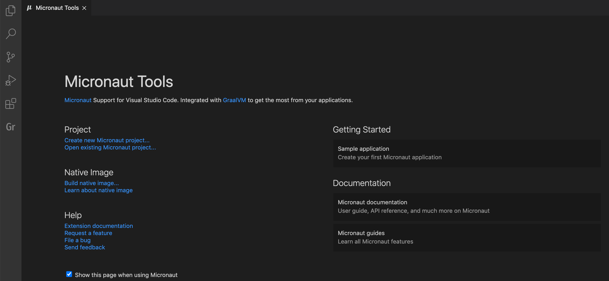

## Features

The GraalVM Tools for Micronaut extension provides:
* Micronaut project creation wizard
* installation of Micronaut CLI
* editing and debugging capabilities for Micronaut projects
* code completion and navigation for Micronaut configuration (YAML) files and Java (available with [Apache NetBeans Language Server extension](https://marketplace.visualstudio.com/items?itemName=asf.apache-netbeans-java))
* ability to build Micronaut projects ahead-of-time into native images with GraalVM
* __Run main with Continuous Mode__ CodeLens runs Micronaut project and reloads it automatically when source code is changed. It is not available as Debugger
* __Launch Java: Continuous Mode__ which is the name of the launch configuration

### Micronaut VS Code Commands

To begin, invoke the Micronaut commands from View > Command Palette (Command Palette can be also opened by pressing F1, or the _Ctrl+Shift+P_ hot keys combination for Linux, and _Command+Shift+P_ for macOS):

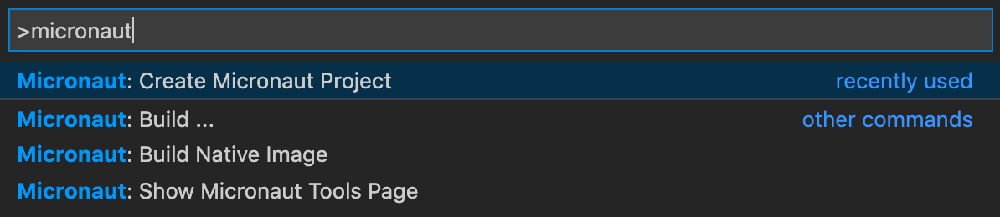

The following commands are available for Micronaut project development:

* `Micronaut: Show Micronaut Tools Page` - show the Micronaut Tools Page
* `Micronaut: Create Micronaut Project` - create a Micronaut project based on [project creation wizard](https://micronaut.io/launch)
* `Micronaut: Build ...` - build a Micronaut project with the user-selected targets
* `Micronaut: Build Native Image` - build a native executable of a Micronaut project
* `Micronaut: Deploy ...` - build and deploy Docker image for Micronaut project

### Extension Settings

This extension contributes the following settings:
* __micronaut.home__ - the optional path to the Micronaut CLI installation
* __micronaut.showWelcomePage__ - show the Micronaut Tools Page on extension activation

## Create Micronaut Project

The Create Micronaut Project command in VS Code supports generating Micronaut applications, CLI applications, and other types of applications that a regular [Micronaut Launch](https://micronaut.io/launch/) application does.
The wizard prompts users to:

  * pick the application type
  * pick the Micronaut version
  * pick the Java version
  * provide a project name
  * provide a base package name
  * pick the project language (Java, Kotlin, Groovy)
  * pick the project features:

  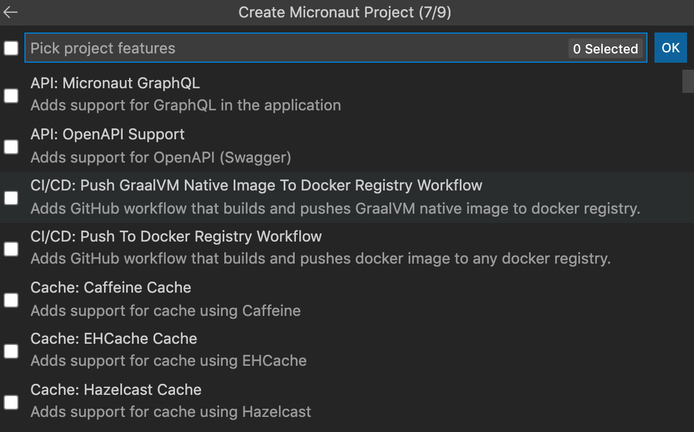

  * pick the build tool (Maven or Gradle)
  * pick the test framework (JUnit, Spock, Kotlintest)

Finally, you are asked to select the destination folder on your local disk and whether to open the created project in a new editor or add it to the current workspace.

The GUI part of the Micronaut extension adds a new view to the Explorer activity, which shows Micronaut projects in the current workspace.

## Generate Native Images of Micronaut Projects

The Micronaut support for VS Code is integrated with GraalVM to get the most from the applications and provide you with rich Native Image capabilities.

[Having set GraalVM as the default runtime and debug environment](../graalvm/README.md#installation-and-setup) in VS Code, invoke the **View > Command Palette > Micronaut: Build...** action, where you can select the build targets (e.g., `clean`, `build`, `nativeImage`, etc.) from a list of available ones.
For example, if your project is built with Maven, and you would like to package the compiled code as a GraalVM native image, select `nativeImage`.
That will run the `mvnw package -Dpackaging=native-image` job.

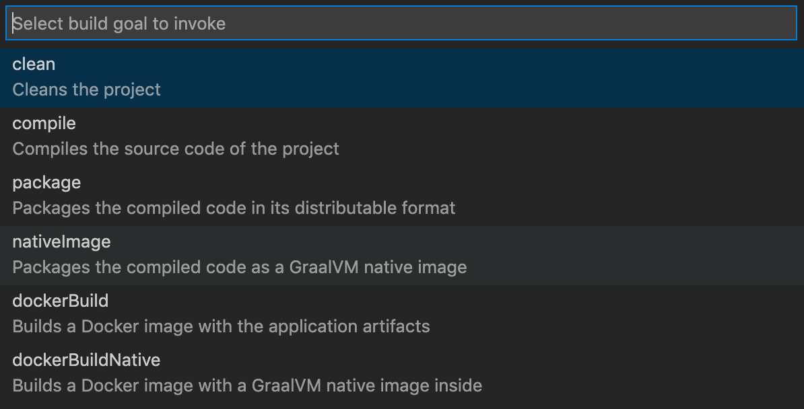

For more details, continue reading to the [Micronaut documentation](https://guides.micronaut.io/micronaut-creating-first-graal-app/guide/index.html#creatingGraalImage).

## Deploy Micronaut Projects to a Docker Registry

The Micronaut support in VS Code allows to build and deploy Docker images to a Docker registry.
- To deploy a dockerized Micronaut application, invoke the action **View** > **Command Palette** > **Micronaut: Deploy...** action.
- To deploy a dockerized Micronaut application, select the **dockerPush** action.
- To build and push docker with a native executable of Micronaut application, invoke the **dockerPushNative** action.

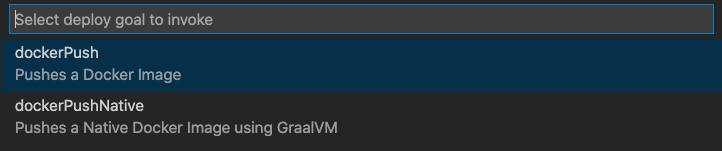

Besides that, you can also push a Micronaut application or a native executable to a Docker Registry from the VS Code Terminal window.
A particular Docker Registry can be configured in the build, see the [Micronaut Deploying Application](https://micronaut-projects.github.io/micronaut-maven-plugin/latest/examples/deploy.html) documentation.

## Deploy and Run Micronaut Applications in a Kubernetes Cluster

GraalVM Tools for Micronaut Extension added support for working with Kubernetes clusters based on Microsofts’s [Visual Studio Code Kubernetes Tools](https://marketplace.visualstudio.com/items?itemName=ms-kubernetes-tools.vscode-kubernetes-tools).
It is now possible to deploy, run and debug a Micronaut application in a Kubernetes cluster from VS Code.

This guide is focused on and tested with [Oracle Container Engine for Kubernetes (OKE)](https://www.oracle.com/uk/cloud-native/container-engine-kubernetes/) and Oracle Container Registry, but Kubernetes features should work in other container registries.
OKE is a fully-managed, scalable, and highly available service that you can use to deploy your containerized applications to Oracle Cloud.

This guide will walk you through the process of deploying a Micronaut application to OKE from VS Code and debugging it.

### Prerequisites
- [Visual Studio Code Kubernetes Tools](https://marketplace.visualstudio.com/items?itemName=ms-kubernetes-tools.vscode-kubernetes-tools)
- [Oracle Cloud Account](https://www.oracle.com/uk/cloud/free/)
- [Access to Oracle Container Engine for Kubernetes (OKE)](https://oracle.github.io/learning-library/oci-library/oci-hol/OKE/workshops/freetier/index.html?lab=intro)
- [Docker](https://docs.docker.com/engine/reference/run/)

## Preparation to Access a Kubernetes Cluster in Oracle Container Registry

### Visual Studio Code Kubernetes Tools

GraalVM Tools for Micronaut Extension uses `kubectl` provided by Microsoft's [Visual Studio Code Kubernetes Tools](https://marketplace.visualstudio.com/items?itemName=ms-kubernetes-tools.vscode-kubernetes-tools).
It has to be installed.

Open Extensions tab, search for "Kubernetes" and install the one from Microsoft.
Once installed, you should see the Kubernetes icon in the left sidebar:
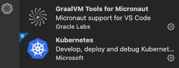

### Oracle Cloud Account

If you have not got an active Oracle Cloud account, create one by following this [link](https://docs.oracle.com/en/cloud/get-started/subscriptions-cloud/csgsg/get-oracle-com-account.html).

### Access to Oracle Container Engine for Kubernetes (OKE)

Supposedly, you have signed in to your Oracle Cloud account.
To be able to deploy Docker images to Oracle Container Registry, you need to setup the access to Oracle Container Engine for Kubernetes (OKE).

**Step 1: Create a Kubernetes cluster in OCI**

Using the Oracle Cloud console, create a Kubernetes cluster with default settings using the *Quick Create* workflow:

1. In the Oracle Cloud console, open the navigation menu and click **Developer Services**.
2. Under Containers, click **Kubernetes Clusters (OKE)**.
3. Then click **Create Cluster**.

For more information, check this [guide](https://docs.oracle.com/en-us/iaas/Content/ContEng/Tasks/contengcreatingclusterusingoke_topic-Using_the_Console_to_create_a_Quick_Cluster_with_Default_Settings.htm).

**Step 2: Set up access to Kubernetes cluster**

You can access your Kubernetes cluster and manage it using `kubectl`.
The `kubectl` command line tool must be configured to communicate with your cluster.
To do that you have to set up a Kubernetes configuration file, _kubeconfig_.
The kubeconfig file (by default stored and can be found in the _$HOME/.kube/config_) provides the necessary details to access the cluster.

See the [Setting Up Local Access to Clusters](https://docs.oracle.com/en-us/iaas/Content/ContEng/Tasks/contengdownloadkubeconfigfile.htm#localdownload) guide for step-by-step instructions.

### Log in to Docker

To be able to dockerize your Micronaut project, push and pull images on a local machine, and deploy to Oracle Container Registry, you will need [Docker](https://docs.docker.com/engine/reference/run/).
To check whether [Docker](https://docs.docker.com/engine/reference/run/) is started and running on your computer, go to VS Code Terminal and type: `docker --help`.

Next you need to login with Docker to your Oracle Container Registry.
Prepare following Oracle Cloud account credentials:

- Oracle Cloud Infrastructure (OCI) tenancy name
- User email address used for your OCI account
- OCI authentification token
- OCI region key

From VS Code Terminal window, log in using the following command:
```bash
docker login -u <tenancy-namespace>/<oci-user-email> -p <auth token> <region-key>.ocir.io
```
For example, if your OCI region is US East (Ashburn), then the key will be `iad`, and the region endpoint will be `https://iad.ocir.io`.
The list of available regions and their keys is available [here](https://docs.oracle.com/en-us/iaas/Content/Registry/Concepts/registryprerequisites.htm).

> NOTE: If the Docker registry is private you will need a Docker registry secret.

This [guide](https://docs.oracle.com/en-us/iaas/Content/ContEng/Tasks/contengpullingimagesfromocir.htm) describes how to create a Docker registry secret and how to specify the image to pull from Oracle Cloud Infrastructure Registry (along with the Docker secret to use) during application deployment to a cluster.

### Specify the Location for Docker Image in Oracle Container Registry

The location where to push your Docker image in Oracle Container Registry should be specified in the project configuration file.

If you used Gradle to build your Micronaut project, open the _gradle.build_ file and update image location:
  ```xml
  dockerBuild {
  images = ["<region-key>.ocir.io/<tenancy-namespace>/<repo-name>/<image-name>:<tag>"]
  }
  ```

See, for example, this example project configuration:
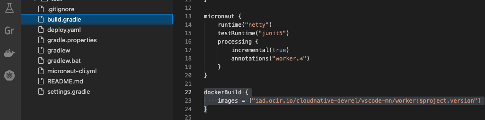

## Deploy a Micronaut Application to OKE

To deploy, run and debug a Micronaut application in Oracle Container Engine for Kubernetes (OKE), the following quick actions for Micronaut are available:

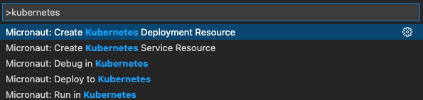

You should start by creating a Kubernetes deployment file that will be applied at the deployment stage.

1. Go to View > Command Palette, search for "Kubernetes" and invoke the **Micronaut: Create Kubernetes Deployment Resource** action. It will start the "Create Kubernetes Deployment File" process.

2. Pick the Docker repository. Since you are using Oracle Container Registry, select **OCIR + region name**. For example:

   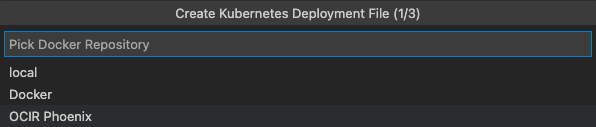

3. Provide your Docker image name and version:

   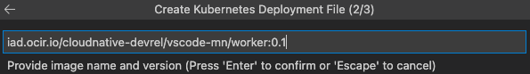

   Currently, available images are not automatically detected, so you need to type it manually.
   Grab the image location from _gradle.build_ or _pom.xml_ you specified in the **Specify the Location for Docker Image in Oracle Container Registry** step.

4. Then you are prompted to select the namespace. Choose default:

   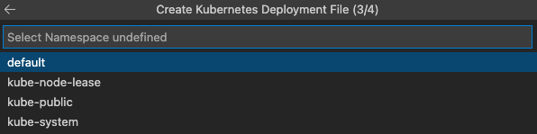

5. Lastly, select a secret for your container registry in OCI (needed only if the Docker registry is private, described in the **Preparation** > **Log in to Docker** section):

    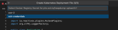

    The `Deploy.yaml` will be created. It will look similar to the following:

    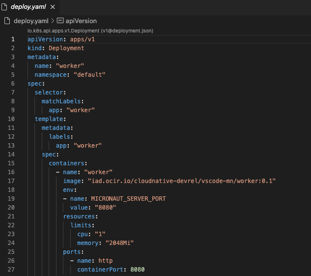

Now you are ready to deploy your Micronaut application to OKE.

1. Go to View > Command Palette, search for **Micronaut: Deploy to Kubernetes** action and invoke it.
   You could have skipped steps 1-3 from above, but if no Kubernetes deployment file exists, VS Code will suggest you to create one at this step.

2. Once you invoke the action, the Output window will open and the "Starting deploy of project" message will be printed.

When you hit this action, the project is packaged with Gradle/Maven to a runnable JAR file, built into a Docker image.
Then Docker pushes this image to the OKE repository (Oracle Container Registry), by applying the _deploy.yaml_ script.
The Kubernetes extension starts port forwarding to connect to the server running in a Kubernetes cluster (`kubectl port-forward` forwards a local port to a port on the Pod).
A direct URL to access your Micronaut REST application from a browser is printed.
Read more on Kubernetes port forwarding [here](https://kubernetes.io/docs/tasks/access-application-cluster/port-forward-access-application-cluster/).

All this can be tracked in the Output window.
If the deployment succeeds, you should see a similar status bar:

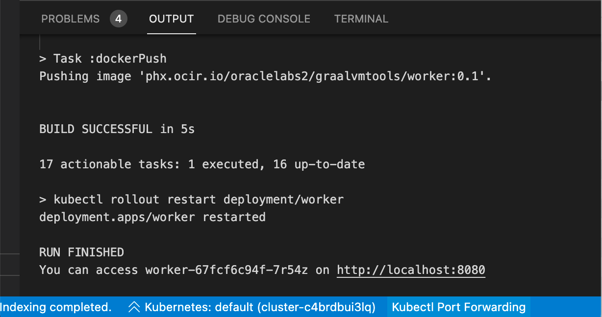

To otherwise check the deployment's status, run:
```bash
kubectl get deployment
```

You can work on other projects, deploy them to another Kubernetes clusters, and they will all be deployed and running from Oracle Container Registry.

## Debug Micronaut Applications in a Kubernetes Cluster

In addition to being able to deploy and run Micronaut applications in Kubernetes, you can also debug your Java application in a Kubernetes cluster directly from VS Code.

> Note: To allow complete Java debugging experience, you need to ensure the [GraalVM Extension Pack for Java](https://marketplace.visualstudio.com/items?itemName=oracle-labs-graalvm.graalvm) is installed. It is not needed if you have installed [GraalVM Tools for Java Extension pack](https://marketplace.visualstudio.com/items?itemName=oracle-labs-graalvm.graalvm-pack), it already includes a full-fledged support for the Java and Micronaut.

With the connection made to a local port (thanks to [Kubernetes port forwarding feature](https://kubernetes.io/docs/tasks/access-application-cluster/port-forward-access-application-cluster/)), you can use your local workstation to debug the application that is running in the Pod.
Having set some breakpoints in your applciation, do the following to start debugging:

1. Go to View > Command Palette, search for **Micronaut: Debug in Kubernetes** action and invoke it.
2. Confirm port forwarding. First time you start debugging your application, deployed in a Kubernetes cluster, a popup window will open in the right bottom corner asking to confirm port forwarding. This will setup a `JAVA_TOOLS_OPTIONS` environment variable in the deployment script file.
3. Then you will be prompted to choose a port forwarding session:

   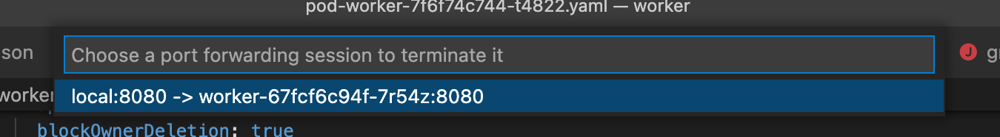

4. Connect the Kubernetes extension to your Kubernetes cluster using **Set Kubeconfig** action.
5. Click on Kubernetes icon in the left sidebar and select the node you are developing.
6. Right-click invoke action Debug (**Attach using Java 8+**):

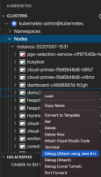

### Feedback

* [Request a feature](https://github.com/graalvm/vscode-extensions/issues/new?labels=enhancement)
* [File a bug](https://github.com/graalvm/vscode-extensions/issues/new?labels=bug)

### Privacy Policy

Read the [Oracle Privacy Policy](https://www.oracle.com/legal/privacy/privacy-policy.html) to learn more.

### Known Issues

The GraalVM Tools for Micronaut Extension extension 0.5.* is Technology Preview, meaning the functionality may not be complete.
