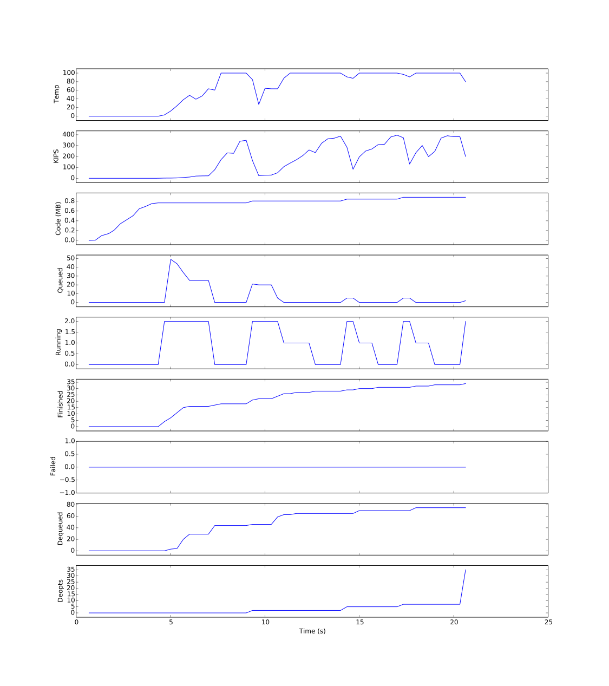

# The Truffle Optimization Thermometer Tool

The Truffle Optimization Thermometer Tool indicates how *warmed-up* your
application is. A *cold* application is running mostly in the interpreter, still
has code to compile, may still loading new code, and may be deoptimizing. A
*warmed up* application is stable and running mostly in compiled code.

It's difficult to talk quantitively about how warm an application is, and there
are many subtle factors at work here, so the tool is more of an *indication* than
a *measurement*.

See https://arxiv.org/abs/1602.00602 for some interesting discussion about
virtual machine warmup.

## Basic usage

Take this example Ruby program. It renders an ERB template. Every now and again
another thread swaps the template.

```ruby
require 'erb'

template = ERB.new('The time is <%= time %>')

Thread.new do
  loop do
    sleep 3 + rand(3)
    template = ERB.new("The time was #{Time.now} but is now <%= time #{'    ' * 10_000} %>")
  end
end

dev_null = File.open('/dev/null', 'w')

loop do
  time = Time.now
  dev_null.puts template.result(binding)
end
```

Run with the `--thermometer` flag (we use `--jvm` for more extreme warmup.)

```
% ruby --jvm --thermometer demo.rb
```

You'll see log lines like this:

```
[thermometer] INFO:   0.75s  🥶    0°    0.77 MB   0.03 GB   55 ▶  2 ▶  66  (  0, 312 )  15 ▼
[thermometer] INFO:   1.06s  🤔   55°    0.77 MB   0.05 GB   34 ▶  2 ▶  68  (  0, 354 )  15 ▼
[thermometer] INFO:   1.37s  😊   94°    0.77 MB   0.07 GB    0 ▶  0 ▶  69  (  0, 356 )  15 ▼
[thermometer] INFO:   1.72s  😊  100°    0.77 MB   0.01 GB    0 ▶  0 ▶  69  (  0, 356 )  15 ▼
[thermometer] INFO:   2.04s  😊  100°    0.77 MB   0.05 GB    0 ▶  0 ▶  70  (  0, 356 )  15 ▼
[thermometer] INFO:   2.37s  😊  100°    0.77 MB   0.12 GB    0 ▶  0 ▶  70  (  0, 356 )  15 ▼
[thermometer] INFO:   2.71s  😊  100°    0.77 MB   0.12 GB    0 ▶  0 ▶  70  (  0, 356 )  15 ▼
[thermometer] INFO:   3.04s  😊  100°    0.77 MB   0.17 GB    0 ▶  0 ▶  70  (  0, 356 )  15 ▼
[thermometer] INFO:   3.37s  😊  100°    0.77 MB   0.22 GB    0 ▶  0 ▶  70  (  0, 356 )  15 ▼
[thermometer] INFO:   3.70s  😊  100°    0.77 MB   0.20 GB    0 ▶  0 ▶  70  (  0, 356 )  15 ▼
[thermometer] INFO:   4.04s  😊  100°    0.77 MB   0.25 GB    0 ▶  0 ▶  70  (  0, 356 )  15 ▼
[thermometer] INFO:   4.43s  😊  100°    0.77 MB   0.01 GB    0 ▶  0 ▶  70  (  0, 356 )  15 ▼
[thermometer] INFO:   4.70s  😊  100°    0.77 MB   0.01 GB    0 ▶  0 ▶  70  (  0, 356 )  15 ▼
[thermometer] INFO:   5.04s  😊  100°    0.77 MB   0.07 GB    0 ▶  0 ▶  70  (  0, 356 )  15 ▼
[thermometer] INFO:   5.58s  🤮   42°    0.81 MB   0.03 GB    8 ▶  2 ▶ 107  (  0, 368 )  22 ▼
[thermometer] INFO:   5.70s  🤔   74°    0.81 MB   0.18 GB    8 ▶  2 ▶ 107  (  0, 368 )  22 ▼
[thermometer] INFO:   6.07s  😊   91°    0.81 MB   0.06 GB    0 ▶  1 ▶ 111  (  0, 373 )  22 ▼
[thermometer] INFO:   6.37s  😊  100°    0.81 MB   0.12 GB    0 ▶  1 ▶ 111  (  0, 373 )  22 ▼
```

```
  ┏━━━━━━━━━━━━━━━━━━━━━━━━━━━━━━━━━━━━━━━━━━━━━━━━━━━━━━━━━━━━━━━━━━ wall clock
  ┃     ┏━━━━━━━━━━━━━━━━━━━━━━━━━━━━━━━━━━━━━━━━━━━━━━━━━━━━━━━━━━━━ indicator (see below)
  ┃     ┃    ┏━━━━━━━━━━━━━━━━━━━━━━━━━━━━━━━━━━━━━━━━━━━━━━━━━━━━━━━ 'temperature' (see below)
  ┃     ┃    ┃       ┏━━━━━━━━━━━━━━━━━━━━━━━━━━━━━━━━━━━━━━━━━━━━━━━ code loaded
  ┃     ┃    ┃       ┃         ┏━━━━━━━━━━━━━━━━━━━━━━━━━━━━━━━━━━━━━ used heap (total - free)
  ┃     ┃    ┃       ┃         ┃        ┏━━━━━━━━━━━━━━━━━━━━━━━━━━━━ queued
  ┃     ┃    ┃       ┃         ┃        ┃     ┏━━━━━━━━━━━━━━━━━━━━━━ running
  ┃     ┃    ┃       ┃         ┃        ┃     ┃     ┏━━━━━━━━━━━━━━━━ finished
  ┃     ┃    ┃       ┃         ┃        ┃     ┃     ┃    ┏━━━━━━━━━━━ failed
  ┃     ┃    ┃       ┃         ┃        ┃     ┃     ┃    ┃   ┏━━━━━━━ dequeued
  ┃     ┃    ┃       ┃         ┃        ┃     ┃     ┃    ┃   ┃     ┏━ deoptimizations and invalidations
5.58s  🤮   42°    0.81 MB   0.03 GB    8 ▶  2 ▶ 107  (  0, 368 )  22 ▼
```

The *temperature* is really the percentage of samples taken during the period
where the top-most Truffle method activation is running in compiled code. Method
preludes set a per-thread flag to indicate whether they're compiled or not. A
separate high-priority timer thread samples this flag.

The indicator is set as follows, in priority order

* 😡 if there was a failure
* 🤮 if there was a deoptimization
* 😊 if temperature is 90 or higher
* 🤔 if temperature is less than 90, or code has been loaded
* 🥶 if temperature is less than 50

## Monitoring performance

`--thermometer.IterationPoint=demo.rb:15` will install an iterations-per-second
counter on any statements at this location. You should ensure there is just one
statement at this location as each statement run will count as an iteration.

```
5.43s  😊  100°   94.382 K i/s    0.81 MB   0.04 GB    0 ▶  1 ▶ 110  (  0, 375 )  23 ▼
                     ┗━━━━━━━━━━━━━━━━━━━━━━━━━━━━━━━━ iterations per second
```

## Logging

A log of the thermometer data in JSON Lines format can be written using
`--thermometer.LogFile=thermometer.jsonl`.

The log can be visualised with a script:

```
% python thermometer-plot.py jvm.jsonl native.jsonl
```



You can pass multiple logs to see them on the same graph.

## Advanced usage

* `--thermometer.SamplingPeriod=10` sets the sampling period in ms
* `--thermometer.ReportingPeriod=300` sets the reporting period in ms

## Overhead

Setting the flag is a volatile write. There is some method indirection in the
interpreter. In compiled code the flag is set with these machine instructions.
Note that the flag is set at the root of each logical method, not at the root of
each compilation unit.

```
movabs    $counter,%rax
movl      $0x1,field(%rax)
lock addl $0x0,(%rsp)
```

## Issues

There is a single flag, so the thermometer works best with applications with a
single thread running most of the time.

The flag is not restored when a call leaves - we found that this added quite a
a bit of overhead.

The sample flag is set for each guest-language method root, so a compilation
unit may set it multiple times increasing overhead.

Counters are `int` so may overflow during a very long running process.

(The `#{'    ' * 10_000}` in the demo is there so code size can be seen to grow
more easily. The demo does eventually stabilise if you run it long enough, but
it's designed to generate a long steady stream of state changes for illustrative
purposes.)
