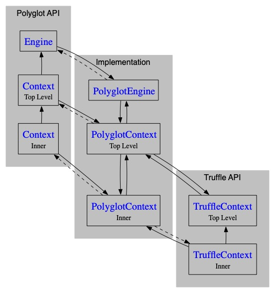

# Automatic Close of Unreachable Context and Engine Objects in Polyglot API

As of Polyglot version 24.2.0, `Context` and `Engine `objects are automatically closed when they are no longer strongly referenced.
This feature ensures that unreachable `Context` and `Engine` instances are correctly cleaned up to minimize memory leaks.
However, it remains highly recommended to manage the lifecycle of `Context` and `Engine` explicitly, ideally using a try-with-resources statement, rather than relying on garbage collection for this purpose.

## Context Lifecycle Management

A `Context` instance is eligible for automatic closure when no strong references to it remain. These references can include the following:

* Direct strong references to the `Context` object.
* Strong references to objects bound to the `Context`, such as `Value` and `PolyglotException` instances.
* Active polyglot threads or any host thread that has explicitly entered the `Context`. A `Context` that is explicitly [entered](https://www.graalvm.org/truffle/javadoc/org/graalvm/polyglot/Context.html#enter()) will not be garbage-collected until it is explicitly [left](https://www.graalvm.org/truffle/javadoc/org/graalvm/polyglot/Context.html#leave()).
* Inner `Context` objects, as inner contexts prevent their parent contexts from being closed if they remain reachable.

When any of these conditions hold, the `Context` instance remains active and will not be garbage-collected and closed.
The presence of active system threads does not prevent a `Context` from being closed.

## Engine Lifecycle Management

The `Engine` object follows a similar approach to lifecycle management.
An `Engine` will only be closed when it no longer has any strong references to it, such as:

* Direct references to the `Engine`.
* Strong references to `Language`, `Instrument`, or `ExecutionListener` instances that were obtained from the `Engine`.

Furthermore, an `Engine` cannot be closed if there is an active `Context` within it or if any `Context` objects that uses this `Engine` remain reachable.
Similar to `Context` objects, the presence of active system threads does not interfere with the automatic closure of an `Engine`.

## TruffleContext and Inner Contexts

In scenarios where a language implementation creates inner contexts using [TruffleLanguage.Env.newInnerContextBuilder()](https://www.graalvm.org/truffle/javadoc/com/oracle/truffle/api/TruffleLanguage.Env.html#newInnerContextBuilder(java.lang.String...)), both the Polyglot API `Context` representing this inner context and the `TruffleContext` must be unreachable to enable automatic closure.
This situation is illustrated in the diagram below, showing an engine with one top-level context and one inner context. Strong references are represented by solid lines, and weak references by dashed lines.

When an inner `Context` is no longer referenced by the embedder, and the corresponding `TruffleContext` instance is no longer referenced by its language implementation, weak references from `PolyglotContext` to `Context` and `TruffleContext` are added to a reference queue.
During the next lifecycle event (such as when a new context is created or closed), this queue is processed, and any unreachable context is closed automatically.
