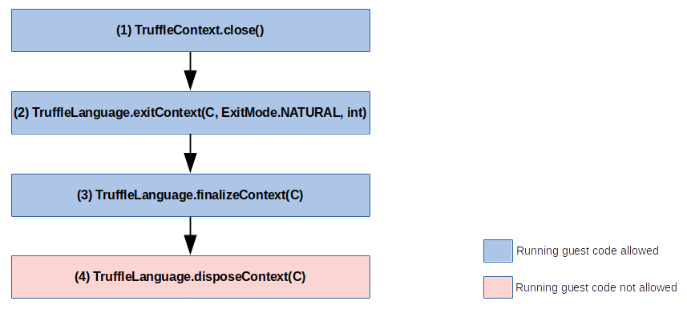
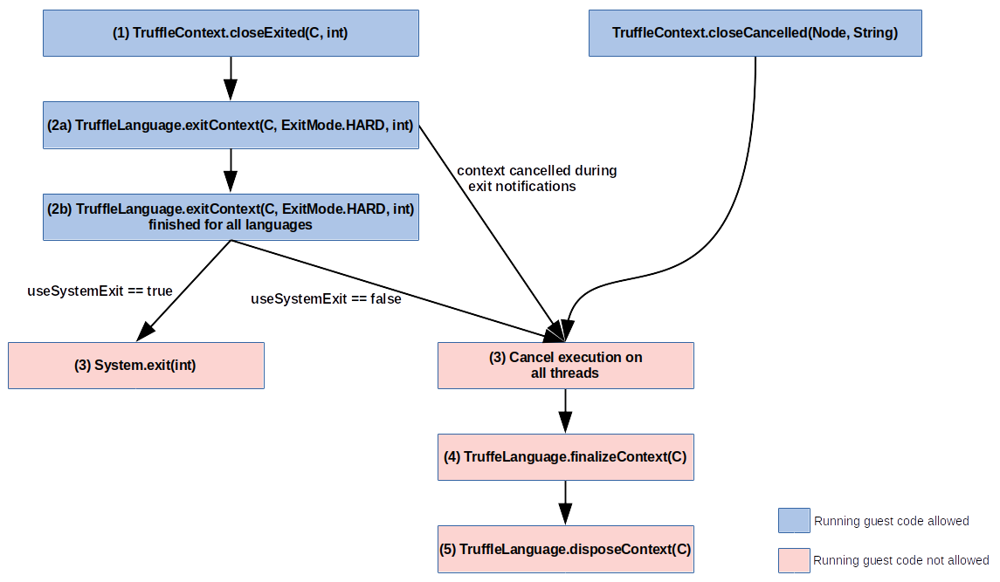

# Context Exit

Different Truffle (guest) languages may use different mechanisms for exiting. This is not optimal as a Truffle language has no way to detect and handle an exit triggered by a different language.

As of 22.0 Truffle has support for polyglot context hard explicit exit triggered by guest languages using [TruffleContext.closeExited(Node,int)](https://www.graalvm.org/truffle/javadoc/com/oracle/truffle/api/TruffleContext.html#closeExited-com.oracle.truffle.api.nodes.Node-int-).
It provides a unified way for languages to trigger the exit of the underlying polyglot context. When triggered, all initialized
guest languages are first notified using [TruffleLanguage.exitContext(C,ExitMode,int)](https://www.graalvm.org/truffle/javadoc/com/oracle/truffle/api/TruffleLanguage.html#exitContext-C-com.oracle.truffle.api.TruffleLanguage.ExitMode-int), then all context threads are stopped, and finally, the context is closed.
The hard explicit exit is simply referred to as "hard exit".

The hard exit is only one of the three types of exit in Truffle. There are the following types of exit.

* The new hard exit introduced above
  * Hard exit notifications are executed with `ExitMode.HARD` as the second parameter of `TruffleLanguage.exitContext(C,ExitMode,int)`.
* Implicit "natural exit"
  * Occurs during normal context close.
  * The newly introduced exit notifications are executed for the natural exit as well, but threads are not forced to stop after the natural exit notifications, and so context threads that are still running can block the natural exit.
  * Natural exit notifications are executed with `ExitMode.NATURAL` as the second parameter of `TruffleLanguage.exitContext(C,ExitMode,int)`.
* "Soft exit"
  * Explicit exit triggered by throwing a Truffle exception of the exception type `ExceptionType.EXIT`.
  * The exception is not automatically thrown in other threads by Truffle and it does not trigger exit notifications or context close on its own.
  * The context is still fully usable after a soft exit and the soft exit can be followed by either the natural or the hard exit.

For completeness, a polyglot context can be also closed by cancelling it using `Context.close(true)`, `TruffleContext.closeCancelled(Node,String)`, or `TruffleContext.closeResourceExhausted(Node,String)`.
The cancel operation leads to immediate stopping of all context threads and closing the context without any exit notifications.

## Soft exit

The soft exit is triggered by throwing a Truffle exception of the exception type `ExceptionType.EXIT` - soft exit exception. The exception is not automatically thrown in other threads by Truffle and it does not trigger exit notifications or context close on its own.
If not caught by languages, the soft exit exception eventually causes the embedder thread to throw a `PolyglotException` to the host with `PolyglotException.isExit() == true` and `PolyglotException.getExitStatus()` equal to the value specified by the soft exit exception.

The context is still fully usable after a soft exit, but the embedder should close the context when it sees the `PolyglotException` with `PolyglotException.isExit() == true`, in which case the soft exit is followed by the natural exit.

## Natural Exit

The natural exit occurs during a normal context close triggered by `Context.close()` or `TruffleContext.close()`. The natural exit illustrated in the figure above consists of the following steps:

1. The natural exit is triggered by `Context.close()` or `TruffleContext.close()`.

2. Exit notifications for all initialized languages are executed - `TruffleLanguage.exitContext(C,ExitMode,int)`, where `ExitMode.NATURAL` is used as the `ExitMode` parameter.
   * Guest code runs normally during exit notifications.

3. All initialized languages are finalized.
   * `TruffleLanguage.finalizeContext(C)` is called for all initalized languages.
   * Guest code runs normally during finalization.

4. All languages are disposed.
   * `TruffleLanguage.disposeContext(C)` is called for all languages.

## Hard Exit

This section describes the hard exit process in detail. The hard exit for a polyglot context can be customized by `Context.Builder.useSystemExit(boolean)`. Therefore,
the following description is divided into two subsections. One for the case when
system exit is not enabled (`Context.Builder.useSystemExit(false)` - the default) and one for the case when system exit
is enabled (`Context.Builder#useSystemExit(true)`). The illustration of the exit process is depicted in the figure above. The figure also relates the exit process to the context cancelling process.
The red color of some of the boxes indicates that the context is invalid at that point and no guest code can be run. More precisely, the first Truffle safepoint will throw either a special `ThreadDeath` exit exception or
a special `ThreadDeath` cancel exception depending on whether the hard exit or the cancel operation is in progress.

### Behavior if useSystemExit is disabled (default)

1. The exit is triggered by [TruffleContext.closeExited(Node,int)](https://www.graalvm.org/truffle/javadoc/com/oracle/truffle/api/TruffleContext.html#closeExited-com.oracle.truffle.api.nodes.Node-int-).

2. Exit notifications for all initialized languages are executed - [TruffleLanguage.exitContext(C,ExitMode,int)](https://www.graalvm.org/truffle/javadoc/com/oracle/truffle/api/TruffleLanguage.html#exitContext-C-com.oracle.truffle.api.TruffleLanguage.ExitMode-int), where `ExitMode.HARD` is used as the `ExitMode` parameter.
   * Guest code runs normally during exit notifications.
   * If the context is not cancelled during exit notifications (during step 2a) and reaches step 2b, the exit process proceeds with the next step. Otherwise, the exit notifications are interrupted and the context is immediately cancelled.

3. All context threads are forced to stop by throwing a special `ThreadDeath` exit exception from Truffle safepoints.
   * To exit threads reliably, languages need to ensure that `ThreadDeath` is always immediately rethrown and guest language exception handlers and finally blocks are not run.
   * The embedder threads eventually throw a `PolyglotException` to the host with `PolyglotException.isExit() == true` and `PolyglotException.getExitStatus()`
     being equal to the exit code originally specified as the second parameter to the first call to`TruffleContext.closeExited(Node,int)`.
   * Note that from step 3 the exit process is similar to the cancelling process as indicated by the figure, but the cancelling process uses a special `ThreadDeath` cancel exception
     and the `PolyglotException` thrown to the host has `PolyglotException.isCancelled() == true` instead of `PolyglotException.isExit() == true`.

4. All initialized languages are finalized.
   * `TruffleLanguage.finalizeContext(C)` is called for all initalized languages.
   * Running any guest code in `TruffleLanguage.finalizeContext(C)` will throw the special `ThreadDeath` exit exception from the first Truffle safepoint.
   * Languages should skip any finalization that would require running guest code. A language can find out if it can run guest code in `TruffleLanguage.finalizeContext(C)` by checking if `TruffleLanguage.exitContext(C,ExitMode,int)` was previously called with ExitMode.NATURAL,
   or by checking that `TruffleContext.isClosed()` returns `false`.

5. All languages are disposed.
   * `TruffleLanguage.disposeContext(C)` is called for all languages.

6. The context is closed.

### Behavior if useSystemExit is enabled

1. The exit is triggered by [TruffleContext.closeExited(Node,int)](https://www.graalvm.org/truffle/javadoc/com/oracle/truffle/api/TruffleContext.html#closeExited-com.oracle.truffle.api.nodes.Node-int-).
   * Same as with system exit disabled.

2. Exit notifications for all initialized languages are executed - [TruffleLanguage.exitContext(C,ExitMode,int)](https://www.graalvm.org/truffle/javadoc/com/oracle/truffle/api/TruffleLanguage.html#exitContext-C-com.oracle.truffle.api.TruffleLanguage.ExitMode-int), where `ExitMode.HARD` is used as the `ExitMode` parameter.
   * Same as with system exit disabled.

3. `System.exit(int)` is called to terminate the whole host application providing the fastest exit possible.
   * The exit code passed to `System.exit(int)`
     is the one originally specified as the second parameter to the first call to`TruffleContext.closeExited(Node,int)`.

## Example Usage

The [SimpleLanguage](https://github.com/graalvm/simplelanguage) demonstrates the usage of the hard context exit. The following aspects are demonstrated.

* [SLExitBuiltin](https://github.com/graalvm/simplelanguage/blob/master/language/src/main/java/com/oracle/truffle/sl/builtins/SLExitBuiltin.java) demonstrates triggering the context exit.
* [SLRegisterShutdownHookBuiltin](https://github.com/graalvm/simplelanguage/blob/master/language/src/main/java/com/oracle/truffle/sl/builtins/SLRegisterShutdownHookBuiltin.java) demonstrates registration of shutdown hooks that are executed during the exit notification defined in [SLLanguage](https://github.com/graalvm/simplelanguage/blob/master/language/src/main/java/com/oracle/truffle/sl/SLLanguage.java).
* [SLExitTest](https://github.com/graalvm/simplelanguage/blob/master/language/src/test/java/com/oracle/truffle/sl/test/SLExitTest.java) demonstrates the usage of the builtins defined above.
