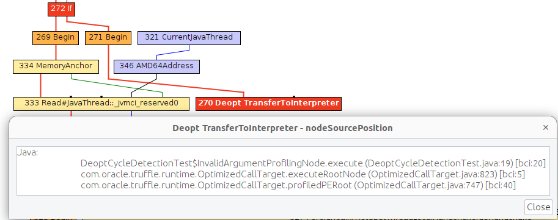

# Optimizing Truffle Interpreters

This document discusses tools for optimizing or debugging Truffle interpreters for peak temporal performance.

## Strategy

1. Run with a profiler to sample the application and identify responsible compilation units. Use a sampling delay (`--cpusampler.Delay=MILLISECONDS`) to only profile after warmup. See the [Profiling](Profiling.md) guide.

2. Understand what is being compiled and look for deoptimizations. Methods that are listed to run mostly in the interpreter likely have a problem with deoptimization.

3. Simplify the code as much as possible where it still shows the performance problem.

4. Enable performance warnings and list boundary calls.

5. Dump the Graal graph of the responsible compilation unit and look at the phase `After TruffleTier`.
   1. Look at the Graal graphs at the phases `After TruffleTier` and `After PartialEscape` and check if it is what you would expect.
   If there are nodes there that you don't want to be there, think about how to guard against including them.
   If there are more complex nodes there than you want, think about how to add specialisations that generate simpler code.
   If there are nodes you think should be there in a benchmark that are not, think about how to make values dynamic so they are not optimized away.

7. Search for `Invoke` nodes in the Graal IR. `Invoke` nodes that are not representing guest language calls should be specialized away. This may not be always possible, e.g., if the method does I/O.

8. Search for control flow splits (red lines) and investigate whether they result from control flow caused by the guest application or are just artifacts from the language implementation. The latter should be avoided if possible.

9. Search for indirections in linear code (`Load` and `LoadIndexed`) and try to minimize the code. The less code that is on the hot-path the better.

## Truffle Compiler Options

A full list of the latest expert and internal options can be found in the [Options](Options.md) guide.

## Observing Compilations

This section provides an overview of most of the available command line options to observe compilations.

Note: Most options also require the additional `--experimental-options` flag set.

The `--engine.TraceCompilation` command prints a line each time a method is compiled:

```shell
[engine] opt done   engine=2  id=213   EqualityConstraint.execute                         |Tier 1|Time    14(  11+3   )ms|AST   31|Inlined   0Y   2N|IR    218/   365|CodeSize    1386|Addr 0x782dd1fb9300|CompId 23519  |UTC 2025-07-08T08:25:20.339|Src octane-deltablue.js:528 0xb0b56c7b
```

Here is a quick overview of the information provided in these logs:
- `engine` - Unique identifier of the engine the compilation is done for.
- `id` - Unique identifier of the call target.
- `Tier` - For which compilation tier was the target scheduled.
- `Time` - How long did the compilation last, with separation between the Truffle tier (mainly partial evaluation) and the Graal Tiers.
- `AST` - The targets non-trivial node count.
- `Inlined` - How many calls were inlined and how many remained calls after inlining.
- `IR` - Graal node count after partial evaluation and after compilation.
- `CodeSize` - The size of the code generated for the call target.
- `Addr` - The address of the compiled code.
- `CompId` - VM specific compilation ID of the compilation.
- `UTC` - The time when the event happened.
- `Src` - Abbreviated source section of the call target and the hash code of the source.

The `--engine.TraceCompilationDetails` command prints a line when compilation is queued, unqueued, started, or completed:

```shell
[engine] opt queued engine=2  id=206   BinaryConstraint.output                            |Tier 1|Count/Thres         75/      100|Queue: Size    3 Change +1  Load  0,25 Time     0us                                   |UTC 2025-07-08T08:25:19.974|Src octane-deltablue.js:416 0xb0b56c7b
[engine] opt queued engine=2  id=208   OrderedCollection.size                             |Tier 1|Count/Thres        100/      125|Queue: Size    4 Change +1  Load  0,31 Time     0us                                   |UTC 2025-07-08T08:25:19.997|Src octane-deltablue.js:71 0xb0b56c7b
[engine] opt queued engine=2  id=32    Array.prototype.push                               |Tier 1|Count/Thres        125/      175|Queue: Size    5 Change +1  Load  0,44 Time     0us                                   |UTC 2025-07-08T08:25:20.025|Src <builtin>:1 0xe756ac41
[engine] opt start  engine=2  id=206   BinaryConstraint.output                            |Tier 1|Priority     93750|Rate 0,000003|Queue: Size    4 Change -1  Load  0,50 Time   195us                                   |UTC 2025-07-08T08:25:20.039|Src octane-deltablue.js:416 0xb0b56c7b|Bonuses first tier
... more log ...
[engine] opt done   engine=2  id=206   BinaryConstraint.output                            |Tier 1|Time   126( 122+4   )ms|AST   32|Inlined   0Y   0N|IR    138/   169|CodeSize     608|Addr 0x782dd1ecec00|CompId 22170  |UTC 2025-07-08T08:25:20.170|Src octane-deltablue.js:416 0xb0b56c7b
[engine] opt start  engine=2  id=208   OrderedCollection.size                             |Tier 1|Priority    323626|Rate 0,000005|Queue: Size    8 Change -1  Load  0,88 Time    17us                                   |UTC 2025-07-08T08:25:20.173|Src octane-deltablue.js:71 0xb0b56c7b|Bonuses first tier
[engine] opt queued engine=2  id=215   OrderedCollection.at                               |Tier 1|Count/Thres        350/      325|Queue: Size    9 Change +1  Load  0,81 Time     0us                                   |UTC 2025-07-08T08:25:20.185|Src octane-deltablue.js:67 0xb0b56c7b
... more log ...
[engine] opt queued engine=2  id=208   OrderedCollection.size                             |Tier 2|Count/Thres      10000/    10000|Queue: Size   19 Change +1  Load  1,00 Time     0us                                   |UTC 2025-07-08T08:25:20.274|Src octane-deltablue.js:71 0xb0b56c7b
[engine] opt queued engine=2  id=206   BinaryConstraint.output                            |Tier 2|Count/Thres      10000/    10000|Queue: Size   20 Change +1  Load  1,00 Time     0us                                   |UTC 2025-07-08T08:25:20.277|Src octane-deltablue.js:416 0xb0b56c7b
[engine] opt done   engine=2  id=214   Planner.addConstraintsConsumingTo                  |Tier 1|Time    90(  68+22  )ms|AST   79|Inlined   0Y   5N|IR    467/   841|CodeSize    3515|Addr 0x782dd1f74e80|CompId 23040  |UTC 2025-07-08T08:25:20.293|Src octane-deltablue.js:743 0xb0b56c7b
[engine] opt start  engine=2  id=205   BinaryConstraint.input                             |Tier 1|Priority   4087953|Rate 0,000111|Queue: Size   19 Change -1  Load  1,00 Time    25us                                   |UTC 2025-07-08T08:25:20.294|Src octane-deltablue.js:409 0xb0b56c7b|Bonuses first tier
... more log ...
[engine] opt done   engine=2  id=215   OrderedCollection.at                               |Tier 2|Time     5(   2+2   )ms|AST   23|Inlined   0Y   0N|IR     49/    94|CodeSize     485|Addr 0x782dd23b7980|CompId 26009  |UTC 2025-07-08T08:25:21.228|Src octane-deltablue.js:67 0xb0b56c7b
[engine] opt start  engine=2  id=206   BinaryConstraint.output                            |Tier 2|Priority   1723949|Rate 0,003724|Queue: Size   82 Change -1  Load  1,00 Time    25us                                   |UTC 2025-07-08T08:25:21.228|Src octane-deltablue.js:416 0xb0b56c7b|Bonuses
[engine] opt done   engine=2  id=206   BinaryConstraint.output                            |Tier 2|Time     6(   3+2   )ms|AST   32|Inlined   0Y   0N|IR    100/   144|CodeSize     639|Addr 0x782dd23b8300|CompId 26014  |UTC 2025-07-08T08:25:21.234|Src octane-deltablue.js:416 0xb0b56c7b
[engine] opt start  engine=2  id=240   Plan.size                                          |Tier 2|Priority   1565159|Rate 0,003621|Queue: Size   81 Change -1  Load  1,00 Time    23us                                   |UTC 2025-07-08T08:25:21.234|Src octane-deltablue.js:770 0xb0b56c7b|Bonuses
[engine] opt done   engine=2  id=240   Plan.size                                          |Tier 2|Time     6(   4+2   )ms|AST   19|Inlined   1Y   0N|IR     43/   112|CodeSize     463|Addr 0x782dd23bdc00|CompId 26018  |UTC 2025-07-08T08:25:21.240|Src octane-deltablue.js:770 0xb0b56c7b
[engine] opt start  engine=2  id=239   Plan.execute                                       |Tier 2|Priority   1591366|Rate 0,004334|Queue: Size   80 Change -1  Load  1,00 Time    27us                                   |UTC 2025-07-08T08:25:21.240|Src octane-deltablue.js:778 0xb0b56c7b|Bonuses
[engine] opt done   engine=2  id=239   Plan.execute                                       |Tier 2|Time    45(  28+17  )ms|AST   53|Inlined   9Y   0N|IR    609/   552|CodeSize    1583|Addr 0x782dd23c5d00|CompId 26052  |UTC 2025-07-08T08:25:21.285|Src octane-deltablue.js:778 0xb0b56c7b
... more log ...
[engine] opt unque. engine=2  id=266   Date.prototype.valueOf                             |Tier 2|Count/Thres     145950/    10000|Queue: Size   15 Change  0  Load  1,00 Time     0us                                   |UTC 2025-07-08T08:25:26.409|Src <builtin>:1 0xe756ac41|Reason Target inlined into only caller
```

Here is a quick overview of the information added in these logs:
- `Count/Thres` - What is the call and loop count of the target and what is the threshold needed to add the compilation to the queue.
- `Queue: Size` - How many compilations are in the compilation queue.
- `Queue: Change` - How did this event impact the compilation queue (e.g. certain events can prune the queue of unneeded compilation tasks).
- `Queue: Load` - A metric of whether the queue is over/under loaded. Normal load is represented with 1, less then 1 is underloaded and greater than 1 is overloaded.
- `Queue: Time` - How long did the event take.
- `Reason` - The runtime reported reason for the event.

The `--engine.TraceCompilationAST` command prints the Truffle AST for each compilation:

```shell
[engine] opt AST          OrderedCollection.size <split-57429b3a>                     |ASTSize      10/   10 |Calls/Thres   10559/    3 |CallsAndLoop/Thres   10559/ 1000
  FunctionRootNode
    body = FunctionBodyNode
      body = DualNode
        left = JSWriteCurrentFrameSlotNodeGen
          rhsNode = JSPrepareThisNodeGen
            operandNode = AccessThisNode
        right = TerminalPositionReturnNode
          expression = PropertyNode
            target = PropertyNode
              target = JSReadCurrentFrameSlotNodeGen
              cache = PropertyGetNode
                cacheNode = ObjectPropertyGetNode
                  receiverCheck = ShapeCheckNode
            cache = PropertyGetNode
              cacheNode = ArrayLengthPropertyGetNode
                receiverCheck = ShapeCheckNode
                arrayLengthRead = ArrayLengthReadNodeGen
```

The `--engine.TraceInlining` command prints guest-language inlining decisions for each compilation:

```shell
[engine] inline start     Plan.execute                                                |call diff        0.00 |Recursion Depth      0 |Explore/inline ratio     1.00 |IR Nodes         2704 |Frequency        1.00 |Truffle Callees      5 |Forced          false |Depth               0
[engine] Inlined            Plan.size                                                 |call diff     -203.75 |Recursion Depth      0 |Explore/inline ratio      NaN |IR Nodes          175 |Frequency      101.88 |Truffle Callees      1 |Forced          false |Depth               1
[engine] Inlined              OrderedCollection.size <split-e13c02e>                  |call diff     -101.88 |Recursion Depth      0 |Explore/inline ratio      NaN |IR Nodes          157 |Frequency      101.88 |Truffle Callees      0 |Forced          false |Depth               2
[engine] Inlined            Plan.constraintAt                                         |call diff     -201.75 |Recursion Depth      0 |Explore/inline ratio      NaN |IR Nodes          206 |Frequency      100.88 |Truffle Callees      1 |Forced          false |Depth               1
[engine] Inlined              OrderedCollection.at                                    |call diff     -100.88 |Recursion Depth      0 |Explore/inline ratio      NaN |IR Nodes          232 |Frequency      100.88 |Truffle Callees      0 |Forced          false |Depth               2
[engine] Inlined            ScaleConstraint.execute                                   |call diff       -0.00 |Recursion Depth      0 |Explore/inline ratio      NaN |IR Nodes          855 |Frequency        0.00 |Truffle Callees      0 |Forced          false |Depth               1
[engine] Inlined            EqualityConstraint.execute                                |call diff     -299.63 |Recursion Depth      0 |Explore/inline ratio      NaN |IR Nodes          295 |Frequency       99.88 |Truffle Callees      2 |Forced          false |Depth               1
[engine] Inlined              BinaryConstraint.output <split-1e163df7>                |call diff      -99.88 |Recursion Depth      0 |Explore/inline ratio      NaN |IR Nodes          259 |Frequency       99.88 |Truffle Callees      0 |Forced          false |Depth               2
[engine] Inlined              BinaryConstraint.input <split-2dfade22>                 |call diff      -99.88 |Recursion Depth      0 |Explore/inline ratio      NaN |IR Nodes          259 |Frequency       99.88 |Truffle Callees      0 |Forced          false |Depth               2
[engine] Inlined            EditConstraint.execute                                    |call diff       -1.00 |Recursion Depth      0 |Explore/inline ratio      NaN |IR Nodes           22 |Frequency        1.00 |Truffle Callees      0 |Forced          false |Depth               1
[engine] inline done      Plan.execute                                                |call diff        0.00 |Recursion Depth      0 |Explore/inline ratio     1.00 |IR Nodes         2704 |Frequency        1.00 |Truffle Callees      5 |Forced          false |Depth               0
```

The `--engine.TraceSplitting` command prints guest-language splitting decisions:

```shell
[engine] split   0-4310d43-1     Strength                                                    |ASTSize       6/    6 |Calls/Thres       2/    3 |CallsAndLoop/Thres       2/ 1000 |SourceSection /Users/christianhumer/graal/4dev/js-benchmarks/octane-deltablue.js~139:4062-4089
[engine] split   1-4b0d79fc-1     Strength                                                    |ASTSize       6/    6 |Calls/Thres       2/    3 |CallsAndLoop/Thres       2/ 1000 |SourceSection /Users/christianhumer/graal/4dev/js-benchmarks/octane-deltablue.js~140:4119-4150
```


The `--engine.TracePerformanceWarnings=(call|instanceof|store|all)` command prints code which may not be ideal for performance. The `call` enables warnings when partial evaluation cannot inline the virtual runtime call. The `instanceof` enables warnings when partial evaluation cannot resolve virtual instanceof to an exact type.
The `store` enables warnings when the store location argument is not a partial evaluation constant:

```shell
[engine] perf warn        ScaleConstraint.execute                                     |Partial evaluation could not inline the virtual runtime call Virtual to HotSpotMethod<ConditionProfile.profile(boolean)> (167|MethodCallTarget).
  Approximated stack trace for [167 | MethodCallTarget:    at com.oracle.truffle.js.nodes.control.IfNode.execute(IfNode.java:158)
    at com.oracle.truffle.js.nodes.binary.DualNode.execute(DualNode.java:125)
    at com.oracle.truffle.js.nodes.function.FunctionBodyNode.execute(FunctionBodyNode.java:73)
    at com.oracle.truffle.js.nodes.function.FunctionRootNode.executeInRealm(FunctionRootNode.java:147)
    at com.oracle.truffle.js.runtime.JavaScriptRealmBoundaryRootNode.execute(JavaScriptRealmBoundaryRootNode.java:93)
    at com.oracle.truffle.runtime.OptimizedCallTarget.executeRootNode(OptimizedCallTarget.java:503)
    at com.oracle.truffle.runtime.OptimizedCallTarget.profiledPERoot(OptimizedCallTarget.java:480)
```

The `--engine.CompilationStatistics` command prints statistics on compilations at the end of the process:

```shell
[engine] Truffle runtime statistics for engine 1
    Compilations                : 2763
      Success                   : 2743
      Temporary Bailouts        : 17
        jdk.graal.compiler.core.common.CancellationBailoutException: Compilation cancelled.: 16
        jdk.graal.compiler.core.common.RetryableBailoutException: Assumption invalidated while compiling code: IsolatedObjectConstant[Object]: 1
      Permanent Bailouts        : 0
      Failed                    : 0
      Interrupted               : 3
    Invalidated                 : 84
        Unknown Reason          : 45
        Profiled Argument Types : 22
        validRootAssumption Split call node: 12
        expression invalidatePropertyAssumption: 1
        getTextPos invalidatePropertyAssumption: 1
        X_OK invalidateAllPropertyAssumptions: 1
        statements invalidatePropertyAssumption: 1
        typed object location generalizing object type !class com.oracle.truffle.js.runtime.objects.Nullish => !class java.lang.Object Object@0[final=false][type=class com.oracle.truffle.js.runtime.objects.Nullish]: 1
    Queues                      : 3410
    Dequeues                    : 262
        Split call node         : 124
        Target inlined into only caller: 87
        validRootAssumption Split call node: 28
        null                    : 17
        Profiled Argument Types : 6
    Splits                      : 5581
    Compilation Accuracy        : 0,969598
    Queue Accuracy              : 0,923167
    Compilation Utilization     : 2,685016
    Remaining Compilation Queue : 409
    Time to queue               : count=3410, sum=12895957640, min=       0, average=  3781805,76, max=11311217, maxTarget=Math.floor
    Time waiting in queue       : count=2763, sum=1247424699, min=      40, average=   451474,74, max= 4762017, maxTarget=tryGetTypeFromEffectiveTypeNode
  ---------------------------   :
  AST node statistics           :
    Truffle node count          : count=2752, sum=    348085, min=       1, average=      126,48, max=    5404, maxTarget=checkSignatureDeclaration
      Trivial                   : count=2752, sum=    124817, min=       0, average=       45,36, max=    2707, maxTarget=visitEachChild
      Non Trivial               : count=2752, sum=    223268, min=       1, average=       81,13, max=    3162, maxTarget=checkSignatureDeclaration
        Monomorphic             : count=2752, sum=    217660, min=       1, average=       79,09, max=    3042, maxTarget=checkSignatureDeclaration
        Polymorphic             : count=2752, sum=      4239, min=       0, average=        1,54, max=      71, maxTarget=checkSignatureDeclaration
        Megamorphic             : count=2752, sum=      1369, min=       0, average=        0,50, max=      49, maxTarget=checkSignatureDeclaration
    Truffle call count          : count=2752, sum=      7789, min=       0, average=        2,83, max=     110, maxTarget=forEachChild
      Indirect                  : count=2752, sum=        29, min=       0, average=        0,01, max=       3, maxTarget=emitLeadingComments
      Direct                    : count=2752, sum=      7760, min=       0, average=        2,82, max=     110, maxTarget=forEachChild
        Dispatched              : count=2752, sum=      6285, min=       0, average=        2,28, max=     110, maxTarget=forEachChild
        Inlined                 : count=2752, sum=      1475, min=       0, average=        0,54, max=      60, maxTarget=parseList <split-8113>
        ----------              :
        Cloned                  : count=2752, sum=         0, min=       0, average=        0,00, max=       0, maxTarget=Array.prototype.push
        Not Cloned              : count=2752, sum=      7747, min=       0, average=        2,82, max=     110, maxTarget=forEachChild
    Truffle loops               : count=2752, sum=       723, min=       0, average=        0,26, max=      12, maxTarget=pipelineEmitWithComments
  ---------------------------   :
  Compilation Tier 1            :
    Compilation Rate            :    471075,74 bytes/second
    Truffle Tier Rate           :   1273853,94 bytes/second
    Graal Tier Rate             :    922948,70 bytes/second
    Installation Rate           :   5640071,94 bytes/second
    Time for compilation (us)   : count=2637, sum=  20538922, min=     727, average=     7788,75, max= 2154173, maxTarget=createPrinter
      Truffle Tier (us)         : count=2623, sum=   7595366, min=     255, average=     2895,68, max=  306107, maxTarget=createPrinter
      Graal Tier (us)           : count=2623, sum=  10483126, min=     378, average=     3996,62, max= 1665018, maxTarget=createPrinter
      Code Installation (us)    : count=2623, sum=   1715472, min=      39, average=      654,01, max=  183048, maxTarget=createPrinter
    Graal node count            :
      After Truffle Tier        : count=2627, sum=   1089218, min=      88, average=      414,62, max=   12999, maxTarget=forEachChild
      After Graal Tier          : count=2624, sum=   2190826, min=     127, average=      834,92, max=   63837, maxTarget=createPrinter
    Graal compilation result    :
      Code size                 : count=2623, sum=   9675388, min=     492, average=     3688,67, max=  238448, maxTarget=createPrinter
      Total frame size          : count=2623, sum=    350080, min=      64, average=      133,47, max=    5328, maxTarget=createPrinter
      Exception handlers        : count=2623, sum=      9316, min=       1, average=        3,55, max=     125, maxTarget=forEachChild
      Infopoints                : count=2623, sum=    105619, min=       5, average=       40,27, max=    1837, maxTarget=forEachChild
        CALL                    : count=2623, sum=    105619, min=       5, average=       40,27, max=    1837, maxTarget=forEachChild
    Marks                       : count=2623, sum=     13115, min=       5, average=        5,00, max=       5, maxTarget=Array.prototype.push
    Data references             : count=2623, sum=    185670, min=       9, average=       70,79, max=    4153, maxTarget=createPrinter
  ---------------------------   :
  Compilation Tier 2            :
    Compilation Rate            :    141825,62 bytes/second
    Truffle Tier Rate           :    397107,38 bytes/second
    Graal Tier Rate             :    243094,58 bytes/second
    Installation Rate           :   4122848,22 bytes/second
    Time for compilation (us)   : count= 123, sum=  11418247, min=     745, average=    92831,28, max=  456707, maxTarget=checkSignatureDeclaration
      Truffle Tier (us)         : count= 120, sum=   4077990, min=     288, average=    33983,25, max=  152158, maxTarget=WhileNode$WhileDoRepeatingNode@72d2eaac typescript-polybench.js:16129~ 'utf8ToBytes'<OSR>
      Graal Tier (us)           : count= 120, sum=   6661604, min=     310, average=    55513,37, max=  343028, maxTarget=checkSignatureDeclaration
      Code Installation (us)    : count= 120, sum=    392786, min=      42, average=     3273,22, max=   68576, maxTarget=JSArrayBufferView.@52bcd02
    Graal node count            :
      After Truffle Tier        : count= 125, sum=    331695, min=      13, average=     2653,56, max=   11989, maxTarget=checkSignatureDeclaration
      After Graal Tier          : count= 120, sum=    432639, min=      46, average=     3605,33, max=   19199, maxTarget=checkSignatureDeclaration
    Graal compilation result    :
      Code size                 : count= 120, sum=   1619400, min=     192, average=    13495,00, max=   72744, maxTarget=checkSignatureDeclaration
      Total frame size          : count= 120, sum=     25728, min=      48, average=      214,40, max=     768, maxTarget=bindEach <split-2459>
      Exception handlers        : count= 120, sum=      1080, min=       0, average=        9,00, max=      84, maxTarget=checkSignatureDeclaration
      Infopoints                : count= 120, sum=      7236, min=       3, average=       60,30, max=     401, maxTarget=checkSignatureDeclaration
        CALL                    : count= 120, sum=      7236, min=       3, average=       60,30, max=     401, maxTarget=checkSignatureDeclaration
    Marks                       : count= 120, sum=      1116, min=       5, average=        9,30, max=      35, maxTarget=checkIndexConstraintForProperty
    Data references             : count= 120, sum=     25252, min=       4, average=      210,43, max=    1369, maxTarget=checkSignatureDeclaration
```

The `--engine.CompilationStatisticDetails` command prints histogram information on individual Graal nodes in addition to the previous compilation statistics:

```shell
  Graal nodes after Truffle tier                    :
      FrameState                                    : count= 168, sum=   35502, min=       1, average=      211.32, max=    2048, maxTarget=deltaBlue
      FixedGuardNode                                : count= 168, sum=   18939, min=       0, average=      112.73, max=    1048, maxTarget=change
      LoadFieldNode                                 : count= 168, sum=   14432, min=       0, average=       85.90, max=     814, maxTarget=EditConstraint
      ...
  Graal nodes after Graal tier                      :
      BeginNode                                     : count= 166, sum=   33333, min=       0, average=      200.80, max=    2110, maxTarget=change
      FrameState                                    : count= 166, sum=   30591, min=       0, average=      184.28, max=    2393, maxTarget=MeasureDefault
      AMD64AddressNode                              : count= 166, sum=   20072, min=       0, average=      120.92, max=    1960, maxTarget=MeasureDefault
      ...
```

The `--engine.TraceSourceCache` command prints a line for each source cache miss, eviction, or failure. `--engine.TraceSourceCacheDetails` additionally prints a line for each source cache hit or uncache miss:

```shell
[engine] source-cache-miss  0xb0b56c7b octane-deltablue.js                               |ParseTime  294 ms|Engine 2 |Layer 1 |CallTarget 27   |Lang js        |Policy EXCLUSIVE|WEAK    |UTC 2025-07-08T08:25:19.042
[engine] source-cache-hit   0xb0b56c7b octane-deltablue.js                               |Hits            1|Engine 2 |Layer 1 |CallTarget 27   |Lang js        |Policy EXCLUSIVE|WEAK    |UTC 2025-07-08T08:25:19.280
[engine] source-cache-evict 0xb0b56c7b octane-deltablue.js                               |Hits            7|Engine 2 |Layer 1 |CallTarget 27   |Lang js        |Policy EXCLUSIVE|WEAK    |UTC 2025-07-08T08:25:21.007
```
Repeated source cache evictions of the same sources may lead to repeated parsing and compilation of the same sources under different call target IDs. This usually points at a bug on the embedder size - missing or insufficient caching of sources.

The `--engine.SourceCacheStatistics` command prints statistics on source cache for an engine when the engine is closed:

```shell
[engine] Polyglot source cache statistics for engine 2
--- SHARING LAYER 1; WEAK CACHE -------------------------
    Languages                                  :
         regex                                 :
            Character Based Sources Stats      :
                Sources                        : count=             14
                    Size (C)                   : count=             14, sum=                     384, min=      20, avg=    27,43, max=         33, maxSource=0xde3bf656 /^--warmup-iterations(?:=(.*))?$/
                    Biggest Sources            :
                        0xc34c7396             : size=              33, name=/^--show-intermediate(?:=(.*))?$/
                        0xde3bf656             : size=              33, name=/^--warmup-iterations(?:=(.*))?$/
                        0x58e35256             : size=              30, name=/^--profile-memory(?:=(.*))?$/
                        ...
                Cache                          : parse time(ms)=   193, parse rate(C/s)=     1989,64, hits=      0, misses=    14, evictions=    0, failures=    0, hit rate= 0%
                    Parse Successful           : count=             14
                        Time (ms)              : count=             14, sum=                     193, min=       4, avg=    13,79, max=         51, maxSource=0x5618ad36 /^--iterations(?:=(.*))?$/
                        Size (C)               : count=             14, sum=                     384, min=      20, avg=    27,43, max=         33, maxSource=0xde3bf656 /^--warmup-iterations(?:=(.*))?$/
                    Sources With Most Hits     :
                        0xbb7ccb96             : parse time(ms)=     5, parse rate(C/s)=     4600,00, hits=      0, misses=     1, evictions=    0, failures=    0, hit rate= 0%, name=/^--buckets(?:=(.*))?$/
                        0x8facaf76             : parse time(ms)=    14, parse rate(C/s)=     2071,43, hits=      0, misses=     1, evictions=    0, failures=    0, hit rate= 0%, name=/^--deterministic(?:=(.*))?$/
                        0x8abc7416             : parse time(ms)=    10, parse rate(C/s)=     2500,00, hits=      0, misses=     1, evictions=    0, failures=    0, hit rate= 0%, name=/^--dump-heap(?:=(.*))?$/
                        ...
                    Sources With Most Misses   :
                        0xbb7ccb96             : parse time(ms)=     5, parse rate(C/s)=     4600,00, hits=      0, misses=     1, evictions=    0, failures=    0, hit rate= 0%, name=/^--buckets(?:=(.*))?$/
                        0x8facaf76             : parse time(ms)=    14, parse rate(C/s)=     2071,43, hits=      0, misses=     1, evictions=    0, failures=    0, hit rate= 0%, name=/^--deterministic(?:=(.*))?$/
                        0x8abc7416             : parse time(ms)=    10, parse rate(C/s)=     2500,00, hits=      0, misses=     1, evictions=    0, failures=    0, hit rate= 0%, name=/^--dump-heap(?:=(.*))?$/
                        ...
                    Sources With Most Evictions:
                        0xbb7ccb96             : parse time(ms)=     5, parse rate(C/s)=     4600,00, hits=      0, misses=     1, evictions=    0, failures=    0, hit rate= 0%, name=/^--buckets(?:=(.*))?$/
                        0x8facaf76             : parse time(ms)=    14, parse rate(C/s)=     2071,43, hits=      0, misses=     1, evictions=    0, failures=    0, hit rate= 0%, name=/^--deterministic(?:=(.*))?$/
                        0x8abc7416             : parse time(ms)=    10, parse rate(C/s)=     2500,00, hits=      0, misses=     1, evictions=    0, failures=    0, hit rate= 0%, name=/^--dump-heap(?:=(.*))?$/
                        ...
                    Failures                   : count=              0
         js                                    :
            Character Based Sources Stats      :
                Sources                        : count=              2
                    Size (C)                   : count=              2, sum=                   53256, min=   25744, avg= 26628,00, max=      27512, maxSource=0x0e851a37 harness.js
                    Biggest Sources            :
                        0x0e851a37             : size=           27512, name=harness.js
                        0xb0b56c7b             : size=           25744, name=octane-deltablue.js
                Cache                          : parse time(ms)=   649, parse rate(C/s)=    82058,55, hits=      0, misses=     2, evictions=    0, failures=    0, hit rate= 0%
                    Parse Successful           : count=              2
                        Time (ms)              : count=              2, sum=                     649, min=     294, avg=   324,50, max=        355, maxSource=0x0e851a37 harness.js
                        Size (C)               : count=              2, sum=                   53256, min=   25744, avg= 26628,00, max=      27512, maxSource=0x0e851a37 harness.js
                    Sources With Most Hits     :
                        0x0e851a37             : parse time(ms)=   355, parse rate(C/s)=    77498,59, hits=      0, misses=     1, evictions=    0, failures=    0, hit rate= 0%, name=harness.js
                        0xb0b56c7b             : parse time(ms)=   294, parse rate(C/s)=    87564,63, hits=      0, misses=     1, evictions=    0, failures=    0, hit rate= 0%, name=octane-deltablue.js
                    Sources With Most Misses   :
                        0x0e851a37             : parse time(ms)=   355, parse rate(C/s)=    77498,59, hits=      0, misses=     1, evictions=    0, failures=    0, hit rate= 0%, name=harness.js
                        0xb0b56c7b             : parse time(ms)=   294, parse rate(C/s)=    87564,63, hits=      0, misses=     1, evictions=    0, failures=    0, hit rate= 0%, name=octane-deltablue.js
                    Sources With Most Evictions:
                        0x0e851a37             : parse time(ms)=   355, parse rate(C/s)=    77498,59, hits=      0, misses=     1, evictions=    0, failures=    0, hit rate= 0%, name=harness.js
                        0xb0b56c7b             : parse time(ms)=   294, parse rate(C/s)=    87564,63, hits=      0, misses=     1, evictions=    0, failures=    0, hit rate= 0%, name=octane-deltablue.js
                    Failures                   : count=              0
```

The `--engine.SourceCacheStatisticDetails` command prints statistics on source cache for an engine when the engine is closed. Statistics for all individual sources are printed.

The `--engine.TraceMethodExpansion=truffleTier` command prints a tree of all expanded Java methods with statistics after each compilation:

```shell
[engine] Expansion tree for test after truffleTier:
Name                                                                                Frequency | Count    Size  Cycles   Ifs Loops Invokes Allocs | Self Count  Size Cycles   Ifs Loops Invokes Allocs | IRNode ASTNode Lang:File:Line:Chars
<root>                                                                                   1.00 |    64      72      42     1     1       0      1 |         34    20      0     0     0       0      0 |  -
 OptimizedCallTarget.profiledPERoot(Object)                                              1.00 |    30      52      42     1     1       0      1 |          1     2      2     0     0       0      0 |    121
  OptimizedCallTarget.injectArgumentsProfile(Object)                                     1.00 |     9      19      16     0     0       0      0 |          4     3      0     0     0       0      0 |      5
   OptimizedCallTarget.unsafeCast(Object, Class, Z, Z, Z)                                1.00 |     1       0       0     0     0       0      0 |          1     0      0     0     0       0      0 |     10
   OptimizedCallTarget.castArgumentsImpl(Object, Class)                                  1.00 |     4      16      16     0     0       0      0 |          4    16     16     0     0       0      0 |     12
  OptimizedCallTarget.executeRootNode(VirtualFrame)                                      1.00 |    20      31      24     1     1       0      1 |          0     0      0     0     0       0      0 |
   JavaScriptRealmBoundaryRootNode.execute(VirtualFrame)                                 1.00 |    20      31      24     1     1       0      1 |          1     1      0     0     0       0      0 |     34       0 js:test.js:1:0-100
    JavaScriptRealmBoundaryRootNode.getRealm()                                           1.00 |     1       1       0     0     0       0      0 |          0     0      0     0     0       0      0 |              0 js:test.js:1:0-100
     JSContext.getRealm()                                                                1.00 |     1       1       0     0     0       0      0 |          0     0      0     0     0       0      0 |
      PolyglotReferences$AssumeSingleContext.get()                                       1.00 |     1       1       0     0     0       0      0 |          0     0      0     0     0       0      0 |
       PolyglotReferences$WeakSingleContext.get()                                        1.00 |     1       1       0     0     0       0      0 |          1     1      0     0     0       0      0 |     37
    FunctionRootNode.executeInRealm(VirtualFrame)                                        1.00 |    18      29      24     1     1       0      1 |          1     1      0     0     0       0      0 |     41       0 js:test.js:1:0-100
     FunctionBodyNode.execute(VirtualFrame)                                              1.00 |    17      28      24     1     1       0      1 |          0     0      0     0     0       0      0 |              1 js:test.js:1:0-100
      AbstractBlockNode.execute(VirtualFrame)                                            1.00 |    17      28      24     1     1       0      1 |          0     0      0     0     0       0      0 |
       AbstractBlockNode.executeVoid(VirtualFrame, JavaScriptNode, I, I)                 1.00 |    16      20      16     1     1       0      0 |          1     1      0     0     0       0      0 |     50       2 js:test.js:1:16-100
        WhileNode.executeVoid(VirtualFrame)                                              1.00 |    15      19      16     1     1       0      0 |          0     0      0     0     0       0      0 |              7 js:test.js:3:35-84
         OptimizedOSRLoopNode.execute(VirtualFrame)                                    101.00 |    15      19      16     1     1       0      0 |          4     3      2     0     1       0      0 |     46       8 js:test.js:3:35-84
          RepeatingNode.executeRepeatingWithValue(VirtualFrame)                          1.00 |    11      16      14     1     0       0      0 |          1     1      0     0     0       0      0 |    100       9 js:test.js:3:35-84
           WhileNode$WhileDoRepeatingNode.executeRepeating(VirtualFrame)               101.00 |    10      15      14     1     0       0      0 |          3     2      1     1     0       0      0 |     63       9 js:test.js:3:35-84
            AbstractRepeatingNode.executeCondition(VirtualFrame)                       101.00 |     1       1       1     0     0       0      0 |          0     0      0     0     0       0      0 |              9 js:test.js:3:35-84
             StatementNode.executeConditionAsBoolean(VirtualFrame, JavaScriptNode)     101.00 |     1       1       1     0     0       0      0 |          0     0      0     0     0       0      0 |
              JSLessThanNodeGen.executeBoolean(VirtualFrame)                           101.00 |     1       1       1     0     0       0      0 |          0     0      0     0     0       0      0 |             10 js:test.js:3:51-58
               JSLessThanNodeGen.executeBoolean_int_int0(VirtualFrame, J)              101.00 |     1       1       1     0     0       0      0 |          0     0      0     0     0       0      0 |
                JSLessThanNode.doInt(I, I)                                             101.00 |     1       1       1     0     0       0      0 |          1     1      1     0     0       0      0 |     59      10 js:test.js:3:51-58
            AbstractRepeatingNode.executeBody(VirtualFrame)                            101.00 |     6      12      12     0     0       0      0 |          0     0      0     0     0       0      0 |              9 js:test.js:3:35-84
             AbstractBlockNode.executeVoid(VirtualFrame)                               101.00 |     6      12      12     0     0       0      0 |          0     0      0     0     0       0      0 |
              AbstractBlockNode.executeVoid(VirtualFrame, JavaScriptNode, I, I)        101.00 |     6      12      12     0     0       0      0 |          0     0      0     0     0       0      0 |             13 js:test.js:3:35-84
               JSWriteCurrentFrameSlotNodeGen.executeVoid(VirtualFrame)                101.00 |     6      12      12     0     0       0      0 |          0     0      0     0     0       0      0 |             14 js:test.js:4:71-79
                JSWriteCurrentFrameSlotNodeGen.executeInt(VirtualFrame)                101.00 |     3       6       6     0     0       0      0 |          0     0      0     0     0       0      0 |             14 js:test.js:4:71-79
                 JSAddNodeGen.executeInt(VirtualFrame)                                 101.00 |     3       6       6     0     0       0      0 |          0     0      0     0     0       0      0 |
                  JSAddNode.doInt(I, I)                                                101.00 |     3       6       6     0     0       0      0 |          0     0      0     0     0       0      0 |
                   Math.addExact(I, I)                                                 100.00 |     3       6       6     0     0       0      0 |          3     6      6     0     0       0      0 |     75      15 js:test.js:4:71-74
                LocalVarPostfixIncNodeGen.executeInt(VirtualFrame)                     101.00 |     3       6       6     0     0       0      0 |          0     0      0     0     0       0      0 |             18 js:test.js:3:60-63
                 LocalVarPostfixIncNode.doInt(Frame)                                   101.00 |     3       6       6     0     0       0      0 |          0     0      0     0     0       0      0 |             18 js:test.js:3:60-63
                  LocalVarIncNode$IncOp.doInt(I)                                       101.00 |     3       6       6     0     0       0      0 |          0     0      0     0     0       0      0 |
                   Math.addExact(I, I)                                                 100.00 |     3       6       6     0     0       0      0 |          3     6      6     0     0       0      0 |     85
       AbstractBlockNode.executeGeneric(VirtualFrame, JavaScriptNode, I, I)              1.00 |     1       8       8     0     0       0      1 |          0     0      0     0     0       0      0 |              2 js:test.js:1:16-100
        ReturnNode$TerminalPositionReturnNode.execute(VirtualFrame)                      1.00 |     1       8       8     0     0       0      1 |          0     0      0     0     0       0      0 |             20 js:test.js:6:87-98
         JSReadCurrentFrameSlotNodeGen.execute(VirtualFrame)                             1.00 |     1       8       8     0     0       0      1 |          0     0      0     0     0       0      0 |
          Integer.valueOf(I)                                                             1.00 |     1       8       8     0     0       0      1 |          1     8      8     0     0       0      1 |    139      21 js:test.js:6:94-97
```


The `--engine.TraceNodeExpansion=truffleTier` command prints a tree of all expanded Truffle nodes with statistics after each compilation.
This view groups the method expansion tree by node id:

```shell
[engine] Expansion tree for test after truffleTier:
Name                                                       Frequency | Count    Size  Cycles   Ifs Loops Invokes Allocs | Self Count  Size Cycles   Ifs Loops Invokes Allocs | IRNode ASTNode Lang:File:Line:Chars
<call-root>                                                     1.00 |    64      72      42     1     1       0      1 |         44    41     18     0     0       0      0 |      0
 FunctionRootNode                                               1.00 |    20      31      24     1     1       0      1 |          3     3      0     0     0       0      0 |     34       0 js:test.js:1:0-100
  FunctionBodyNode                                              1.00 |    17      28      24     1     1       0      1 |          0     0      0     0     0       0      0 |              1 js:test.js:1:0-100
   ExprBlockNode                                                1.00 |    17      28      24     1     1       0      1 |          1     1      0     0     0       0      0 |     50       2 js:test.js:1:16-100
    WhileNode                                                   1.00 |    15      19      16     1     1       0      0 |          0     0      0     0     0       0      0 |              7 js:test.js:3:35-84
     OptimizedOSRLoopNode$OptimizedDefaultOSRLoopNode         101.00 |    15      19      16     1     1       0      0 |          4     3      2     0     1       0      0 |     46       8 js:test.js:3:35-84
      WhileNode$WhileDoRepeatingNode                          101.00 |    11      16      14     1     0       0      0 |          4     3      1     1     0       0      0 |    100       9 js:test.js:3:35-84
       JSLessThanNodeGen                                      101.00 |     1       1       1     0     0       0      0 |          1     1      1     0     0       0      0 |     59      10 js:test.js:3:51-58
       VoidBlockNode                                          101.00 |     6      12      12     0     0       0      0 |          0     0      0     0     0       0      0 |             13 js:test.js:3:35-84
        JSWriteCurrentFrameSlotNodeGen                        101.00 |     6      12      12     0     0       0      0 |          0     0      0     0     0       0      0 |             14 js:test.js:4:71-79
         JSAddNodeGen                                         100.00 |     3       6       6     0     0       0      0 |          3     6      6     0     0       0      0 |     75      15 js:test.js:4:71-74
         LocalVarPostfixIncNodeGen                            100.00 |     3       6       6     0     0       0      0 |          3     6      6     0     0       0      0 |     85      18 js:test.js:3:60-63
    ReturnNode$TerminalPositionReturnNode                       1.00 |     1       8       8     0     0       0      1 |          0     0      0     0     0       0      0 |             20 js:test.js:6:87-98
     JSReadCurrentFrameSlotNodeGen                              1.00 |     1       8       8     0     0       0      1 |          1     8      8     0     0       0      1 |    139      21 js:test.js:6:94-97
```


The `--engine.MethodExpansionStatistics=truffleTier` command prints statistics on expanded Java methods during partial evaluation at the end of a run.
This can be useful to detect code that produces too many or certain Graal nodes unexpectedly:

```shell
[engine] Method expansion statistics after truffleTier:
Name                                                                       Count IR Nodes (min avg max)        Size (min avg max)      Cycles (min avg max)       Ifs  Loops Invokes Allocs | Max IRNode ASTNode Unit:Lang:File:Line:Chars
  <no-source-position>                                                         1      212 (212 212.0 212)       117 (117 117.0 117)         0 (0 0.0 0)             0      0       0      0 |          0         mandelbrot
  OptimizedOSRLoopNode.execute(VirtualFrame)                                   4       13 (0 3.3 5)               9 (0 2.3 3)               6 (0 1.5 2)             0      3       0      0 |        172      60 mandelbrot:js:mandelbrot.js:68:2589-2888
  Math.addExact(I, I)                                                          4       12 (3 3.0 3)              24 (6 6.0 6)              24 (6 6.0 6)             0      0       0      0 |        485     103 mandelbrot:js:mandelbrot.js:80:2874-2875
  WhileNode$WhileDoRepeatingNode.executeRepeating(VirtualFrame)                4        9 (0 2.3 3)               6 (0 1.5 2)               3 (0 0.8 1)             3      0       0      0 |         88      17 mandelbrot:js:mandelbrot.js:57:2374-3431
  JSTypes.intToDouble(I)                                                       7        7 (1 1.0 1)               7 (1 1.0 1)              24 (0 3.4 8)             0      0       0      0 |        144      41 mandelbrot:js:mandelbrot.js:62:2478-2486
  OptimizedCallTarget.castArgumentsImpl(Object, Class)                         1        7 (7 7.0 7)              25 (25 25.0 25)           24 (24 24.0 24)          0      0       0      0 |         12         mandelbrot
  JSWriteCurrentFrameSlotNodeGen.executeVoid(VirtualFrame)                     6        6 (0 1.0 3)               4 (0 0.7 2)               2 (0 0.3 1)             2      0       0      0 |        563      46 mandelbrot:js:mandelbrot.js:64:2519-2544
  AbstractBlockNode.executeVoid(VirtualFrame, JavaScriptNode, I, I)            8        6 (0 0.8 4)               6 (0 0.8 4)               0 (0 0.0 0)             0      0       0      0 |        177      39 mandelbrot:js:mandelbrot.js:61:2459-3416
  Math.multiplyExact(I, I)                                                     4        6 (1 1.5 2)              12 (2 3.0 4)              20 (4 5.0 6)             0      0       0      0 |        155      49 mandelbrot:js:mandelbrot.js:64:2529-2534
  OptimizedCallTarget.injectArgumentsProfile(Object)                           1        4 (4 4.0 4)               3 (3 3.0 3)               0 (0 0.0 0)             0      0       0      0 |          5         mandelbrot
  JSMultiplyNode.doDouble(D, D)                                                4        4 (1 1.0 1)               4 (1 1.0 1)               8 (2 2.0 2)             0      0       0      0 |        280      75 mandelbrot:js:mandelbrot.js:70:2657-2663
  IfNode.executeVoid(VirtualFrame)                                             3        3 (0 1.0 3)               2 (0 0.7 2)               1 (0 0.3 1)             1      0       0      0 |        606     126 mandelbrot:js:mandelbrot.js:93:3240-3397
  Math.subtractExact(I, I)                                                     1        3 (3 3.0 3)               6 (6 6.0 6)               6 (6 6.0 6)             0      0       0      0 |        589     129 mandelbrot:js:mandelbrot.js:93:3249-3257
  JSSubtractNode.doDouble(D, D)                                                3        3 (1 1.0 1)               3 (1 1.0 1)               3 (1 1.0 1)             0      0       0      0 |        167      47 mandelbrot:js:mandelbrot.js:64:2528-2544
  JSLessThanNode.doInt(I, I)                                                   3        3 (1 1.0 1)               3 (1 1.0 1)               3 (1 1.0 1)             0      0       0      0 |        187      62 mandelbrot:js:mandelbrot.js:68:2596-2602
  JSAddNode.doDouble(D, D)                                                     3        3 (1 1.0 1)               3 (1 1.0 1)               3 (1 1.0 1)             0      0       0      0 |        263      67 mandelbrot:js:mandelbrot.js:69:2623-2639
  JSDivideNode.doDouble(D, D)                                                  2        2 (1 1.0 1)               2 (1 1.0 1)              64 (32 32.0 32)          0      0       0      0 |        165      48 mandelbrot:js:mandelbrot.js:64:2528-2540
  JSBitwiseXorNode.doInteger(I, I)                                             2        2 (1 1.0 1)               2 (1 1.0 1)               2 (1 1.0 1)             0      0       0      0 |        575     119 mandelbrot:js:mandelbrot.js:90:3170-3173
  JSEqualNode.doInt(I, I)                                                      2        2 (1 1.0 1)               2 (1 1.0 1)               2 (1 1.0 1)             0      0       0      0 |        592     127 mandelbrot:js:mandelbrot.js:93:3244-3257
  RepeatingNode.executeRepeatingWithValue(VirtualFrame)                        4        1 (0 0.3 1)               1 (0 0.3 1)               0 (0 0.0 0)             0      0       0      0 |        499      61 mandelbrot:js:mandelbrot.js:68:2589-2888
  FunctionRootNode.executeInRealm(VirtualFrame)                                1        1 (1 1.0 1)               1 (1 1.0 1)               0 (0 0.0 0)             0      0       0      0 |         53       0 mandelbrot:js:mandelbrot.js:50:2279-3447
  OptimizedCallTarget.profiledPERoot(Object)                                   1        1 (1 1.0 1)               2 (2 2.0 2)               2 (2 2.0 2)             0      0       0      0 |        737         mandelbrot
  PolyglotReferences$WeakSingleContext.get()                                   1        1 (1 1.0 1)               1 (1 1.0 1)               0 (0 0.0 0)             0      0       0      0 |         41         mandelbrot
  JSLeftShiftNode.doInteger(I, I)                                              1        1 (1 1.0 1)               1 (1 1.0 1)               1 (1 1.0 1)             0      0       0      0 |        619     134 mandelbrot:js:mandelbrot.js:94:3269-3277
  Integer.intValue()                                                           1        1 (1 1.0 1)               2 (2 2.0 2)               2 (2 2.0 2)             0      0       0      0 |         50       4 mandelbrot:js:1:0-0
  JSSubtractNode.doInt(I, I)                                                   2        1 (0 0.5 1)               1 (0 0.5 1)               1 (0 0.5 1)             0      0       0      0 |        940     136 mandelbrot:js:mandelbrot.js:94:3282-3295
  JSLeftShiftConstantNode.doInteger(I)                                         1        1 (1 1.0 1)               1 (1 1.0 1)               1 (1 1.0 1)             0      0       0      0 |        527     107 mandelbrot:js:mandelbrot.js:83:2907-2922
  JSSubtractNodeGen.executeDouble(VirtualFrame)                                3        1 (0 0.3 1)               1 (0 0.3 1)               0 (0 0.0 0)             0      0       0      0 |         33      47 mandelbrot:js:mandelbrot.js:64:2528-2544
  JSReadCurrentFrameSlotNodeGen.executeInt(VirtualFrame)                       1        1 (1 1.0 1)               1 (1 1.0 1)               0 (0 0.0 0)             0      0       0      0 |         74      19 mandelbrot:js:mandelbrot.js:57:2381-2382
  Integer.valueOf(I)                                                           1        1 (1 1.0 1)               8 (8 8.0 8)               8 (8 8.0 8)             0      0       0      1 |        939     154 mandelbrot:js:mandelbrot.js:105:3442-3445
  JSBitwiseOrNode.doInteger(I, I)                                              1        1 (1 1.0 1)               1 (1 1.0 1)               1 (1 1.0 1)             0      0       0      0 |        532     106 mandelbrot:js:mandelbrot.js:83:2907-2931
  JSGreaterThanNode.doDouble(D, D)                                             1        1 (1 1.0 1)               1 (1 1.0 1)               2 (2 2.0 2)             0      0       0      0 |        461      93 mandelbrot:js:mandelbrot.js:76:2800-2815
  OptimizedCallTarget.unsafeCast(Object, Class, Z, Z, Z)                       1        1 (1 1.0 1)               0 (0 0.0 0)               0 (0 0.0 0)             0      0       0      0 |         10         mandelbrot
  JavaScriptRealmBoundaryRootNode.execute(VirtualFrame)                        1        1 (1 1.0 1)               1 (1 1.0 1)               0 (0 0.0 0)             0      0       0      0 |         38         mandelbrot
  JSLeftShiftConstantNodeGen.executeInt(VirtualFrame)                          1        1 (1 1.0 1)               1 (1 1.0 1)               0 (0 0.0 0)             0      0       0      0 |         36     107 mandelbrot:js:mandelbrot.js:83:2907-2922
  DualNode.execute(VirtualFrame)                                               1        0 (0 0.0 0)               0 (0 0.0 0)               0 (0 0.0 0)             0      0       0      0 |                  2 mandelbrot:js:mandelbrot.js:50:2279-3447
  ...
```

The `--engine.NodeExpansionStatistics=truffleTier` command prints statistics on expanded Truffle nodes during partial evaluation at the end of a run.
This can be useful to detect code that produces too many or certain Graal nodes unexpectedly.
It also shows individual specialization combinations as they were observed during compilation:

```shell
[engine] Node expansion statistics after truffleTier:
Name                                                    Count IR Nodes (min avg max)        Size (min avg max)      Cycles (min avg max)       Ifs  Loops Invokes Allocs | Max IRNode ASTNode Unit:Lang:File:Line:Chars
  <call-root>                                               1      226 (226 226.0 226)       148 (148 148.0 148)        26 (26 26.0 26)          0      0       0      0 |          0         mandelbrot
  OptimizedOSRLoopNode$OptimizedDefaultOSRLoopNode          4       13 (0 3.3 5)               9 (0 2.3 3)               6 (0 1.5 2)             0      3       0      0 |        172      60 mandelbrot:js:mandelbrot.js:68:2589-2888
  JSAddConstantRightNumberNodeGen                           4       12 (3 3.0 3)              24 (6 6.0 6)              24 (6 6.0 6)             0      0       0      0 |        485     103 mandelbrot:js:mandelbrot.js:80:2874-2875
    [doInt(I)]                                              4       12 (3 3.0 3)              24 (6 6.0 6)              24 (6 6.0 6)             0      0       0      0 |        485     103 mandelbrot:js:mandelbrot.js:80:2874-2875
  JSMultiplyNodeGen                                         6       11 (1 1.8 3)              17 (1 2.8 6)              28 (2 4.7 10)            0      0       0      0 |        155      49 mandelbrot:js:mandelbrot.js:64:2529-2534
    [doIntALargerZero(I, I), doIntBLargerZero(I, I)]        2        6 (3 3.0 3)              12 (6 6.0 6)              20 (10 10.0 10)          0      0       0      0 |        155      49 mandelbrot:js:mandelbrot.js:64:2529-2534
    [doDouble(D, D)]                                        4        5 (1 1.3 2)               5 (1 1.3 2)               8 (2 2.0 2)             0      0       0      0 |        275      75 mandelbrot:js:mandelbrot.js:70:2657-2663
  WhileNode$WhileDoRepeatingNode                            4       10 (0 2.5 4)               7 (0 1.8 3)               3 (0 0.8 1)             3      0       0      0 |        499      61 mandelbrot:js:mandelbrot.js:68:2589-2888
  JSSubtractNodeGen                                         5        9 (1 1.8 3)              12 (1 2.4 6)              10 (1 2.0 6)             0      0       0      0 |        589     129 mandelbrot:js:mandelbrot.js:93:3249-3257
    [doDouble(D, D)]                                        3        5 (1 1.7 2)               5 (1 1.7 2)               3 (1 1.0 1)             0      0       0      0 |         33      47 mandelbrot:js:mandelbrot.js:64:2528-2544
    [doInt(I, I)]                                           2        4 (1 2.0 3)               7 (1 3.5 6)               7 (1 3.5 6)             0      0       0      0 |        589     129 mandelbrot:js:mandelbrot.js:93:3249-3257
  JSWriteCurrentFrameSlotNodeGen                           18        7 (0 0.4 3)               5 (0 0.3 2)               2 (0 0.1 1)             2      0       0      0 |        563      46 mandelbrot:js:mandelbrot.js:64:2519-2544
  JSDivideNodeGen                                           2        5 (2 2.5 3)               5 (2 2.5 3)              88 (40 44.0 48)          0      0       0      0 |        158      48 mandelbrot:js:mandelbrot.js:64:2528-2540
    [doDouble(D, D)]                                        2        5 (2 2.5 3)               5 (2 2.5 3)              88 (40 44.0 48)          0      0       0      0 |        158      48 mandelbrot:js:mandelbrot.js:64:2528-2540
  VoidBlockNode                                             7        5 (0 0.7 4)               5 (0 0.7 4)               0 (0 0.0 0)             0      0       0      0 |        177      39 mandelbrot:js:mandelbrot.js:61:2459-3416
  JSAddNodeGen                                              3        3 (1 1.0 1)               3 (1 1.0 1)               3 (1 1.0 1)             0      0       0      0 |        263      67 mandelbrot:js:mandelbrot.js:69:2623-2639
    [doDouble(D, D)]                                        3        3 (1 1.0 1)               3 (1 1.0 1)               3 (1 1.0 1)             0      0       0      0 |        263      67 mandelbrot:js:mandelbrot.js:69:2623-2639
  JSLessThanNodeGen                                         3        3 (1 1.0 1)               3 (1 1.0 1)               3 (1 1.0 1)             0      0       0      0 |        187      62 mandelbrot:js:mandelbrot.js:68:2596-2602
    [doInt(I, I)]                                           3        3 (1 1.0 1)               3 (1 1.0 1)               3 (1 1.0 1)             0      0       0      0 |        187      62 mandelbrot:js:mandelbrot.js:68:2596-2602
  IfNode                                                    4        3 (0 0.8 3)               2 (0 0.5 2)               1 (0 0.3 1)             1      0       0      0 |        606     126 mandelbrot:js:mandelbrot.js:93:3240-3397
  JSGreaterThanNodeGen                                      1        2 (2 2.0 2)               2 (2 2.0 2)               2 (2 2.0 2)             0      0       0      0 |        460      93 mandelbrot:js:mandelbrot.js:76:2800-2815
    [doDouble(D, D)]                                        1        2 (2 2.0 2)               2 (2 2.0 2)               2 (2 2.0 2)             0      0       0      0 |        460      93 mandelbrot:js:mandelbrot.js:76:2800-2815
  JSBitwiseXorNodeGen                                       2        2 (1 1.0 1)               2 (1 1.0 1)               2 (1 1.0 1)             0      0       0      0 |        575     119 mandelbrot:js:mandelbrot.js:90:3170-3173
    [doInteger(I, I)]                                       2        2 (1 1.0 1)               2 (1 1.0 1)               2 (1 1.0 1)             0      0       0      0 |        575     119 mandelbrot:js:mandelbrot.js:90:3170-3173
  JSLeftShiftConstantNodeGen                                1        2 (2 2.0 2)               2 (2 2.0 2)               1 (1 1.0 1)             0      0       0      0 |         36     107 mandelbrot:js:mandelbrot.js:83:2907-2922
    [doInteger(I)]                                          1        2 (2 2.0 2)               2 (2 2.0 2)               1 (1 1.0 1)             0      0       0      0 |         36     107 mandelbrot:js:mandelbrot.js:83:2907-2922
  JSReadCurrentFrameSlotNodeGen                             2        2 (1 1.0 1)               9 (1 4.5 8)               8 (0 4.0 8)             0      0       0      1 |         74      19 mandelbrot:js:mandelbrot.js:57:2381-2382
  JSEqualNodeGen                                            2        2 (1 1.0 1)               2 (1 1.0 1)               2 (1 1.0 1)             0      0       0      0 |        592     127 mandelbrot:js:mandelbrot.js:93:3244-3257
    [doInt(I, I)]                                           2        2 (1 1.0 1)               2 (1 1.0 1)               2 (1 1.0 1)             0      0       0      0 |        592     127 mandelbrot:js:mandelbrot.js:93:3244-3257
  FunctionRootNode                                          1        2 (2 2.0 2)               2 (2 2.0 2)               0 (0 0.0 0)             0      0       0      0 |         53       0 mandelbrot:js:mandelbrot.js:50:2279-3447
  ExprBlockNode                                             1        1 (1 1.0 1)               1 (1 1.0 1)               0 (0 0.0 0)             0      0       0      0 |         69       5 mandelbrot:js:mandelbrot.js:50:2305-3447
  JSBitwiseOrNodeGen                                        1        1 (1 1.0 1)               1 (1 1.0 1)               1 (1 1.0 1)             0      0       0      0 |        532     106 mandelbrot:js:mandelbrot.js:83:2907-2931
    [doInteger(I, I)]                                       1        1 (1 1.0 1)               1 (1 1.0 1)               1 (1 1.0 1)             0      0       0      0 |        532     106 mandelbrot:js:mandelbrot.js:83:2907-2931
  AccessIndexedArgumentNode                                 1        1 (1 1.0 1)               2 (2 2.0 2)               2 (2 2.0 2)             0      0       0      0 |         50       4 mandelbrot:js:1:0-0
  JSLeftShiftNodeGen                                        2        1 (0 0.5 1)               1 (0 0.5 1)               1 (0 0.5 1)             0      0       0      0 |        619     134 mandelbrot:js:mandelbrot.js:94:3269-3277
    [doInteger(I, I)]                                       1        1 (1 1.0 1)               1 (1 1.0 1)               1 (1 1.0 1)             0      0       0      0 |        619     134 mandelbrot:js:mandelbrot.js:94:3269-3277
    <unknown>                                               1        0 (0 0.0 0)               0 (0 0.0 0)               0 (0 0.0 0)             0      0       0      0 |                134 mandelbrot:js:mandelbrot.js:94:3269-3277
  FunctionBodyNode                                          1        0 (0 0.0 0)               0 (0 0.0 0)               0 (0 0.0 0)             0      0       0      0 |                  1 mandelbrot:js:mandelbrot.js:50:2279-3447
  ReturnNode$TerminalPositionReturnNode                     1        0 (0 0.0 0)               0 (0 0.0 0)               0 (0 0.0 0)             0      0       0      0 |                153 mandelbrot:js:mandelbrot.js:105:3435-3445
  DualNode                                                  1        0 (0 0.0 0)               0 (0 0.0 0)               0 (0 0.0 0)             0      0       0      0 |                  2 mandelbrot:js:mandelbrot.js:50:2279-3447
  WhileNode                                                 4        0 (0 0.0 0)               0 (0 0.0 0)               0 (0 0.0 0)             0      0       0      0 |                 15 mandelbrot:js:mandelbrot.js:57:2374-3431
  DirectBreakTargetNode                                     2        0 (0 0.0 0)               0 (0 0.0 0)               0 (0 0.0 0)             0      0       0      0 |                 14 mandelbrot:js:mandelbrot.js:50:2305-3447
```

The `--engine.InstrumentBoundaries` command prints, at the end of the process, information about runtime calls (`@TruffleBoundary`) made from compiled code.
These cause objects to escape (are black-boxes to further optimization) and should generally be minimized.
Also see the [Branch Instrumentation](BranchInstrumentation.md) guide for more details about instrumenting branches and boundaries.

```shell
Execution profile (sorted by hotness)
=====================================
  0: *******************************************************************************
  1:

com.oracle.truffle.js.nodes.binary.JSAddNode.doStringInt(JSAddNode.java:177) [bci: 2]
[0] count = 22525269

com.oracle.truffle.js.builtins.ConstructorBuiltins$ConstructDateNode.constructDateZero(ConstructorBuiltins.java:837) [bci: 6]
[1] count = 69510
```

The `--engine.InstrumentBranches` command prints, at the end of the process, information of branch usage in compiled code:

```shell
Execution profile (sorted by hotness)
=====================================
  2: ***************
  1: **************
  5: *************
  4: ************
  3: *********
 10: **
  8: *
  9: *
 14: *
 ...

com.oracle.truffle.js.nodes.access.PropertyGetNode.getValueOrDefault(PropertyGetNode.java:301) [bci: 55]
[2] state = BOTH(if=36486564#, else=44603498#)

com.oracle.truffle.js.nodes.control.IfNode.execute(IfNode.java:158) [bci: 12]
[1] state = BOTH(if=72572593#, else=1305851#)

com.oracle.truffle.js.nodes.function.JSFunctionCallNode.executeCall(JSFunctionCallNode.java:233) [bci: 18]
[5] state = BOTH(if=38703322#, else=32550439#)

com.oracle.truffle.js.nodes.access.PropertyCacheNode$PrototypeShapeCheckNode.accept(PropertyCacheNode.java:364) [bci: 4]
[4] state = ELSE(if=0#, else=64094316#)

com.oracle.truffle.js.nodes.control.WhileNode$WhileDoRepeatingNode.executeRepeating(WhileNode.java:230) [bci: 5]
[3] state = BOTH(if=44392142#, else=7096299#)
...
```

The `--engine.SpecializationStatistics` command prints detailed histograms about Node classes and their usage of Truffle DSL specializations.
See [`Specialization Statistics`](SpecializationHistogram.md) for a tutorial on how to use it.

Note: Specialization statistics require a recompilation of the interpreter.

```shell
 -----------------------------------------------------------------------------------------------------------------------------------------------------------------------
| Name                                                                         Instances          Executions     Executions per instance
 -----------------------------------------------------------------------------------------------------------------------------------------------------------------------
| JSWriteCurrentFrameSlotNodeGen                                               8 (17%)            18 (12%)        Min=         1 Avg=        2.25 Max=          5  MaxNode= test.js~5-7:76-128
|   doBoolean <boolean>                                                          1 (13%)             1 (6%)         Min=         1 Avg=        1.00 Max=          1  MaxNode= test.js~4:52-71
|   doInt <int>                                                                  1 (13%)             1 (6%)         Min=         1 Avg=        1.00 Max=          1  MaxNode= test.js~5-7:76-128
|   doSafeIntegerInt                                                             0 (0%)              0 (0%)         Min=         0 Avg=        0.00 Max=          0  MaxNode=  -
|   doSafeInteger                                                                0 (0%)              0 (0%)         Min=         0 Avg=        0.00 Max=          0  MaxNode=  -
|   doLong                                                                       0 (0%)              0 (0%)         Min=         0 Avg=        0.00 Max=          0  MaxNode=  -
|   doDouble                                                                     0 (0%)              0 (0%)         Min=         0 Avg=        0.00 Max=          0  MaxNode=  -
|   doObject                                                                     7 (88%)            16 (89%)        Min=         1 Avg=        2.29 Max=          5  MaxNode= test.js~5-7:76-128
|     <DynamicObjectBasic>                                                         6 (86%)            12 (75%)        Min=         1 Avg=        2.00 Max=          5  MaxNode= test.js~5-7:76-128
|     <IteratorRecord>                                                             1 (14%)             1 (6%)         Min=         1 Avg=        1.00 Max=          1  MaxNode= test.js~1-8:16-130
|     <String>                                                                     2 (29%)             2 (13%)        Min=         1 Avg=        1.00 Max=          1  MaxNode= test.js~5-7:76-128
|     <Integer>                                                                    1 (14%)             1 (6%)         Min=         1 Avg=        1.00 Max=          1  MaxNode= test.js~6:105-123
|   --------------------------------------------------------------------------------------------------------------------------------------------------------------------
|   [doBoolean]                                                                  1 (13%)             1 (6%)         Min=         1 Avg=        1.00 Max=          1  MaxNode= test.js~4:52-71
|   [doInt, doObject]                                                            1 (13%)             4 (22%)        Min=         4 Avg=        4.00 Max=          4  MaxNode= test.js~5-7:76-128
|     doInt                                                                        1 (100%)            1 (25%)        Min=         1 Avg=        1.00 Max=          1  MaxNode= test.js~5-7:76-128
|     doObject                                                                     1 (100%)            3 (75%)        Min=         3 Avg=        3.00 Max=          3  MaxNode= test.js~5-7:76-128
|   [doObject]                                                                   6 (75%)            13 (72%)        Min=         1 Avg=        2.17 Max=          5  MaxNode= test.js~5-7:76-128
 -----------------------------------------------------------------------------------------------------------------------------------------------------------------------
| Name                                                                         Instances          Executions     Executions per instance
 -----------------------------------------------------------------------------------------------------------------------------------------------------------------------
| JSReadCurrentFrameSlotNodeGen                                                8 (17%)            25 (17%)        Min=         1 Avg=        3.13 Max=          5  MaxNode= test.js~5-7:76-128
|   doBoolean                                                                    0 (0%)              0 (0%)         Min=         0 Avg=        0.00 Max=          0  MaxNode=  -
|   doInt <no-args>                                                              1 (13%)             1 (4%)         Min=         1 Avg=        1.00 Max=          1  MaxNode= test.js~5:81-87
|   doDouble                                                                     0 (0%)              0 (0%)         Min=         0 Avg=        0.00 Max=          0  MaxNode=  -
|   doObject <no-args>                                                           8 (100%)           24 (96%)        Min=         1 Avg=        3.00 Max=          5  MaxNode= test.js~5-7:76-128
|   doSafeInteger                                                                0 (0%)              0 (0%)         Min=         0 Avg=        0.00 Max=          0  MaxNode=  -
|   --------------------------------------------------------------------------------------------------------------------------------------------------------------------
|   [doInt, doObject]                                                            1 (13%)             4 (16%)        Min=         4 Avg=        4.00 Max=          4  MaxNode= test.js~5:81-87
|     doInt                                                                        1 (100%)            1 (25%)        Min=         1 Avg=        1.00 Max=          1  MaxNode= test.js~5:81-87
|     doObject                                                                     1 (100%)            3 (75%)        Min=         3 Avg=        3.00 Max=          3  MaxNode= test.js~5:81-87
|   [doObject]                                                                   7 (88%)            21 (84%)        Min=         1 Avg=        3.00 Max=          5  MaxNode= test.js~5-7:76-128
 -----------------------------------------------------------------------------------------------------------------------------------------------------------------------
```

## Controlling What Is Compiled

To make the best use of the former options, limit what is compiled to the methods that you are interested in.

* `--engine.CompileOnly=foo` restricts compilation to methods with `foo` in their name. Use this in combination with returning a value or taking parameters to avoid code being compiled away.

* `--engine.CompileImmediately` compiles methods as soon as they are run.

* `--engine.BackgroundCompilation=false` compiles synchronously, which can simplify things.

* `--compiler.Inlining=false` disables inlining which can make code easier to understand.

* `--engine.OSR=false` disables on-stack-replacement (compilation of the bodies of `while` loops for example) which can make code easier to understand.

* `--engine.Compilation=false` turns off Truffle compilation all together.

## Debugging Deoptimizations

Sometimes compiled code deoptimizes (goes from Truffle compiled code back to the interpreter) unexpectedly.
These are some ways to investigate why the code is deoptimized.
It is very important for performance to avoid repeated deoptimizations.

The `--engine.TraceCompilation` option shows deoptimizations with an `[engine] opt deopt` prefix, which is useful to evaluate if many deoptimizations happen.
However, it shows no other details.

Materializing a frame with `FrameInstance#getFrame(READ_WRITE|MATERIALIZE)` from the stack causes deoptimizations (but no invalidation).
These deoptimizations can be traced with `--engine.TraceDeoptimizeFrame`.

When using native images, you need to build the native image with `-H:+IncludeNodeSourcePositions` to enable stack traces for deoptimizations.
These are disabled by default to save on image size.

On natives images, `--engine.TraceTransferToInterpreter` prints an accurate stack trace for any deoptimization, it is effectively the same as `--vm.XX:+TraceDeoptimization --engine.NodeSourcePositions`.
This is often the most efficient way to find where a deoptimization comes from thanks to the stracktrace.

```shell
[Deoptimization initiated
    name: String#[]
    sp: 0x7ffd7b992710  ip: 0x7f26a8d8079f
    reason: TransferToInterpreter  action: InvalidateReprofile
    debugId: 25  speculation: jdk.vm.ci.meta.SpeculationLog$NoSpeculationReason@13dbed9e
    stack trace that triggered deoptimization:
        at org.truffleruby.core.string.StringNodesFactory$StringSubstringPrimitiveNodeFactory$StringSubstringPrimitiveNodeGen.execute(StringNodesFactory.java:12760)
        at org.truffleruby.core.string.StringNodes$GetIndexNode.substring(StringNodes.java:836)
        at org.truffleruby.core.string.StringNodes$GetIndexNode.getIndex(StringNodes.java:650)
        at org.truffleruby.core.string.StringNodesFactory$GetIndexNodeFactory$GetIndexNodeGen.execute(StringNodesFactory.java:1435)
        at org.truffleruby.language.RubyCoreMethodRootNode.execute(RubyCoreMethodRootNode.java:53)
        at com.oracle.truffle.runtime.OptimizedCallTarget.executeRootNode(OptimizedCallTarget.java:632)
        at com.oracle.truffle.runtime.OptimizedCallTarget.profiledPERoot(OptimizedCallTarget.java:603)
[Deoptimization of frame
    name: String#[]
    sp: 0x7ffd7b992710  ip: 0x7f26a8d8079f
    stack trace where execution continues:
        at org.truffleruby.core.string.StringNodesFactory$StringSubstringPrimitiveNodeFactory$StringSubstringPrimitiveNodeGen.execute(StringNodesFactory.java:12760) bci 99  return address 0x4199a1d
        at org.truffleruby.core.string.StringNodes$GetIndexNode.substring(StringNodes.java:836) bci 32 duringCall  return address 0x41608e0
        at org.truffleruby.core.string.StringNodes$GetIndexNode.getIndex(StringNodes.java:650) bci 25 duringCall  return address 0x415f197
        at org.truffleruby.core.string.StringNodesFactory$GetIndexNodeFactory$GetIndexNodeGen.execute(StringNodesFactory.java:1435) bci 109 duringCall  return address 0x4182391
        at org.truffleruby.language.RubyCoreMethodRootNode.execute(RubyCoreMethodRootNode.java:53) bci 14 duringCall  return address 0x4239a29
        at com.oracle.truffle.runtime.OptimizedCallTarget.executeRootNode(OptimizedCallTarget.java:632) bci 9 duringCall  return address 0x3f1c4c9
        at com.oracle.truffle.runtime.OptimizedCallTarget.profiledPERoot(OptimizedCallTarget.java:603) bci 37 duringCall  return address 0x3f1d965
]
]
```

On HotSpot, `--engine.TraceTransferToInterpreter` prints a stack trace only for explicit deoptimizations via `CompilerDirectives.transferToInterpreterAndInvalidate()` or `CompilerDirectives.transferToInterpreter()`.
The reported location can be incorrect if the deoptimization was caused by something else.
In that case it will report the stracktrace of the next `CompilerDirectives.transferToInterpreter*` call even though it is not the cause.

```shell
[engine] transferToInterpreter at
  BinaryConstraint.output(../../../../4dev/js-benchmarks/octane-deltablue.js:416)
    Constraint.satisfy(../../../../4dev/js-benchmarks/octane-deltablue.js:183)
    Planner.incrementalAdd(../../../../4dev/js-benchmarks/octane-deltablue.js:597) <split-609bcfb6>
    Constraint.addConstraint(../../../../4dev/js-benchmarks/octane-deltablue.js:165) <split-7d94beb9>
    UnaryConstraint(../../../../4dev/js-benchmarks/octane-deltablue.js:219) <split-560348e6>
    Function.prototype.call(<builtin>:1) <split-1df8b5b8>
    EditConstraint(../../../../4dev/js-benchmarks/octane-deltablue.js:315) <split-23202fce>
    ...
  com.oracle.truffle.api.CompilerDirectives.transferToInterpreterAndInvalidate(CompilerDirectives.java:90)
    com.oracle.truffle.js.nodes.access.PropertyCacheNode.deoptimize(PropertyCacheNode.java:1269)
    com.oracle.truffle.js.nodes.access.PropertyGetNode.getValueOrDefault(PropertyGetNode.java:305)
    com.oracle.truffle.js.nodes.access.PropertyGetNode.getValueOrUndefined(PropertyGetNode.java:191)
    com.oracle.truffle.js.nodes.access.PropertyNode.executeWithTarget(PropertyNode.java:153)
    com.oracle.truffle.js.nodes.access.PropertyNode.execute(PropertyNode.java:140)
    ...
```

On HotSpot, `--vm.XX:+UnlockDiagnosticVMOptions --vm.XX:+DebugNonSafepoints --vm.XX:+TraceDeoptimization` prints all deoptimization events (but no stacktraces), whether the code is compiled by Truffle or conventional compilers.
The `TraceDeoptimization` option might require using a `fastdebug` JDK.

```shell
Uncommon trap   bci=9 pc=0x00000001097f2235, relative_pc=501, method=com.oracle.truffle.js.nodes.access.PropertyNode.executeInt(Ljava/lang/Object;Ljava/lang/Object;)I, debug_id=0
Uncommon trap occurred in com.oracle.truffle.runtime.OptimizedCallTarget::profiledPERoot compiler=JVMCI compile_id=2686 (JVMCI: installed code name=BinaryConstraint.output#2)  (@0x00000001097f2235) thread=5891 reason=transfer_to_interpreter action=reinterpret unloaded_class_index=-1 debug_id=0
```

Finally, on native images, `--vm.XX:+TraceDeoptimizationDetails` prints additional information:

```shell
[Deoptimization initiated
    name: BinaryConstraint.output
    sp: 0x7ffee7324d90  ip: 0x1126c51a8
    reason: TransferToInterpreter  action: InvalidateReprofile
    debugId: 3  speculation: jdk.vm.ci.meta.SpeculationLog$NoSpeculationReason@10f942aa0
[Deoptimization of frame
    name: BinaryConstraint.output
    sp: 0x7ffee7324d90  ip: 0x1126c51a8
    stack trace where execution continues:
        at com.oracle.truffle.runtime.OptimizedCallTarget.profiledPERoot(OptimizedCallTarget.java:475) bci 0  return address 0x10aab9e5e
            com.oracle.truffle.runtime.OptimizedCallTarget.profiledPERoot(OptimizedCallTarget.java:475)
            bci: 0  deoptMethodOffset: 35524160  deoptMethod: 0x10aab9e40  return address: 0x10aab9e5e  offset: 0
            slot 0  kind: Object  value: com.oracle.svm.truffle.api.SubstrateOptimizedCallTarget@0x112cbbaa0  offset: 64
            slot 1  kind: Object  value: [Ljava.lang.Object;@0x1144a7db0  offset: 56
]
]
```

You might notice the presence of a `debugId` or `debug_id` in the output of these options.
This id might only be set if you also enable dumping, e.g., via `--vm.Djdk.graal.Dump=Truffle:1` (see below).
In that case, the debug id will correspond to the id of a node in the IGV graph.
First, open the first phase of the relevant compilation.
That id can be searched via `id=NUMBER` in IGV's `Search in Nodes` search box,
then selecting `Open Search for node NUMBER in Node Searches window`,
and then clicking the `Search in following phases` button.

## Automatic Detection of Deoptimization Cycles

Since the version 25, Truffle has an automatic deoptimization cycle detection feature. This feature is available and enabled by default when running optimized on JDK 25 and later.
Whenever a deoptimization cycle is detected, the compilation fails with a permanent bailout that contains the Java stacktrace of the location, if available.

Compilation failures are not printed by default. One way of printing compilation failures is to set the option `engine.CompilationFailureAction` to `Print`. This also prints an approximated stack trace of the deoptimization location.

> Note: To get the approximated stack trace of the deoptimization location in a native image, the image has to be built with `-H:+IncludeNodeSourcePositions`.

Deoptimization cycle detection can be completely disabled by setting `compiler.DeoptCycleDetectionThreshold` to `-1`.

**Example:**

The following is a simple program that causes a deoptimization cycle.
```java
public class DeoptCycleDetectionTest {
    static class InvalidArgumentProfilingNode extends RootNode {
        @CompilerDirectives.CompilationFinal
        boolean cachedValue;

        protected InvalidArgumentProfilingNode() {
            super(null);
        }

        @Override
        public Object execute(VirtualFrame frame) {
            boolean arg = (boolean) frame.getArguments()[0];
            if (this.cachedValue != arg) {
                // Bug: repeated non-stabilizing deoptimization
                CompilerDirectives.transferToInterpreterAndInvalidate();
                this.cachedValue = arg;
            }
            return this.cachedValue;
        }
    }

    public static void main(String[] args) {
        try (Context context = Context.create()) {
            context.enter();
            CallTarget callTarget = new InvalidArgumentProfilingNode().getCallTarget();
            for (int i = 0; i < Integer.MAX_VALUE; i++) {
                callTarget.call(i % 2 == 0);
            }
        }
    }
}
```
In general, when no new code to compile is introduced, Truffle compilations should eventually stabilize and no new compilations/deoptimizations should be produced. However, the above root node
`InvalidArgumentProfilingNode` contains a bug which causes a deoptimization cycle. When the root node is executed repeatedly and the argument keeps changing, the number of deoptimizations/recompilations is unlimited.
The following command executes the program with the default deoptimization cycle detection and a deopt stacktrace printing for any detected repeated deoptimization.
```commandline
java -Dpolyglot.engine.CompilationFailureAction=Print DeoptCycleDetectionTest
```
The expected output is
```
[engine] opt fail     DeoptCycleDetectionTest.InvalidArgumentProfilingNode@761490b0|AST      1
jdk.graal.compiler.code.SourceStackTraceBailoutException$1:jdk.graal.compiler.code.SourceStackTraceBailoutException:jdk.graal.compiler.core.common.PermanentBailoutException:jdk.graal.compiler.core.common.GraalBailoutException:jdk.vm.ci.code.BailoutException:java.lang.RuntimeException:java.lang.Exception:
jdk.graal.compiler.code.SourceStackTraceBailoutException$1: Deopt taken too many times: 270|Deopt. This could indicate a deopt cycle, which typically hints at a bug in the language implementation or Truffle.
	at DeoptCycleDetectionTest$InvalidArgumentProfilingNode.execute(DeoptCycleDetectionTest.java:19)
	at com.oracle.truffle.runtime.OptimizedCallTarget.executeRootNode(OptimizedCallTarget.java:823)
	at com.oracle.truffle.runtime.OptimizedCallTarget.profiledPERoot(OptimizedCallTarget.java:747)
```
This tells us that a deopt cycle was detected and the stacktrace points to the if condition testing the argument as the location of the repeated deopt. The information about the precise location of the `CompilerDirectives.transferToInterpreterAndInvalidate()` is lost, but the compiler knows one branch of the if statement leads to the repeated deopt that causes the deopt cycle and so the if condition is determined as the location of the deopt. If the compilation was dumped, the appropriate compilation graph would show the deoptimization node with id `270` is in the `false` branch of the if statement:



The sensitivity of the deoptimization cycle detection can be fine-tuned by the options `compiler.DeoptCycleDetectionThreshold` and `compiler.DeoptCycleDetectionAllowedRepeats`.

After the number of successful compilations of a call target reaches `compiler.DeoptCycleDetectionThreshold`, the subsequent Truffle compilations of the call target execute an extra deoptimization cycle detection phase that adds information to the compilation framework which allows it to later detect that the exactly same compiled code was deoptimized at the exatly same location repeatedly. If that happens the compilation fails with a permanent bailout. If `compiler.DeoptCycleDetectionAllowedRepeats` is set to a higher value than the default `0`, the compilation will only fail after the same deopt is repeated more times than the allowed count.

See [Deoptimization Cycle Patterns](./DeoptCyclePatterns.md) to learn about common patterns that cause deoptimization cycles and thus should be avoided.

## Debugging Invalidations

Invalidations happen when a compiled CallTarget is thrown away.

The most common causes are:
* An explicit `CompilerDirectives.transferToInterpreterAndInvalidate()` (an internal invalidation)
* One of the `Assumption` used by that CallTarget has been invalidated (an external invalidation).
  Use `--engine.TraceAssumptions` to trace those with more details.

The `--engine.TraceCompilation` option also shows CallTarget invalidations with an `[engine] opt inv.` prefix.

## Uncovering Optimization Barriers: Compiler-Level Insights for Truffle Apps

Once you are comfortable profiling Truffle applications and analyzing results (see [Profiling](Profiling.md)), you may reach a point where you wonder, “Why is this benchmark slower than expected?” 
After determining that the majority of execution time is spent in compiled code, the next step is a deeper analysis of the generated machine code.

Start by identifying “hot” compilation units and addressing any Truffle performance warnings (see Step 4 of this document). 
However, you may still encounter limitations in performance even after resolving these.

In such cases, reviewing compiler-level performance warnings can be insightful. 
While in-depth knowledge of Graal compiler internals is not required here, some warnings surfaced at the compiler level can be actionable by Truffle developers.

The Graal compiler offers a compiler analysis phase that emits performance warnings during code compilation. 
These are similar to Truffle performance warnings but may surface later in the pipeline and are not always directly actionable.

### Enabling Compiler-Level Metrics
To enable reporting of these metrics, launch your application with:
```
--vm.Djdk.graal.ReportHotMetrics=<method filter>
```
This prints warnings and hot spots to `stdout` for all compilation units.

To narrow the output to specific methods or functions, use known method names like `*wasm-function:5311*`:
```
--vm.Djdk.graal.ReportHotMetrics='*wasm-function:5311*'
```
To improve the quality of the generated data, run with node source position tracking `--vm.Djdk.graal.TrackNodeSourcePosition=true`.

### Example Output
```
Reporting hot metrics before HighTierLoweringPhase during compilation of wasm-function:5311
[Hot Code Warning] Unknown profile for 704|If with f=241.99984874999717 in hot loop Loop (depth=1) 4951258|LoopBegin, node source position is 
        at org.graalvm.wasm.nodes.WasmFunctionNode.executeBodyFromOffset(WasmFunctionNode.java:363) [bci: 1654]
        at org.graalvm.wasm.nodes.WasmFunctionNode.execute(WasmFunctionNode.java:241) [bci: 15]
        [...cut for brevity...]
        Potential Action Item: Add profile to the top-of-stack source location.
```

### Interpreting Results:
* `[Hot Code Info]` lines highlight the hottest basic blocks and loops.
  * “Local frequency” is the number of times the block is executed per loop iteration.
  * “Global frequency” is across the entire method. A value of 1 means the basic block executes once per method invocation.
* `[Hot Code Warning]` denotes locations or IR patterns that may inhibit optimization.
  * Warnings include, for example, missing profile data in hot paths (for example, `unknown profile for 704|If …`), which is a common actionable warning.

Some warnings may be actionable, while others are for informational purposes. If you encounter frequent or unexplained compiler warnings in your hottest methods and are unsure how to proceed, please reach out to the Truffle community via our Slack channels for advice.


## Ideal Graph Visualizer

The [Ideal Graph Visualizer (IGV)](../../docs/tools/ideal-graph-visualizer.md) is a tool to understand Truffle ASTs and the Graal Compiler graphs.

A typical usage is to run with `--vm.Djdk.graal.Dump=Truffle:1 --vm.Djdk.graal.PrintGraph=Network`, which will show you Truffle ASTs, guest-language call graphs, and the Graal graphs as they leave the Truffle phase.
If the `-Djdk.graal.PrintGraph=Network` flag is omitted then the dump files are placed in the `graal_dumps` directory, which you should then open in IGV.

Use `--vm.Djdk.graal.Dump=Truffle:2` to dump Graal graphs between each compiler phase.

## C1 Visualizer

The C1 Visualizer is a tool to understand the Low Level IR (LIR), register allocation, and
code generation stages of GraalVM. It is available [here](http://lafo.ssw.uni-linz.ac.at/c1visualizer/).

A typical usage is `--vm.Djdk.graal.Dump=:3`.
Files are put into a `graal_dumps` directory which you should then open in the C1 Visualizer.

## Disassembler

THe `--vm.XX:+UnlockDiagnosticVMOptions --vm.XX:+PrintAssembly` commands combination prints assembly code.
You will need to install `hsdis` using `mx hsdis` in `graal/compiler`, or manually install it into the current directory from [here](https://lafo.ssw.uni-linz.ac.at/pub/graal-external-deps/hsdis/intel/).

Typical usage is `--vm.Djdk.graal.Dump --vm.Djdk.graal.PrintBackendCFG=true`. Files are
put into a `graal_dumps` directory which you should then open in the
C1 Visualizer.

Combine with `--vm.XX:TieredStopAtLevel=0` to disable compilation of runtime routines so that it's easier to find your guest-language method.

Note: You can also look at assembly code in the C1 Visualizer.

These have been the most common and powerful ways to optimize or debug Truffle interpreters.
