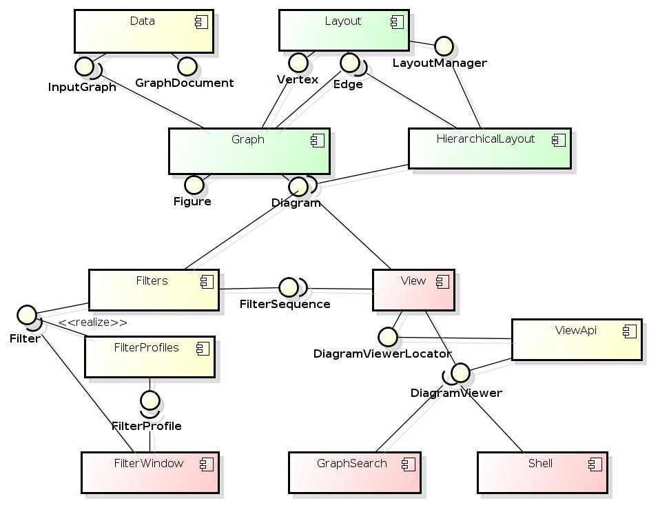
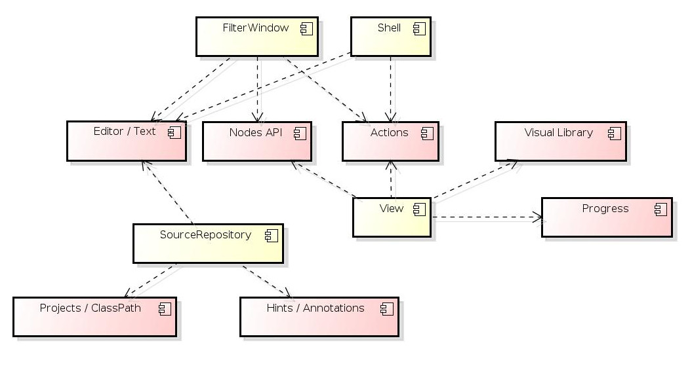

# Application Overview
The IGV application was built on top of NetBeans Platform. Later when integration with sources
was required, IGV used more clusters from the NetBeans project, most importantly Java cluster 
to access (Graal) java sources and Webcommon cluster for Filter (javascript) editing.

IGV is a set of NetBeans modules, all UI features use NetBeans APIs and NetBeans Platform
UI implementations:
- Explorers to represent tree and list structure
- Nodes to provide UI abstraction for data
- DataSystems to work with files
- Visual Library for interactive drawing
- Actions to provide UI abstraction for application commands

Individual IGV modules register their implementations (actions, ...) with the NetBeans platform
and some (i.e. **View** module) make their own extension points that allow other IGV modules
to enrich the basic functionality.

## Modules Structure
IGV modules depend on each other. The API separation is not strict and compatibility is not strictly maintained
as so far the project has no external contributors except the IGV team; however code is separated
to API / implementation as allocated development time permits and it can be formalized by splitting APIs into
separate modules (if multiple implementations exist, or the set of implementation dependencies is almost distinct
from the APIs) or refactoring into public packages.

The following picture outlines conceptual dependencies between IGV modules and selected API interfaces exported
and consumed:

## Main Platform Dependencies
Only **Data**, **Graph** and **HierarchicalLayout** are mostly independent of NetBeans Platform - 
just utility modules are used. Most of the other modules expose UI to some degree, so they depend
and integrate with the NetBeans Platform (IDE) heavily.

The following diagram outlines conceptual platform dependencies (though more dependencies exist because
of implementation details):

## Customizations
Resources, pictures, embedded files are replaced / overridden so the graphics and content appropriate for IGV and/or Oracle
appear to the user. The `branding/` directory contains such overridden resources. The `igv` directory contains launcher
configuration and the launcher script(s) themselves.

Resources stored in the **virtual configuration filesystem** provided by individual modules is customized in a special
module **VisualizerUI** mentioned below.

# Modules Overview

## Data and Service Layers

### Data
Contains data structures for BGV payload data. Just the data, not the layout or graph 
representation - that's **Graph** module role. Types in Data module are used by all other 
modules to access BGV data.

In package `org.graalvm.visualizer.data.services`, abstract services to work with the data
in the application are defined. 

- `GraphViewer` - allows to view a specific graph, find an active viewer or a existing viewer for a particular Graph or Group
- `InputGraphProvider` - representation of a viewer. More UI-oriented extension of this interface is in **View** module.
- `GraphSelections` - allows to select, extract or reveal nodes
- `GraphClassifier` - assigns a type to a Graph

Most of the services might be separated into its own module, as they are more UI than data oriented.

## Filter
Defines APIs for Graph Data filters as well as some of the default Filter implementations. Defines an API for 
and implements a service that actually runs the filters and fires start/stop events for a sequence of filters.
Most important are **UserFilters** that use script to define the filter behaviour. This module only configures such
scripts, actual execution of script engines is handled by **PolyglotRunner** module.

## FilterProfiles
Defines and implements concept of filter profiles. A Filter Profile is a collection of Custom Filters (scripts). Individual
filters are repreented as files collected in a folder that corresponds to a default profile. All Filters must be registered
there. Other profiles are also represented as folder, with links pointing to the files in the default profile folder.

Each profile can be managed separately (order, enable, disable). Filters can be removed from individual profiles, or added
from the filter pool (the default profile).

Each profile can have **selectors** which determine the priority of the profile for a certain graph type. A service is
implemented to compute the profile's priority for a graph. Simple selectors are defined by properties-style files.

### Graph
API and data structures for presenting BGV data structures from Data module. Diagram, Figure, Slots are defined here,
which copy BGV data and add positional and e.g. color for presenting the data. 

| Data | Graph element |
|------|---------------|
| Graph | Diagram |
| InputNode | Figure (multiple nodes)|
| Edge | Connection |
| Port | Input/OutputSlot |

### HierarchicalLayout
The layouting algorithm implementation. The algorithm takes **Diagram** as an input, and computes positions of its constituents.
Multiple layouting algorithms may be supported in theory, but now **View** module hardcodes usage of clustered / non-clustered 
algorithm for all graphs. 

### SourceRepository
The initial goal was to keep configuration of roots for sources the user is working with. It turned out that for demo
purposes, **Maven** project support is more appropriate, and after **Mx project support** has been implemented, the need
for separate configuration is significantly lower. 

The module manages, for a Graph, a map of Node to a stack of source locations, potentially for multiple languages. As e.g. 
JS code is graal-processed, the Node may get a java stack from graal, and an additional js stack from the original source's
representation. A graph is processed as a whole and the map is cached. The Location could be now simplified, because similar data structures
emerged in graal Graph IO library. The module maps String filenames to FileObjects, and try to revalidate existing stack items as the fileobjects become
available, i.e. as a result of project open.

The module exports SPI, for language-specific modules (currently: just **JavaSource**) that allow to map filename strings to FileObjects
and to parse stack frames into locations - each language has a specific syntax. The actual opening of the location is also
delegated to a language-specific module.

The module **contributes actions** 
- to the source editor that navigate or select node(s) in the active graph viewer, that may
have an association to the viewed text.
- to the graph viewer to navigate to the source, or track node selection

A "Stack" window UI is implemented here, which shows the stack for the current (selected) node and allows to switch between
languages, if more of them is available. If the stack frame's filename is not resolvable to a FileObject, the implementation
uses SPI implementations to offer 'LocatorUI's that could improve the situation (**JavaSources** module implements a locator
that offers to open project that contain the file in its java source paths).

## Utility modules
### Difference
Simple diffing for graphs. It is designed to diff **only graphs from the same compilation** as node ID is used as sole
representation of an identity. Structural diff based on e.g. properties of connected nodes was never implemented.

### Graal
Defines Graal-specific filters. Defines several Filter Profiles for certain graph types. Contains additional Graal-specific
filter implementations.

### JavaSources
Implements specific processing for java source information in the BGV data

- processes call stack
- helps to locate a project that contains a specific java filename
- opens source file at desired position
- implements go to type action

### Layout
APIs that the layout algorithm uses to query / update positional information. APIs are implemented by UI models in **Graph** module 
(which add additional stuff like coloring), and used by layouting algorithms in **HierarchicalLayout**.

### NetworkConnection
Manages the IGV server that accepts connection from the local GraalVM. The module degraded into a tiny layer, all data manipulation
and deserialization is implemented in **Data** module.

### Coordinator
The module implements the main explorer that shows loaded BGVs and their contents. It also implements actions available in
that view or in the main menu operating on the graph level.

Implements file operations and loaded document management actions (remove, diff). **Save** action may save selected parts of the
graph tree, or combine all opened (acquired) documents into one or present them as separate sessions.

### Upgrade
This module handles upgrades between version of IGV. Right now it migrates filter definitions from ancient Visualizer versions
to Filters directory. The module uses NetBeans upgrade infrastructure to handle simple file relocations.

## Prominent User Interface Modules

### FilterWindow
Implements UI for the filters. Displays profile selector, contents of the selected profile. Allows to switch profiles and
manage filters using APIs from **FilterProfiles** module. Pure UI module.

### GraphSearch
Implements search facility for a group of graphs. The modules is not clearly split to API/impl, but is structured
so that search can be invoked programmatically. Individual searches are displayed in separate tabs, results
can be post-processed (sort, filter). Results are displayed as either flat list, or grouped by the origin graph.

The module is implemented as a result-providing service and an UI for executing and displaying the result, but is not 
separated into API/SPI/UI submodules.

### View
This is the core module that manages the graph view. It uses **HierarchicalLayout** to compute layout, and **NetBeans Visual Library**
to provide drawing surface. For performance reasons only part of Diagram figures are converted to Visual Library Widgets - they
are heavyweight to capture user gestures and provide drawing capabilities, so only the visible region plus some side gap is converted;
additional widgets are created lazily as the user slides the viewport.

The View module also implements the process of converting data (InputGraph) into view model (Diagram) and filter processing; the process is
organized into stages:

- base diagram,
- filtered diagram (including scripts),
- laid out diagram,
- extracted diagram

Output of each stage is weakly cached, with respect to the settings / applied function; this allows to e.g. quickly change extraction, since
the computation-intensive filter+layout part can be taken from the cache.

The viewer UI component defines an extensibility API so that actions can be added to its UI by other modules. The **SourceRepository** module
does this. Other extensibility points would be useful to add features to context menus.

### Shell
The module allows to apply a script to a Diagram and to alter / re-execute that script. The script is applied on to of filters enabled
in the active Filter Profile. Each re-execution will apply the script to the result of Filter Profile and display the results in
the diagram view.

Shell module leverages NetBeans platform's support for Javascript editing, but now it is limited to syntax highlight and general code completion.
Specific code completion for global objects, names or types introduced by IGV can be added.

## Other User Interface
### ControlFlow

### SettingsUI
UI for the settings. The implementation uses html4java technology available in NetBeans platform, more as a demonstration
of the capabilities and embedding into the Java application - setting views implemented by NetBeans platform are still Swing-based.
HTML4Java allows to specify layout in HTML, style with CSS and bing controls to Java models and event handlers.

### VisualizerUI
This module is a "customization layer" that disables unnecessary UI parts of included NetBeans plugins and/or NetBeans 
platform itself. It also defines a layout for the application windows and default positions of docking containers in
the layout.

### ViewerApi
APIs to control the graph view or open graph views. Extracted interfaces to implementations in the **View** module, so that features
can be implemented in separate modules, not in the **View** one - the **GraphSearch** or **Shell** are example users.

The APIs allow:

- locate a viewer for a graph, or open one
- navigate through viewer's timeline (compiler graph phases, inlining decisions), hide duplicates
- select nodes, extract nodes
- convert data (InputNode) into UI model (Figure) and vice versa
- listen to changes of a viewer (i.e. different diagram displayed)

### Settings
API / beans for viewer settings (LayoutSettings) and application settings (Settings).

### Util
Various UI oriented utilities that do not fit elsewhere. 

