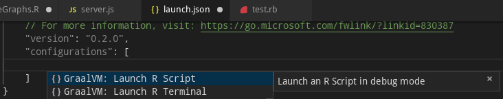
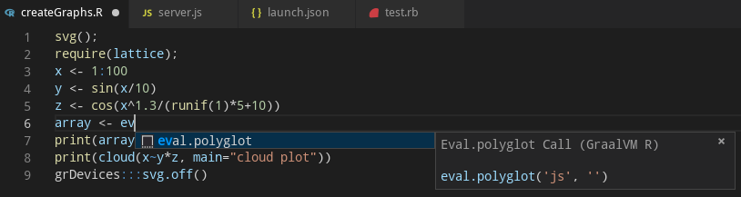
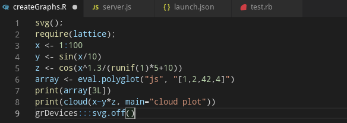

# GraalVM R Support for VS Code

A VS Code extension providing the basic support for editing and debugging R programs running on [GraalVM R](http://www.graalvm.org/docs/reference-manual/languages/r).
The extension is Technology Preview.

## Features

Upon the extension installation, the GraalVM is checked for presence of the R component and user is provided with an option of an automatic installation of the missing component.
The following command from the Command Palette (Ctrl+Shift+P) can be used to install the GraalVM R component manually:
* __Install GraalVM Component__

Once the GraalVM contains the R component, the following debug configurations can be used to debug your R applications/scripts running on GraalVM:
* __Launch R Script__ - Launches an R script using GraalVM in a debug mode.
* __Launch R Terminal__ - Launches an integrated R terminal running on GraalVM in a debug mode.

Since an easy writing of [polyglot](https://www.graalvm.org/docs/reference-manual/polyglot) applications is one of the defining features of GraalVM, the code completion invoked inside R sources provides items for `eval.polyglot(...)` and `new("<Java type>", ...)` calls.

For R sources opened in editor, all the `eval.polyglot(...)` calls are detected and the respective embedded languages are injected to their locations. For example, having a JavaScript code snippet called via the Polyglot API from inside an R source, the JavaScript language code is embedded inside the corresponding R string and all VS Code's editing features (syntax highlighting, bracket matching, auto closing pairs, code completion, etc.) treat the content of the string as the JavaScript source code.

## Requirements

This extension depends on the following extensions:
* [R](https://marketplace.visualstudio.com/items?itemName=Ikuyadeu.r) - Basic support for R language.
* [GraalVM](https://marketplace.visualstudio.com/items?itemName=oracle-labs-graalvm.graalvm) - Basic support for GraalVM.

## Privacy Policy

Please read the [Oracle Privacy Policy](https://www.oracle.com/legal/privacy/privacy-policy.html) to learn more.
