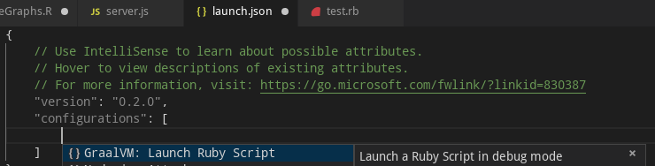
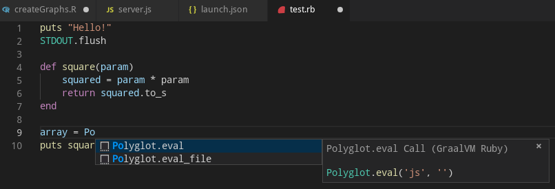
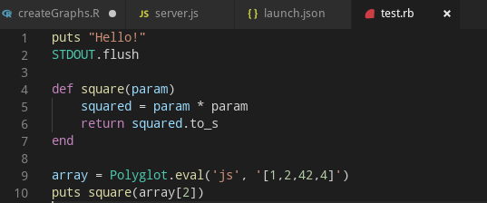

# GraalVM Ruby Support for VS Code

A VS Code extension providing the basic support for editing and debugging Ruby programs running on [GraalVM Ruby](http://www.graalvm.org/docs/reference-manual/languages/ruby).
The extension is Technology Preview.

## Features

Upon the extension installation, the GraalVM is checked for presence of the Ruby component and user is provided with an option of an automatic installation of the missing component.
The folowing command from the Command Palette (Ctrl+Shift+P) can be used to install the GraalVM Ruby component manually:
* __Install GraalVM Component__

Once the GraalVM contains the Ruby component, the following debug configuration can be used to debug your Ruby applications running on GraalVM:
* __Launch Ruby Script__ - Launches a Ruby script using GraalVM in a debug mode.

Since an easy writing of [polyglot](https://www.graalvm.org/docs/reference-manual/polyglot) applications is one of the defining features of GraalVM, the code completion invoked inside Ruby sources provides items for `Polyglot.eval(...)`, `Polyglot.eval_file(...)` and `Java.type(...)` calls.

For Ruby sources opened in editor, all the `Polyglot.eval(...)` calls are detected and the respective embedded languages are injected to their locations. For example, having a JavaScript code snippet called via the Polyglot API from inside a Ruby source, the JavaScript language code is embedded inside the corresponding Ruby string and all VS Code's editing features (syntax highlighting, bracket matching, auto closing pairs, code completion, etc.) treat the content of the string as the JavaScript source code.

## Requirements

This extension depends on the following extensions:
* [Ruby](https://marketplace.visualstudio.com/items?itemName=rebornix.Ruby) - Ruby language support.
* [GraalVM](https://marketplace.visualstudio.com/items?itemName=oracle-labs-graalvm.graalvm) - Basic support for GraalVM.

## Privacy Policy

Please read the [Oracle Privacy Policy](https://www.oracle.com/legal/privacy/privacy-policy.html) to learn more.
