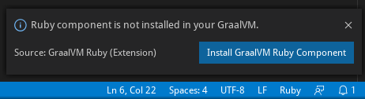

# GraalVM Ruby Support for VS Code

A VS Code extension providing the basic support for editing and debugging Ruby programs running on [GraalVM Ruby](http://www.graalvm.org/docs/reference-manual/languages/ruby).
The extension is Technology Preview.

## Features

### GraalVM Ruby Component Installation

Upon the extension installation, the GraalVM is checked for presence of the Ruby component and user is provided with an option of an automatic installation of the missing component.

The folowing command from the Command Palette (Ctrl+Shift+P) can be used to install the GraalVM Ruby component manually:
* __Install GraalVM Component__

### Ruby Debugging

To debug a Ruby application running on GraalVM, creating a launch configuration for the application is necessary. To do so, open the applicarion project folder in VS Code (File > Open Folder) and then select the Configure gear icon on the Debug view top bar. If debugging is not yet configured (no `launch.json` has been created), select `GraalVM` from the list of available debug environmnets. Once the `launch.json` file is opened in the editor, one of the following techniques can be used to add a new configuration:
* Use IntelliSense if your cursor is located inside the configurations array.
* Press the Add Configuration button to invoke snippet IntelliSense at the start of the array.
* Choose Add Configuration option in the Debug menu.

The GraalVM Ruby extension provides the following debug configuration that can be used to debug a Ruby applications/scripts running on GraalVM:
* __Launch Ruby Script__ - Launches a Ruby script using GraalVM in a debug mode.

When editing debug configurations, you can use IntelliSense suggestions (Ctrl+Space) to find out which attributes exist for a specific debug configuration. Hover help is also available for all attributes.

In order to start a debug session, first select the proper configuration using the Configuration drop-down in the Debug view. Once you have your launch configuration set, start your debug session with F5. Alternatively you can run your configuration through the Command Palette (Ctrl+Shift+P), by filtering on Debug: Select and Start Debugging or typing 'debug ', and selecting the configuration you want to debug.

### Language Server Integration

GraalVM supports smart editing features of development tools used to create guest language applications by providing a built-in implementation of the [Language Server Protocol](https://microsoft.github.io/language-server-protocol). This allows you to attach compatible development tools such as VS Code to GraalVM and to get features like auto complete, go to declaration, or documentation on hover.

Note that the GraalVM Language Server itself does not provide the static data usually gathered by parsing the application sources (as these data are sometimes fuzzy in case of dynamic languages). Instead, the GraalVM Language Server was designed to provide the accurate dynamic data gathered form the application runtime. However, the GraalVM Language Server could delegate to the existing language servers written specially for the particular languages and merge the static data returned from these servers with its own dynamic data to a single result.

This extension provides an option to automatically install and run the [solargraph](https://github.com/castwide/solargraph) which is an implementation of the Language Server Protocol for the language of Ruby. Enabling this option, the GraalVM Ruby installation is checked for presence of the `solargraph` gem and user is provided with an option of an automatic installation of the missing gem.

Once the `solargraph` gem is installed, the Ruby Language Server is automatically started and passed to the GraalVM Language Server as delegate when necessary.

### Additional Editor Features

Since an easy writing of [polyglot](https://www.graalvm.org/docs/reference-manual/polyglot) applications is one of the defining features of GraalVM, the code completion invoked inside Ruby sources provides items for `Polyglot.eval(...)`, `Polyglot.eval_file(...)` and `Java.type(...)` calls.

For Ruby sources opened in editor, all the `Polyglot.eval(...)` calls are detected and the respective embedded languages are injected to their locations. For example, having a JavaScript code snippet called via the Polyglot API from inside a Ruby source, the JavaScript language code is embedded inside the corresponding Ruby string and all VS Code's editing features (syntax highlighting, bracket matching, auto closing pairs, code completion, etc.) treat the content of the string as the JavaScript source code.

## Extension Settings

This extension contributes the following settings:

* __graalvm.languageServer.startRubyLanguageServer__ - Start Ruby Language Server.

## Requirements

This extension depends on the following extensions:
* [Ruby](https://marketplace.visualstudio.com/items?itemName=rebornix.Ruby) - Ruby language support.
* [GraalVM](https://marketplace.visualstudio.com/items?itemName=oracle-labs-graalvm.graalvm) - Basic support for GraalVM.

## Privacy Policy

Please read the [Oracle Privacy Policy](https://www.oracle.com/legal/privacy/privacy-policy.html) to learn more.
