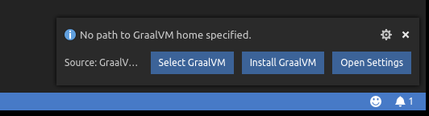
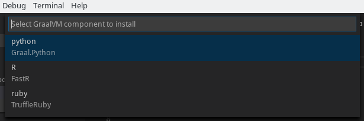

# GraalVM Support for VS Code

A VS Code extension providing the basic support for editing and debugging programs running on [GraalVM](http://www.graalvm.org).
The extension is Technology Preview.

## Features

Upon the extension installation, the user is requested to provide a path to the GraalVM home directory.

To that purpose, the following commands can be used:
* __Select GraalVM Installation__ - Provides the UI to select an already installed GraalVM.

By default, the following locations are searched for an already installed GraalVM:
    * the extension's global storage
    * `/opt` folder as the default RPM install location
    * `PATH` environment variable content
    * `GRAALVM_HOME` environment variable content
    * `JAVA_HOME` environment variable content

* __Install GraalVM__ - Downloads the latest GraalVM release from [Github](https://github.com/oracle/graal/releases) and installs it within the extension's global storage.
* __Install GraalVM Component__ - Downloads and installs one of the GraalVM's optional components.

All three commands can be invoked at any time from the Command Palette (Ctrl+Shift+P)

Once the path to GraalVM home directory is provided, the following debug configurations can be used to debug your
applications/scripts running on GraalVM:
* __Launch Node.js Application__ - Launches a Node.js Application using GraalVM in a debug mode.
* __Launch JavaScript__ - Launches a JavaScript using GraalVM in a debug mode.
* __Attach__ - Attaches debugger to a locally running GraalVM.
* __Attach to Remote__ - Attaches debugger to the debug port of a remote GraalVM.

Since an easy writing of [polyglot](https://www.graalvm.org/docs/reference-manual/polyglot) applications is one of the defining features of GraalVM, the code completion invoked inside JavaScript sources provides items for `Polyglot.eval(...)`, `Polyglot.evalFile(...)` and `Java.type(...)` calls.

For JavaScript sources opened in editor, all the `Polyglot.eval(...)` calls are detected and the respective embedded languages are injected to their locations. For example, having an R code snippet called via the Polyglot API from inside a JavaScript source, the R language code is embedded inside the corresponding JavaScript string and all VS Code's editing features (syntax highlighting, bracket matching, auto closing pairs, code completion, etc.) treat the content of the string as the R source code.

## Extension Settings

This extension contributes the following settings:

* __graalvm.home__ - Path to GraalVM installation.

## Privacy Policy

Please read the [Oracle Privacy Policy](https://www.oracle.com/legal/privacy/privacy-policy.html) to learn more.
