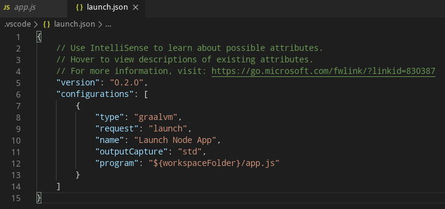

# GraalVM Support for VS Code

A VS Code extension providing the basic support for editing and debugging programs running on [GraalVM](http://www.graalvm.org).
The extension is Technology Preview.

## Features

### GraalVM Installation and Setup

Upon the extension installation, the user is requested to provide a path to the GraalVM home directory.


To that purpose, the following commands can be used:
* __Select GraalVM Installation__ - Provides the UI to select an already installed GraalVM.<p>
<p>
By default, the following locations are searched for an already installed GraalVM:
    * the extension's global storage
    * `/opt` folder as the default RPM install location
    * `PATH` environment variable content
    * `GRAALVM_HOME` environment variable content
    * `JAVA_HOME` environment variable content

* __Install GraalVM__ - Downloads the latest GraalVM release from [Github](https://github.com/graalvm/graalvm-ce-builds/releases) and installs it within the extension's global storage.
* __Install GraalVM Component__ - Downloads and installs one of the GraalVM's optional components.


All three commands can be invoked at any time from the Command Palette (Ctrl+Shift+P)


### JavaScript and Node.js Debugging

To debug a JavaScript or Node.js application running on GraalVM, creating a launch configuration for the application is necessary. To do so, open the applicarion project folder in VS Code (File > Open Folder) and then select the Configure gear icon on the Debug view top bar. If debugging is not yet configured (no `launch.json` has been created), select `GraalVM` from the list of available debug environmnets. Once the `launch.json` file is opened in the editor, one of the following techniques can be used to add a new configuration:
* Use IntelliSense if your cursor is located inside the configurations array.
* Press the Add Configuration button to invoke snippet IntelliSense at the start of the array.
* Choose Add Configuration option in the Debug menu.


The GraalVM extension provides the following debug configurations that can be used to debug an applications running on GraalVM:
* __Launch Node.js Application__ - Launches a Node.js Application using GraalVM in a debug mode.
* __Launch JavaScript__ - Launches a JavaScript using GraalVM in a debug mode.
* __Launch Polyglot Application__ - Launches a Polyglot Application in debug mode.
* __Attach__ - Attaches debugger to a locally running GraalVM.
* __Attach to Remote__ - Attaches debugger to the debug port of a remote GraalVM.



Note that the attributes available in launch configurations vary from configuration to configuration. You can use IntelliSense suggestions (Ctrl+Space) to find out which attributes exist for a specific debug configuration. Hover help is also available for all attributes.


In order to start a debug session, first select the proper configuration using the Configuration drop-down in the Debug view. Once you have your launch configuration set, start your debug session with F5. Alternatively you can run your configuration through the Command Palette (Ctrl+Shift+P), by filtering on Debug: Select and Start Debugging or typing 'debug ', and selecting the configuration you want to debug.

### Language Server Integration

GraalVM supports smart editing features of development tools used to create guest language applications by providing a built-in implementation of the [Language Server Protocol](https://microsoft.github.io/language-server-protocol). This allows you to attach compatible development tools such as VS Code to GraalVM and to get features like auto complete, go to declaration, or documentation on hover.

Currently, the GraalVM Language Server implementation supports the following services:
* [Text Document Synchronization](https://microsoft.github.io/language-server-protocol/specifications/specification-current/#textDocument_synchronization)
* [Hover Provider](https://microsoft.github.io/language-server-protocol/specifications/specification-current/#textDocument_hover)
* [Completion Provider](https://microsoft.github.io/language-server-protocol/specifications/specification-current/#textDocument_completion)
* [Signature Help Provider](https://microsoft.github.io/language-server-protocol/specifications/specification-current/#textDocument_signatureHelp)
* [Document Highlight Provider](https://microsoft.github.io/language-server-protocol/specifications/specification-current/#textDocument_documentHighlight)
* [Code Action Provider](https://microsoft.github.io/language-server-protocol/specifications/specification-current/#textDocument_codeAction)
* [Code Lens Provider](https://microsoft.github.io/language-server-protocol/specifications/specification-current/#textDocument_codeLens)
* [Execute Command Provider](https://microsoft.github.io/language-server-protocol/specifications/specification-current/#workspace_executeCommand)

To start the GraalVM Language Server, pass the `--lsp` option to the command-line launcher as in the following example with a Node.js application:
```
$ node --experimental-options --lsp app.js
[Graal LSP] Starting server and listening on localhost/127.0.0.1:8123
Example app listening on port 3000!
```
Note that the GraalVM Language Server itself does not provide the static data usually gathered by parsing the application sources (as these data are sometimes fuzzy in case of dynamic languages). Instead, the GraalVM Language Server was designed to provide the accurate dynamic data gathered form the application runtime.


However, the GraalVM Language Server could delegate to the existing language servers written specially for the particular languages (using the `--lsp.Delegates` launcher option) and merge the static data returned from these servers with its own dynamic data to a single result.

This extension works as a client to the GraalVM Language Server. By default, a language server is started as a part of every process being executed or debugged via VS Code UI. The other possibility (available on option) is a language server started as a separated process that gets informed about every application being executed or debugged. It tries to "dry-run" the same code as the original application and serve the runetime data afterwards. Currently, both approaches start the language server providing the smart editing features for the following Truffle Languages - JavaScript, Python, R, Ruby, and SimpleLanguage.

### Additional Editor Features

Since an easy writing of [polyglot](https://www.graalvm.org/docs/reference-manual/polyglot) applications is one of the defining features of GraalVM, the code completion invoked inside JavaScript sources provides items for `Polyglot.eval(...)`, `Polyglot.evalFile(...)` and `Java.type(...)` calls.


For JavaScript sources opened in editor, all the `Polyglot.eval(...)` calls are detected and the respective embedded languages are injected to their locations. For example, having an R code snippet called via the Polyglot API from inside a JavaScript source, the R language code is embedded inside the corresponding JavaScript string and all VS Code's editing features (syntax highlighting, bracket matching, auto closing pairs, code completion, etc.) treat the content of the string as the R source code.


## Extension Settings

This extension contributes the following settings:

* __graalvm.home__ - Path to GraalVM installation.
* __graalvm.languageServer.currentWorkDir__ - Absolute path to the working directory of the GraalVM Language Server.
* __graalvm.languageServer.inProcessServer__ - Start GraalVM Language Server within processes being run or debugged.
* __graalvm.languageServer.delegateServers__ - Comma-separated list of language@[host:]port where other language servers run.

## Privacy Policy

Please read the [Oracle Privacy Policy](https://www.oracle.com/legal/privacy/privacy-policy.html) to learn more.
