# GraalVM Visual Studio Code Extension

[GraalVM Extension for Visual Studio Code (VS Code)](https://marketplace.visualstudio.com/items?itemName=oracle-labs-graalvm.graalvm) provides the basic support for editing and debugging programs running on [GraalVM](http://www.graalvm.org).
The extension is Technology Preview.

The major goal of creating GraalVM VS Code Extension was to enable a polyglot environment in VS Code, to make it suitable and convenient to work with GraalVM from an integrated development environment, to allow VS Code users to edit and debug applications written in any of the GraalVM supported languages (Java, JS, Ruby, R, and Python).

#### Table of contents
- [Features](#features)
- [Installation and Setup](#graalvm-installation-and-setup)
- [Java Development and Support](#java-development-and-support)
- [JavaScript and Node.js Debugging](#javascript-and-nodejs-debugging)
- [Python Debugging](#python-debugging)
- [R Debugging](#r-debugging)
- [Ruby Debugging](#ruby-debugging)
- [Polyglot Applications Debugging](#polyglot-applications-debugging)
- [Debug Adapter Protocol](#debug-adapter-protocol)
- [Language Server Integration](#language-server-integration)
- [R Language Server](#r-language-server)
- [Ruby Language Server](#ruby-language-server)
- [Additional Editor Features](#additional-editor-features)
- [Extension Settings](#extension-settings)
- [Recommendations](#recommendations)
- [Feedback](#feedback)

## Features

The installation wizzard for GraalVM VS Code Extension simplifies setting up the development environment.
You can now download and install any available GraalVM distribution right from the user interface, or, alternatively, you can select an existing GraalVM installation from your local disk.

GraalVM Extension brings support for Java projects development and debugging in VS Code. This extension for VS Code also provides editing and debugging capabilities for JavaScript and Node.js, Python, R, and Ruby applications running on GraalVM by default.

GraalVM VS Code Extension is a prerequisite for the [Micronaut support in VS Code](https://marketplace.visualstudio.com/items?itemName=oracle-labs-graalvm.micronaut), which brings many more possibilities for Java developers.

The future development of the extension should also enable generating native executables right from the VS Code console.
The development team is actively working on further improvements and focus on GraalVM Extension providing high usability to developers.

## Installation and Setup

To install GraalVM Extention in VS Code, navigate to Extensions in the left-hand side Activity Bar (or use _Ctrl+Shift+X_ hot keys combination).
Search for "GraalVM" in the search field.
Once found, press Install. That action will install GraalVM Extention from the [VS Code Marketplace](https://marketplace.visualstudio.com/items?itemName=oracle-labs-graalvm.graalvm). Reload will be requried.

When installed, notice the "Gr" icon in the left-hand side Activity Bar.
By clicking on the icon, a dialog with the following choices displays:
* Download & Install GraalVM
* Add Existing GraalVM


### Download & Install GraalVM

The Download & Install GraalVM action prompts to:
* Pick the GraalVM distribution: Community (Free for all purposes) or Enterprise (Free for evaluation and development)
* Pick the GraalVM version: Current (20.3), Annual (19.3), Latest Snapshot (Nightly Build 21.0-dev)
* Pick a Java version: 8, 11
* Select the destination folder


If you prefer GraalVM Community Edition, the installation wizzard will download the package from [Github](https://github.com/graalvm/graalvm-ce-builds/releases) in the background and display the progress.

If you select GraalVM Enterprise Editon, you are prompted to accept the Oracle Technology Network License Agreement and requested to enter your email address. Providing your email address is optional, but if you do not enter it, the GraalVM Enterprise Edition License will prompt everytime.


The installation wizzard will download the package from [Oracle Software Downloads](https://www.oracle.com/downloads/graalvm-downloads.html) in the background and display the progress.

If you are behind a proxy, setup your proxy configuration by the "Setup Proxy" command or by overriding the `http_proxy` and `https_proxy` environment variables.

Upon completion, the "Set as Default Java" action is invoked. At the same time, the "Install Optional GraalVM Components" window pops up:

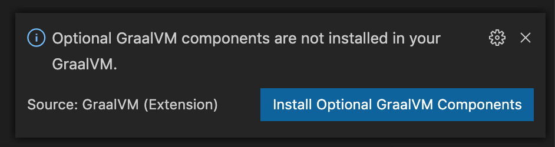

Once you confirm, you are taken to the selection list:


Note: You can download and install multiple GraalVM distributions and components at the same time.

### Add Existing GraalVM

The "Add Existing GraalVM" action allows to select the existing GraalVM installation from your local disk.
As in the previous installation scenario, you are prompted to set the GraalVM installation as default, and to install optional components, if not already installed.

Adding existing GraalVM action can also be invoked by using an icon on the side of the "GRAALVM: INSTALLATIONS" panel.
To make a newly added GraalVM active, you can use a "home" icon by the side of the installation.


Alternatively, you can invoke the same actions from the View > Command Palette (Command Palette can be also opened by pressing F1, or _Ctrl+Shift+P_  hot keys combination for Linux and _Command+Shift+P_ for macOS):
* GraalVM: Download & Install GraalVM
* GraalVM: Install GraalVM Component
* GraalVM: Set Active GraalVM Installation

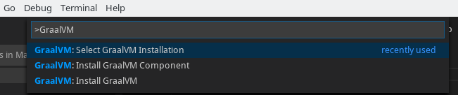

Each registered GraalVM instance displays its installation location and all its available components.
The active one is placed on top.
Components are either installed or available for download - the context actions to install (the plus icon) or remove (the bucket icon) are displayed when hovering over the component name.


All registered GraalVM instances for `java.home` will be listed in the configuration file under File > Preferences > Settings (Code > Preferences > Settings on macOS).

This installation model much simplifies setting up GraalVM development environment in VS Code:
- it permits multiple GraalVM and components installations at the same time;
- it allows an easy switch from one runtime version to another;
- it enables quick removals of unnecessary GraalVM installations from VS Code global storage or even from your local disk.

The "Download & Install GraalVM" action is a preferable way, as it eliminates the fuss around setting up environment variables and prepares the GraalVM runtime in VS Code for you.

## Java Development and Debugging

To enable support for Java development with GraalVM in VS Code, you have to install the [Apache NetBeans Language Server](https://marketplace.visualstudio.com/items?itemName=asf.apache-netbeans-java) extension. Reload will be required.

To start developping or debugging Java applications, ensure GraalVM is used as your Java runtime in VS Code.
If the current path is not pointing to the GraalVM folder, go to User Settings window and edit `netbeans.jdkhome` value in _settings.json_ file.
This configuration is then used to launch the Java Language Server.

The project you create from scratch or a Java project you open in VS Code will run in the GraalVM runtime.

To debug a Java application running on GraalVM, creating a launch configuration for the application is necessary.
Having opened the file to be debugged or run in VS Code, switch to the Debug view by clicking on the "bug" icon in the left-hand side panel.
The newly opened window will suggest to create a _launch.json_ file:


Make sure to select the "Java 8+" environment. To start debugging, press F5 or navigate to Run > Start Debugging.
To add more lunch configurations, navigate to Run > Add Configuration or open the _.vscode/launch.json_ file and press the Add Configuration button in the right-hand corner.


## JavaScript and Node.js Debugging

To debug a JavaScript or Node.js application running on GraalVM, creating a launch configuration for the application is necessary.
To do so, open the application project folder in VS Code (File > Open Folder), switch to the Debug view by clicking on the "bug" icon in the left-hand side panel. The newly opened window will suggest to create a _launch.json_ file:

If debugging is not yet configured (no `launch.json` has been created), select `GraalVM` from the list of available debug environmnets.

The following techniques can be used to add a new configuration:
* Use IntelliSense if your cursor is located inside the configurations array.
* Press the Add Configuration button to invoke snippet IntelliSense at the start of the array.
* Choose Add Configuration option in the Debug menu.

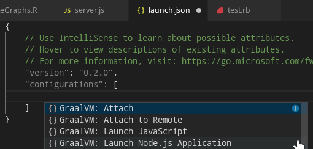

Note that the attributes available in launch configurations vary from configuration to configuration.
You can use IntelliSense suggestions (_Ctrl+Space_) to find out which attributes exist for a specific debug configuration.
Hover help is also available for all attributes.


The GraalVM extension provides the following debug configurations that can be used to run and debug JavaScript and Node.js applications running on GraalVM:
* __Launch Node.js Application__ - Launches a Node.js Application using GraalVM in a debug mode.
* __Launch JavaScript__ - Launches a JavaScript using GraalVM in a debug mode.
* __Attach__ - Attaches debugger to a locally running GraalVM.
* __Attach to Remote__ - Attaches debugger to the debug port of a remote GraalVM.

You now have the possibility to choose which debugging protocol to use ([Debug Adapter Protocol](https://www.graalvm.org/tools/dap/) or [Chrome Dev Tools protocol](https://www.graalvm.org/tools/chrome-debugger/)) by setting the `protocol` attribute in the corresponding debug configuration to either `chromeDevTools` or `debugAdapter`.
For example, to connect to the open Debug Adapter Protocol port, the content of the _launch.json_ should be:
```json
{
    "version": "0.2.0",
    "configurations": [
        {
            "type": "graalvm",
            "request": "launch",
            "name": "Launch Node App",
            "outputCapture": "std",
            "protocol": "debugAdapter",
            "program": "${workspaceFolder}/App.js"
        }
    ]
}
```

In order to start a debug session, first select the proper configuration using the Configuration drop-down in the Debug view.
Once you have your launch configuration set, start your debug session with F5.
Alternatively, you can run your configuration through the Command Palette (Command Palette can be also opened by pressing F1, or _Ctrl+Shift+P_  hot keys combination for Linux and _Command+Shift+P_ for macOS), by filtering on Debug: Select and Start Debugging or typing "debug", and selecting the configuration you want to debug.

## Python Debugging

To debug a Python application running on GraalVM, creating a launch configuration for the application is necessary.
To do so, open the application project folder in VS Code (File > Open Folder), switch to the Debug view by clicking on the "bug" icon in the left-hand side panel. The newly opened window will suggest to create a _launch.json_ file.
If debugging is not yet configured (no `launch.json` has been created), select `GraalVM` from the list of available debug environmnets.
Once the `launch.json` file is opened in the editor, one of the following techniques can be used to add a new configuration:
* Use IntelliSense if your cursor is located inside the configurations array.
* Press the Add Configuration button to invoke snippet IntelliSense at the start of the array.
* Choose Add Configuration option in the Debug menu.


The GraalVM Python extension provides the following debug configuration that can be used to debug a Python applications/scripts running on GraalVM:
* __Launch Python Script__ - Launches a Python script using GraalVM in a debug mode.

You now have the possibility to choose which debugging protocol to use ([Debug Adapter Protocol](https://www.graalvm.org/tools/dap/) or [Chrome Dev Tools protocol](https://www.graalvm.org/tools/chrome-debugger/)) by setting the `protocol` attribute in the corresponding debug configuration to either `chromeDevTools` or `debugAdapter`.
For example, to connect to the Chrome Dev Tools protocol port, the content of the _launch.json_ should be:
```json
{
    "version": "0.2.0",
    "configurations": [
        {
            "type": "graalvm",
            "request": "launch",
            "name": "Launch Python App",
            "outputCapture": "std",
            "protocol": "chromeDevTools",
            "program": "${workspaceFolder}/App.py"
        }
    ]
}
```

When editing debug configurations, you can use IntelliSense suggestions (_Ctrl+Space_) to find out which attributes exist for a specific debug configuration.
Hover help is also available for all attributes.

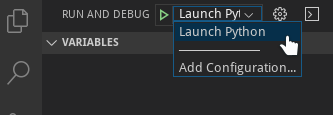

In order to start a debug session, first select the proper configuration using the Configuration drop-down in the Debug view.
Once you have your launch configuration set, start your debug session with F5.
Alternatively, you can run your configuration through the Command Palette (Command Palette can be also opened by pressing F1, or _Ctrl+Shift+P_  hot keys combination for Linux and _Command+Shift+P_ for macOS), by filtering on Debug: Select and Start Debugging or typing "debug", and selecting the configuration you want to debug.

## R Debugging

To debug an R application running on GraalVM, creating a launch configuration for the application is necessary.
To do so, open the application project folder in VS Code (File > Open Folder), switch to the Debug view by clicking on the "bug" icon in the left-hand side panel. The newly opened window will suggest to create a _launch.json_ file.
If debugging is not yet configured (no `launch.json` has been created), select `GraalVM` from the list of available debug environmnets.
Once the `launch.json` file is opened in the editor, one of the following techniques can be used to add a new configuration:
* Use IntelliSense if your cursor is located inside the configurations array.
* Press the Add Configuration button to invoke snippet IntelliSense at the start of the array.
* Choose Add Configuration option in the Debug menu.

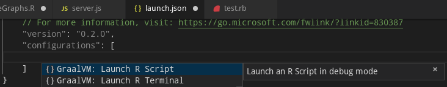

The GraalVM R extension provides the following debug configurations that can be used to debug an R applications/scripts running on GraalVM:
* __Launch R Script__ - Launches an R script using GraalVM in a debug mode.
* __Launch R Terminal__ - Launches an integrated R terminal running on GraalVM in a debug mode.

You now have the possibility to choose which debugging protocol to use ([Debug Adapter Protocol](https://www.graalvm.org/tools/dap/) or [Chrome Dev Tools protocol](https://www.graalvm.org/tools/chrome-debugger/)) by setting the `protocol` attribute in the corresponding debug configuration to either `chromeDevTools` or `debugAdapter`.
For example, to connect to the Chrome Dev Tools protocol port, the content of the _launch.json_ should be:
```json
{
    "version": "0.2.0",
    "configurations": [
        {
            "type": "graalvm",
            "request": "launch",
            "name": "Launch R Script",
            "outputCapture": "std",
            "protocol": "chromeDevTools",
            "program": "${workspaceFolder}/App.r"
        }
    ]
}
```

When editing debug configurations, you can use IntelliSense suggestions (_Ctrl+Space_) to find out which attributes exist for a specific debug configuration.
Hover help is also available for all attributes.

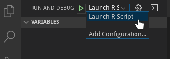

In order to start a debug session, first select the proper configuration using the Configuration drop-down in the Debug view.
Once you have your launch configuration set, start your debug session with F5.
Alternatively, you can run your configuration through the Command Palette (Command Palette can be also opened by pressing F1, or _Ctrl+Shift+P_  hot keys combination for Linux and _Command+Shift+P_ for macOS), by filtering on Debug: Select and Start Debugging or typing "debug", and selecting the configuration you want to debug.

## Ruby Debugging

To debug a Ruby application running on GraalVM, creating a launch configuration for the application is necessary.
To do so, open the application project folder in VS Code (File > Open Folder), switch to the Debug view by clicking on the "bug" icon in the left-hand side panel. The newly opened window will suggest to create a _launch.json_ file.
If debugging is not yet configured (no `launch.json` has been created), select `GraalVM` from the list of available debug environmnets.
Once the `launch.json` file is opened in the editor, one of the following techniques can be used to add a new configuration:
* Use IntelliSense if your cursor is located inside the configurations array.
* Press the Add Configuration button to invoke snippet IntelliSense at the start of the array.
* Choose Add Configuration option in the Debug menu.


The GraalVM Ruby extension provides the following debug configuration that can be used to debug a Ruby applications/scripts running on GraalVM:
* __Launch Ruby Script__ - Launches a Ruby script using GraalVM in a debug mode.

You now have the possibility to choose which debugging protocol to use ([Debug Adapter Protocol](https://www.graalvm.org/tools/dap/) or [Chrome Dev Tools protocol](https://www.graalvm.org/tools/chrome-debugger/)) by setting the `protocol` attribute in the corresponding debug configuration to either `chromeDevTools` or `debugAdapter`.
For example, to connect to the Chrome Dev Tools protocol port, the content of the _launch.json_ should be:
```json
{
    "version": "0.2.0",
    "configurations": [
        {
            "type": "graalvm",
            "request": "launch",
            "name": "Launch Ruby App",
            "outputCapture": "std",
            "protocol": "chromeDevTools",
            "program": "${workspaceFolder}/App.rb"
        }
    ]
}
```

When editing debug configurations, you can use IntelliSense suggestions (_Ctrl+Space_) to find out which attributes exist for a specific debug configuration.
Hover help is also available for all attributes.


In order to start a debug session, first select the proper configuration using the Configuration drop-down in the Debug view.
Once you have your launch configuration set, start your debug session with F5.
Alternatively, you can run your configuration through the Command Palette (Command Palette can be also opened by pressing F1, or _Ctrl+Shift+P_  hot keys combination for Linux and _Command+Shift+P_ for macOS), by filtering on Debug: Select and Start Debugging or typing "debug", and selecting the configuration you want to debug.

## Polyglot Applications Debugging

To run a polyglot application on GraalVM in VS Code, you have to either pass the `--polyglot` option to any of the existing application lauchers (e.g. `js --polyglot`, `node --polyglot`) or use an experimental launcher called `polyglot` that runs code for JavaScript, Python, Ruby, and R without requiring the selection of a primary language.
The `polyglot` launcher does not require the `--polyglot` option, it is enabled by default.
For more information see the [GraalVM polyglot documentation](https://www.graalvm.org/reference-manual/polyglot-programming/).

To debug a polyglot application on GraalVM in VS Code, creating a launch configuration for the application is necessary.
To do so, open the application project folder in VS Code (File > Open Folder), switch to the Debug view by clicking on the "bug" icon in the left-hand side panel. The newly opened window will suggest to create a _launch.json_ file.
If debugging is not yet configured (no `launch.json` has been created), select `GraalVM` from the list of available debug environmnets.
Once the `launch.json` file is opened in the editor, one of the following techniques can be used to add a new configuration:
* Use IntelliSense if your cursor is located inside the configurations array.
* Press the Add Configuration button to invoke snippet IntelliSense at the start of the array.
* Choose Add Configuration option in the Debug menu.

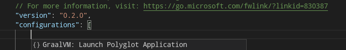

The GraalVM extension provides the following debug configuration that can be used to debug an applications running on GraalVM using the `polyglot` launcher:
* __Launch Polyglot Application__ - Launches a Polyglot Application in debug mode.

You now have the possibility to choose which protocol ([Debug Adapter Protocol](https://www.graalvm.org/tools/dap/) or [Chrome Dev Tools protocol](https://www.graalvm.org/tools/chrome-debugger/)) to use to debug a polyglot application by setting the `protocol` attribute in the corresponding debug configuration to either `chromeDevTools` or `debugAdapter`.
For example, to connect to the Chrome Dev Tools protocol port, the content of the _launch.json_ can be:
```json
{
    "version": "0.2.0",
    "configurations": [
        {
            "type": "graalvm",
            "request": "launch",
            "name": "Launch Polyglot App",
            "outputCapture": "std",
            "protocol": "chromeDevTools",
            "program": "${workspaceFolder}/polyglot.js"
        }
    ]
}
```

Alternatively, to pass the `--polyglot` option to any of the existing application lauchers, add the `runtimeArgs` attribute containing the `--polyglot` value to their respective debug configurations. Note that in some cases (polyglot application calls Java or R, or native launcher accesses languages installed with `gu` without [rebuilding images](https://www.graalvm.org/reference-manual/graalvm-updater/#component-uninstallation)), passing also the `--jvm` option is necessary.


## Debug Adapter Protocol

When creating the Run/Debug Configurations in VS Code, Chrome DevTools Protocol is provisioned by default. However, GraalVM provides a built-in implementation of the [Debug Adapter Protocol (DAP)](https://www.graalvm.org/tools/dap/) and, with GraalVM Extention for VS Code, a user now can choose a protocol to use by setting the protocol attribute in the corresponding debug configuration to either `chromeDevTools` or `debugAdapter`.

To open a debugger port serving Debug Adapter Protocol, you need to pass the `--dap` option to the command line launcher.
Other available options to pass to GraalVM's Debug Adapter Protocol are:
* `--dap.Suspend=false`: disable the execution suspension at first source line, enabled by default.
* `--dap.WaitAttached`: do not execute any source code until debugger client is attached. The default is false.
* `--dap=<[[host:]port]>`: start the debugger on a different port than default (`<host>:4711`).

Then you need a DAP client to connect to the open DAP port.
To connect to the open DAP port, the content of _launch.json_ for, for example, a Node.js application, should be:
```json
{
    "version": "0.2.0",
    "configurations": [
        {
            "type": "graalvm",
            "request": "launch",
            "name": "Launch Node App",
            "outputCapture": "std",
            "protocol": "debugAdapter",
            "program": "${workspaceFolder}/App.js"
        }
    ]
}
```

The advantage of using Debug Adapter Protocol over Chrome Dev Tools is that (1) it is 'native' to Visual Studio Code (VS Code), meaning it does not require any intermediate translatation, and (2) that it supports multithreading, which can be particually useful to debug, e.g., a Ruby application.

## Language Server Protocol Integration

GraalVM supports smart editing features of development tools used to create guest language applications by providing a built-in implementation of the [Language Server Protocol](https://microsoft.github.io/language-server-protocol).
This allows you to attach compatible development tools such as VS Code to GraalVM and to get features like auto complete, go to declaration, or documentation on hover.

Currently, [GraalVM's Language Server Protocol](https://www.graalvm.org/tools/lsp/) implementation supports the following services:
* [Text Document Synchronization](https://microsoft.github.io/language-server-protocol/specifications/specification-current/#textDocument_synchronization)
* [Hover Provider](https://microsoft.github.io/language-server-protocol/specifications/specification-current/#textDocument_hover)
* [Completion Provider](https://microsoft.github.io/language-server-protocol/specifications/specification-current/#textDocument_completion)
* [Signature Help Provider](https://microsoft.github.io/language-server-protocol/specifications/specification-current/#textDocument_signatureHelp)
* [Document Highlight Provider](https://microsoft.github.io/language-server-protocol/specifications/specification-current/#textDocument_documentHighlight)
* [Code Action Provider](https://microsoft.github.io/language-server-protocol/specifications/specification-current/#textDocument_codeAction)
* [Code Lens Provider](https://microsoft.github.io/language-server-protocol/specifications/specification-current/#textDocument_codeLens)
* [Execute Command Provider](https://microsoft.github.io/language-server-protocol/specifications/specification-current/#workspace_executeCommand)

Note: The Language Server Protocol is offered as a technology preview and requires to pass the `--experimental-options` option for its activation.

To start the Language Server Protocol, pass the `--lsp` option to the command-line launcher as in the following example with a Node.js application:
```shell
node --experimental-options --lsp app.js
[Graal LSP] Starting server and listening on localhost/127.0.0.1:8123
Example app listening on port 3000!
```

Note: GraalVM's Language Server Protocol itself does not provide the static data usually gathered by parsing the application sources (as these data are sometimes fuzzy in case of dynamic languages).
Instead, it was designed to provide the accurate dynamic data gathered form the application runtime.

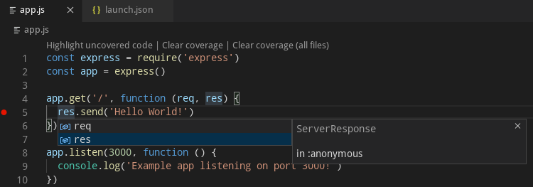

However, GraalVM's Language Server Protocol could delegate to the existing language servers written specially for the particular languages (using the `--lsp.Delegates` launcher option) and merge the static data returned from these servers with its own dynamic data to a single result.

This extension works as a client to the Language Server Protocol.
By default, a language server is started as a part of every process being executed or debugged via VS Code user interface.
The other possibility (available on option) is a language server started as a separated process that gets informed about every application being executed or debugged.
It tries to "dry-run" the same code as the original application and serve the run-time data afterwards.
Currently, both approaches start the language server providing the smart editing features for the following GraalVM-supported languages - JavaScript, Python, R, Ruby, and [SimpleLanguage](https://github.com/graalvm/simplelanguage).

### R Language Server

This extension provides an option to automatically install and run the [languageserver](https://github.com/REditorSupport/languageserver) which is an implementation of the Language Server Protocol for the R language.
Enabling this option, the GraalVM R installation is checked for presence of the `languageserver` package and a user is provided with an option of an automatic installation of the missing package.

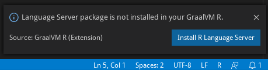

Once the `languageserver` package is installed, the R Language Server is automatically started and passed to the  Language Server Protocol as delegate when necessary.

### Ruby Language Server

This extension provides an option to automatically install and run the [solargraph](https://github.com/castwide/solargraph) which is an implementation of the Language Server Protocol for the Ruby language.
Enabling this option, the GraalVM Ruby installation is checked for presence of the `solargraph` gem and a user is provided with an option of an automatic installation of the missing gem.

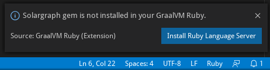

Once the `solargraph` gem is installed, the Ruby Language Server is automatically started and passed to the Language Server Protocol as delegate when necessary.

### Additional Editor Features

Since an easy writing of [polyglot](https://www.graalvm.org/docs/reference-manual/polyglot) applications is one of the defining features of GraalVM, the code completion invoked inside JavaScript sources provides items for `Polyglot.eval(...)`, `Polyglot.evalFile(...)` and `Java.type(...)` calls.

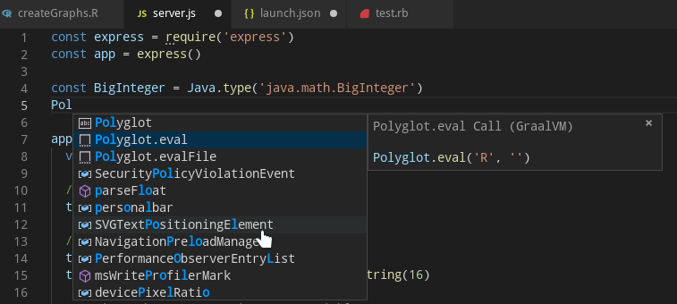

Similarly, the code completion invoked inside Python sources provides items for `Polyglot.eval(...)`, `Polyglot.eval_file(...)` and `Java.type(...)` calls.


The code completion invoked inside R sources provides items for `eval.polyglot(...)` and `new("<Java type>", ...)` calls.

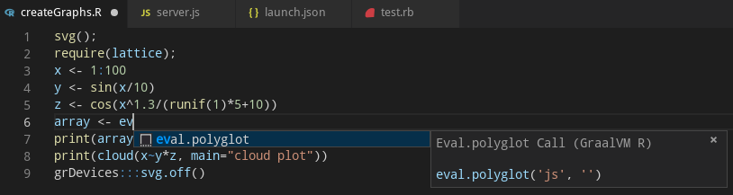

And finally, the code completion invoked inside Ruby sources provides items for `Polyglot.eval(...)`, `Polyglot.eval_file(...)` and `Java.type(...)` calls.


For JavaScript, Python, R, and Ruby sources opened in the editor, all the `Polyglot.eval(...)` calls are detected and the respective embedded languages are injected to their locations.
For example, having an R code snippet called via the Polyglot API from inside a JavaScript source, the R language code is embedded inside the corresponding JavaScript String and all VS Code's editing features (syntax highlighting, bracket matching, auto closing pairs, code completion, etc.) treat the content of the String as the R source code.

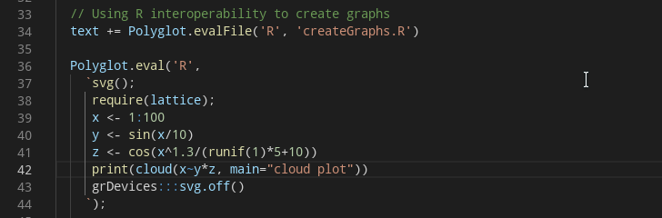

## Extension Settings

This extension contributes the following settings:

* __graalvm.home__ - The path to the GraalVM installation.
* __graalvm.installations__ - All registered GraalVM installations.
* __graalvm.systemDetect__ - Detect GraalVM's installation from the system environment variables.
* __graalvm.languageServer.currentWorkDir__ - An absolute path to the working directory of GraalVM's Language Server Protocol.
* __graalvm.languageServer.inProcessServer__ - Start GraalVM's Language Server Protocol within processes being run or debugged.
* __graalvm.languageServer.delegateServers__ - A comma-separated list of `language@[host:]port` where other language servers run.
* __graalvm.languageServer.startRLanguageServer__ - Start the R Language Server.
* __graalvm.languageServer.startRubyLanguageServer__ - Start the Ruby Language Server.

## Recommendations

GraalVM Extension for VS Code recommends the following extensions:
* [Python](https://marketplace.visualstudio.com/items?itemName=ms-python.python) - The Python language support
* [R](https://marketplace.visualstudio.com/items?itemName=Ikuyadeu.r) - A basic support for the R language
* [Ruby](https://marketplace.visualstudio.com/items?itemName=rebornix.Ruby) - The Ruby language support
* [Apache NetBeans Language Server](https://marketplace.visualstudio.com/items?itemName=asf.apache-netbeans-java) - The Java 8+ language support

## Feedback

* [Request a feature](https://github.com/oracle/graal/issues/new?assignees=&labels=feature,vscode&template=0_feature_request.md&title=).
* [File a bug](https://github.com/oracle/graal/issues/new?assignees=&labels=bug,agent&template=5_issues_other.md&title=).
* [Discuss with us](https://github.com/oracle/graal/discussions).

### Privacy Policy

Read the [Oracle Privacy Policy](https://www.oracle.com/legal/privacy/privacy-policy.html) to learn more.
